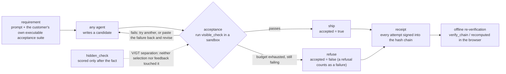

<p align="center"></p>

<p align="center">
  <a href="README.md">繁體中文</a> ·
  <b>English</b> ·
  <a href="README.ja.md">日本語</a>
</p>

# Vacant

**Vacant is not a mandatory layer wrapped around an agent, and it is not another agent
framework. It is a receiving desk: a delivery without a verifiable receipt is not
accepted. Because it looks only at the deliverable and does not care how the agent ran,
output from any framework can be fed into it.**

It runs the customer's own executable acceptance tests, decides ship-or-refuse on the
result, and signs every attempt — failures included — into a hash chain anyone can
re-verify offline. Making it the **single exit on a machine** takes containers, ACLs or
egress policy — that is the deployment layer's job, not Vacant's
(`vacant/controller.py:7-8` has said so verbatim all along; it had simply never appeared
in anything outward-facing).

An existing pattern, not one we invented: supply-chain security does the same thing with
**in-toto / SLSA / Sigstore** — an artifact without a valid attestation is rejected at intake.

```bash
pip install vacant-network        # the import name is still `vacant`
```

[](https://pypi.org/project/vacant-network/)
[](pyproject.toml)
[](LICENSE)
[](pyproject.toml)
[](tests)
[](ops/gain/replay)
[](AGENTS.md)

> **The premise. Every delivery claim must be quoted together with it.**
> All of this rests on "the requirement can be compiled into an executable acceptance
> suite". Where the requirement will not run, this mechanism has no free referee and
> degrades into "ask a model" — which is exactly the thing that measured badly.
> (Verbatim from `DECISION_20260903_R440P_CONFORMANCE_GATE.md` §五-1.)

**The integration contract for AI agents is [`AGENTS.md`](https://github.com/cosmopig/Vacant/blob/main/AGENTS.md)**
(index: [`llms.txt`](https://github.com/cosmopig/Vacant/blob/main/llms.txt)). The lower half of this page,
[§For AI](#for-ai), is the prose version of the same contract.

---

## 30-second quickstart

No model call, no network, no clone.

```python
from vacant.checks import run_python_check
from vacant.identity import Identity, PublicIdentity
from vacant.logbook import Logbook

# 1) Acceptance: the tests run in the runner process, the candidate in a separate worker
tests = "assert solve([1, 2, 3, 4]) == 6\nassert solve([]) == 0\n"
good  = "def solve(nums):\n    return sum(n for n in nums if n % 2 == 0)\n"
cheat = "def solve(nums):\n    import os; os._exit(0)\n"      # tries to fake "all tests passed"

print(run_python_check(good,  tests, allowed_entry_points=("solve",)))   # True
print(run_python_check(cheat, tests, allowed_entry_points=("solve",)))   # False

# 2) Receipts: every attempt is signed into an append-only hash chain
me, book = Identity.generate(), Logbook()
who = PublicIdentity(vacant_id=me.vacant_id, pub=me.pub)
book.append("attempt", {"draft": "sha256:aaa", "visible_ok": False}, me, ts_ms=1_700_000_000_000)
book.append("attempt", {"draft": "sha256:bbb", "visible_ok": True},  me, ts_ms=1_700_000_000_001)
book.append("shipped", {"accepted": True, "draft": "sha256:bbb"},    me, ts_ms=1_700_000_000_002)
print(book.verify_chain(who))                                            # True

# 3) Tamper with an interior entry -> verification fails
import copy
from vacant.logbook import LogEntry
forged = Logbook([copy.deepcopy(e) for e in book.entries])
e = forged.entries[1]
forged.entries[1] = LogEntry(e.stream_id, e.branch_id, e.seq, e.prev_hash, e.ts_ms, e.type,
                             {"draft": "sha256:aaa", "visible_ok": True}, e.sig)  # False -> True
print(forged.verify_chain(who))                                          # False

# 4) Honest boundary: a truncated tail is a valid prefix, and this does NOT catch it
print(Logbook(list(book.entries[:2])).verify_chain(who))                 # True <- not detected
```

Step 4 is not a demonstration of a bug; it is **the boundary of this chain**.
`verify_chain` checks sequence continuity, `prev_hash` linkage and per-entry signatures.
There is **no length commitment and no external anchor**, so a valid prefix verifies — a
**truncation / omission attack** (Ma & Tsudik 2009). The chain gives **integrity (nothing
was altered), not completeness (nothing is missing)**. If you need truncation-evidence you
must publish heads (`Logbook.head()`) externally or have them countersigned — Vacant will
not do it for you.

```bash
vacant --help                     # CLI available after install
```

---

## You do not have to trust us

A system that claims accountability and cannot be checked from outside has no content.
**An outside user can run all four of these**, without believing anything we say:

| What to check | Run it yourself | Why that is enough |
|---|---|---|
| The receipt chains were not touched | `verify_run_receipts.py --selftest` (negative controls first), then `--glob 'runs/g_r532_*'` | First prove the verifier catches a broken chain, then point it at the real ones. R532: **86 chains, 3,895 entries, 0 failures** |
| The tasks were not cherry-picked | [`docs/BANKS_HOWTO.md`](https://github.com/cosmopig/Vacant/blob/main/docs/BANKS_HOWTO.md) | Bank sha256 is pinned; date windows and known-bad tasks are in [`runs/INDEX.md`](https://github.com/cosmopig/Vacant/blob/main/runs/INDEX.md) |
| The conclusions are not the analyzer's invention | Count `runs/g_*/rows.jsonl` yourself | One row = one task on one arm; `deliv = accepted AND meets_demand` |
| Whether we are hiding mistakes | [`examples/verdicts.py`](https://github.com/cosmopig/Vacant/blob/main/examples/verdicts.py) and the honest boundaries below | Refuted claims are kept; **so are the coverage gaps we found in our own audit** (boundary 3) |

---

## The idea in 60 seconds

Three steps: **acceptance → gate → receipt**.



1. **Acceptance.** The customer's suite is **data, not code** (`SuiteSpec` = entry point
   plus literal `(args, expected)`); the executor only runs code it rendered itself. Before
   a suite goes on the chain it must clear a gauge: the reference solution passes **and**
   every known-bad stub is rejected.
2. **Gate.** Only what passes ships. If nothing passes within budget, the delivery is
   **refused**, and a refusal counts as a failure (the denominator is every task).
3. **Receipt.** Every attempt — not only the successful one — is signed into an append-only
   hash chain that anyone holding the public key can re-verify offline. The multi-party
   version has k keys each running and signing independently; disagreement **names the key**.

---

## Current results

**Every number carries its denominator, and all of them sit under the premise above.**
Single entry point for numbers: [`docs/VACANT_COMPLETE_2026-09-12.md`](https://github.com/cosmopig/Vacant/blob/main/docs/VACANT_COMPLETE_2026-09-12.md).
Single source of truth for verdicts: [`examples/verdicts.py`](https://github.com/cosmopig/Vacant/blob/main/examples/verdicts.py).

### The headline, in one sentence

**The bulk of the gain is the executable acceptance gate plus resampling — not the
feedback loop.**

| Comparison | 12B (gemma-4-12b-it-qat) | 27B (qwen3.8-27b, non-thinking) |
|---|---|---|
| **gate+resample − one-shot** (Δ_G) | five same-task replications: **+14.17 / +18.33 / +17.50 / +19.17 / +18.97 pp** (n=120, every p_raw < 0.002) | 836 tasks, 5 sets, pooled: **+7.89 pp** [5.36, 10.04], p=3.0e-9 |
| **loop − one-shot** (Δ_O) | **15/15 cells pass Holm**, +17.5 to +29.2 pp | **+4.67 pp** [1.75, 7.38], p=0.0015 (Holm p_adj 0.0030) |
| **loop − gate+resample** (Δ_C) | five reps +5.83 / +4.17 / +0.83 / +2.50 / +4.31 pp, **0/5 pass Holm**; four cross-bank sets pooled +1.12 pp, Holm p_adj **0.341** | all five sets **negative** −5.83 / −5.19 / −16.67 / −1.28 / −0.54, pooled **−3.23 pp** [−5.52, −0.75], p=0.0101 |

⚠ Δ_G is **outside the pre-registered family** (the family is Δ_C and Δ_O only), so its p
is **not multiplicity-corrected** and it has no corrected interval. That sentence must
travel with the number.

### What may and may not be said

**May be said: the loop beats one-shot, and that is stable.** 15/15 cells pass Holm on
12B; +4.67 pp passes on 27B.

**May not be said: the loop beats equal-budget resampling.** That is **not established**.
On 12B all nine data points share a sign (+0.64 to +5.83 pp), but 0/5 pass Holm in the
replications and the four-set pooled comparison has Holm p_adj 0.341. On 27B all five sets
flip **negative** and the pooled comparison is significant. **Same sign with nothing
passing correction is unresolved — it is neither a positive nor a negative result.**
(Per-set power against +10 pp is only 0.14–0.55 at n=54–156.)

The quotable state for the 27B run is **`RULED_OUT`**: on these 836 tasks, a practical gain
of ≥ +2 pp for the loop over equal-budget resampling is excluded. **`EFFECTIVE` must not be
quoted** — the pre-registered four-state table had no direction guard, so a significant
result in the **opposite** direction was labelled `EFFECTIVE`, and the sentence that label
authorizes is false on this data (`DECISION_20260917_R532_STRONGER_MODEL_PREREG.md`
AMEND1). "Reverse and significant" has **no pre-registered state to land in**, so no "the
loop is harmful" conclusion is drawn either.

**Honest boundary that must be written: the 27B run's own premise — "a stronger model" —
is not supported by its own data.** The `OFF` arm is bare model strength with no harness:
27B 74.8% vs 12B 75.2%, and **all three LiveCodeBench sets are worse** (−9.2 / −9.6 / −3.7
pp); only the two EvalPlus sets are better. So what was measured is **a different model**,
not a stronger one. "The loop stops helping once the model gets stronger" is not a
sentence this data supports (AMEND2).

**Banned phrasings**: replication failed, effect disappeared, equivalent, tied, majority
supports, replication stable, the loop is useless, the trend is clear. Write the
difference as a difference; do not write it as an *improvement*.

### Scale and integrity (the R532 round)

| Quantity | Number | Recompute it yourself |
|---|---|---|
| Scale | 5 task sets, **836 tasks**, **43 blocks**, 2,508 rows, **zero `infra_void`** | `ops/gain/r532/results_r532.json` |
| Hidden-test leakage (**one arm only**) | V/GT `--scope v2`: **the H-MIX arm is 43/43 CLEAN** (199,019 fingerprints); `OFF` and `CONFORM` were **never scanned** (boundary 3) | `ops/gain/harness_vgt_audit.py --run <run> --bank <bank> --scope v2` |
| Receipt chains | **86 chains, 3,895 entries**, every Ed25519 signature and link verified, **0 failures** | `python3 ops/gain/replay/verify_run_receipts.py --glob 'runs/g_r532_*'` |
| The arbiter's own teeth | `--selftest` PASS (12/12 hand-computed cases) | `python3 ops/gain/r532/analyze_r532.py --selftest` |

⚠ **Do not write "V/GT is clean on all arms".** The tool structurally scans only the H arm
(boundary 3) and skips trivial needles — **skipped is not checked**.
⚠ That gauge has **never been validated on a run that really leaked**; every negative
control is hand-planted.

**To re-run the whole thing**, see [`docs/BANKS_HOWTO.md`](https://github.com/cosmopig/Vacant/blob/main/docs/BANKS_HOWTO.md).

---

## Honest boundaries

Part of the specification, not a disclaimer. Quote them with the numbers.

1. **The premise, overriding everything below.** The requirement must compile into an
   executable acceptance suite; where it will not run, there is no free referee.
2. **Vacant is not a mandatory layer that takes effect merely by being installed.** As a
   library (`vacant/agent.py:51-103`, `self.brain` is a public attribute) or as an MCP tool
   (`vacant/mcp_server.py:184-210`, whose tool docstring only *persuades*), it is
   **voluntary** — an agent that does not call it is not involved with it at all, and
   nothing notices. Only as a controller (`vacant/controller.py:304-530`) or with the
   harness owning the agent loop is it binding, and then only on the subprocess it spawns
   itself. Verbatim, `vacant/controller.py:7-8`: *the guarantee covers only child processes
   launched through this controller; it cannot stop the same OS user from running the agent
   directly. A machine-wide single exit requires containers, ACLs, or egress policy.*
   Nothing on this page may be read as more optimistic than that sentence.
   Stated precisely: of Saltzer & Schroeder's (1975) three reference-monitor conditions,
   Vacant satisfies **tamper-proof** and **small enough to be verified**, and does **not**
   satisfy **complete mediation**. That is not a bug; it is the unavoidable consequence of
   something being optional. Calling it a mandatory layer would be a lie.
3. **We said something wrong yesterday; this is the correction.** We wrote that R532 was
   "V/GT 43/43 CLEAN". **That statement is false.**
   `ops/gain/harness_vgt_audit.py:746` reads `if arm not in VARIANTS: continue`, and
   `harness_arms.py:65` sets `VARIANTS = ("HPI", "HOC", "HMIX")` — so the **`OFF` and
   `CONFORM` arms were never scanned at all**; every block's `per_arm` contains only
   `{'HMIX': N}`. The accurate statement is "**the H-MIX arm is 43/43 CLEAN; the other two
   arms are unaudited**". A retroactive sweep of 179 archived runs **is under way and its
   result is not in**; until it is, nothing in this project may claim V/GT is clean across
   arms. This entry stays because finding and publishing a gap in our own audit says more
   about whether accountability is workable than any performance number does.
4. **The gate guarantees "passed the tests that were written down", not "met the real
   requirement".** Verbatim from `vacant/suitegauge.py:30-33`: blocking known-bad stubs
   proves only that the suite does not pass everything; it **does not** prove the suite
   covers the real requirement. Measured: of the 811 deliveries the gate accepted in R532,
   **120 (14.8%) passed the visible suite and still failed the hidden check**. Ungated it
   is 211/836 = 25.2%. The gate roughly **halves** false delivery; it does not remove it.
5. **The chain gives integrity (nothing was altered), not completeness (nothing is
   missing).** `vacant/logbook.py:168-195` checks sequence continuity, `prev_hash` linkage
   and per-entry signatures — no length commitment, no external anchor — so **a valid prefix
   verifies** (quickstart step 4). The literature has a name for this: a
   **truncation / omission attack** (Ma & Tsudik 2009). Three things must be said together:
   - **`vacant/checkpoint.py:144-155` has the same hole one level up.**
     `verify_checkpoint_chain` only walks `prev_checkpoint_sig` backwards and requires the
     first to be null; **drop the last few checkpoints and the rest still passes**
     (measured: 4 of 4 pass, dropping the last 2 still passes, removing an interior one
     fails, removing the first fails).
   - **Signing the count into every entry does not help.** `seq` already *is* the count, and
     every entry of a truncated prefix remains self-consistent. **A length commitment only
     works if it is exogenous** — held by someone else, or timestamped before the truncation.
   - To detect it, publish `Logbook.head()` externally or have it countersigned. Vacant does
     not do this for you.
6. **A signature identifies a key — not a person, and not the truth.** A receipt proves
   "this key said this and it has not been altered since"; it does **not** prove the
   statement is true (`vacant/peerexec.py:117-120`). On the product path the receipt is
   signed by the **delivering party itself** (`vacant/ecosystem.py:641-642`), and the
   private key is a plaintext PEM readable by the same OS user (`vacant/body.py:160` calls
   `identity.save` with no passphrase). Key custody is a deployment assumption; software
   cannot *prevent* forgery by root.
7. **Not a security boundary.** `run_python` runs in a separate process, a scratch cwd,
   under CPU limit and timeout; it blocks the common early `exit(0)`, same-file hidden-test
   reads and process/file APIs, but it is **not** a complete malicious-code boundary.
   Untrusted code belongs in a container, gVisor, or a separate VM. There is no working
   Windows sandbox branch in `vacant/checks.py`.
8. **Majority vote has a mathematical ceiling**: at most ⌊(k−1)/2⌋ corrupted executors.
   Past that the mechanism inverts, and **it cannot know which side of the threshold it is
   on**.
9. **No defence against corruption of the acceptance suite itself**: replace the suite with
   "it loads, therefore it passes" and every vote is honest, every chain verifies, every
   metric is full — while the system ships garbage. The residual is always reported as
   **two numbers**: +2.72 pp achievable, +4.35 pp hindsight ceiling.
10. **The renderer and the sandbox remain trusted inputs.** Trust is relocated, not
   abolished: a renderer bug makes k machines wrong **consistently**, and the dispute rate
   stays 0.
11. **Sybil resistance raises cost; it does not prevent.** Minting a new identity currently
    costs nothing.
12. **n is small.** LCB v2 at n=120 resolves roughly 12 pp differences; ±5 pp needs 278 tasks.
13. **Bank characteristics.** "Visible filtering is lossless" is partly a property of these
    banks. Where the acceptance suite is not a subset of the real requirement, refusal will
    kill good answers.
14. **The five replications share the same 120 tasks.** Seeds change ordering, persona and
    sampling — not the tasks. Bank-specific effects do not replicate away.
15. **Two backends are two inference conditions** (thinking / non-thinking), not just two
    version numbers. Per-set absolute values and token counts are a mixture of the two.
16. **Contamination cannot be ruled out.** HumanEval+ / MBPP+ (2021) are almost certainly in
    every modern model's training set; a higher delivery rate **cannot be distinguished**
    from "these tasks entered the training set".
17. **An evidence pack is self-consistent, not true.** `SHA256SUMS` **detects** tampering
    after the fact; it does not **prevent** it.
18. **The reconciliation is same-origin.** The three reconciliation rules in
    `ops/gain/replay/verify_run_receipts.py` (verdict count == row count, task_id sets equal,
    attempt count >= verdict count) compare **two records written by the same process**. They
    catch asymmetric omissions (bugs); they **cannot** catch both sides failing to write
    together (malice). Real reconciliation requires at least one end held by a party with
    different interests — that is not in place.
19. **Not a proof.** A demo may say "you can see an improvement"; "proves an improvement" is
    reserved for a pre-registered batch run.

Full list in [`docs/VACANT_COMPLETE_2026-09-12.md`](https://github.com/cosmopig/Vacant/blob/main/docs/VACANT_COMPLETE_2026-09-12.md) §四.

### Where it is fair to be strong

These are true and have code behind them:

- **The intake check cannot be routed around.** `vacant/receipt.py` plus
  `controller.verify_delivery` **recompute five sha256 digests** (request, task, tests,
  answer, trust card), verify the Ed25519 signature, compare `chain_head` / `stream_id` /
  `branch_id` against the **chain as it stands right now**, confirm every review is bound to
  this exact delivery, and only then `policy.admit`. The launch right is claimed with
  `os.O_EXCL` (`vacant/controller.py:372`), so **a receipt can be consumed exactly once**.
  Enforcement happens at **acceptance time**, not execution time — and that part really works.

- **A self-report is never taken on faith.** The ecosystem runs the verifier itself
  (`vacant/ecosystem.py:531`), and the controller runs it **again, independently**, before
  launching anything downstream (`vacant/controller.py:299-300`).
- **The acceptance sandbox is two processes.** Test code in the runner, candidate code in a
  separate worker, talking over stdin/stdout with a nonce (`vacant/checks.py:577-600`,
  `444-457`). Verbatim comment at `ops/gain/gain_run.py:957`: *"the candidate worker cannot
  see this test code"*. The candidate **structurally cannot read the tests** — it is not a
  blocklist.
- **"Not measured is not passed" is written as code**:
  `"all_pass": bool(total > 0 and passed == total)` (`ops/gain/r530/acceptance.py:272`);
  likewise the gauge requires `n_broken >= 1`, so an empty stub set cannot succeed vacuously.
- **Refusal really happens**: in R532's 836 tasks the gated arm refused 25 deliveries and
  the loop arm 68 — and refusals are in the denominator of every rate.

---

## What it is not

- **Not an agent.** It stands at the delivery exit of *any* agent: gate, receipts, multi-party attestation.
  Who writes the code is not its business.
- **Not a prompting trick.** The three loop arms share verbatim identical feedback
  templates, truncation rules, sandbox and timeouts (red line KS-1 has an executable
  guard); the only difference is the mechanism.
- **Not "trust".** The terminology is **accountability**. The classical definitions
  (Gambetta 1988, Mayer 1995) put "acting without monitoring" into the necessary conditions
  for trust, and monitoring is the entire content of this system.

---

## Architecture

| Layer | Modules | What it carries |
|---|---|---|
| L0 crypto | `vacant/canonical.py`, `identity.py`, `crypto.py` | the one serialization every signature uses; Ed25519 keypair + `vacant_id` |
| L1 ledger | `vacant/logbook.py`, `envelope.py`, `checkpoint.py`, `attest.py`, `receipt.py` | append-only hash chain (`stream_id` = genesis hash); signed envelopes; checkpoints that chain to each other |
| L2 accountability | `vacant/registry.py`, `reputation.py`, `router.py`, `auditor.py`, `memory.py`, `dashboard.py` | discovery + reputation index, 5-dimensional Beta, on/off switch, deterministic re-audit (**the dashboard is not a source of accountability**) |
| L3 banks and gauge | `vacant/codebench.py`, `suitespec.py`, `suitegauge.py` | MBPP+, LiveCodeBench v1–v3, HumanEval+; **acceptance suites are data, not code**; the gauge is two-sided (**one-sided guarantee**) |
| L4 experiment | `ops/gain/*`, `vacant/peerexec.py`, `record.py`, `research.py` | nine-arm runner, arbiter (four states, Holm, intervals, `--selftest` / `--mutation-check`), attestation layer, RECORD_SPEC packs |
| L5 exhibit | `vacant/entrycost.py`, `examples/receipt_viewer_multiparty.html` | mechanism simulation (sub-second on site), single-file offline receipt viewer |

**Nine arms**: `OFF` (one-shot, 1.00 calls), `ON` (reputation routing + K=3 review + one
revision, ≈5), `OFF5` (five-way vote, 5.00), `CONFORM` (acceptance gate with early stop,
1.3–1.7), `EQ5` (equal budget, exactly 5.00), `ONR` (routing isolated), `H-PI` / `H-OC` /
`H-MIX` (three revision loops).
**Why `OFF5` and `EQ5` must exist**: `ON` beating `OFF` is nearly guaranteed because it
spends five times the calls. Claiming "the mechanism works" from 1 call versus 5 is passing
off cost as mechanism.

---

## Running from source

The PyPI wheel **does not include `ops/`** (the experiment runner). Recomputing experiment
numbers requires a clone.

```bash
git clone https://github.com/cosmopig/Vacant.git && cd Vacant
python3 -m venv .venv && .venv/bin/pip install -e '.[dev]'
.venv/bin/python -m pytest tests/ -q

# things you can see with zero model calls
open examples/receipt_viewer_multiparty.html                       # Linux: xdg-open
.venv/bin/python ops/gain/replay/verify_run_receipts.py --glob 'runs/g_r532_*'
.venv/bin/python ops/gain/analyze_r529.py --selftest
.venv/bin/python ops/gain/analyze_r529.py --mutation-check
.venv/bin/python ops/gain/r532/analyze_r532.py --selftest
```

⚠ The **136 `_analysis_*` directories under `runs/` are derived artefacts, not evidence** —
their input is `runs/g_*/rows.jsonl`. Read [`runs/INDEX.md`](https://github.com/cosmopig/Vacant/blob/main/runs/INDEX.md) before citing
any run.

---

# For AI

The integration contract for coding agents. The **full version, with every signature and a
machine-readable facts block, is [`AGENTS.md`](https://github.com/cosmopig/Vacant/blob/main/AGENTS.md)**; the index is
[`llms.txt`](https://github.com/cosmopig/Vacant/blob/main/llms.txt). What follows is the part you should not miss.

## A. Which shape is actually binding

| Shape | Entry point | Binding on the agent? |
|---|---|---|
| **Library** | `vacant.agent.Vacant` (`vacant/agent.py:51-103`) | **No — voluntary.** `self.brain` is a public attribute; code that does not call Vacant does not involve Vacant. |
| **MCP tool** | `vacant.mcp_server` (`vacant/mcp_server.py:184-210`) | **No — persuasion only.** The `delegate` docstring says "THE PREFERRED PATH". A model that ignores it is not intercepted and nothing detects that. |
| **Controller** | `VacantFirstController.delegate_then_run` (`vacant/controller.py:304-530`) | **Yes — for the subprocess it spawns itself.** Verified delivery first, then `shell=False` exec. |
| **Harness owns the loop** | e.g. `ops/gain/r530/openwork_arms.py:642-696` | **Yes — the harness is the loop.** |

**The right framing is "receiving desk", not "mandatory layer".** Enforcement happens at
**acceptance time** — a delivery without a verifiable receipt is not accepted, and **that
check cannot be routed around** (`vacant/receipt.py` + `controller.verify_delivery`
recompute five sha256 digests, verify Ed25519, compare `chain_head`, and `os.O_EXCL` makes a
receipt consumable exactly once). Enforcement does **not** happen at execution time: making
Vacant the single exit on a machine takes containers, ACLs or egress policy, which is the
deployment layer's job. Same pattern as in-toto / SLSA / Sigstore in supply-chain security.

Precisely: of Saltzer & Schroeder's (1975) three reference-monitor conditions, Vacant
satisfies **tamper-proof** and **small enough to be verified** and does **not** satisfy
**complete mediation** — the unavoidable consequence of being optional, not a defect. With
the library or MCP shapes the honest description is "the agent's verified work is
accountable", not "the agent is constrained".

## B. Where to intercept

1. **Just a pass/fail bar** → call `vacant.checks.run_python_check`. No identities, no
   chain, no configuration.
2. **An audit trail of attempts** → add a `Logbook` and append every attempt.
3. **A tamper-evident suite** → express it as a `SuiteSpec` and commit it with
   `commit_suite_with_gauge` *before* any candidate exists. The executor then runs only the
   code it rendered from the spec, so a supplier cannot disguise a program as a test.
4. **k independent parties** → `peerexec.select_by_quorum`; disagreement names the key.
5. **The agent must not be able to ship unverified work** → `VacantFirstController` plus an
   OS boundary (§A).

**What the agent has to cooperate with**: return code that **defines the declared entry
point** (the gate calls `entry_point(*args)`; it does not read prose); **tolerate refusal**
(an exhausted budget is a refusal, and shipping the last candidate anyway deletes the only
thing the gate does); **never receive the hidden tests** (held-out data must not enter a
prompt, a retry message or a lesson — feedback abstracts to the *shape* of the failure,
red line A4).

## C. Verifiable invariants

- **I-1** Edits and interior deletions are caught; so is removing genesis.
- **I-2** The candidate **structurally cannot read the test code** — separate processes, a
  nonce-tagged literal-only RPC (`vacant/checks.py:577-600`, `444-457`).
- **I-3** Self-reported success is never taken on faith (`ecosystem.py:531`, then
  `controller.py:299-300` independently).
- **I-4** "Not measured" is failure, in code:
  `bool(total > 0 and passed == total)` (`ops/gain/r530/acceptance.py:272`); the gauge
  requires `n_broken >= 1`.
- **I-5** The gauge is two-sided: the reference must pass **and** every known-bad stub must
  be rejected.
- **I-6** `suitespec.render(spec)` is deterministic, so `render_sha256` is comparable across
  machines.
- **I-7** Refusal really happens and is counted: R532, 836 tasks — 25 gated refusals, 68
  loop refusals.

## D. Boundaries that bite integrations

All 19 above apply. The four that will bite you:

- **H-1** The premise: no executable acceptance suite, no free referee.
- **H-2** Passing the suite is not meeting the requirement
  (`suitegauge.py:30-33`, one-sided guarantee). Measured: 14.8% false delivery even gated.
- **H-3** The chain gives **integrity, not completeness**: it **does not detect truncation**
  (a truncation / omission attack, Ma & Tsudik 2009). `checkpoint.py:144-155` has the same
  hole. Signing the count into each entry **does not help** (`seq` already is the count; a
  truncated prefix stays self-consistent) — a length commitment must be **exogenous**.
  Publish `Logbook.head()` externally or countersign.
- **H-5** **The published wheel has no default acceptance criterion.**
  `suitegauge.default_runner` and `peerexec.sandbox_probe` delegate to
  `ops.gain.gain_run.meets_demand`, which ships only in the git repository — it carries the
  experiment's own sandbox import allow-list and `infra_void` semantics, and a second copy
  of the acceptance criterion is exactly the drift both docstrings forbid. Without `ops/`
  they raise `vacant.suitegauge.OpsRunnerUnavailable`, whose message contains the fix.
  **Inject instead**: `gauge_suite(..., runner=my_runner)`,
  `Executor.new(..., probe=my_probe)`, where
  `runner(code, check_code, entry_point, timeout_s) -> (ok, message)`;
  `vacant.checks.run_python_check` is a ready foundation.

## E. Common mistakes

| Wrong | Right | Why |
|---|---|---|
| `VACANT_ENDPOINT=http://host:8765` for the experiment runner | `VACANT_GAIN_API=http://host:8765/v1/chat/completions` | Three variables, three shapes. `VACANT_GAIN_API` (`ops/gain/brain_cline.py:134`) is the **full path**; `VACANT_ENDPOINT` (`vacant/substrate.py:171`) is a base URL; the CLI uses `VACANT_MCP_BASE` + `VACANT_MCP_MODEL` + `VACANT_MCP_API`, and the last must be exactly `responses` or `openai`. |
| Gating on `contains` / `regex` | `equals` / `json_schema` / `run_python` | The first two are exploration checks; they cannot carry a delivery or authorize a launch. |
| Recording only successes | Append every attempt | A success-only chain answers no interesting question. |
| Reading a valid chain as "the work is correct" | Read it as "the record is unaltered" | Boundary 6: a signature identifies a key, not the truth. |
| Reading a valid chain as "nothing is missing" | Publish heads or countersign | H-3: integrity != completeness. |
| Using `seq` / an entry count as truncation protection | An exogenous length commitment (held elsewhere, or timestamped earlier) | `seq` is the count; a truncated prefix stays self-consistent. |
| Treating `verify_run_receipts.py` reconciliation as an independent audit | Treat it as a same-origin self-check | Both sides are written by the same process: catches bugs, not malice. |
| Calling Vacant a "mandatory layer" | "receiving desk": a delivery without a verifiable receipt is not accepted | It does not satisfy complete mediation; a machine-wide single exit is the deployment layer's job. |
| `pip install vacant` | `pip install vacant-network` | `vacant` on PyPI is an unrelated DNS tool. The **import** name is still `vacant`. |
| Catching `ImportError` around `Executor.new(id).attest(...)` | Inject: `Executor.new(id, probe=...)` | H-5; the exception is `OpsRunnerUnavailable`. |
| Shipping the last candidate on exhaustion | Refuse, and count it as a failure | It deletes the only thing the gate does. |
| Pasting hidden-test text into a retry prompt | Feed the *shape* of the failure | Red line A4; quoting held-out data invalidates the measurement. |
| Calling it a "trust layer" | "accountability layer" | See above. |
| Citing `runs/_analysis_*` as source data | Cite `runs/g_*/rows.jsonl` | Those 136 directories are **derived**; citing them feeds a conclusion back to itself. |

## F. Machine-readable facts

The full block is [`AGENTS.md` §9](https://github.com/cosmopig/Vacant/blob/main/AGENTS.md#9-machine-readable-facts). Summary:

```json
{
  "schema": "vacant.facts/1",
  "package": {"pypi_name": "vacant-network", "import_name": "vacant", "version": "0.7.0",
              "requires_python": ">=3.11",
              "runtime_dependencies": ["cryptography>=42", "mcp>=1.26,<2", "jsonschema>=4.21"],
              "license": "MIT", "console_script": "vacant", "module_count": 50, "test_files": 78},
  "terminology": {"use": "accountability", "never_use": ["trust layer"]},
  "enforcement": {"model": "receiving desk, not a mandatory wrapper and not an agent framework",
                  "framework_agnostic": "operates on the deliverable, not on how the agent ran",
                  "recommended_shapes": ["library", "mcp_tool", "controller"],
                  "not_recommended_for_integrators": "harness_owns_loop",
                  "enforced_at": "acceptance time", "not_enforced_at": "execution time",
                  "prior_art": ["in-toto", "SLSA", "Sigstore"],
                  "reference_monitor_Saltzer_Schroeder_1975": {
                    "tamper_proof": true, "small_enough_to_verify": true,
                    "complete_mediation": false},
                  "library": "voluntary", "mcp_tool": "advisory",
                  "controller": "binding on its own spawned subprocess only",
                  "harness_owns_loop": "binding",
                  "machine_wide": "requires container / ACL / egress policy"},
  "chain_guarantees": {"integrity": true, "completeness": false,
                       "truncation_attack": "not detected (Ma & Tsudik 2009)",
                       "also_affects": "vacant/checkpoint.py:144-155",
                       "seq_does_not_help": true,
                       "fix": "an exogenous length commitment"},
  "reconciliation": {"tool": "ops/gain/replay/verify_run_receipts.py", "same_origin": true,
                     "catches": "asymmetric omissions (bugs)",
                     "does_not_catch": "both sides omitting together (malice)"},
  "headline": {
    "gate_plus_resample_vs_one_shot_pp": {"12b_five_reps": [14.17, 18.33, 17.50, 19.17, 18.97],
                                          "27b_pooled": 7.89},
    "loop_vs_one_shot": {"12b": "15/15 Holm, +17.5..+29.2 pp", "27b_pooled_pp": 4.67},
    "loop_vs_resample": {"status": "not established",
                         "12b_reps_pp": [5.83, 4.17, 0.83, 2.50, 4.31], "12b_holm": "0/5",
                         "27b_pooled_pp": -3.23, "27b_quotable_state": "RULED_OUT"},
    "false_delivery_pp": {"ungated": 25.24, "gated": 14.80, "n": 836}
  },
  "retracted_claim": {
    "was": "R532 V/GT 43/43 CLEAN (read as: across the run)",
    "is": "the HMIX arm is 43/43 CLEAN; OFF and CONFORM were never scanned",
    "cause": "ops/gain/harness_vgt_audit.py:746 skips any arm not in VARIANTS = (HPI, HOC, HMIX)",
    "status": "retroactive sweep of 179 archived runs in progress, result not in",
    "do_not_claim": "V/GT clean across arms"
  },
  "denominators": {"HumanEval+": "156, not 164", "MBPP+": "371 of 378",
                   "LCB v2": 120, "LCB v3 medium": 135, "LCB v3 hard": 54}
}
```

---

## Research discipline

- **Pre-registration.** Thresholds, families, denominators, interval methods, the state
  table and the **falsification conditions** are frozen before the data exists.
- **Holm.** The family is the tests *within one replication*. Throwing five replications'
  tests into one Holm would quietly turn "replication" into "one experiment with n=600".
- **Complete-case.** `infra_void` rows are never back-filled; worst-case bounds are reported
  alongside.
- **Replication.** The claim rule is fixed in advance; when it is not met, the results are
  listed one by one. **"Run it three times first" and "conclude from three runs" are
  different things.**
- **Adversarial re-checking.** Every outward claim is handed to an independent agent whose
  job is to refute it. In the first round, 3 of 12 were refuted and 3 judged overstated; all
  of them stay in [`examples/verdicts.py`](https://github.com/cosmopig/Vacant/blob/main/examples/verdicts.py).
- **After-the-fact corrections are recorded too.** R532's state table had no direction guard
  and its own "stronger model" premise did not hold — both were found after seeing the data,
  and both are written verbatim into the DECISION file (AMEND1 / AMEND2). The frozen
  criteria were not changed to suit the result.
- **Refuted claims are kept.** A system that claims accountability and cannot be held
  accountable for its own claims has no content.

---

## Documents

| File | Contents |
|---|---|
| [`AGENTS.md`](https://github.com/cosmopig/Vacant/blob/main/AGENTS.md) / [`llms.txt`](https://github.com/cosmopig/Vacant/blob/main/llms.txt) | **the integration contract for AI** and its index |
| [`CHANGELOG.md`](https://github.com/cosmopig/Vacant/blob/main/CHANGELOG.md) | 0.6.0 → 0.7.0 is a different codebase |
| [`docs/VACANT_COMPLETE_2026-09-12.md`](https://github.com/cosmopig/Vacant/blob/main/docs/VACANT_COMPLETE_2026-09-12.md) | the single entry point for numbers |
| [`docs/BANKS_HOWTO.md`](https://github.com/cosmopig/Vacant/blob/main/docs/BANKS_HOWTO.md) | how to re-run the task banks |
| [`docs/HMIX_ARCHITECTURE_2026-09-11.md`](https://github.com/cosmopig/Vacant/blob/main/docs/HMIX_ARCHITECTURE_2026-09-11.md) | the loop: six parts, verbatim prompts, what it cannot do |
| [`DECISION_20260912_R460R_FABLE_AUDIT_REPLICATIONS.md`](https://github.com/cosmopig/Vacant/blob/main/DECISION_20260912_R460R_FABLE_AUDIT_REPLICATIONS.md) | five-replication closing audit |
| [`DECISION_20260912_R529_FABLE_AUDIT_CROSS_BANK.md`](https://github.com/cosmopig/Vacant/blob/main/DECISION_20260912_R529_FABLE_AUDIT_CROSS_BANK.md) | cross-bank closing audit |
| [`DECISION_20260917_R532_STRONGER_MODEL_PREREG.md`](https://github.com/cosmopig/Vacant/blob/main/DECISION_20260917_R532_STRONGER_MODEL_PREREG.md) | the 27B round + AMEND1 / AMEND2 |
| [`ops/gain/r532/results_r532.json`](https://github.com/cosmopig/Vacant/blob/main/ops/gain/r532/results_r532.json) | citable source for every R532 figure |
| [`runs/INDEX.md`](https://github.com/cosmopig/Vacant/blob/main/runs/INDEX.md) | which runs are evidence and which are derived |
| [`examples/verdicts.py`](https://github.com/cosmopig/Vacant/blob/main/examples/verdicts.py) | **single source of truth for verdicts** |

---

## Citation

See [`CITATION.cff`](https://github.com/cosmopig/Vacant/blob/main/CITATION.cff).

```bibtex
@software{vacant_2026,
  author  = {cosmopig},
  title   = {Vacant: an accountability layer for AI agents},
  year    = {2026},
  url     = {https://github.com/cosmopig/Vacant}
}
```

## License

[MIT](https://github.com/cosmopig/Vacant/blob/main/LICENSE).
