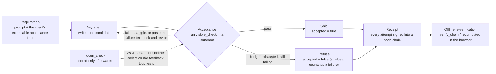

<p align="center"></p>

<p align="center">
  <a href="README.md">繁體中文</a> ·
  <b>English</b> ·
  <a href="README.ja.md">日本語</a>
</p>

<details>
<summary>ASCII wordmark (where SVG does not render)</summary>

```text
█   █  ███   ███   ███  █   █ █████
█   █ █   █ █   █ █   █ ██  █   █
█   █ █   █ █     █   █ ██  █   █
█   █ █████ █     █████ █ █ █   █
█   █ █   █ █     █   █ █  ██   █
 █ █  █   █ █   █ █   █ █  ██   █
  █   █   █  ███  █   █ █   █   █
```

</details>

# Vacant

**An accountability layer that wraps any AI agent: run the client's executable acceptance tests,
decide whether to ship, and sign every step into a receipt.**

Vacant is an **accountability layer** for AI agents: it runs the client's own **executable acceptance
tests**, gates delivery on the result, and signs every attempt into a **hash chain** of verifiable
**signed receipts**. Every measurement is **pre-registered**, and the headline comparison was re-run as
**five same-bank replications** plus a four-set cross-benchmark run on **LLM code generation**
(LiveCodeBench, HumanEval+, MBPP+); **all five are listed below one by one**, never pooled into a single
number.

[](pyproject.toml)
[](LICENSE)
[](tests)
[](runs/INDEX.md)
[](ops/gain/replay)
[](DECISION_20260911_R460R_FIVE_REPLICATIONS_PREREG.md)

> **The premise sentence (every delivery-effect claim must carry it)**
> The whole thing rests on "requirements can be compiled into executable acceptance tests."
> Where requirements cannot be executed, this mechanism has no free judge and degenerates into
> "ask another model" — which is exactly the thing that measured badly.
> (English rendering of the verbatim Chinese in `DECISION_20260903_R440P_CONFORMANCE_GATE.md` §5-1.)

---

## In 60 seconds

Three steps: **acceptance → gate → receipt**.



1. **Acceptance**: the client's acceptance suite is **data, not code** (`SuiteSpec` = entry point plus
   literal `(args, expected)` pairs); the executor only runs code its own renderer produced. Before it
   goes on-chain it must pass the gauge: the reference solution passes ∧ every known bad stub is caught.
2. **Gate**: ship only what passes acceptance; if nothing passes within budget, **refuse** — and a
   **refusal counts as a failure** (the denominator is all tasks).
3. **Receipt**: every attempt (not just the successful one) is signed into an append-only hash chain;
   anyone holding the public key can re-verify it offline. In the multi-party version, k keys each run
   and each sign, and a disagreement **names which key** dissented.

---

## What was measured

**Every number carries its denominator, and all of them sit under the premise sentence above.**
The single entry point for numbers is
[`docs/VACANT_COMPLETE_2026-09-12.md`](docs/VACANT_COMPLETE_2026-09-12.md); the single source of truth
for verdicts is [`examples/verdicts.py`](examples/verdicts.py).

### A. Five same-bank replications (LCB v2, 120 tasks, gemma-4-12b-it-qat, six arms interleaved, five-call equal budget)

| Arm | R460 main run | r1 | r2 | r3 | r4 | r5 |
|---|---:|---:|---:|---:|---:|---:|
| Single shot (OFF) | 58.33% | 57.50% | 54.17% | 57.50% | 51.67% | 51.26% |
| Gate + resample (CONFORM) | 70.83% | 71.67% | 72.50% | 75.00% | 70.83% | 70.94% |
| Five-way vote (OFF5) | 65.00% | 60.83% | 61.67% | 59.17% | 66.67% | 68.64% |
| Loop (H-MIX) | 84.17% | 77.50% | 76.67% | 75.83% | 73.33% | 74.79% |
| **H-MIX − CONFORM** | **+13.33 pp** | +5.83 | +4.17 | +0.83 | +2.50 | +4.31 |
| b/c | 22/6 | 15/8 | 17/12 | 12/11 | 13/10 | 14/9 |
| 95% interval (unadjusted) | [4.22, 19.46] | [−2.79, 12.89] | [−5.35, 12.80] | [−7.44, 8.89] | [−5.94, 10.28] | [−4.54, 12.01] |
| Holm p_adj (family of 6) | 0.011 | 0.630 | 0.917 | 1.000 | 0.678 | 0.922 |

Denominators are 120 throughout **except r5**: after the backend model crashed on 2026-09-13 it was
JIT-reloaded with a 1-hour TTL (unloading every hour), producing 7 `infra_void` rows. The r5 column
therefore uses **per-arm denominators** (OFF 119 / CONFORM 117 / OFF5 118 / H-PI 120 / H-OC 120 /
H-MIX 119), and the primary metric H-MIX − CONFORM uses **complete-case n=116**; voided rows are not
back-filled. (Source: `DECISION_20260912_R460R_FABLE_AUDIT_REPLICATIONS.md` §8-1.)

**The pre-registered claim rule, verbatim**: "5/5 same sign (Δ_C > 0) and ≥4/5 Holm-significant ⇒ you
may write 'replication is stable'; otherwise list every replication as it came out." Same sign 5/5
holds; Holm-significant **0/5** does not ⇒ **list every replication as it came out**. The only
sentence available is:

> The five Δ_C values are +5.83 / +4.17 / +0.83 / +2.50 / +4.31 pp, of which **0 pass Holm**.

Five things must appear in the same paragraph (leaving one out is cherry-picking):
(1) five out of five have the same sign; (2) 0/5 pass Holm; (3) all five unadjusted intervals
**intersect R460's [4.22, 19.46]** — by interval, not one replication is disjoint from R460;
(4) all five upper bounds (12.89 / 12.80 / 8.89 / 10.28 / 12.01) are **below** R460's point estimate of
13.33 (a description, not a test); (5) the power written down in advance — n=120 against +10 pp has
power **0.43–0.63**, so **2–3 of five** were expected to pass; if the true effect really were +10 pp,
seeing 0/5 has probability ≈0.007–0.06, i.e. **the lower tail** (a lower tail is not a disproof).

**⚠ Do not quote "84%" on its own.** R460's 84.17% / +13.33 pp is a **single-run, upward-biased point
estimate** (winner's curse: an estimate that can be declared significant is truncated above the MDE),
and it **did not recur in any of the nine later measurements**.
**Do not write**: replication is stable, mostly supported, replication failed, the effect vanished,
equivalent, a tie, the loop is useless. **Do not** pool n, average, or pick one replication.
`RULED_OUT` (r3) means **≥+10 pp is excluded**, not "any effect is excluded".

**Two things that did hold in all five**:
- **A loop beats a single shot**: H-MIX / H-PI / H-OC against OFF — **all fifteen cells pass Holm**
  (+17.5 to +29.2 pp).
- **False delivery (shipped but wrong) is lower for H-MIX than for CONFORM**: 5/5.

### B. Cross-benchmark (R529: four mutually exclusive task sets, three real sources, three arms)

| Task set | n | OFF | CONFORM | H-MIX | H−C (b/c) | H−O (b/c) |
|---|---:|---:|---:|---:|---|---|
| LCB v3 medium | 135 | 115/135 = 85.19% | 125/135 = 92.59% | 126/135 = 93.33% | +0.74 pp (6/5) | +8.15 pp (17/6) |
| LCB v3 hard | 54 | 38/54 = 70.37% | 41/54 = 75.93% | 43/54 = 79.63% | +3.70 pp (5/3) | +9.26 pp (7/2) |
| HumanEval+ | 156 | 129/156 = 82.69% | 147/156 = 94.23% | 148/156 = 94.87% | +0.64 pp (5/4) | +12.18 pp (24/5) |
| MBPP+ | 371 | 277/371 = 74.66% | 295/371 = 79.51% | 299/371 = 80.59% | +1.08 pp (15/11) | +5.93 pp (31/9) |
| **Pooled** | **716** | 559/716 = 78.07% | 608/716 = 84.92% | 616/716 = 86.03% | +1.12 pp (31/23, Holm **p_adj 0.341**) | +7.96 pp (79/22, Holm **p_adj 2.0e-8**) |

- **Sayable**: the feedback loop's advantage **over a single shot** holds across benchmarks
  (all four sets positive; pooled p_adj 2.0e-8).
- **Sayable**: the feedback loop's advantage **over same-budget resampling** is **too small to measure**
  on these four sets (+0.6 to +3.7 pp; pooled p 0.341).
- **Not sayable**: "H-MIX beats resampling across benchmarks" — and equally **not** the reverse,
  "H-MIX does nothing against resampling": **same sign but unresolved ≠ no difference**
  (single-set power at n=54–156 against +10 pp is only 0.14–0.55).
- HumanEval+'s denominator is **156, not 164** (8 tasks excluded by the sandbox envelope); two of the
  four sets are difficulty slices of one source ⇒ **three real sources, not four**.
- ⚠ **The two backends were not the same inference condition**: 1003 (LM Studio 0.4.24) had thinking
  enabled for gemma-4, 1004 (0.4.17) did not — same model file, probe: 59 completion tokens
  (53 reasoning) vs 2 (0). Paired primary metrics are unaffected (each block ran three arms on one
  machine), but **per-set absolute values and token/tpc are a mixture of two inference conditions and
  must no longer be quoted on their own**.
  (Source: `DECISION_20260912_R529_FABLE_AUDIT_CROSS_BANK.md` §11.)

### C. Where the gain actually comes from (audit judgement, not a pre-registered primary metric)

Decompose "loop beats single shot" and **the executable acceptance gate plus resampling already takes
most of it**:

- CONFORM − OFF across the five replications: **+14.17 / +18.33 / +17.50 / +19.17 / +18.97 pp**
  (all p_raw < 0.002, **uncorrected**); R529's four sets: +4.85 to +11.54 pp.
- On the same data, H-MIX adds only +5.83 / +4.17 / +0.83 / +2.50 / +4.31 pp on top of CONFORM (0/5 pass Holm).
- **A decomposition is not a causal claim**: CONFORM and H-MIX are two arms that each ran on their own,
  not a two-stage "gate first, then loop"; "+14 pp from the gate, +4 pp from the loop" is **arithmetic
  subtraction**, not a component the experiment separated.
- **Majority vote loses to the gate**: OFF5 − CONFORM across five replications is
  −10.83 / −10.83 / −15.83 / −4.17 / −1.74 pp — **5/5 same sign but only 3/5 significant**, and the two
  cleanest runs (no co-tenancy on the backend) are the non-significant ones ⇒ **same sign, unresolved**;
  it may not be written as "wins".

### D. What the accountability layer itself was checked against

| Quantity | Number | Recompute it yourself |
|---|---|---|
| Receipt chains | **9,841 entries** (67 runs / 194 chains), every Ed25519 signature and chain link **verified, 0 failures, 0 broken chains** | `ops/gain/replay/verify_run_receipts.py --glob 'runs/g_r460r*'` (30 runs / 120 chains / 6,674 entries) **plus** `--glob 'runs/g_r529_*'` (37 runs / 74 chains / 3,167 entries); the two add up to 9,841 — `--glob` takes a single pattern, so one invocation cannot cover both |
| V/GT separation (zero hidden-test leakage) | `--scope v2`: **67/67 blocks CLEAN**, 0 violations | `ops/gain/harness_vgt_audit.py --run <run> --bank <bank> --scope v2` (bank names: `evalplus` = MBPP+, `humanevalplus`, `lcb2`, `lcb3`) |
| Teeth on the instrument itself | `--selftest` PASS, `--mutation-check` **9/9 caught** | `ops/gain/analyze_r529.py --mutation-check` |
| Index has not drifted | `OK: index agrees with the data (290 dirs, 117 with summary.json)` | `ops/gain/build_runs_index.py --check` |

⚠ The V/GT tool **only scans the H arms** and skips trivial needles (R460R r1–r3: 95,090 needles in
total, 57,248 actually checked, 37,842 skipped = 39.8%) — **skipped is not checked**; the remainder is
covered by manual sampling.
⚠ Gauge v2 has **never been validated on a run that really did leak**; all negative controls are
manually planted.

---

## What this is not

- **Not an agent.** It wraps **any** agent: gate, receipt, multi-party attestation. Who writes the code
  is not its business.
- **Not a prompt trick.** The feedback template, truncation rules, sandbox and timeout of the three loop
  arms are **verbatim identical** (ironclad rule KS-1 has an executable guard); the only difference is the
  mechanism. R460's offline attribution puts the gain in the loop: Δ(final − first turn) landed at
  **+16 to +19 pp** in both replays, while the pi-style arm's first-turn prompt effect is
  **approximately zero (within ±2 pp, moving with replay machine load)**.
  ⚠ The attribution is an offline recomputation (`--rescore-turn1`): **R460's two replays differ by 1–3
  tasks per arm** (R460R r1's three local re-scorings differ by 1 task in 120); say which re-scoring a
  number came from.
- **Not "trust".** The register is **accountability / making your reliance well-founded**. Classic
  definitions (Gambetta 1988, Mayer 1995) make "not depending on monitoring" a necessary condition of
  trust — and monitoring is the entirety of this system, so the word "trust" is never used here.
- **Not a security boundary.** `run_python` runs in a separate process with a temporary cwd, CPU limit
  and timeout; it catches early `exit(0)`, reading the hidden tests out of the same file, and common
  process/file APIs, but it is **not a complete malicious-code boundary**. Untrusted code belongs in a
  container, gVisor, or a separate VM.
- **Not a proof.** A demo may only say "an improvement is visible"; "proves an improvement" is reserved
  for pre-registered batch runs, and both antecedents of C-3 in `docs/PREREG_V2.md` are still missing.

---

## Architecture and code map

| Layer | Modules | What it carries |
|---|---|---|
| L0 crypto | `vacant/canonical.py`, `identity.py`, `crypto.py` | the one serialization rule that makes signatures verify across machines; Ed25519 keypair + `vacant_id` (private key at the gateway; agent inference never sees the identity) |
| L1 the ledger | `vacant/logbook.py`, `envelope.py`, `checkpoint.py`, `attest.py`, `receipt.py`, `trustcard.py` | append-only hash chain (`stream_id` = genesis hash, real `head()`); signed envelopes + `ReviewEnvelope`; V1 checkpoints that themselves form a chain; portable attestations and delegation receipts |
| L2 accountability | `vacant/registry.py`, `reputation.py`, `router.py`, `auditor.py`, `memory.py`, `dashboard.py` | discovery + reputation index (**not** a central router); five-dimensional Beta keyed by (stream, branch, substrate) so credit follows the memory, not the body; one on/off switch; deterministic re-verification; MemoryManager M0/M1/M2; observatory (**the dashboard is not the source of accountability**) |
| L3 banks and gauges | `vacant/codebench.py`, `suitespec.py`, `suitegauge.py` | MBPP+ (sha256-pinned, fixed 371-task subset) + LiveCodeBench v1/v2/v3 + HumanEval+; **the acceptance suite is data, not code**; the gauge = reference solution passes ∧ every known bad stub caught (**a one-sided guarantee**) |
| L4 experiment rig | `ops/gain/gain_run.py`, `harness_arms.py`, `analyze_r460.py`, `analyze_r460r.py`, `analyze_r529.py`, `vacant/peerexec.py`, `record.py`, `research.py` | the nine-arm runner (OFF / ON / OFF5 / CONFORM / EQ5 / ONR + H-PI / H-OC / H-MIX); arbiters (four states, Holm, intervals, gatekeeping metrics, `--selftest` / `--mutation-check`); "execute together, don't review together" attestation layer; RECORD_SPEC evidence packs; McNemar + bootstrap + four pre-registered statistical functions |
| L5 exhibition | `vacant/entrycost.py`, `examples/receipt_viewer_multiparty.html`, `examples/e10_mediator.py`, `examples/publish_*.py`, `examples/verdicts.py` | mechanism simulation (seconds-scale on site); offline single-file receipt viewer (r454's three chains, 5,579 entries); recomputation of the E10 routing sequences; publication scripts and the **single source of truth for verdicts** |

**The nine arms**: `OFF` (single shot, 1.00 calls), `ON` (reputation routing + K=3 peer review + one
revision, ≈5 calls), `OFF5` (five-way vote, 5.00), `CONFORM` (acceptance gate with early stop, 1.3–1.7, bank-dependent),
`EQ5` (equal budget, always 5.00), `ONR` (routing isolated), `H-PI` / `H-OC` / `H-MIX` (three revision loops).
**Why OFF5 has to exist**: ON beating OFF is nearly automatic because it spends five times the calls —
claiming "the mechanism works" by comparing 1 call against 5 is passing cost off as mechanism.

---

## Install and a minimal runnable example

Python 3.11+. The only runtime dependency is `cryptography` (plus `mcp` for the MCP compatibility surface).

```bash
git clone https://github.com/cosmopig/Vacant.git
cd Vacant
python3 -m venv .venv
.venv/bin/pip install -e '.[dev]'
.venv/bin/python -m pytest tests/ -q      # 1,507 collected tests
```

### Things you can see with zero model calls

```bash
# 1) Receipt viewer (offline single file, opens over file://, zero external resources)
open examples/receipt_viewer_multiparty.html     # Linux: xdg-open

# 2) Re-verify receipt chains entry by entry (Ed25519 + chain links; it names the failing seq)
#    --glob takes one pattern, so it takes two runs to cover all 9,841 entries (6,674 + 3,167)
.venv/bin/python ops/gain/replay/verify_run_receipts.py --glob 'runs/g_r460r*'
.venv/bin/python ops/gain/replay/verify_run_receipts.py --glob 'runs/g_r529_*'

# 3) The arbiter's own teeth
.venv/bin/python ops/gain/analyze_r460r.py --selftest
.venv/bin/python ops/gain/analyze_r529.py --selftest
.venv/bin/python ops/gain/analyze_r529.py --mutation-check

# 4) The run index has not drifted
.venv/bin/python ops/gain/build_runs_index.py --check
```

### To actually run the gate once (needs an OpenAI-compatible endpoint)

```bash
export VACANT_MCP_BASE=http://localhost:1234
export VACANT_MCP_MODEL=your-model
export VACANT_MCP_API=openai

.venv/bin/vacant run \
  "Write solve(nums), returning the sum of all even integers." \
  --test "assert solve([1, 2, 3, 4]) == 6" \
  --test "assert solve([]) == 0"
```

The flow: generate at most three times (only redo when the previous draft failed the objective check) →
signed peer review by other residents plus a deterministic auditor re-running the check → an Ed25519
receipt bound to task / check / answer / trust card → **re-run the check locally**; the gate passes only
if everything holds. `--agent` or `--agent-argv` hands the verified delivery to a downstream CLI agent
(JSON argv, `shell=False`, no placeholder allowed in `argv[0]`).

⚠ **Only `equals`, `json_schema` and `run_python` are strong enough to authorize an agent launch.**
`contains` / `regex` are fine for exploration but cannot carry a delivery.

---

## Recompute it yourself

```bash
# The five-replication aggregate (--selftest pins known answers on R460's six blocks)
python3 ops/gain/analyze_r460r.py --reps 1 2 3 4 5 --bank lcb2 --json /tmp/r460r.json

# R460's six-arm settlement
python3 ops/gain/analyze_r460.py \
  --run runs/g_r460_harness_lcb2_{a1,a2,a3,b1,b2,b3} \
  --bank lcb2 --rescore-turn1 --json /tmp/r460.json

# The four cross-benchmark sets
python3 ops/gain/analyze_r529.py --json /tmp/r529.json

# V/GT audit (v2 should be CLEAN everywhere; --scope v1 reproduces R460's 90 false positives verbatim)
# ⚠ MBPP+'s bank name is `evalplus`. `--bank` has no choices list, so a wrong name falls through to the
#   builtin infinite generator: no error, the command just hangs.
python3 ops/gain/harness_vgt_audit.py --run runs/g_r529_mbpp_a1 --bank evalplus --scope v2 --out /tmp/vgt.json

# The two E10 routing sequences (the exhibition's main visual; reads archived JSONL only, zero GPU time)
python3 examples/e10_mediator.py

# The 8-bit wordmark at the top of this README (rebuild = re-run the generator; never hand-edit the SVG)
python3 docs/assets/make_vacant_8bit.py --check
```

⚠ `examples/e10_mediator.py` reads an archived dataset that lives in iCloud, **not in this repo**;
outside users cannot run it, and that is expected, not a bug.
⚠ The **136 `_analysis_*` directories under `runs/` are derivatives, not evidence** — their input is
`runs/g_*/rows.jsonl`, so citing them as raw data feeds your own conclusion back to you. Read
[`runs/INDEX.md`](runs/INDEX.md) before citing any run.
⚠ The `PREREG` constant in `ops/gain/analyze_r447.py` must not be edited — it is somebody else's
pre-registration.

---

## Honest boundaries

1. **The premise (it overrides everything below)**: requirements must compile into executable acceptance
   tests; requirements that cannot be executed have no free judge.
2. **n is not enough**: LCB v2 at n=120 only separates differences of roughly 12 pp; getting the interval
   to ±5 pp would need 278 tasks.
3. **Bank properties**: "visible filtering is lossless" is partly a property of these banks (in MBPP+ and
   LCB the `hidden_check` structurally contains the visible one). Where the acceptance suite is not a
   subset of the real requirement, refusals will kill good answers.
4. **The five replications share the same 120 tasks**: the seed only changes task order, persona
   assignment and sampling — **not the tasks** ⇒ task-level effects are perfectly correlated across the
   five, so bank idiosyncrasy cannot be replicated away.
5. **The five runs did not see the same backend load** (co-tenancy with another run at 8.5 / 71.3 / 2.1 /
   0 / 0%; r5 straddles a model crash and four unloads) — described, not corrected for, and **differences
   between replications must not all be attributed to sampling**.
6. **Two backends = two inference conditions** (thinking / non-thinking), not merely two version numbers.
7. **Majority vote has a mathematical bound**: it tolerates at most ⌊(k−1)/2⌋ corrupt executors; past
   that the naming flips, and **the mechanism cannot know which side of the threshold it is on**.
8. **No defence at all against a corrupt acceptance suite**: replace the suite with "if it imports, it
   passes" and every vote is honest, every chain verifies, every indicator is green — while the system
   ships garbage. The residual is always reported as **two numbers**: realizable +2.72 pp, hindsight
   upper bound +4.35 pp.
9. **The renderer and the sandbox remain trusted inputs**: trust is relocated, not abolished — a buggy
   renderer makes k machines wrong **consistently**, and the dispute rate stays 0.
10. **A signature identifies a key, not a subject**: a receipt proves "this key said this and it was not
    changed afterwards", **not** "this is true".
11. **Same-origin / Sybil resistance raises cost; it does not prevent**: **minting a new identity
    currently costs nothing** — that is the boundary of the mechanism, not a parameter to tune.
12. **Key custody is a deployment assumption**: where the same OS user or root can read the private key,
    software cannot prevent forgery.
13. **The software gate only covers processes the controller launched**: running the downstream agent
    directly bypasses it, by construction.
14. **The Windows sandbox does not run** (the non-posix branch of `vacant/checks.py`); the exhibition
    machine is a Linux VM, so this does not affect it.
15. **`g_*` run directories are not RECORD_SPEC evidence packs**: only `blayer_1000_v2` and `v3` currently
    satisfy every required item.
16. **An evidence pack guarantees internal consistency, not truth**: `SHA256SUMS` **detects** tampering
    after the fact; it does not **prevent** it.

The full list (B0–B20, H1–H9, and each settlement's own boundaries) is in
[`docs/VACANT_COMPLETE_2026-09-12.md`](docs/VACANT_COMPLETE_2026-09-12.md) §4.

---

## The physical exhibition

**The only deliverable is a physical exhibition. No thesis, no paper submission.** The question asked of
any piece of work is "does this make a difference when a visitor is standing in front of it?" The hard
constraints that follow each change a technical decision:

1. **Seconds-scale interaction**: a real model takes about 114 s per task — nobody waits for that on
   site ⇒ the exhibit runs a mechanism simulation (`vacant/entrycost.py`) or a pre-computed replay, and
   **the screen must say "this is a mechanism simulation"** — calling a simulation a proof is the
   exhibition version of ironclad rule 5.
2. **Runs offline, unattended**: assume no network and no docent; anything depending on an external
   endpoint needs a fallback. (The same reason turned the harness's "doom-loop: ask a human" into an
   automatic refusal.)
3. **Prior work still matters, but the reason is that we must not tell visitors something false**: pulse
   attacks were named in 2005 (Srivatsa) and entry fees were shown not to work in 2001 (Friedman &
   Resnick) — we rediscovered these, we did not discover them.
4. **Statistical power need not reach publication standards**: a counterfactual a layperson can read at a
   glance matters more than a p-value.
5. **Ethics is a front-line requirement, not an appendix**: the exhibition generates personas from real
   people's data, and Hollanek 2024 points out that **donor consent is not enough — the people
   interacting must be able to consent too**; a zoo is by nature something other people watch. The same
   `logbook` / `checkpoint` machinery provides the exhibition's own consent and deletion proofs: proving
   we keep our word with the very mechanism we are exhibiting.

The exhibit: [`examples/receipt_viewer_multiparty.html`](examples/receipt_viewer_multiparty.html)
(4.48 MB, embedding three complete chains from the real r454 run = 5,579 entries; the browser verifies
from genesis to head, recomputes each verdict / naming / shipping decision, and demonstrates that
flipping a vote turns the signature red, that one missing honest vote produces a tie with no naming, and
that changing a platform string does nothing at all). On the exhibition's Linux VM, headless Chrome
renders it over `file://` in a measured **2.1 s**.
**The docent must know**: that receipt (`Mbpp/100`, draft 0) is **the first lying cell in sort order, not
a cherry-picked one**.

---

## Research discipline

- **Pre-registration**: thresholds, families, denominators, interval method, the four states and the
  **refutation keys** are frozen before the data exists; before launch every `summary.json` is scanned to
  confirm the seeds have never been used (the hit set must be **exactly** the authorized set — one too
  few also stops the launch, because "not measurable" is not "passed").
- **Holm**: the family is the 6 tests **within one replication**; the 30 tests of five replications must
  **not** be thrown into one Holm — that would quietly turn "replication" into "one n=600 experiment".
- **Complete-case**: `infra_void` rows are not back-filled; r5's primary denominator is **116, not 120**,
  and the worst-case bound is reported alongside.
- **Replication**: the claim rule is fixed in advance (only 5/5 same sign and ≥4/5 Holm-significant earns
  "replication is stable"); when it is not met, every replication is listed as it came out.
  **"Run three first" and "conclude from three" are two different things.**
- **Adversarial re-verification**: every outward claim is handed to an independent agent whose job is to
  refute it. In the first round, **3 of 12 were refuted and 3 were judged overstated**; all of them stay
  in `examples/verdicts.py`, nothing is deleted. R452's first version claimed "three attacks are
  inexpressible" — that **was wrong**: `entry_point="exec"` punched straight through (368/371 on chain,
  31.5% false delivery), and that failure stays on the record too.
- **Incident disclosure**: 1003 hit `bad alloc` and `Context size has been exceeded` twice (the voided
  blocks were moved wholesale into `runs/_aborted/` as evidence and enter no analysis); a scheduler died
  of `UnicodeDecodeError` (the launcher truncated Chinese by bytes); the V/GT gauge v1 reported 90
  violations that were **all false positives once classified one by one** (a noisy gauge drowns the real
  signal); the analyzer's concurrency window once treated completion timestamps as dispatch timestamps ⇒
  phantom oversubscription — after the fix **every arbitration value was bit-identical**.
- **What was refuted stays**: a system that claims to be accountable and cannot be accountable about
  itself has no claim at all.

---

## Document index

| File | Contents |
|---|---|
| [`docs/VACANT_COMPLETE_2026-09-12.md`](docs/VACANT_COMPLETE_2026-09-12.md) | **The state of things**: what exists, what was measured, honest boundaries, how to verify it yourself (the single entry point for numbers) |
| [`docs/VACANT_ARCHITECTURE_AND_RESULTS_2026-09-07.md`](docs/VACANT_ARCHITECTURE_AND_RESULTS_2026-09-07.md) | The canon up to R455 / R461 (carried over verbatim, not superseded) |
| [`docs/HMIX_ARCHITECTURE_2026-09-11.md`](docs/HMIX_ARCHITECTURE_2026-09-11.md) | The H-MIX loop: six parts, the verbatim prompt, what it cannot do |
| [`docs/HARNESS_STUDY_2026-09-07.md`](docs/HARNESS_STUDY_2026-09-07.md) | Source-code facts about external harnesses and the "nine legends" checked one by one |
| [`DECISION_20260911_R460R_FIVE_REPLICATIONS_PREREG.md`](DECISION_20260911_R460R_FIVE_REPLICATIONS_PREREG.md) | Five-replication pre-registration (claim rule, prohibitions, abort criteria) |
| [`DECISION_20260912_R460R_FABLE_AUDIT_REPLICATIONS.md`](DECISION_20260912_R460R_FABLE_AUDIT_REPLICATIONS.md) | Five-replication settlement audit (§8 = all five are in) |
| [`DECISION_20260911_R529_CROSS_BANK_PREREG.md`](DECISION_20260911_R529_CROSS_BANK_PREREG.md) | Cross-benchmark pre-registration |
| [`DECISION_20260912_R529_FABLE_AUDIT_CROSS_BANK.md`](DECISION_20260912_R529_FABLE_AUDIT_CROSS_BANK.md) | Cross-benchmark settlement audit (§11 = the two backends ran different inference modes) |
| [`DECISION_20260911_R460_FABLE_AUDIT_HARNESS.md`](DECISION_20260911_R460_FABLE_AUDIT_HARNESS.md) | R460's six-arm settlement (four states, gatekeeping metrics, winner's-curse disclaimer) |
| [`DECISION_20260903_R440P_CONFORMANCE_GATE.md`](DECISION_20260903_R440P_CONFORMANCE_GATE.md) | Where the premise sentence comes from + the candidate-pool ceiling (17–19% of tasks have all five candidates wrong) |
| [`SPEC_GAIN.md`](SPEC_GAIN.md) | G-experiment spec: V/GT separation, fixed bank subsets, arm definitions |
| [`docs/RECORD_SPEC.md`](docs/RECORD_SPEC.md) / [`docs/PREREG_V2.md`](docs/PREREG_V2.md) | Evidence-pack spec / claim ladder (**awaiting a human signature to freeze**) |
| [`runs/INDEX.md`](runs/INDEX.md) | Run index: what is evidence, what is a derivative, bank sha256s and known-bad tasks |
| [`examples/verdicts.py`](examples/verdicts.py) | **The single source of truth for verdicts** (held / unresolved / no_effect / overstated / refuted) |
| [`CLAUDE.md`](CLAUDE.md) | Working constraints: ironclad rules, register, deferred items |

---

## Citation

See [`CITATION.cff`](CITATION.cff).

```bibtex
@software{vacant_2026,
  author  = {cosmopig},
  title   = {Vacant: an accountability layer for AI agents},
  year    = {2026},
  url     = {https://github.com/cosmopig/Vacant}
}
```

## License

[MIT](LICENSE).
