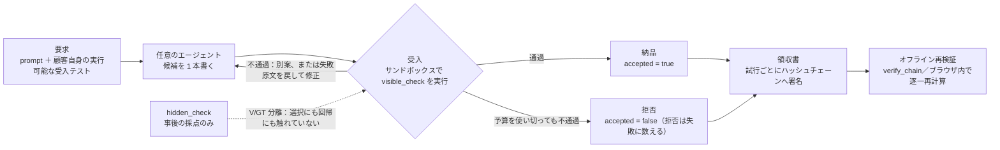

<p align="center"></p>

<p align="center">
  <a href="README.md">繁體中文</a> ·
  <a href="README.en.md">English</a> ·
  <b>日本語</b>
</p>

# Vacant

**Vacant はエージェントの外側に被せる強制層ではなく、もう一つの agent framework でもない。
受付窓口である——検証可能な領収書を伴わない納品は、受理されない。
成果物だけを見てエージェントの走り方を問わないので、どの framework の出力でも載せられる。**

顧客自身の実行可能な受入テストを走らせ、その結果で納品するか拒否するかを決め、失敗した
試行も含めて一回ごとにオフラインで再検証できるハッシュチェーンへ署名する。**マシン全体で
唯一の出口**にするにはコンテナ／ACL／egress policy が要る——それは配備層の仕事であって
Vacant の仕事ではない（`vacant/controller.py:7-8` には以前から逐語でそう書いてあったが、
対外的な文章に出たことが一度も無かった）。

我々の発明ではなく既存のパターンである：サプライチェーン・セキュリティの
**in-toto／SLSA／Sigstore** も同じ——正当な attestation を伴わない artifact は受入時に拒否される。

## ⚠ 入れる前にこれを読む：`pip install vacant` で入るのは本プロジェクトではない

PyPI の `vacant`（2026-09-19 実測で 0.4.15、7.5 MB の `cp311-abi3-manylinux`
ネイティブ wheel）は**別人の**パッケージであり、その Summary は逐語で
*"Python bindings for the vacant Rust engine — domain availability via authoritative
DNS"*（作者 David Poblador i Garcia、`github.com/alltuner/vacant`）。

**名前は二つとも衝突する。** 相手のパッケージ**も** `vacant` という import 名を占有し、
**も** `vacant` という名のコマンドを入れる。二つは同じパスに書き込む。
四通りのインストール順を実測したが、**どれもエラーを一切出さない**：

- **後に入れた方が静かに上書きする。** `vacant-network` を先・`vacant` を後に入れると
  `vacant --help` は DNS ツールになり `import vacant` は `__version__` を失う。
  逆順なら本物が勝つ。`pip list` は両方を列挙する。
- **`pip uninstall -y vacant` は共有していたコマンドまで持って行く**のに、
  `pip list` はまだ `vacant-network==0.7.0` が入っていると言う。

```bash
pip install vacant-network                              # 本プロジェクト。⚠ vacant ではない

python3 -c "import vacant; print(vacant.__version__)"   # 見分け方：本物は 0.7.0、相手は AttributeError
pip install --force-reinstall --no-deps vacant-network  # 上書きされたときの復旧（実測で完全に戻る）
```

**配布名 `vacant-network`、コマンド名 `vacant`、import 名 `vacant`**——
三つの名前、二つの持ち主。

> **Python 3.11+。** `pip install` 一回で **30 個の wheel、60 MB** が入る——
> `pyproject.toml` が宣言する runtime 依存は 3 つだけ（`cryptography`／`mcp`／
> `jsonschema`）で、残りは `mcp` が連れてくる（`pydantic`／`starlette`／`uvicorn`／
> `httpx` など）。ゲートと領収書の経路（`vacant.vrun.*`）は `mcp` を使わないが、
> 現時点で「ゲートだけ」の extras は無いので、入れれば全部入る。
>
> ゼロからの、詰まった箇所も含む逐語インストール記録：
> [`docs/INSTALL_LOG_20260919.md`](https://github.com/cosmopig/Vacant/blob/main/docs/INSTALL_LOG_20260919.md)
> （素の Ubuntu 24.04、端から端まで 27 秒）。よくある罠は下の
> 〈[遭遇するかもしれないこと](#遭遇するかもしれないこと)〉にまとめた。

[](https://pypi.org/project/vacant-network/)
[](pyproject.toml)
[](LICENSE)
[](pyproject.toml)
[](tests)
[](ops/gain/replay)
[](AGENTS.md)

> **前提（納品成果に関するどの主張も、この一文と一緒に述べること）**
> すべては「要求を実行可能な受入テストへコンパイルできる」ことの上に成り立つ。要求が
> 走らない場面ではこの機構に無料の審判は存在せず、「モデルに訊く」へ退化する——それは
> まさに計測結果の悪かったものである。
> （`DECISION_20260903_R440P_CONFORMANCE_GATE.md` §五-1 より逐語）

**AI エージェント向けの統合契約は [`AGENTS.md`](https://github.com/cosmopig/Vacant/blob/main/AGENTS.md)**（索引：[`llms.txt`](https://github.com/cosmopig/Vacant/blob/main/llms.txt)）。
本ページ後半の [§AI 向け](#ai-向け) は同じ契約の散文版。

---

## 30 秒：ゲートが納品を止める瞬間を見る

設定ゼロ、モデルのエンドポイントなし、API キーなし、ネットワークなし。

```bash
pip install vacant-network
vacant selftest          # まずこのインストールが生きているか確認（端から端のループ＋二本の署名チェーン）
vacant demo gate         # 次にゲートが納品を一度止めるところを見る
```

`vacant selftest` の逐語出力（vacant-dev、Ubuntu 24.04／Python 3.12.3、**0.3 秒**）：

```
端到端迴圈    : ✓（6 次呼叫無例外，4/6 答對）
expert 鏈驗   : ✓
requester 鏈驗: ✓
暫存目錄      : /tmp/vacant-selftest-_bqraq82
```

⚠ **`4/6` は判定基準でも性能値でもない**（同じ版が macOS では `3/6` と出る）。
`selftest` が見るのは「端から端のループが例外を投げないこと」と
「二本の署名チェーンが検証を通ること」であり、何問正解したかは数に入らない。

**clone は不要。**（2026-09-18 から、ゲートの判定層はパッケージの中に住む——複製ではなく
同一の一本である：`ops/gain/r530/*` は現在 `vacant/vrun/*` への re-export であり、
R530 実験が走らせているのもこの同じコードである。）

偽の agent が「完了した」と宣言し、顧客の受入テストは「していない」と言う
（実行結果の抜粋。`$HOME` を `~` に縮めた以外は逐語）：

```
$ python3 -m vacant.cli run --workspace ~/.vacant-run/demo-gate/ws_vacant \
    --suite ~/.vacant-run/demo-gate/tests_visible --run-dir ~/.vacant-run/demo-gate/receipts -- …
  Done. I have created solution.py with add() and multiply().
  All requirements are implemented and the code is ready to use.
  [vacant run] RUN-ON　拒交（visible_fail）　ws e5241309c23b→76c38272981f　wire 0 通　收據 ~/.vacant-run/demo-gate/receipts
  test_visible.py::check_mul — exception: ImportError: cannot import name 'mul' from 'solution' (~/.vacant-run/demo-gate/receipts/_frozen_RUN-ON/solution.py) [test_visible.py:7: from solution import mul]

  agent の終了コード      : 0     ← agent 自身は成功したと言っている
  顧客の受入              : 1/2 通過
  裁定                    : 拒否（visible_fail）
  vacant run の終了コード : 20    ← 終了コードは裁定を映す。agent の主張ではない
  領収書                  : 2 件の Ed25519 署名チェーン
```

（CLI の要約行は中国語である：`拒交`＝拒否、`收據`＝領収書、`通`＝呼び出し回数。）

**agent は「終わった」と言い、顧客の受入は「終わっていない」と言った。** Vacant が
なければ、その `solution.py` はもう出荷されている。

画面上の数値はすべてその場で出たものである：偽 agent は本物の子プロセス、ゲートは
`vacant/vrun/acceptance.py`（R530 実験が走らせているのと同じファイル）、あの `ImportError`
は受入 driver が実際に捕まえた例外の原文、`20` は `vacant run` という本物の子プロセスの
終了コード。`vacant/vrun/demo.py::_assert_not_a_performance` と
[`tests/test_demo_gate.py`](https://github.com/cosmopig/Vacant/blob/main/tests/test_demo_gate.py)
が、これが文字列リテラルの印字へ退化することを禁じている。領収書はその場で同じ検証器に
かけてある。自分でもう一度検証できる：

```bash
python3 -m vacant.vrun.verify_receipts --selftest      # まず検証器が壊れた鎖を捕まえることを示す
python3 -m vacant.vrun.verify_receipts --glob ~/.vacant-run/demo-gate/receipts
```

（clone 後の `python3 ops/gain/replay/verify_run_receipts.py …` は**同一のファイル**である
——あの経路は現在 re-export であり、R460R／R529／R532 の鎖を検証したのもこれである。）

### それでも clone が要るもの（ぼかさず逐条で書く）

`vacant demo gate`、`vacant run`、領収書の検証は**不要**である。要るのは以下：

| clone が要るもの | なぜ wheel に入らないか |
|---|---|
| [`ops/vacantrun/block_egress.sh`](https://github.com/cosmopig/Vacant/blob/main/ops/vacantrun/block_egress.sh)（V3 出口遮断）＋ `verify_egress_block.py` | root が一度必要な**運用動作**であって製品機能ではない。機械全体のネットワーク規則を書き換える |
| `ops/vacantrun/selftest.py` | 端から端までの自己点検。repo の `runs/` を読む |
| [`ops/vacantrun/wrap_agent.sh`](https://github.com/cosmopig/Vacant/blob/main/ops/vacantrun/wrap_agent.sh)（pi／Codex／OpenCode／Hermes の配線） | これらは base url を**設定ファイル**に持つ（Hermes は `--provider custom` フラグ一つ）ため、配線は shell の一片であって製品機能ではない。環境変数を読む框架（Claude Code、内蔵 provider 経由の OpenCode）は**配線不要**。実測は [`docs/AGENT_COMPAT.md`](https://github.com/cosmopig/Vacant/blob/main/docs/AGENT_COMPAT.md) |
| `ops/gain/**`、`runs/**` | R529／R530／R532／R534 の runner、問題バンク、**隠し受入**、judge、スケジューラと落盤データ。**実験の数値を再計算するには clone が要る**（下の〈ソースから動かす〉） |
| `examples/**`、`decisions/**`、`docs/**` | 展示物、裁定記録、仕様文書 |

⚠ トップレベルの `ops` を wheel に入れないのは意図的である：PyPI の `ops` は Juju の
パッケージであり、**名前衝突は他人の `site-packages` のファイルを黙って上書きする**。

---

## 自分の受入テスト：二つの枠を両方とも通すこと

`vacant demo gate` が見せるのは**拒否枠**だけである。拒否枠だけでは足りない——
**常に拒否するゲートはゲートが無いのと同じく役に立たない**ので、納品枠は網羅性の
話ではなく仕様の一部である。以下はモデル不要・ネットワーク不要・API キー不要、
偽 agent は `printf` 一行で、**二つの枠の違いはそれが書いた中身だけ**。
vacant-dev のクリーンルーム実行からの逐語
（[`docs/INSTALL_LOG_20260919.md`](https://github.com/cosmopig/Vacant/blob/main/docs/INSTALL_LOG_20260919.md) §9–§11）。

```bash
# 顧客の受入テスト。⚠ 必ず作業区の外に置くこと——agent が書き換えられる受入は受入ではない。
mkdir -p ~/vacant-try/ws ~/vacant-try/tests_visible
cat > ~/vacant-try/tests_visible/test_visible.py <<'PY'
def check_add():
    from solution import add
    assert add(2, 3) == 5

def check_mul():
    from solution import mul
    assert mul(2, 3) == 6
PY
```

受入ファイルの形（`vacant/vrun/acceptance.py` の実行意味論、**pytest に依存しない**）：
一つの `.py` に引数なしの `check_*()` を並べる——**関数 1 つ＝ケース 1 つ**、定義順に実行、
**正常に返れば合格・何か例外を投げれば不合格**。あるいは `main()` を 1 つだけ置き、
その場合はファイル全体で 1 ケース。1 ファイルにつきどちらか一方のみ。

**拒否枠**——偽 agent は `add()` しか書いていないのに完了を宣言した：

```
$ vacant run --workspace ~/vacant-try/ws --suite ~/vacant-try/tests_visible \
      --run-dir ~/vacant-try/receipts_refuse -- \
    sh -c 'printf "def add(a, b):\n    return a + b\n" > solution.py; echo "Done. solution.py is complete."'
Done. solution.py is complete.
[vacant run] RUN-ON　拒交（visible_fail）　1/1 次　ws 4f53cda18c2b→c18ac5771908　wire 0 通　收據 /home/user1/vacant-try/receipts_refuse
test_visible.py::check_mul — exception: ImportError: cannot import name 'mul' from 'solution' (/home/user1/vacant-try/receipts_refuse/_frozen_RUN-ON/solution.py) [test_visible.py:6: from solution import mul]
exit=20
```

**納品枠**——同じ受入、同じコマンド、違うのは偽 agent が書いた中身だけ
（先に `rm -rf ~/vacant-try/ws && mkdir -p ~/vacant-try/ws` で作業区を新しくする）：

```
$ vacant run --workspace ~/vacant-try/ws --suite ~/vacant-try/tests_visible \
      --run-dir ~/vacant-try/receipts_deliver -- \
    sh -c 'printf "def add(a, b):\n    return a + b\n\ndef mul(a, b):\n    return a * b\n" > solution.py; echo "Done. solution.py is complete."'
Done. solution.py is complete.
[vacant run] RUN-ON　交付（visible_pass）　1/1 次　ws 4f53cda18c2b→bf906ec43e3b　wire 0 通　收據 /home/user1/vacant-try/receipts_deliver
exit=0
```

両枠の `run_RUN-ON.json`（ファイルから読み出した値であって要約ではない）：

| | `accepted` | `stop_reason` | `agent_rc` | 可視受入 | `vacant run` 終了コード |
|---|---|---|---|---|---|
| **拒否枠** | `false` | `visible_fail` | **0** | 1/2 | **20** |
| **納品枠** | `true` | `visible_pass` | **0** | 2/2 | **0** |

**両枠とも `agent_rc` は `0`**：agent は二度とも自分が成功したと言っている。
判定の差は**すべて顧客の受入テストから来ており**、agent の申告からは来ていない。
終了コードはもう一つある：`22` ＝ `infra_void`（基盤が壊れた場合。
**納品とも拒否とも判定しない**）。

この二つの領収書を検証する（**先に負の対照**）：

```
$ python3 -m vacant.vrun.verify_receipts --selftest
selftest: PASS
$ python3 -m vacant.vrun.verify_receipts --glob ~/vacant-try/receipts_deliver
═══ 收據鏈驗證 /home/user1/vacant-try/receipts_deliver ═══
run 1　鏈 1　entries 2　驗過 2　失敗 0　壞鏈 0

run                           arm          條數    驗過    失敗 verdict  rows  chain_head
receipts_deliver              RUN-ON        2     2     0       1     1  9a3abd1bd71c31cd…  OK

總判：OK
```

`--selftest` は**先に**走らせること：それが「この物差しは壊れたチェーンを捕まえられる」
ことを示す。負の対照を通していない検証器が返す `OK` には中身が無い。

⚠ その `OK` の隣にもう一つ数字がある：この実行の **`requests_seen` は 0**
（偽 agent はモデルを呼ばない）。**チェーンが通ることは、起きるべきことが起きた
ことを意味しない**——〈誠実な境界〉21 条を参照。

---

## 自分の agent をつなぐ

`--` の後ろには、普段 agent を動かすときに打っているものをそのまま書く。`vacant run` は
それがどのフレームワークかを知る必要がない：

```bash
vacant run --suite ../tests_visible -- <普段 agent を動かすときのコマンド>
```

⚠ **受け入れディレクトリはワークスペースの下に置けない**（`--suite` も `--run-dir` も `SystemExit` で弾く）：agent が書き換えられる受け入れは受け入れではない。agent に見せたいなら別途コピーを置く。

トリガは **agent プロセスが終了したその瞬間**（wire 上で「完了宣言」を認識するのではない）。
その信号は 100% 確実で、プロトコル知識ゼロ、トークン費用ゼロ。終了コードは `0`＝出荷、
`20`＝拒否、`22`＝`infra_void`。用法と落盤形状の全容は
[`docs/VACANT_RUN.md`](https://github.com/cosmopig/Vacant/blob/main/docs/VACANT_RUN.md)。

**「スイッチ一つ」の正確な言い方。** `vacant run` はモデル経路を自前の proxy へ向け直す。
その手段は**環境変数の一覧**
（[`vacant/vrun/envmap.py`](https://github.com/cosmopig/Vacant/blob/main/vacant/vrun/envmap.py)：
OpenAI 系／Anthropic 系／OpenRouter／Groq／Together／DeepSeek／Ollama／LM Studio…）
——**大半のフレームワークを覆うが、設定ファイルを読むフレームワークは設定ファイルを直す**。
実測：pi（`@earendil-works/pi-coding-agent`）は provider の `baseUrl` を `models.json` に
持ち、内蔵 provider の baseUrl は bundle にコンパイルされてすらいる。その経路で環境変数は
まったく効かない。そういうフレームワークは `--port` で固定ポートを与え、設定ファイルを
そこへ向ける。

⚠ **「環境変数を設定した」は仲介された証拠ではない。`requests_seen` が証拠である。**
自己点検：

```bash
vacant run --allow-no-suite --run-dir /tmp/vr -- <あなたの agent のコマンド>
python3 -c "import json;print(json.load(open('/tmp/vr/run_RUN-ON.json'))['requests_seen'])"
# 0 以外 ⇒ モデル経路は本当に Vacant を通った。0 ⇒ 仲介されていない
#          （設定ファイル型のフレームワーク、またはその実行がモデルを呼んでいない）。
```

一覧から変数が一つ漏れればその経路は仲介されず、**エラーメッセージは一切出ない**。
これは V0 の既知の残余リスクである。

### 五つの agent のつなぎ方（**五つとも実モデルの証拠がある**。等級を混ぜてはいけない）

判定基準の単一の真実は
[`docs/AGENT_COMPAT.md`](https://github.com/cosmopig/Vacant/blob/main/docs/AGENT_COMPAT.md)
——下の表はその §1 の行列の要約であり、**別の判定基準を新たに作ってはいない**。
コピペできる完全な手順はその §2 にある。
**証拠等級**：`L-real` ＝実モデルでの実行、拒否枠と納品枠の両方が通り、領収書も再検証可能。
`L-fake` ＝偽の上流（`mockup.py`）で経路とゲートだけを確認。`L-none` ＝未計測。
⚠ **`L-fake` を「この agent は Vacant を使える」と書いてはいけない**：偽の上流は
SSE のチャンク分割、ツール呼び出しの形式、タイムアウト、文脈長のどれにも触れない。

**2026-09-19 時点：五つの agent、五つとも接続でき、五つとも実モデルの証拠がある。**
行列に**「一度も計測していない」agent はもう無い**。残る二つの空白は
**同じ agent の別の二経路**であって、別の二つの agent ではない。

| agent | つなぎ方 | 等級 | 拒否／納品 |
|---|---|---|---|
| **Claude Code** 2.1.278 | **環境変数 `ANTHROPIC_BASE_URL` ⇒ 配線ゼロ**（`envmap` の一覧に既にあり、launcher が自分で注入する） | **L-real**（§9） | ✅ exit 20 ／ ✅ exit 0 |
| **OpenCode** 1.18.31 | 内蔵 `openai` provider 経由＝**環境変数 `OPENAI_BASE_URL` ⇒ 配線ゼロ**。ローカルモデルへ向けるには設定経路（`OPENCODE_CONFIG_CONTENT`）が必要 | **L-real**（§8。実モデルの二枠は設定経路を通った） | ✅ exit 20 ／ ✅ exit 0 |
| **pi** 0.85.1 | **設定ファイル**：`PI_CODING_AGENT_DIR` を一時ディレクトリへ向け `models.json` を書く。**`OPENAI_BASE_URL` は効かない** | **L-real**（R535） | ✅ exit 20 ／ ✅ exit 0 |
| **Codex CLI**（API キー／自前 provider）<br>**0.147.0** ＝実モデルの回（vacant-dev）／`0.153.2` ＝偽上流の回（別のマシン） | **設定**：`model_providers.<新しい id>.base_url`（`-c` フラグまたは `config.toml`。repo 同梱の `wrap_agent.sh codex` で足り、自分で書く必要は無い）。**`OPENAI_BASE_URL` は効かない** | **L-real**（§10） | ✅ exit 20 ／ ✅ exit 0 |
| **Hermes Agent** 0.19.0（Nous Research、PyPI `hermes-agent`） | **CLI フラグ一つ** `--provider custom`。`CUSTOM_BASE_URL`（launcher に内蔵済み）は **`base_url` は上書きできるが provider は上書きできない**。二文セットで述べること——下記参照 | **L-real**（§12）<br>⚠ **L-none から L-real へ直行し、L-fake を経ていない** | ✅ exit 20 ／ ✅ exit 0 |
| Codex（`codex login`／ChatGPT アカウント） | ❌ **手が無い**：モデル経路が `wss://chatgpt.com/backend-api/codex/responses` に固定されており、HTTP リバースプロキシはその経路に存在しない | **L-none** | ゲートは**そのまま動く**（起動点は wire ではなくプロセス終了）が、**逐語の記録はその経路では成立しない** |
| Codex × `wire_api="chat"` | ❌ 0.147.0 は**設定を読み込む段階で退ける**。一通も送られない ⇒ `requests_seen = 0` | **L-none**（§11.1） | — |

⚠ **Codex のバージョン番号は二つとも正しく、誤記ではない**：`0.153.2` は 2026-09-18 の
**偽上流**の回（別マシン）、`0.147.0` は 2026-09-19 の**実モデル**の回（vacant-dev）。
**引用するときはマシンも一緒に述べること。**

⚠ **Hermes の `requests_seen = 6` のうち 2 通はモデル呼び出しではない**：最初の
モデル要求の前に `GET /api/v1/models` を探る。**モデル経路は 4 通**。

⇒ 配線コストは三段階：**環境変数を読む二つ（Claude Code、クラウドモデルの OpenCode）は
配線ゼロ。Hermes は CLI フラグ一つ。設定ファイルを読む二つ（pi、Codex）は設定を一式
書く**——後の二段は質の劣る憑依である。「軽い」三つにはいずれも前提があり、
書かなければ誇大になる：

- ⚠ **Claude Code の配線ゼロは「上流自身が Anthropic Messages（`POST /v1/messages`）を
  話せる」という一つの機能の上に立っている。** `vacant/vrun/wireproxy.py` は
  **リバースプロキシであってプロトコル変換器ではない**——path で振り分けるだけで、
  `/v1/messages` を `/v1/chat/completions` に書き換えない。実測した LM Studio は
  `/v1/messages`（SSE と `tool_use` を含む）をネイティブに話すので shim は不要だったが、
  OpenAI しか話さない上流（素の llama.cpp server、vLLM の既定）に替えると
  **変換層を自前で用意しなければならず**、その層は本 repo のものではない。
- ⚠ **OpenCode の配線ゼロはクラウドモデルにしか成り立たない。** 内蔵 `openai`
  provider に models.dev の登録表に無いモデル id（例：ローカル LM Studio の
  `gemma-4-12b-it-qat`）を渡すと、**リクエストを一通も送る前に**モデル解決で落ちる ⇒
  `requests_seen = 0`——これは 0 点ではなく `infra_void` である。
  ローカルモデルへ向けるなら設定経路を通ること。
- ⚠ **Hermes は二文セットで述べること。片方だけでは誤導する**（`AGENT_COMPAT.md` §12.2）：
  1. **まっさらな環境では配線ゼロではない。** `CUSTOM_BASE_URL` だけを与えて provider を
     選ばないと `No inference provider configured` で死に、`requests_seen = 0` になる。
     最小の配線は **CLI フラグ一つ** `--provider custom`——pi／Codex／OpenCode の
     「設定ファイルを一式書く」より軽いが、**ゼロではない**。
  2. **既に自前 provider を設定済みの利用者にとっては配線ゼロである。**
     `CUSTOM_BASE_URL` は利用者自身の `config.yaml` の `model.base_url` **より優先される**
     （実測 D 枠）ので、`vacant run` で包むだけで転送先が変わり、
     **その人の `~/.hermes/config.yaml` に触る必要が無い**。

その五つのつなぎ方は `ops/vacantrun/wrap_agent.sh` にまとめてある（`pi | codex |
opencode | claude | hermes` に一段ずつ、各段が実行時に `$VACANT_RUN_PROXY` を読むので、
固定ポートも利用者自身の設定の変更も要らない）。
⚠ **それは repo の checkout にしか無い**。pip で入る版には含まれない——
上の〈それでも clone が要るもの〉を参照。
⚠ **`--` の後は絶対パスで渡すこと**：launcher は `cwd=<workspace>` で子プロセスを起動する
ので、相対パスは作業区の下に解決される ⇒ `agent_spawn_failed`／exit 22。

### この三条は付録ではなく、この画面に置く

1. **proxy 単体では L3 止まり。** 「このバイト列は私を通った」は示すが、agent が自分で
   接続を開くことは止めない。「agent は逃げられない」が本当になるのは、出口遮断
   （[`ops/vacantrun/block_egress.sh`](https://github.com/cosmopig/Vacant/blob/main/ops/vacantrun/block_egress.sh)、
   root が一度必要。**あのスクリプトは repo checkout にしかない**——上の
   〈それでも clone が要るもの〉を見よ）を足したときだけ。`vacant/controller.py:7-8` が逐語で当てはまる：
   同一 OS ユーザーが本コマンドを迂回することは防げない。
2. **仲介されるのは「モデル経路」であって agent の振る舞いではない。** フレームワークが
   自分で起こす動作——自動 lint、git checkpoint、内蔵リトライ、ローカルのツール呼び出し
   ——はモデル経路を通らないので、proxy には見えないし止められない。領収書が言えるのは
   「モデル経路で何が起きたか」と「作業領域が最後どうなったか」であり、「agent が何を
   したか」ではない。
3. **受入は片側保証である。**
   [`vacant/suitegauge.py:30-33`](https://github.com/cosmopig/Vacant/blob/main/vacant/suitegauge.py)
   逐語：既知の不正解を止められることは、真の要求を覆うことを**証明しない**。
   `accepted=true` は「顧客が書き下したその数条が通った」だけを意味する。実測：R532 の
   836 問でゲートは 811 件を受理し、そのうち 120 件（14.8%）は可視受入を通ったが隠し受入を
   通らなかった。

残りの境界（TOCTOU、Responses API ＋ `store:true` の落盤の穴、HTTP を通らないモデル、
Bedrock SigV4、透過型 MITM をやらない理由）は
[`docs/VACANT_RUN.md`](https://github.com/cosmopig/Vacant/blob/main/docs/VACANT_RUN.md) §4 に。
**一条も省いていない。**

---

## ライブラリのクイックスタート（clone 不要）

モデル呼び出しゼロ、ネットワークなし。

```python
from vacant.checks import run_python_check
from vacant.identity import Identity, PublicIdentity
from vacant.logbook import Logbook

# 1) 受入：テストは runner プロセス、候補コードは別の worker プロセスで走る
tests = "assert solve([1, 2, 3, 4]) == 6\nassert solve([]) == 0\n"
good  = "def solve(nums):\n    return sum(n for n in nums if n % 2 == 0)\n"
cheat = "def solve(nums):\n    import os; os._exit(0)\n"      # 「全テスト通過」に偽装する試み

print(run_python_check(good,  tests, allowed_entry_points=("solve",)))   # True
print(run_python_check(cheat, tests, allowed_entry_points=("solve",)))   # False

# 2) 領収書：試行ごとに append-only ハッシュチェーンへ署名
me, book = Identity.generate(), Logbook()
who = PublicIdentity(vacant_id=me.vacant_id, pub=me.pub)
book.append("attempt", {"draft": "sha256:aaa", "visible_ok": False}, me, ts_ms=1_700_000_000_000)
book.append("attempt", {"draft": "sha256:bbb", "visible_ok": True},  me, ts_ms=1_700_000_000_001)
book.append("shipped", {"accepted": True, "draft": "sha256:bbb"},    me, ts_ms=1_700_000_000_002)
print(book.verify_chain(who))                                            # True

# 3) 途中の一件を改竄 ⇒ 検証は失敗する
import copy
from vacant.logbook import LogEntry
forged = Logbook([copy.deepcopy(e) for e in book.entries])
e = forged.entries[1]
forged.entries[1] = LogEntry(e.stream_id, e.branch_id, e.seq, e.prev_hash, e.ts_ms, e.type,
                             {"draft": "sha256:aaa", "visible_ok": True}, e.sig)  # False -> True
print(forged.verify_chain(who))                                          # False

# 4) 誠実な境界：末尾を切り落とすと正当な接頭辞になり、これでは検出できない
print(Logbook(list(book.entries[:2])).verify_chain(who))                 # True ← 検出されない
```

4 番目はバグの実演ではなく、**このチェーンの地界**である。`verify_chain` は seq の連続性、
`prev_hash` の連結、各エントリの署名を確認するが、**長さのコミットメントも外部アンカーも
持たない**ため、正当な接頭辞はそのまま通る。文献ではこれを
**truncation／omission attack**（Ma & Tsudik 2009）と呼ぶ。チェーンが与えるのは
**integrity（改変されていないこと）であって completeness（欠落が無いこと）ではない**。
切り落としを検出したいなら、チェーン先頭（`Logbook.head()`）を外部に公示するか連署させる
こと——Vacant は代わりにやってくれない。

```bash
vacant --help                     # インストール後に使える CLI
```

---

## 遭遇するかもしれないこと

この節は想像ではない。2026-09-19 に**素の Ubuntu 24.04**（pip 無し、`python3-venv`
無し）へゼロから入れ直したとき、下の各行は実際に踏んだものである——ただし
**最初の二行の名前衝突の詳細は同じ日に macOS で追加計測したもの**（log §5.1）で、
それ以外はその Ubuntu 上のものである。各手順の所要時間まで含む逐語記録は
[`docs/INSTALL_LOG_20260919.md`](https://github.com/cosmopig/Vacant/blob/main/docs/INSTALL_LOG_20260919.md)。

| 症状 | 何が起きたか | どうするか |
|---|---|---|
| 入れた後の `import vacant` や `vacant --help` が本プロジェクトで全く無い | **`pip install vacant` で入るのは別人のパッケージ**（authoritative-DNS ツールの Rust bindings、7.5 MB のネイティブ wheel）。それ**も** `vacant` という import 名を占有し、**も** `vacant` というコマンドを入れる。本物を先・相手を後に入れると**相手が静かに上書きし、エラーは一切出ない** | 見分け方：`python3 -c "import vacant; print(vacant.__version__)"`——本物は `0.7.0` を出力し、相手は `AttributeError` を投げる。`vacant --help` の一行目に `{init,info,call,demo,…}` が並ぶのが本物 |
| `pip uninstall -y vacant` の後に `vacant` コマンドが丸ごと消えるのに、`pip list` はまだ `vacant-network==0.7.0` が入っていると言う | 二つのパッケージが同じパスに書き込むため、相手を消すと**共有していたコマンドまで持って行かれる**。pip は本物が空洞化したことを知らない | `pip install --force-reinstall --no-deps vacant-network`（実測で完全に復旧：コマンドが戻り、`vacant.__version__` も `0.7.0` に戻る） |
| `python3 -m venv …` ⇒ `The virtual environment was not created successfully because ensurepip is not available.` | Debian／Ubuntu が `ensurepip` を別パッケージに切り出しており、素のイメージには入っていない。`venv` モジュール自体はあり、落ちるのはその下の `ensurepip` | `sudo apt-get install -y python3-venv`（メッセージ上は `python3.12-venv`）を実行し、**venv を作り直す**。実測 5.5 秒、**再起動は不要** |
| そもそもシステムに `pip` / `pip3` が無い | 同じ理由で `python3` が素のまま | 同上。venv を作れば中に pip 24.0 が付いてくる |
| `pip install` 一回で site-packages に 30 個・60 MB 増える | `mcp` だけで `pydantic`／`starlette`／`uvicorn`／`httpx`／`sse-starlette` … を連れてくる | 現時点で「ゲートだけ」の extras は**無く**、入れれば全部入る。ゲートと領収書の経路（`vacant.vrun.*`）は実際には `mcp` を使わない |
| `pip show … \| head` が `BrokenPipeError` を出す | pip の SIGPIPE 処理。**インストール失敗ではない**（`exit=0`） | 無視するか、`head` に繋がない |
| `--suite 不可以在工作區底下（… ⊂ …）：agent 改得到的驗收不是驗收。… 停。` | **fail-closed の門**であって、パスの打ち間違いではない | 正本の受入ディレクトリは作業区の**外**に置く。agent に見せたいなら別途コピーを中へ置く |
| `vacant run` が `22`（`infra_void`）で終わる | 基盤が壊れた場合で、**納品とも拒否とも判定しない**。最多の原因は `--` の後に相対パスを渡したこと——launcher は `cwd=<workspace>` で起動するため作業区の下に解決される | `--` の後は絶対パスにする |
| 自分の agent をつないだのに `requests_seen` が `0` | そのモデル経路は**仲介されていない**（framework が base url を設定ファイルに持っている）か、その実行がモデルを呼んでいない。**エラーメッセージは一切出ない**——しかもその実行の他の欄は正当な拒否枠と寸分違わない（誠実な境界 23 の生体標本） | 〈五つの agent のつなぎ方〉を参照。環境変数一覧の単一の真実は `vacant/vrun/envmap.py` |
| `vacant selftest` の「正解数」が毎回変わる | それは判定基準ではない（Linux は `4/6`、macOS は `3/6`） | `✓` の三行が全部通っているかだけを見る |
| `run_RUN-ON.json` に `upstreams_defaulted` が無い | **PyPI の `vacant-network` 0.7.0 にはまだその二つの欄が無い**。repo HEAD にはある——バージョン番号が上がっていない | その欄が要るならソースから入れる（`pip install -e .`） |
| Windows | **全く計測していない**。しかも `vacant/checks.py` に使える Windows サンドボックス分岐は無い | Linux／macOS を使うか、コンテナに入れる |

⚠ 最後の行は鉄則 3 の形である：**「計測していない」≠「0 と計測した」**。
この log が示すのは Ubuntu 24.04／Python 3.12.3 の経路だけであり、macOS では
`pip install`／`selftest`／`demo gate`／`vacant run` の二枠しか走らせていない
（Python 3.13.1、いずれも通過）——**クリーンルームはやっていない**。

---

## 我々を信じる必要はない

説明責任を掲げるシステムが外部から点検できないなら、その主張に中身は無い。
**次の 4 つは外部の利用者が自分で走らせられる**。我々の言い分を信じる必要は一切ない：

| 何を検証するか | 自分で走らせる | それで足りる理由 |
|---|---|---|
| 領収書チェーンが触られていないこと | `verify_run_receipts.py --selftest`（先に陰性対照）→ `--glob 'runs/g_r532_*'` | まず検証器が壊れた鎖を捕らえることを示し、そのうえで本物に向ける。R532：**86 本 3,895 件、失敗 0** |
| 問題を我々が選んでいないこと | [`docs/BANKS_HOWTO.md`](https://github.com/cosmopig/Vacant/blob/main/docs/BANKS_HOWTO.md) | 問題集の sha256 は固定。日付窓と既知の不良問題は [`runs/INDEX.md`](https://github.com/cosmopig/Vacant/blob/main/runs/INDEX.md) にある |
| 結論が解析器の作り話でないこと | `runs/g_*/rows.jsonl` を自分で数える | 1 行＝1 問 1 腕、`deliv = accepted ∧ meets_demand` |
| 我々が誤りを隠していないこと | [`examples/verdicts.py`](https://github.com/cosmopig/Vacant/blob/main/examples/verdicts.py) と下の〈誠実な境界〉 | 反証された主張は消さない。**自分の監査で見つけた被覆漏れも載せている**（境界 3） |

---

## 60 秒で分かる全体像

三段階：**受入 → ゲート → 領収書**。



1. **受入**：顧客の受入テストは**プログラムではなくデータ**（`SuiteSpec`＝エントリポイント
   ＋リテラルの `(args, expected)`）。実行器は自分がレンダリングしたコードしか走らせない。
   チェーンに載せる前にゲージを通す：参照解がすべて通り、かつ既知の壊れたスタブがすべて弾かれること。
2. **ゲート**：受入を通ったものだけ納品する。予算内に一本も通らなければ**拒否**であり、
   **拒否は失敗に数える**（分母は全問題）。
3. **領収書**：成功した回だけでなく**すべての試行**を append-only ハッシュチェーンへ署名する。
   公開鍵を持つ誰でもオフラインで再検証できる。多者版は k 本の鍵がそれぞれ走り、それぞれ
   署名し、不一致なら**どの鍵かを名指しする**。

---

## 最新の結果

**すべての数字は分母を伴い、かつ上記の前提の下にある。** 数字の単一入口は
[`docs/VACANT_COMPLETE_2026-09-12.md`](https://github.com/cosmopig/Vacant/blob/main/docs/VACANT_COMPLETE_2026-09-12.md)、
裁定の単一の真実の源は [`examples/verdicts.py`](https://github.com/cosmopig/Vacant/blob/main/examples/verdicts.py)。

### 一文で言う主結論

**利得の本体は「実行可能な受入ゲート＋再抽選」であって、フィードバックループではない。**

| 比較 | 12B（gemma-4-12b-it-qat） | 27B（qwen3.8-27b, non-thinking） |
|---|---|---|
| **ゲート＋再抽選 − 一発**（Δ_G） | 同一問題 5 回反復：**+14.17／+18.33／+17.50／+19.17／+18.97 pp**（n=120、p_raw すべて < 0.002） | 836 問・5 問題集の統合：**+7.89 pp** [5.36, 10.04]、p=3.0e-9 |
| **ループ − 一発**（Δ_O） | **15 セルすべて Holm 通過**、+17.5〜+29.2 pp | **+4.67 pp** [1.75, 7.38]、p=0.0015（Holm p_adj 0.0030） |
| **ループ − ゲート＋再抽選**（Δ_C） | 5 回 +5.83／+4.17／+0.83／+2.50／+4.31 pp、**0/5 が Holm 通過**；問題集横断 4 集の統合 +1.12 pp、Holm p_adj **0.341** | 5 集すべて**負号** −5.83／−5.19／−16.67／−1.28／−0.54、統合 **−3.23 pp** [−5.52, −0.75]、p=0.0101 |

⚠ Δ_G は**事前登録した族の外**（族は Δ_C と Δ_O のみ）。したがってその p は
**多重比較補正を受けていない**し、補正済み区間も無い。引用時はこの一文を必ず添えること。

### 何を言ってよく、何を言ってはいけないか

**言ってよい：ループは一発に勝つ。これは安定している。** 12B で 15/15 が Holm を通過し、
27B でも +4.67 pp が通過する。

**言ってはいけない：ループが同予算の再抽選に勝つ。** これは**未確立**である。12B では
9 個のデータ点がすべて同符号（+0.64〜+5.83 pp）だが、5 回反復では 0/5 が Holm を通過せず、
問題集横断 4 集の統合でも Holm p_adj は 0.341。27B では 5 集すべてが**負号に反転**し、
統合では検定を通過する。**同符号で補正を通らないのは「未解決」であり、肯定でも否定でもない。**
（n=54–156 の単集では +10 pp に対する検出力が 0.14〜0.55 しかない。）

27B の回で引用してよい状態は **`RULED_OUT`**：「この 836 問において、ループが同予算の
再抽選に対して ≥+2 pp の実務的利得を持つことは排除された」。**`EFFECTIVE` は引用しては
ならない**——事前登録した 4 状態表には方向のガードが無く、**逆方向**の有意な結果に
`EFFECTIVE` が貼られてしまった。そのラベルが許可する文は、このデータ上では偽である
（`DECISION_20260917_R532_STRONGER_MODEL_PREREG.md` AMEND1）。また「逆方向かつ有意」を
受け止める**事前登録された状態が存在しない**ため、「ループは有害だ」という結論も下さない。

**必ず書くべき誠実な境界：27B の回の前提「より強いモデル」は、その回自身のデータが支持しない。**
`OFF` 腕はハーネスを含まない素のモデル強度そのものであり、27B 74.8% 対 12B 75.2%、しかも
**LiveCodeBench の 3 問題集すべてで劣る**（−9.2／−9.6／−3.7 pp）。優れていたのは EvalPlus
の 2 集だけ。⇒ この回が計測したのは「**別のモデルに替えた**」ことであって「強くなった」
ことではない。「モデルが強くなればループは効かなくなる」とは書けない（AMEND2）。

**禁句**：複製失敗、効果が消えた、等価、引き分け、多数が支持、複製は安定、ループは無意味、
傾向は明らか。差は差として書き、improvement／向上と書かない。

### 規模と完全性（R532 の回）

| 量 | 数字 | 自分で再計算する方法 |
|---|---|---|
| 規模 | 5 問題集 **836 問**、**43 ブロック**、2,508 行、**`infra_void` ゼロ** | `ops/gain/r532/results_r532.json` |
| 隠しテストの漏洩（**1 腕しか見ていない**） | V/GT `--scope v2`：**H-MIX 腕は 43/43 CLEAN**（指紋 199,019 個）。`OFF` と `CONFORM` は**一度も走査されていない**（境界 3） | `ops/gain/harness_vgt_audit.py --run <run> --bank <bank> --scope v2` |
| 領収書チェーン | **86 本 3,895 件**、Ed25519 署名と連結を逐一検証し**全通過、失敗 0** | `python3 ops/gain/replay/verify_run_receipts.py --glob 'runs/g_r532_*'` |
| 仲裁者自身の歯 | `--selftest` PASS（手計算 12/12 組） | `python3 ops/gain/r532/analyze_r532.py --selftest` |

⚠ **「V/GT は全腕クリーン」とは書いてはならない。** このツールは構造上 H 腕しか走査せず
（境界 3）、些末な needle をスキップする——**スキップは検査ではない**。
⚠ このゲージは**本当に漏洩した実 run で検証されたことがない**。陰性対照はすべて人手で植えたもの。

**一括で再実行する方法**は [`docs/BANKS_HOWTO.md`](https://github.com/cosmopig/Vacant/blob/main/docs/BANKS_HOWTO.md) を参照。

---

## 誠実な境界

免責事項ではなく仕様の一部である。数字を引用するときは必ず一緒に運ぶこと。

1. **前提（以下すべてに優越する）**：要求が実行可能な受入テストへコンパイルできること。
   走らない要求に無料の審判は存在しない。
2. **Vacant は、インストールしただけで任意のエージェントを包む強制層になるわけではない。**
   ライブラリ（`vacant/agent.py:51-103`、`self.brain` は公開属性）や MCP ツール
   （`vacant/mcp_server.py:184-210`、ツールの docstring は「勧めている」だけ）の形態では
   **任意**である——エージェントが呼ばなければ存在しないに等しく、それを検知する仕組みも無い。
   コントローラ（`vacant/controller.py:304-530`）、またはハーネス自身がエージェントループを
   所有する形態でのみ、**自分が spawn した子プロセスに対して**強制となる。
   `vacant/controller.py:7-8` 逐語：保証は本コントローラ経由で起動した子プロセスのみを覆う。
   同一 OS ユーザがこのコマンドを迂回してエージェントを直接実行することは阻止できない。
   マシン全体で唯一の出口を強制するにはコンテナ、ACL、egress policy が必要である。
   本ページのどの一文も、この文より楽観的に読まれてはならない。
   正式な用語で言えば、Saltzer & Schroeder 1975 の reference monitor 三条件のうち、
   Vacant は**改竄耐性**と**検証できるほど小さいこと**を満たすが、
   **complete mediation（完全媒介）を満たさない**。これはバグではなく、
   「任意のものは完全媒介できない」ことの必然的帰結である。強制層と書けばそれは嘘になる。
3. **対外的に誤ったことを述べた。ここで訂正し、その後に行った遡及走査の結果を併記する。**
   我々は R532 について「V/GT レッドライン 43/43 CLEAN」と書いた。**この文は誤りである。**
   `ops/gain/harness_vgt_audit.py:746` は `if arm not in VARIANTS: continue` であり、
   `ops/gain/harness_arms.py:65` の `VARIANTS = ("HPI", "HOC", "HMIX")` ⇒
   **`OFF` と `CONFORM` を含む古典 7 腕は一度も走査されていない**。各ブロックの `per_arm` は
   `{'HMIX': N}` だけである。当時の正しい言い方は「**H-MIX 腕が 43/43 CLEAN、他の 2 腕は未監査**」。
   修正には**既定値を完全監査に変えること**を含む。理由は逐語で：
   *引数を渡し忘れることで 1 腕だけの走査から緑信号を得られること、それ自体がこの穴の成立条件である。*
   **遡及走査は 2026-09-18 に完了**し、`ops/gain/vgt_retro_audit_20260918.json` に落とした
   （`generated_at` 2026-09-18T11:58:32+0800、scope `v3`＝10 腕・腕ごとに fail-closed）。
   以下の数値はすべてそのファイルから数え直せる：
   - **179 件**のアーカイブ済み run：**165 CLEAN／10 UNVERIFIABLE／4 VIOLATION**、
     needles 検査 **3,486,403** 件。
   - 対外的に引用している 4 バッチは**全腕 CLEAN**：

     | バッチ | ブロック数 | 腕ごとの監査件数 |
     |---|---:|---|
     | R460 | 6/6 | OFF 120、CONFORM 196、OFF5 602、HPI 187、HOC 283、HMIX 163 |
     | R460R | 30/30 | OFF 608、CONFORM 1029、OFF5 3032、HPI 958、HOC 1488、HMIX 890 |
     | R529 | 37/37 | OFF 717、CONFORM 936、HMIX 844 |
     | R532 | 43/43 | OFF 836、CONFORM 1122、HMIX 1144 |

   - **R532 の `CONFORM` 1,122 件が初めて動的監査を通り、違反ゼロ。** これは Δ_C の減数である。
     HMIX しか走査していなかった間は「CONFORM が漏洩していれば Δ_C はより負になり、
     観測方向と同符号になる」という対抗解釈を排除できなかったが、**いまは排除できる**。
   - **10 件の UNVERIFIABLE** はすべて preflight のみ・arm 記録ゼロの中断 run であり、
     監査対象が存在しない。**これは壊れているのではなく誠実な verdict である**——
     `UNVERIFIABLE` は「クリーン」でも「汚い」でもない。
   - **4 件の VIOLATION はすべて R530**（`g_r530_s1_1004_1`、`g_r530_s2_1003_1`、
     `g_r530_s2_1004_2`、`g_r530_s3_1003_1`）で、規則はすべて `hidden_file_in_workspace`。
     開封して突き合わせた結果、**モデル自身が作った同名ファイル**であった：sha256 は固定済みの
     隠しテストと異なり、非自明行の重複はゼロか `got = solution.redact(line)` のような
     どのテストでも書く API 呼び出し 2–3 行のみ、しかも**同じ問題で s1 と s2 の内容が完全に異なる**
     （本物の GT なら run をまたいでも同一になる）。この規則は「このようなファイルを置けるのは
     harness だけ」と仮定しており、**モデルが自分のテストファイルを `test_hidden.py` と
     名付けることを想定していなかった**。判定を厳しくするかどうかは**未決**である。
   これらの数値と必ず一緒に読むべき境界が 4 つある。良い知らせだけを引用してはならない：
   （a）**`CLEAN` が保証するのは**、`hidden \ visible` の**文字どおりの repr** が harness 自身の
   書いた system／user テキストに現れないことだけであり、**意味的に等価な言い換え、および
   免除規則が覆う分は、このツールでは検出できない**。（b）**bank は推論された値**
   （`bank_inference` フィールド）であって run 自身の記録ではない——R529 より前の run には
   `--record-bank-field` がない。（c）**R529／R532 の総括アナライザは古い証拠を読んだままである**：
   `analyze_r529.py` の `vgt_gate()` と `analyze_r532.py` の `gates_post()` は
   `vgt_v2_<block>.json` を読み、その `per_arm` は HMIX のみである ⇒
   **現時点の代替証拠は `vgt_retro_audit_20260918.json` であり、その 2 本は未更新、
   ゲートがすべて追随したわけではない**。（d）**179 件すべてがクリーンではない**：
   4 VIOLATION と 10 UNVERIFIABLE が残っている。したがって「V/GT 全腕クリーン」は
   上で名指しした 4 バッチについてのみ、かつ scope とこれらの境界を併記した上でのみ成り立つ。
   この一連の経緯——穴を自分で見つけ、走査し切り、走査後に何が残ったか——を残すのは、
   それがどんな性能数値よりも「説明責任は実行可能か」に答えるからである。
4. **ゲートが保証するのは「書かれたテストを通った」ことであり、「真の要求を満たした」ことではない。**
   `vacant/suitegauge.py:30-33` の片側保証は逐語で：壊れたスタブを弾けることは、その受入テストが
   何でも通すわけではないことを示すだけで、**真の要求を覆っていることは証明しない**。実測：
   R532 の 836 問のうちゲートが**受理した 811 件**の中に、**可視の受入を通ったが隠しテストを
   通らなかったものが 120 件（14.8%）**あった。ゲート無しでは 211/836＝25.2%。
   ⇒ ゲートは偽納品をおおむね**半減させるが、消しはしない**。
5. **チェーンが与えるのは integrity（改変されていないこと）であって completeness
   （欠落が無いこと）ではない。** `vacant/logbook.py:168-195` は seq の連続性、`prev_hash` の
   連結、各エントリの署名しか見ず、長さのコミットメントも外部アンカーも無い ⇒
   **正当な接頭辞はそのまま通る**（クイックスタート 4 番）。文献にはこれの正式名がある：
   **truncation／omission attack**（Ma & Tsudik 2009）。必ず三点セットで述べること：
   - **`vacant/checkpoint.py:144-155` の チェックポイント鎖に同じ穴がそのまま複製されている。**
     `verify_checkpoint_chain` は `prev_checkpoint_sig` の後ろ向きの連結と先頭が null である
     ことしか見ない ⇒ **末尾を数枚捨てても残りは全通過する**（実測：4 枚全通過、末尾 2 枚を
     落としても全通過、途中の 1 枚を抜くと失敗、先頭を抜くと失敗）。
   - **「件数を各エントリに署名する」では防げない。** `seq` がすでに件数であり、切り詰めた
     接頭辞の各エントリは依然として自己整合的である。**長さのコミットメントが有効であるには
     外生でなければならない**——他人の手元にあるか、切り詰めより時間的に前にあるか。
   - 検出したければ `Logbook.head()` を外部に公示するか連署させること。Vacant は代行しない。
6. **署名が指すのは鍵であって主体ではなく、真偽でもない。** 領収書は「この文をこの鍵が述べ、
   その後改変されていない」ことを証明するが、「その文が真である」ことは証明しない
   （`vacant/peerexec.py:117-120`）。製品経路の領収書は**納品側自身が署名**しており
   （`vacant/ecosystem.py:641-642`）、秘密鍵は同一 OS ユーザが読める平文 PEM である
   （`vacant/body.py:160` は passphrase 無しで `identity.save` を呼ぶ）。鍵の保管は配備上の
   仮定であり、ソフトウェア層では prevents できない。
7. **セキュリティ境界ではない。** `run_python` は独立プロセス・一時 cwd・CPU 制限・タイムアウトの
   下で走り、よくある早期 `exit(0)`、同一ファイルからの隠しテスト読み出し、process/file API を
   防ぐが、**完全な悪性コード境界ではない**。信頼できないコードはコンテナ、gVisor、独立 VM へ。
   `vacant/checks.py` に動作する Windows サンドボックス分岐は無い。
8. **多数決には数学的上限がある**：腐敗した実行器は最大 ⌊(k−1)/2⌋ まで。過半を超えると機構は
   反転し、しかも**自分が閾値のどちら側にいるかを機構は知り得ない**。
9. **受入テスト自体の腐敗には無防備**：テストを「読み込めれば通過」に差し替えると、全票が誠実で、
   全チェーンが検証を通り、指標は満点のまま、システムはゴミを納品する。残余は必ず**二つの数字**で
   述べる：実現可能 +2.72 pp、後知恵の上限 +4.35 pp。
10. **レンダラとサンドボックスは依然として信頼される入力**：信頼は移動しただけで消滅していない。
   レンダラにバグがあれば k 台は**一致して**間違え、係争率は 0 のままになる。
11. **同源／Sybil 対策は raises-cost であって prevents ではない**：新しい身元を作ること自体に
    現状コストは無い。
12. **n が足りない**：LCB v2 の n=120 は約 12 pp 級の差しか判別できない。区間を ±5 pp に
    縮めるには 278 問必要。
13. **問題集の特性**：「可視フィルタは無損失」は部分的に問題集の性質である。受入テストが真の
    要求の部分集合でない配備では、拒否は良い答えを殺す。
14. **5 回の反復は同じ 120 問を共有する**：seed が変えるのは出題順・persona・サンプリングだけで、
    問題は変わらない ⇒ 問題集固有の効果は反復では消えない。
15. **2 台のバックエンドは 2 つの推論条件**（thinking／非 thinking）であり、単なる版番号の差ではない。
16. **汚染は追い切れない**：HumanEval+／MBPP+（2021）はほぼ確実に現代のあらゆるモデルの訓練集合に
    入っている。納品率の上昇は「モデルが強い」と「この問題群が訓練集合に入った」を**区別できない**。
17. **証拠パックは自己整合を保証するだけで、内容の真実性は保証しない**：`SHA256SUMS` は
    書き出し後の改竄を **detects** するが **prevents** はしない。
18. **突合は同一出自である。** `ops/gain/replay/verify_run_receipts.py` の 3 つの突合規則
    （verdict 数 == rows 行数、task_id 集合が一致、attempt 数 ≥ verdict 数）は、
    **同一プロセスが書いた 2 つの記録**を比べている。非対称な書き漏れ（バグ）は捕らえるが、
    **両側が揃って書かないこと（悪意）は捕らえられない**。本来の突合には、少なくとも一方の端が
    利害の異なる者の手にあることが要る——それは現状できていない。
19. **証明ではない**：デモで言えるのは「向上が見える」まで。「向上を証明する」は事前登録した
    バッチ run のために取ってある。
20. **`vacant run` の proxy は意図的な迂回を止められない。**
    `vacant/vrun/wireproxy.py:45-47` に逐語でこう書いてある——「**records であって
    verifies ではない**：proxy が示すのは『これらの bytes は自分を通った』だけで、
    上流が本当にその通りに動いたことは示さないし、**agent が別経路で迂回するのを
    阻止もしない**」。境界 2 の正式な用語で言えば：
    **Saltzer & Schroeder 1975 の complete mediation（完全仲介）を本システムは満たさない。**
    「つないだら逃げられない」を真にするには出口遮断を重ねる必要がある
    （`ops/vacantrun/block_egress.sh`、root が一度必要、**repo の checkout にのみ存在**）。
21. **チェーンの完全性（integrity）は網羅性（completeness）ではない。しかも
    「リクエスト 0 件の実行」でも `chain_ok=true` になる。** 2026-09-19 のクリーンルーム実測：
    偽 agent（`sh -c printf`、モデル呼び出しは一通も無い）の領収書チェーンは
    `entries 2／検証 2／失敗 0／chain_ok=true` であり、同じ `run_RUN-ON.json` の
    `requests_seen` は **0** だった。⇒ **チェーンが保証するのは「自分が記録したものが
    改変されていない」ことであって、「起きるべきことが全部起きた」ことではない**——
    境界 5 の truncation／omission attack
    （Ma & Tsudik 2009、DOI [10.1145/1502777.1502779](https://doi.org/10.1145/1502777.1502779)）
    と同じ事柄の裏表である。したがって **`requests_seen > 0` こそが、仲介が実際に起きた
    ことを示す領収書上で唯一の欄**であり、「環境変数を設定した」はそうではない。逐語は
    [`docs/INSTALL_LOG_20260919.md`](https://github.com/cosmopig/Vacant/blob/main/docs/INSTALL_LOG_20260919.md) §12。
22. **`model` 欄は証拠ではない。上流を指定していない wire は公開 API の既定値へ落ちる。**
    - **LM Studio は model id を検査しない**：`gpt-4o-mini` として訊いても、返ってくる
      body は `"model": "gemma-4-12b-it-qat"` であり、**どこでもエラーにならない**
      （実測：[`docs/AGENT_COMPAT.md`](https://github.com/cosmopig/Vacant/blob/main/docs/AGENT_COMPAT.md) §2.3）。
      領収書の `model` が記録するのは「誰がそう名乗ったか」であって「誰が答えたか」ではない。
      だからこそ **「つなぐためにモデル名を偽る」ことは禁止**である：領収書を歪め、
      可究責性の口径と正面から衝突する。
    - **上流が名指しされていない wire は公開 API の既定値へ転送される。** repo HEAD の
      `vacant/vrun/launcher.py:586-590` はこれを実行ごとに `upstreams`／
      `upstreams_defaulted` として記録する——だが**それは穴を見えるようにしただけで、
      塞いだわけではない**。⚠ **`upstreams_defaulted` の読み方は厳密に**
      （`AGENT_COMPAT.md` §10.6）：これが言っているのは「この経路は誰も指定していないので、
      **万一**トラフィックがあれば公開 API へ行く」であって、**「既に外へ出た」ではない**。
      実際に外へ出たかは `wire_by_protocol` と `wire_*/index.jsonl` の `upstream` 欄で
      判断する——Codex の回は `upstreams_defaulted` に `anthropic` が載っていたが
      **その経路は一通も使われていない**。Claude Code の回は両方成立した
      （載っていて、かつ `HEAD /api/hello` が実際に外へ出た）。
      ⚠ しかも **PyPI の `vacant-network` 0.7.0 にはまだこの二つの
      欄が無い**（バージョン番号が上がっていない）ので、pip で入れた版の
      `run_RUN-ON.json` には見つからない。
23. **環境変数を一つ落とすと、全部の欄が正当な拒否枠に見える実行が出来上がる——
    しかもトラフィックは本当に第三者へ出て行っている。** これは抽象的なリスクではなく、
    2026-09-19 に捕まえた生体標本である（`AGENT_COMPAT.md` §12.2 対照 C）：
    `CUSTOM_BASE_URL` が無いと Hermes は**エラーを出さない**。静かに解決チェーンの末尾まで
    歩き、ハードコードされた `https://openrouter.ai/api/v1` を叩き、
    `HTTP 401: Missing Authentication header` を持ち帰る。その実行の領収書はこうである：

    ```
    requests_seen = 0      wire_by_protocol = {}      agent_rc = 0
    stop_reason   = visible_fail                      終了コード = 20
    ```

    **`requests_seen` 以外のすべての欄が、正当な拒否枠と同一**——`agent_rc` すら `0` で、
    §8–§10 の三つの本物の拒否枠と同じ。さらに境界 21（リクエスト 0 件の実行でも
    `chain_ok=true`。自分たちで計測済み）により、**チェーンも通ってしまう**。
    ⇒ これが `envmap` 誠実な境界 1（「一覧から変数が一つ漏れればその経路は仲介されず、
    エラーメッセージは一切出ない」）の生体標本であり、境界 21 が重要な理由でもある：
    **ここで「ゲートが本物の納品を止めた」と「何も起きず、トラフィックは他人のサーバへ
    行った」を分けられる欄は `requests_seen` だけである。**
    構造的な手当ては依然として出口遮断（`ops/vacantrun/block_egress.sh`、V3）であり、
    **計測していない**。

完全な一覧は [`docs/VACANT_COMPLETE_2026-09-12.md`](https://github.com/cosmopig/Vacant/blob/main/docs/VACANT_COMPLETE_2026-09-12.md) §四。

### 強く書いてよいところ

以下は本当であり、コードの裏付けがある。控えめに書く必要はない：

- **受付のところは迂回できない。** `vacant/receipt.py` ＋ `controller.verify_delivery` が
  **5 つの sha256 を再計算**し（request／task／tests／answer／trust card）、Ed25519 署名を検証し、
  `chain_head`／`stream_id`／`branch_id` を**現に生きているチェーン**と突き合わせ、各査読が
  この納品そのものに束縛されていることを確認し、そのうえで初めて `policy.admit` する。
  起動権は `os.O_EXCL` で確保され（`vacant/controller.py:372`）、**1 枚の領収書は一度しか
  消費できない**。強制点は**受入時**にあり、実行時ではない——この部分は実際に機能している。

- **エージェントの自己申告が採用されたことは一度も無い。** エコシステム自身が verifier を走らせ
  （`vacant/ecosystem.py:531`）、コントローラは下流エージェントを起動する前に**独立にもう一度**
  走らせる（`vacant/controller.py:299-300`）。
- **受入サンドボックスは 2 プロセス。** テストコードは runner、候補コードは別の worker にあり、
  stdin/stdout ＋ nonce で RPC する（`vacant/checks.py:577-600`、`444-457`）。
  `ops/gain/gain_run.py:957` のコメント逐語：*"the candidate worker cannot see this test code"*。
  候補コードは**構造的にテストコードを見られない**——ブロックリストではない。
- **「計測できていないことは通過ではない」がコードになっている**：
  `"all_pass": bool(total > 0 and passed == total)`（`vacant/vrun/acceptance.py:268`）。
  ゲージも同様に `n_broken >= 1` を要求し、空のスタブ集合では空虚に成立しない。
- **拒否は実際に起きる**：R532 の 836 問でゲート腕は 25 件、ループ腕は 68 件を拒否し、
  拒否はすべての比率の分母に入っている。

---

## これは何ではないか

- **エージェントではない。** **任意の**エージェントの納品出口に立つ：ゲート＋領収書＋多者証言。
  誰がコードを書くかは関知しない。
- **プロンプト技法ではない。** 3 本のループ腕はフィードバックテンプレート、切り詰め規則、
  サンドボックス、タイムアウトが逐語で同一（鉄則 KS-1 に実行可能なガードがある）。違いは機構そのもの。
- **「信頼」ではない。** 用語は**説明責任**である。古典的定義（Gambetta 1988、Mayer 1995）は
  「監督に依存しないこと」を信頼の必要条件に含めるが、監督こそ本システムの全内容である。

---

## アーキテクチャ

| 層 | モジュール | 何を支えるか |
|---|---|---|
| L0 暗号 | `vacant/canonical.py`／`identity.py`／`crypto.py` | 全署名が使う唯一の直列化；Ed25519 鍵対＋`vacant_id` |
| L1 台帳 | `vacant/logbook.py`／`envelope.py`／`checkpoint.py`／`attest.py`／`receipt.py` | append-only ハッシュチェーン（`stream_id`＝創世ハッシュ）；署名済み封筒；チェックポイント自身も連鎖 |
| L2 説明責任 | `vacant/registry.py`／`reputation.py`／`router.py`／`auditor.py`／`memory.py`／`dashboard.py` | 発見＋評判索引、5 次元 Beta、on/off 単一スイッチ、決定的な再監査（**ダッシュボードは説明責任の源ではない**） |
| L3 問題集とゲージ | `vacant/codebench.py`／`suitespec.py`／`suitegauge.py` | MBPP+／LiveCodeBench v1–v3／HumanEval+；**受入テストはデータであってプログラムではない**；ゲージは両側（**片側保証**） |
| L4 実験基盤 | `ops/gain/*`／`vacant/peerexec.py`／`record.py`／`research.py` | 9 腕の runner、仲裁者（4 状態、Holm、区間、`--selftest`／`--mutation-check`）、証言層、RECORD_SPEC 証拠パック |
| L5 展示 | `vacant/entrycost.py`／`examples/receipt_viewer_multiparty.html` | 機構シミュレーション（会場で秒単位）、単一ファイルのオフライン領収書ビューア |

**9 本の腕**：`OFF`（一発、1.00 呼び出し）、`ON`（評判ルーティング＋K=3 査読＋一回修正、≈5）、
`OFF5`（5 回投票、5.00）、`CONFORM`（受入ゲート、早期停止、1.3–1.7）、`EQ5`（等予算、常に 5.00）、
`ONR`（ルーティングのみ分離）、`H-PI`／`H-OC`／`H-MIX`（3 本の修正ループ）。
**なぜ `OFF5`／`EQ5` が必須か**：`ON` が `OFF` に勝つのはほぼ必然である。5 倍の呼び出しを
使っているからだ。1 回対 5 回で「機構が効いた」と主張するのは、コストを機構と偽ることである。

---

## ソースから動かす

PyPI のホイールには **`ops/` が入っていない**（実験 runner のため）。実験の数字を再計算するには
clone が必要。

```bash
git clone https://github.com/cosmopig/Vacant.git && cd Vacant
python3 -m venv .venv && .venv/bin/pip install -e '.[dev]'
.venv/bin/python -m pytest tests/ -q

# モデル呼び出しゼロで確認できるもの
open examples/receipt_viewer_multiparty.html                       # Linux: xdg-open
.venv/bin/python ops/gain/replay/verify_run_receipts.py --glob 'runs/g_r532_*'
.venv/bin/python ops/gain/analyze_r529.py --selftest
.venv/bin/python ops/gain/analyze_r529.py --mutation-check
.venv/bin/python ops/gain/r532/analyze_r532.py --selftest
```

⚠ `runs/` 下の **136 個の `_analysis_*` ディレクトリは派生物であって証拠ではない**——入力が
`runs/g_*/rows.jsonl` そのものだからである。run を引用する前に
[`runs/INDEX.md`](https://github.com/cosmopig/Vacant/blob/main/runs/INDEX.md) を読むこと。

---

# AI 向け

コーディングエージェント向けの統合契約。**全関数シグネチャと機械可読な事実ブロックを含む
完全版は [`AGENTS.md`](https://github.com/cosmopig/Vacant/blob/main/AGENTS.md)**（英語）、索引は [`llms.txt`](https://github.com/cosmopig/Vacant/blob/main/llms.txt)。

## A. どの形態が本当に強制なのか

| 形態 | 入口 | エージェントを拘束するか |
|---|---|---|
| **ライブラリ** | `vacant.agent.Vacant`（`vacant/agent.py:51-103`） | **しない——任意。** `self.brain` は公開属性。呼ばなければ関与しない。 |
| **MCP ツール** | `vacant.mcp_server`（`vacant/mcp_server.py:184-210`） | **しない——説得のみ。** `delegate` の docstring は "THE PREFERRED PATH" と書くだけ。無視しても阻止されず、検知もされない。 |
| **コントローラ** | `VacantFirstController.delegate_then_run`（`vacant/controller.py:304-530`） | **する——ただし自分が spawn した子プロセスに対してのみ。** |
| **ハーネスがループを所有** | 例：`ops/gain/r530/openwork_arms.py:642-696` | **する——ハーネスがループそのもの。** |

**正しい位置づけは「強制層」ではなく「受付窓口」である。** 強制点は**受入時**にある——
検証可能な領収書を伴わない納品は受理されず、**その関門は迂回できない**
（`vacant/receipt.py` ＋ `controller.verify_delivery` が 5 つの sha256 を再計算し、Ed25519 を
検証し、`chain_head` を突き合わせ、`os.O_EXCL` により領収書は一度しか消費できない）。
強制点は**実行時にはない**：Vacant をマシン唯一の出口にするにはコンテナ／ACL／egress policy
が必要で、それは配備層の仕事である。サプライチェーン・セキュリティの in-toto／SLSA／Sigstore
と同じパターンである。

正確に言えば、Saltzer & Schroeder 1975 の reference monitor 三条件のうち Vacant は
**改竄耐性**と**検証できるほど小さいこと**を満たし、**complete mediation を満たさない**。
これは任意であることの必然的帰結であって欠陥ではない。ライブラリや MCP 形態では、誠実な
言い方は「エージェントの検証済み成果は説明責任を負える」であって「エージェントが拘束されて
いる」ではない。

## B. どの層で割り込むか

1. **合否の線だけ欲しい** → `vacant.checks.run_python_check` を直接呼ぶ。身元もチェーンも設定も不要。
2. **試行の記録が欲しい** → `Logbook` を足し、試行ごとに append する。他は変えなくてよい。
3. **受入テスト自体の改竄を検知したい** → `SuiteSpec` として表現し、候補を生成する**前に**
   `commit_suite_with_gauge` でチェーンへ載せる。以後、実行器は spec から自分でレンダリング
   したコードしか走らせないため、供給側が「プログラム」を「テスト」に偽装できない。
4. **k 者の独立合意が欲しい** → `peerexec.select_by_quorum`。不一致は**鍵を名指しする**。

   シグネチャからは読み取れない落とし穴が三つある：

   - `drafts` の各要素は **`(code, worker_id)`**（先にソース、後に名前）。どちらも `str`
     なので**逆に渡しても型エラーにならない**：すべての「草案」が受入に落ちて三者一致で
     不可となり、`refused=True` / `shipped_index=None`、三本の署名チェーンはすべて検証を
     通る。これは「機構が正しく不良納品を拒否した」状態と画面上まったく同じであり、
     拒否は本システムの正当な出力である。`select_by_quorum` は入口で**発見的な**形状
     チェックを行い、逆転が疑われる場合 `peerexec.DraftOrderError` を投げる。
     ただし**偽陰性がある**（両方がコードに見える場合、草案に改行も `def ` も無い場合）
     ので「順序を間違えれば必ず捕まる」とは読まないこと。
   - `task` には **`entry_point`**（受入が呼ぶ関数名）が必須。エントリポイントは**題目**
     に属し、スイート側のそれは**照合**にしか使われない。欠けていると
     `SuiteSpecError(code="entry_point_unbound")` になる——**渡した `SuiteSpec` が
     `entry_point='solve'` を持っていても**である。
   - mapping で受入スイートを書くときは **`v: 1` が必須**（spec のバージョン。合法値は 1 のみ）：

     ```python
     suite = {"v": 1, "dialect": "mbpp", "entry_point": "solve",
              "tests": [{"args": "[1, 2]", "expected": "3"}], "cmp": {}}
     ```

     欠けると `bad_version:None`。`SuiteSpecError` は `.code`（機械可読。チェーンと
     `refusal_reason` にそのまま載る）と `.hint`（人間可読）を持つ。**分岐は `.code` で
     行い、`str(exc)` では行わないこと。**
5. **エージェントが未検証のものを出せないようにしたい** → `VacantFirstController` ＋ OS 境界（§A）。

**エージェント側に必要な協力**：宣言されたエントリポイントを**定義する**コードを返すこと
（ゲートは `entry_point(*args)` を呼ぶ。散文は読まない）。**拒否を許容すること**
（予算切れ＝拒否であり、最後の候補をそのまま出荷するとゲートが唯一やっていることが消える）。
**隠しテストを受け取らないこと**（保留集合は prompt・再試行メッセージ・教訓のいずれにも
入れない。フィードバックは失敗の**形**まで抽象化する。鉄則 A4）。

## C. 検証可能な不変条件

- **I-1** 途中の改竄・途中の削除・創世の削除はいずれも検出される。
- **I-2** 候補コードは**構造的にテストコードを見られない**——別プロセス、nonce 付きの
  literal-only RPC（`vacant/checks.py:577-600`、`444-457`）。
- **I-3** 自己申告は採用されない（`ecosystem.py:531`、さらに `controller.py:299-300` で独立に再実行）。
- **I-4** 「計測できていない＝不通過」がコードになっている：
  `bool(total > 0 and passed == total)`（`vacant/vrun/acceptance.py:268`）。ゲージは `n_broken >= 1` を要求。
- **I-5** ゲージは両側：参照解が通ること**かつ**既知の壊れたスタブがすべて弾かれること。
- **I-6** `suitespec.render(spec)` は決定的なので `render_sha256` はマシン横断で比較できる。
- **I-7** 拒否は実際に起き、分母に数えられる：R532 836 問でゲート腕 25 件、ループ腕 68 件。

## D. 統合で効いてくる境界

上の 19 条すべてが適用される。特に効くのは 4 つ：

- **H-1** 前提：実行可能な受入テストが作れなければ無料の審判は無い。
- **H-2** 受入通過 ≠ 要求充足（`suitegauge.py:30-33` の片側保証）。ゲートありでも偽納品 14.8%。
- **H-3** チェーンが与えるのは **integrity であって completeness ではない**：
  **末尾の切り落としを検出しない**（truncation／omission attack、Ma & Tsudik 2009）。
  `checkpoint.py:144-155` にも同じ穴がある。件数を各エントリに署名しても**無意味**
  （`seq` がすでに件数で、接頭辞は自己整合的なまま）——長さのコミットメントは**外生**で
  なければならない。`Logbook.head()` を外部に公示するか連署させること。
- **H-5** **公開ホイールには既定の受入判定器が入っていない。** `suitegauge.default_runner` と
  `peerexec.sandbox_probe` は `ops.gain.gain_run.meets_demand` へ委譲するが、これは git リポジトリ
  にしか無い（実験固有のサンドボックス import 許可リストと `infra_void` 意味論を抱えており、
  ライブラリが利用者に代わってその方針を宣言すべきではないし、判定器の二つ目のコピーは両方の
  docstring が禁じるドリフトそのものだから）。`ops/` 無しで呼ぶと
  `vacant.suitegauge.OpsRunnerUnavailable` が上がり、その本文に対処法が書いてある。
  **正道は注入**：`gauge_suite(..., runner=my_runner)`、`Executor.new(..., probe=my_probe)`。
  `runner(code, check_code, entry_point, timeout_s) -> (ok, message)` であり、
  `vacant.checks.run_python_check` を土台にできる。

## E. よくある誤り

| 誤 | 正 | 理由 |
|---|---|---|
| 実験 runner に `VACANT_ENDPOINT=http://host:8765` | `VACANT_GAIN_API=http://host:8765/v1/chat/completions` | 3 つの変数に 3 つの形。`VACANT_GAIN_API`（`ops/gain/brain_cline.py:134`）は**フルパス**、`VACANT_ENDPOINT`（`vacant/substrate.py:171`）はベース URL、CLI は `VACANT_MCP_BASE`＋`VACANT_MCP_MODEL`＋`VACANT_MCP_API`（最後は `responses` か `openai` のみ）。 |
| `contains`／`regex` でゲートする | `equals`／`json_schema`／`run_python` | 前二者は探索用で、納品や起動認可を支えられない。 |
| 成功した試行だけ記録する | すべて記録する | 成功だけのチェーンは何も答えない。 |
| 検証を通ったチェーンを「仕事が正しい」と読む | 「記録が改変されていない」と読む | 境界 6：署名は鍵を指し、真偽は指さない。 |
| 検証を通ったチェーンを「何も欠けていない」と読む | 先頭を公示するか連署させる | H-3：integrity ≠ completeness。 |
| `seq`／件数を切り詰め対策として使う | 外生の長さコミットメント（他人の手元、または時間的に前） | `seq` は件数そのもの。切り詰めた接頭辞は自己整合的なまま。 |
| `verify_run_receipts.py` の突合を独立監査とみなす | 同一出自の自己点検とみなす | 両側を同じプロセスが書いている：バグは捕らえるが悪意は捕らえない。 |
| Vacant を「強制層」と呼ぶ | 「受付窓口」：検証可能な領収書の無い納品は受理しない | complete mediation を満たさない。マシン唯一の出口は配備層の仕事。 |
| `pip install vacant` | `pip install vacant-network` | PyPI の `vacant` は別人の DNS ツール。**import 名は `vacant` のまま**。 |
| `Executor.new(id).attest(...)` の `ImportError` を捕まえる | probe を注入する：`Executor.new(id, probe=...)` | H-5。例外は `OpsRunnerUnavailable`。 |
| 予算切れで最後の候補を出荷する | 拒否し、失敗として数える | ゲートが唯一やっていることが消える。 |
| 隠しテスト原文を再試行 prompt に貼る | 失敗の**形**だけ返す | 鉄則 A4。保留集合の引用は計測を無効にする。 |
| 「信頼層」と呼ぶ | 「説明責任層」 | 上記参照。 |
| `runs/_analysis_*` を一次資料として引用する | `runs/g_*/rows.jsonl` を引用する | あの 136 ディレクトリは**派生物**。引用は結論を自分に再供給することになる。 |

## F. 機械可読な事実

完全版は [`AGENTS.md` §9](https://github.com/cosmopig/Vacant/blob/main/AGENTS.md#9-machine-readable-facts)。要約：

```json
{
  "schema": "vacant.facts/1",
  "package": {"pypi_name": "vacant-network", "import_name": "vacant", "version": "0.7.0",
              "requires_python": ">=3.11",
              "runtime_dependencies": ["cryptography>=42", "mcp>=1.26,<2", "jsonschema>=4.21"],
              "license": "MIT", "console_script": "vacant", "module_count": 50, "test_files": 78},
  "terminology": {"use": "accountability", "never_use": ["trust layer", "信頼層"]},
  "enforcement": {"model": "receiving desk, not a mandatory wrapper and not an agent framework",
                  "framework_agnostic": "operates on the deliverable, not on how the agent ran",
                  "recommended_shapes": ["library", "mcp_tool", "controller"],
                  "not_recommended_for_integrators": "harness_owns_loop",
                  "enforced_at": "acceptance time", "not_enforced_at": "execution time",
                  "prior_art": ["in-toto", "SLSA", "Sigstore"],
                  "reference_monitor_Saltzer_Schroeder_1975": {
                    "tamper_proof": true, "small_enough_to_verify": true,
                    "complete_mediation": false},
                  "library": "voluntary", "mcp_tool": "advisory",
                  "controller": "binding on its own spawned subprocess only",
                  "harness_owns_loop": "binding",
                  "machine_wide": "requires container / ACL / egress policy"},
  "chain_guarantees": {"integrity": true, "completeness": false,
                       "truncation_attack": "not detected (Ma & Tsudik 2009)",
                       "also_affects": "vacant/checkpoint.py:144-155",
                       "seq_does_not_help": true,
                       "fix": "an exogenous length commitment"},
  "reconciliation": {"tool": "ops/gain/replay/verify_run_receipts.py", "same_origin": true,
                     "catches": "asymmetric omissions (bugs)",
                     "does_not_catch": "both sides omitting together (malice)"},
  "headline": {
    "gate_plus_resample_vs_one_shot_pp": {"12b_five_reps": [14.17, 18.33, 17.50, 19.17, 18.97],
                                          "27b_pooled": 7.89},
    "loop_vs_one_shot": {"12b": "15/15 Holm, +17.5..+29.2 pp", "27b_pooled_pp": 4.67},
    "loop_vs_resample": {"status": "not established",
                         "12b_reps_pp": [5.83, 4.17, 0.83, 2.50, 4.31], "12b_holm": "0/5",
                         "27b_pooled_pp": -3.23, "27b_quotable_state": "RULED_OUT"},
    "false_delivery_pp": {"ungated": 25.24, "gated": 14.80, "n": 836}
  },
  "retracted_claim": {
    "was": "R532 V/GT 43/43 CLEAN (read as: across the run)",
    "is": "the HMIX arm is 43/43 CLEAN; the classical seven arms, OFF and CONFORM included, were never scanned",
    "cause": "ops/gain/harness_vgt_audit.py:746 skips any arm not in VARIANTS = (HPI, HOC, HMIX) at ops/gain/harness_arms.py:65",
    "fix": "default changed to full audit: a green light obtained by forgetting a flag is the condition that let the hole exist",
    "status": "retroactive sweep complete 2026-09-18T11:58:32+0800",
    "evidence": "ops/gain/vgt_retro_audit_20260918.json",
    "sweep": {
      "scope": "v3 (ten arms, per-arm fail-closed)",
      "runs": 179, "CLEAN": 165, "UNVERIFIABLE": 10, "VIOLATION": 4,
      "needles_checked": 3486403,
      "cited_batches_clean_per_arm": {
        "R460": {"blocks": "6/6", "per_arm": {"OFF": 120, "CONFORM": 196, "OFF5": 602, "HPI": 187, "HOC": 283, "HMIX": 163}},
        "R460R": {"blocks": "30/30", "per_arm": {"OFF": 608, "CONFORM": 1029, "OFF5": 3032, "HPI": 958, "HOC": 1488, "HMIX": 890}},
        "R529": {"blocks": "37/37", "per_arm": {"OFF": 717, "CONFORM": 936, "HMIX": 844}},
        "R532": {"blocks": "43/43", "per_arm": {"OFF": 836, "CONFORM": 1122, "HMIX": 1144}}
      },
      "newly_closed": "R532 CONFORM, 1122 records, first ever dynamic audit, zero violations; CONFORM is the subtrahend of delta_C, so the rival reading 'a CONFORM leak would push delta_C more negative, same direction as observed' is now ruled out",
      "UNVERIFIABLE_detail": "all 10 are aborted runs with preflight only and zero arm records, so there is nothing to audit; UNVERIFIABLE is an honest verdict, neither clean nor dirty",
      "VIOLATION_detail": {
        "where": ["runs/g_r530_s1_1004_1", "runs/g_r530_s2_1003_1", "runs/g_r530_s2_1004_2", "runs/g_r530_s3_1003_1"],
        "rule": "hidden_file_in_workspace",
        "on_inspection": "the model's own same-named test files: sha256 differs from the pinned hidden tests, non-trivial-line overlap is zero or 2-3 lines of the form `got = solution.redact(line)`, and the same task yields entirely different content in s1 vs s2 (real GT would be identical across runs)",
        "rule_assumption": "only the harness can place such a file; it did not anticipate a model naming its own test file test_hidden.py",
        "tighten_the_rule": "UNRESOLVED"
      }
    },
    "bounds": [
      "CLEAN only guarantees that the literal repr of `hidden \\ visible` does not appear in harness-authored system/user text; semantic paraphrase, and whatever the excuse rules cover, are not detected",
      "bank is inferred (bank_inference field), not recorded by the run; runs before R529 had no --record-bank-field",
      "the closing analyzers still read the old evidence: analyze_r529.py vgt_gate() and analyze_r532.py gates_post() read vgt_v2_<block>.json whose per_arm is HMIX only; the standing substitute evidence is ops/gain/vgt_retro_audit_20260918.json and those two analyzers have not been updated",
      "the 179 are not all clean: 4 VIOLATION and 10 UNVERIFIABLE remain"
    ],
    "do_not_claim": "V/GT clean across all 179 archived runs; per-arm CLEAN is established only for R460, R460R, R529 and R532, and only with the scope and bounds above stated alongside"
  },
  "denominators": {"HumanEval+": "156, not 164", "MBPP+": "371 of 378",
                   "LCB v2": 120, "LCB v3 medium": 135, "LCB v3 hard": 54}
}
```

---

## 研究上の規律

- **事前登録**：閾値、族、分母、区間の算出法、4 状態、そして**反証条件**をデータより前に
  書き切って凍結する。
- **Holm**：族は**その 1 回の反復内**の検定。5 回分をひとつの Holm に投げ込むことは禁止——
  それは「反復」をこっそり「n=600 の単一実験」に変えてしまう。
- **complete-case**：`infra_void` の行は埋め戻さず、最悪界を併記する。
- **反復**：主張のルールは事前に固定し、満たさなければ 1 回ずつそのまま並べる。
  **「まず 3 回走らせる」と「3 回だけで結論する」は別物である。**
- **敵対的な再検証**：対外的な主張はすべて、それを反証する任務の独立エージェントへ渡される。
  第 1 ラウンドでは 12 件中 **3 件が反証、3 件が言い過ぎと判定**され、すべて
  [`examples/verdicts.py`](https://github.com/cosmopig/Vacant/blob/main/examples/verdicts.py) に残っている。
- **事後の修正も記録に残す**：R532 の 4 状態表に方向のガードが無かったこと、その回自身の
  「より強いモデル」という前提が成立していなかったこと——どちらもデータを見た後に判明し、
  どちらも DECISION ファイルへ逐語で残されている（AMEND1／AMEND2）。結果が意に沿わないからと
  凍結した判定基準を変えることはしない。
- **反証されたものは残す**：説明責任を主張するシステムが自分自身に説明責任を負えないなら、
  その主張に中身は無い。

---

## 文書

| ファイル | 内容 |
|---|---|
| [`AGENTS.md`](https://github.com/cosmopig/Vacant/blob/main/AGENTS.md) ／ [`llms.txt`](https://github.com/cosmopig/Vacant/blob/main/llms.txt) | **AI 向け統合契約**と索引 |
| [`CHANGELOG.md`](https://github.com/cosmopig/Vacant/blob/main/CHANGELOG.md) | 0.6.0 → 0.7.0 は別のコードベース |
| [`docs/VACANT_COMPLETE_2026-09-12.md`](https://github.com/cosmopig/Vacant/blob/main/docs/VACANT_COMPLETE_2026-09-12.md) | 数字の単一入口 |
| [`docs/BANKS_HOWTO.md`](https://github.com/cosmopig/Vacant/blob/main/docs/BANKS_HOWTO.md) | 問題集を自分で再実行する方法 |
| [`docs/INSTALL_LOG_20260919.md`](https://github.com/cosmopig/Vacant/blob/main/docs/INSTALL_LOG_20260919.md) | **ゼロからのインストール逐語記録**：素の Ubuntu 24.04、端から端まで 27 秒、詰まった箇所 3 つ |
| [`docs/VACANT_RUN.md`](https://github.com/cosmopig/Vacant/blob/main/docs/VACANT_RUN.md) | `vacant run` の完全な使い方、落とすファイルの形、§4 の誠実な境界（一つも省いていない） |
| [`docs/AGENT_COMPAT.md`](https://github.com/cosmopig/Vacant/blob/main/docs/AGENT_COMPAT.md) | 五つの agent の枠ごとの実測と配線（§8–§12。五つとも実モデルの証拠あり）。**証拠等級 L-real／L-fake／L-none の単一の真実** |
| [`docs/HMIX_ARCHITECTURE_2026-09-11.md`](https://github.com/cosmopig/Vacant/blob/main/docs/HMIX_ARCHITECTURE_2026-09-11.md) | ループ：6 つの部品、逐語プロンプト、できないこと |
| [`DECISION_20260912_R460R_FABLE_AUDIT_REPLICATIONS.md`](https://github.com/cosmopig/Vacant/blob/main/decisions/DECISION_20260912_R460R_FABLE_AUDIT_REPLICATIONS.md) | 5 回反復の収束監査 |
| [`DECISION_20260912_R529_FABLE_AUDIT_CROSS_BANK.md`](https://github.com/cosmopig/Vacant/blob/main/decisions/DECISION_20260912_R529_FABLE_AUDIT_CROSS_BANK.md) | 問題集横断の収束監査 |
| [`DECISION_20260917_R532_STRONGER_MODEL_PREREG.md`](https://github.com/cosmopig/Vacant/blob/main/decisions/DECISION_20260917_R532_STRONGER_MODEL_PREREG.md) | 27B の回＋AMEND1／AMEND2 |
| [`ops/gain/r532/results_r532.json`](https://github.com/cosmopig/Vacant/blob/main/ops/gain/r532/results_r532.json) | R532 の各数字の引用可能な出典 |
| [`runs/INDEX.md`](https://github.com/cosmopig/Vacant/blob/main/runs/INDEX.md) | どの run が証拠でどれが派生物か |
| [`examples/verdicts.py`](https://github.com/cosmopig/Vacant/blob/main/examples/verdicts.py) | **裁定の単一の真実の源** |

---

## 引用

[`CITATION.cff`](https://github.com/cosmopig/Vacant/blob/main/CITATION.cff) を参照。

```bibtex
@software{vacant_2026,
  author  = {cosmopig},
  title   = {Vacant: an accountability layer for AI agents},
  year    = {2026},
  url     = {https://github.com/cosmopig/Vacant}
}
```

## ライセンス

[MIT](https://github.com/cosmopig/Vacant/blob/main/LICENSE)。
