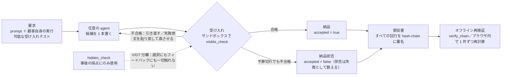

<p align="center"></p>

<p align="center">
  <a href="README.md">繁體中文</a> ·
  <a href="README.en.md">English</a> ·
  <b>日本語</b>
</p>

<details>
<summary>ASCII ロゴ（SVG が表示されない環境向け）</summary>

```text
█   █  ███   ███   ███  █   █ █████
█   █ █   █ █   █ █   █ ██  █   █
█   █ █   █ █     █   █ ██  █   █
█   █ █████ █     █████ █ █ █   █
█   █ █   █ █     █   █ █  ██   █
 █ █  █   █ █   █ █   █ █  ██   █
  █   █   █  ███  █   █ █   █   █
```

</details>

# Vacant

**任意の AI agent の外側に取り付ける説明責任（accountability）レイヤ：顧客の実行可能な受け入れテストを走らせ、
納品するかしないかを決め、一手ごとを領収書に署名して残す。**

Vacant は任意の **AI agent** の外側に取り付ける**説明責任レイヤ（accountability layer）**です：
顧客自身の**実行可能な受け入れテスト（executable acceptance tests）**を走らせ、その結果で納品可否を決め、
すべての試行をオフラインで再検証できる **hash chain**（**signed receipts**）に署名して残します。
測定はすべて**事前登録（pre-registered）**されており、主要な比較は**同一問題集で 5 回の追試（replication）**と、
互いに排反な 4 集合による横断実験として再実行しました。題材は **LLM code generation**
（**LiveCodeBench**・**HumanEval+**・**MBPP+**）。**5 回の結果は下で 1 回ずつそのまま列挙**し、
1 つの数字に併合していません。

[](pyproject.toml)
[](LICENSE)
[](tests)
[](runs/INDEX.md)
[](ops/gain/replay)
[](DECISION_20260911_R460R_FIVE_REPLICATIONS_PREREG.md)

> **前提文（納品効果に関するいかなる主張も、必ずこれを添えて述べること）**
> このすべては「要求仕様が実行可能な受け入れテストにコンパイルできる」という前提の上に成り立つ。
> 要求が実行できない場面では、この機構に無料の審判はおらず、「もう一つのモデルに訊く」へ退化する——
> そしてそれこそが、測ってみて非常に悪かったものである。
> （`DECISION_20260903_R440P_CONFORMANCE_GATE.md`§五-1 の逐語文の日本語訳）

---

## 60 秒でわかる

3 ステップ：**受け入れ → ゲート → 領収書**。



1. **受け入れ**：顧客の受け入れスイートは**プログラムではなくデータ**（`SuiteSpec` ＝ entry point ＋
   リテラルの `(args, expected)`）。実行器は自分のレンダラが生成したコードしか走らせない。
   チェーンに載せる前にゲージを通す必要がある：参照解がすべて通る ∧ 既知の壊れスタブがすべて弾かれる。
2. **ゲート**：受け入れを通ったものだけ納品。予算内に 1 本も通らなければ**納品拒否**、
   しかも**拒否は失敗として数える**（分母は全問）。
3. **領収書**：成功分だけでなく**すべての試行**を append-only の hash chain に署名。
   公開鍵を持つ誰でもオフラインで再検証できる。多者版では k 本の鍵が各自走らせ各自署名し、
   食い違えば**どの鍵かを名指しする**。

---

## 何を測ったか

**すべての数字に分母を付け、すべて上記の前提文のもとにある。** 数字の唯一の入口は
[`docs/VACANT_COMPLETE_2026-09-12.md`](docs/VACANT_COMPLETE_2026-09-12.md)、
裁定の唯一の真実源は [`examples/verdicts.py`](examples/verdicts.py)。

### A. 同一問題集での 5 回追試（LCB v2 120 問、gemma-4-12b-it-qat、6 アーム交錯、5 コール等予算）

| アーム | R460 本 run | r1 | r2 | r3 | r4 | r5 |
|---|---:|---:|---:|---:|---:|---:|
| 一発（OFF） | 58.33% | 57.50% | 54.17% | 57.50% | 51.67% | 51.26% |
| ゲート＋引き直し（CONFORM） | 70.83% | 71.67% | 72.50% | 75.00% | 70.83% | 70.94% |
| 5 回多数決（OFF5） | 65.00% | 60.83% | 61.67% | 59.17% | 66.67% | 68.64% |
| ループ（H-MIX） | 84.17% | 77.50% | 76.67% | 75.83% | 73.33% | 74.79% |
| **H-MIX − CONFORM** | **+13.33 pp** | +5.83 | +4.17 | +0.83 | +2.50 | +4.31 |
| b／c | 22/6 | 15/8 | 17/12 | 12/11 | 13/10 | 14/9 |
| 95% 区間（未調整） | [4.22, 19.46] | [−2.79, 12.89] | [−5.35, 12.80] | [−7.44, 8.89] | [−5.94, 10.28] | [−4.54, 12.01] |
| Holm p_adj（族 6） | 0.011 | 0.630 | 0.917 | 1.000 | 0.678 | 0.922 |

分母はいずれも 120、**ただし r5 は例外**：2026-09-13 にバックエンドのモデルが crash し、TTL 1 時間付きで
JIT 再ロードされた（毎時アンロード）ため 7 行が `infra_void` になった。したがって r5 の列は**アームごとの分母**
（OFF 119／CONFORM 117／OFF5 118／H-PI 120／H-OC 120／H-MIX 119）であり、主指標 H-MIX − CONFORM は
**complete-case n=116**、無効行は埋め戻さない。
（出典：`DECISION_20260912_R460R_FABLE_AUDIT_REPLICATIONS.md`§八-1）

**事前登録された主張ルール（逐語）**：「5/5 同符号（Δ_C > 0）かつ 4/5 以上が Holm 有意 ⇒『追試は安定』と
書いてよい。さもなくば各回をありのまま列挙する。」同符号 5/5 は成立、Holm 有意 **0/5** は不成立 ⇒
**各回をありのまま列挙**。書ける文型はこれだけ：

> 5 回の Δ_C はそれぞれ +5.83／+4.17／+0.83／+2.50／+4.31 pp、そのうち **Holm を通ったのは 0 回**。

同じ段落に必ず同時に現れるべき 5 点（1 つでも欠ければ良い所だけの報告）：
(1) 5 回とも同符号；(2) 0/5 が Holm 有意；(3) 未調整区間 5 本は**すべて R460 の [4.22, 19.46] と交わる**
——区間で見る限り R460 と排反な回は 1 つもない；(4) 5 本の上限（12.89／12.80／8.89／10.28／12.01）は
**すべて** R460 の点推定 13.33 **より低い**（これは記述であって検定ではない）；(5) 事前に書き留めた検出力
——n=120 で +10 pp に対し **0.43–0.63** ⇒ 5 回中**期待は 2–3 回**通過。真値が本当に +10 pp なら
0/5 が出る確率は約 0.007–0.06、すなわち**下側の裾**（下側の裾は反証ではない）。

**⚠「84%」を単独で引用しないこと。** R460 の 84.17%／+13.33 pp は**単回の上方バイアスのかかった点推定**
（winner's curse：有意と判定されうる推定値は MDE 以上に切り詰められる）であり、
**その後の 9 回の測定で一度も再現していない**。
**書いてはいけない語**：追試は安定、おおむね支持、追試失敗、効果は消えた、等価、引き分け、ループは無意味。
**n の併合・平均・1 回だけの抜き出しも禁止**。`RULED_OUT`（r3）の意味は**「≥+10 pp を排除」**であって
「いかなる効果も排除」ではない。

**5 回すべてで持ちこたえた 2 点**：
- **ループがあれば一発に勝つ**：H-MIX／H-PI／H-OC 対 OFF は**15 セルすべてが Holm 有意**（+17.5～+29.2 pp）。
- **誤納品（納品したが間違い）は H-MIX < CONFORM**：5/5 成立。

### B. 問題集横断（R529：互いに排反な 4 集合、真の出典は 3 つ、3 アーム）

| 問題集 | n | 一発 OFF | ゲート CONFORM | ループ H-MIX | H−C（b/c） | H−O（b/c） |
|---|---:|---:|---:|---:|---|---|
| LCB v3 medium | 135 | 115/135＝85.19% | 125/135＝92.59% | 126/135＝93.33% | +0.74 pp（6/5） | +8.15 pp（17/6） |
| LCB v3 hard | 54 | 38/54＝70.37% | 41/54＝75.93% | 43/54＝79.63% | +3.70 pp（5/3） | +9.26 pp（7/2） |
| HumanEval+ | 156 | 129/156＝82.69% | 147/156＝94.23% | 148/156＝94.87% | +0.64 pp（5/4） | +12.18 pp（24/5） |
| MBPP+ | 371 | 277/371＝74.66% | 295/371＝79.51% | 299/371＝80.59% | +1.08 pp（15/11） | +5.93 pp（31/9） |
| **併合** | **716** | 559/716＝78.07% | 608/716＝84.92% | 616/716＝86.03% | +1.12 pp（31/23、Holm **p_adj 0.341**） | +7.96 pp（79/22、Holm **p_adj 2.0e-8**） |

- **言ってよい**：フィードバックループの**一発に対する**優位は問題集を跨いで成立（4 集合すべて正、併合 p_adj 2.0e-8）。
- **言ってよい**：フィードバックループの**同予算の引き直しに対する**優位は、この 4 集合では**測れないほど小さい**
  （+0.6～+3.7 pp、併合 p 0.341）。
- **言ってはいけない**：「H-MIX は問題集横断で引き直しに勝つ」。逆に「H-MIX は引き直しに対して無効」も
  **言ってはいけない**——**同符号だが未解決 ≠ 差がない**（単一集合 n=54–156 の +10 pp に対する検出力は
  0.14–0.55 しかない）。
- HumanEval+ の分母は **164 ではなく 156**（8 問はサンドボックスの封筒条件で除外）。4 集合のうち 2 つは
  同一出典の難易度スライス ⇒ **真の出典は 3 つ**。
- ⚠ **2 台のバックエンドは同じ推論条件ではない**：1003（LM Studio 0.4.24）は gemma-4 に対し thinking が有効、
  1004（0.4.17）は無効（同一のモデルファイル。プローブ：completion 59 token／うち reasoning 53 対 2／0）。
  ペア比較はブロック内で同一機のため影響を受けないが、**集合ごとの絶対値と token／tpc は 2 つの推論条件の
  混合物であり、単独で引用してはならない**。
  （出典：`DECISION_20260912_R529_FABLE_AUDIT_CROSS_BANK.md`§十一）

### C. 増分の本体はどこにあるか（監査判断であり、事前登録の主指標ではない）

「ループ対一発」の増分を分解すると、**実行可能な受け入れゲート＋引き直しが大部分を持っていく**：

- CONFORM − OFF の 5 回：**+14.17／+18.33／+17.50／+19.17／+18.97 pp**（いずれも p_raw < 0.002、**未補正**）。
  R529 の 4 集合では +4.85～+11.54 pp。
- 同じデータで、H-MIX が CONFORM にさらに上乗せするのは +5.83／+4.17／+0.83／+2.50／+4.31 pp（0/5 が Holm 有意）。
- **分解は因果ではない**：CONFORM と H-MIX はそれぞれ独立に走った 2 本のアームであり、
  「まずゲート、次にループ」の二段構えではない。「+14 pp はゲート、+4 pp はループ」は**引き算で得た記述**であって、
  実験が分離した成分ではない。
- **多数決はゲートに負ける**：OFF5 − CONFORM の 5 回は −10.83／−10.83／−15.83／−4.17／−1.74 pp。
  **5/5 同符号だが有意は 3/5 のみ**、しかもバックエンドが最もきれい（共用なし）だった 2 回が非有意 ⇒
  **同符号・未解決**であり、「勝つ」と書いてはならない。

### D. 説明責任レイヤ自身は何を検証されたか

| 量 | 数字 | 自分で再計算する方法 |
|---|---|---|
| 領収書チェーン | **9,841 件**（67 run／194 チェーン）、Ed25519 署名と連結を 1 件ずつ**全通過、失敗 0、断裂 0** | `ops/gain/replay/verify_run_receipts.py --glob 'runs/g_r460r*'`（30 run／120 チェーン／6,674 件）**＋**`--glob 'runs/g_r529_*'`（37 run／74 チェーン／3,167 件）の合計＝9,841。`--glob` はパターンを 1 つしか取らないので 1 回の実行では全部を覆えない |
| V/GT 分離（隠しテストの漏洩ゼロ） | `--scope v2` で **67/67 ブロック CLEAN**、違反 0 | `ops/gain/harness_vgt_audit.py --run <run> --bank <bank> --scope v2`（bank 名＝`evalplus`＝MBPP+／`humanevalplus`／`lcb2`／`lcb3`） |
| 計測器自身の歯 | `--selftest` PASS、`--mutation-check` **9/9 検出** | `ops/gain/analyze_r529.py --mutation-check` |
| 索引がずれていない | `OK：索引とデータが一致（290 ディレクトリ、117 個に summary.json）` | `ops/gain/build_runs_index.py --check` |

⚠ V/GT ツールは **H アームしか走査せず**、些末な needle をスキップする（R460R r1–r3：needle 総数 95,090、
実検査 57,248、スキップ 37,842＝39.8%）——**スキップは検査済みではない**。残りは人手の抜き取りで補う。
⚠ ゲージ v2 は**「本当に漏洩した」実際の run で検証されたことがない**。陰性対照はすべて人手で植えたもの。

---

## これは何ではないか

- **agent ではない。** **任意の** agent の外側に付く：ゲート＋領収書＋多者立会い。誰がコードを書くかは関知しない。
- **prompt の小技ではない。** 3 本のループアームのフィードバック雛形・切り詰め規則・サンドボックス・
  タイムアウトは**逐語同一**（鉄則 KS-1 に実行可能なガードあり）で、違うのは機構そのもの。
  R460 のオフライン帰属は増分をループに置く：Δ(最終 − 初回ターン) は 2 回の再実行とも **+16～+19 pp**。
  一方、pi 式アームの初回ターンの prompt 効果は**ほぼゼロ（±2 pp 以内、再実行機の負荷で動く）**。
  ⚠ 帰属はオフライン再計算（`--rescore-turn1`）である：**R460 の 2 回の再実行はアームごとに 1–3 問ずれる**
  （R460R r1 の 3 回のローカル再採点は 120 問中 1 問のずれ）。数字を引くときはどの再採点かを明記すること。
- **「信頼（trust）」ではない。** 用語は**説明責任／依存に根拠を与えること**。古典的定義（Gambetta 1988、
  Mayer 1995）は「監視に依存しないこと」を信頼の必要条件に含めるが、監視こそがこのシステムの全部である——
  だからここでは「信頼」という語を使わない。
- **セキュリティ境界ではない。** `run_python` は独立プロセス・一時 cwd・CPU 制限・タイムアウトの下で走り、
  早期 `exit(0)`、同一ファイルからの隠しテスト読み出し、よくある process/file API は防ぐが、
  **悪意あるコードに対する完全な境界ではない**。信頼できないコードは container・gVisor・別 VM に入れること。
- **証明ではない。** demo で言えるのは「向上が見える」まで。「向上を証明した」は事前登録された batch run に
  留保されており、`docs/PREREG_V2.md` の C-3 は前件が 2 つとも未達である。

---

## アーキテクチャとコードマップ

| 層 | モジュール | 何を支えているか |
|---|---|---|
| L0 暗号 | `vacant/canonical.py`／`identity.py`／`crypto.py` | 機械を跨いで署名検証が一致する唯一の直列化規則。Ed25519 鍵対＋`vacant_id`（秘密鍵はゲートウェイ側、agent の推論からは身元が見えない） |
| L1 台帳 | `vacant/logbook.py`／`envelope.py`／`checkpoint.py`／`attest.py`／`receipt.py`／`trustcard.py` | append-only hash chain（`stream_id`＝創世ハッシュ、本物の `head()`）、署名エンベロープ＋`ReviewEnvelope`、それ自体が連鎖する V1 チェックポイント、可搬な証明書と委譲領収書 |
| L2 説明責任 | `vacant/registry.py`／`reputation.py`／`router.py`／`auditor.py`／`memory.py`／`dashboard.py` | 発見＋評判索引（**中央ルータではない**）、5 次元 Beta（key＝stream／branch／substrate ＝ credit は身体ではなく記憶に付く）、on/off 単一スイッチ、決定論的な再検証、MemoryManager M0/M1/M2、観測台（**パネルは説明責任の源ではない**） |
| L3 問題集と計測器 | `vacant/codebench.py`／`suitespec.py`／`suitegauge.py` | MBPP+（sha256 固定、371 問の固定部分集合）＋LiveCodeBench v1/v2/v3＋HumanEval+。**受け入れスイートはプログラムではなくデータ**。ゲージ＝参照解が全通過 ∧ 既知の壊れスタブを全阻止（**片側保証**） |
| L4 実験基盤 | `ops/gain/gain_run.py`／`harness_arms.py`／`analyze_r460.py`／`analyze_r460r.py`／`analyze_r529.py`／`vacant/peerexec.py`／`record.py`／`research.py` | 9 アームの runner（OFF／ON／OFF5／CONFORM／EQ5／ONR ＋ H-PI／H-OC／H-MIX）、裁定器（4 状態・Holm・区間・門番指標・`--selftest`／`--mutation-check`）、「相互実行であって相互審査ではない」立会い層、RECORD_SPEC 証拠パック、McNemar＋bootstrap＋事前登録の 4 関数 |
| L5 展示 | `vacant/entrycost.py`／`examples/receipt_viewer_multiparty.html`／`examples/e10_mediator.py`／`examples/publish_*.py`／`examples/verdicts.py` | 機構シミュレーション（会場で秒単位）、オフライン単一ファイルの領収書ビューア（r454 の 3 チェーン 5,579 件）、E10 の経路列の再計算、対外公開スクリプトと**裁定の唯一の真実源** |

**9 本のアーム**：`OFF`（一発、1.00 コール）、`ON`（評判ルーティング＋K=3 相互審査＋1 回修正、約 5 コール）、
`OFF5`（5 回多数決、5.00）、`CONFORM`（受け入れゲート・早期終了、1.3–1.7、題目集による）、`EQ5`（等予算、常に 5.00）、
`ONR`（ルーティングのみ切り出し）、`H-PI`／`H-OC`／`H-MIX`（3 本の修正ループ）。
**なぜ OFF5 が必要か**：ON が OFF に勝つのはほぼ必然である——5 倍のコールを使うからだ。
1 回対 5 回で「機構が効いた」と主張するのは、コストを機構だと言い換えているだけである。

---

## インストールと最小の実行例

Python 3.11 以上。runtime 依存は `cryptography` のみ（MCP 互換面のために `mcp` を追加）。

```bash
git clone https://github.com/cosmopig/Vacant.git
cd Vacant
python3 -m venv .venv
.venv/bin/pip install -e '.[dev]'
.venv/bin/python -m pytest tests/ -q      # 収集されるテストは 1,507 件
```

### モデル呼び出しゼロで見られるもの

```bash
# 1) 領収書ビューア（オフライン単一ファイル、file:// で直接開く、外部リソース 0）
open examples/receipt_viewer_multiparty.html     # Linux: xdg-open

# 2) 領収書チェーンを 1 件ずつ再検証（Ed25519 ＋ 連結。壊れた seq を名指しする）
#    --glob はパターン 1 つのみ ⇒ 2 回走らせて合計 9,841 件（6,674 ＋ 3,167）
.venv/bin/python ops/gain/replay/verify_run_receipts.py --glob 'runs/g_r460r*'
.venv/bin/python ops/gain/replay/verify_run_receipts.py --glob 'runs/g_r529_*'

# 3) 裁定器自身の歯
.venv/bin/python ops/gain/analyze_r460r.py --selftest
.venv/bin/python ops/gain/analyze_r529.py --selftest
.venv/bin/python ops/gain/analyze_r529.py --mutation-check

# 4) run 索引がずれていないこと
.venv/bin/python ops/gain/build_runs_index.py --check
```

### 実際にゲートを 1 回走らせる（OpenAI 互換エンドポイントが必要）

```bash
export VACANT_MCP_BASE=http://localhost:1234
export VACANT_MCP_MODEL=your-model
export VACANT_MCP_API=openai

.venv/bin/vacant run \
  "Write solve(nums), returning the sum of all even integers." \
  --test "assert solve([1, 2, 3, 4]) == 6" \
  --test "assert solve([]) == 0"
```

流れ：最大 3 回生成（前の版が客観 check を通らなかったときだけ作り直す）→ 他の resident による署名付き
相互審査＋決定論的 auditor による check 再実行 → task／check／answer／trust card を完全に束縛した Ed25519
receipt を生成 → **ローカルでもう一度 check**。すべて成立して初めてゲート通過。
`--agent` または `--agent-argv` で検証済み納品物を下流の CLI agent に渡せる
（JSON argv、`shell=False`、`argv[0]` にプレースホルダ不可）。

⚠ **agent 起動を認可できるゲートは `equals`／`json_schema`／`run_python` の 3 種の強い check のみ。**
`contains`／`regex` は探索向きで、納品物を支えるには足りない。

---

## 自分で再計算する

```bash
# 5 回追試の集計（--selftest は R460 の 6 ブロックで既知の答えに釘付けする）
python3 ops/gain/analyze_r460r.py --reps 1 2 3 4 5 --bank lcb2 --json /tmp/r460r.json

# R460 6 アームの裁定量
python3 ops/gain/analyze_r460.py \
  --run runs/g_r460_harness_lcb2_{a1,a2,a3,b1,b2,b3} \
  --bank lcb2 --rescore-turn1 --json /tmp/r460.json

# 横断 4 集合
python3 ops/gain/analyze_r529.py --json /tmp/r529.json

# V/GT 監査（v2 は全 CLEAN のはず。--scope v1 は R460 の 90 件の偽陽性を逐語で再現する）
# ⚠ MBPP+ の bank 名は evalplus。`--bank` に choices が無いため、名前を間違えると builtin の無限ジェネレータに
#   落ちる ⇒ エラーにならず、そのままハングする。
python3 ops/gain/harness_vgt_audit.py --run runs/g_r529_mbpp_a1 --bank evalplus --scope v2 --out /tmp/vgt.json

# E10 の 2 行の経路列（展示の主ビジュアル。保存済み JSONL を読むだけ、GPU 時間ゼロ）
python3 examples/e10_mediator.py

# この README 冒頭の 8-bit ロゴ（再構築＝生成器を再実行。SVG を手で直さない）
python3 docs/assets/make_vacant_8bit.py --check
```

⚠ `examples/e10_mediator.py` が読むのは iCloud にある保存済みデータセットで、**この repo には入っていない**。
外部の利用者が走らせられないのは想定どおりであり、不具合ではない。
⚠ `runs/` 配下の **136 個の `_analysis_*` ディレクトリは派生物であって証拠ではない**——入力が
`runs/g_*/rows.jsonl` そのものなので、生データとして引用することは自分の結論を自分に食べさせ直すことに等しい。
どの run を引用する前にも [`runs/INDEX.md`](runs/INDEX.md) を読むこと。
⚠ `ops/gain/analyze_r447.py` の `PREREG` 定数は変更禁止——他人の事前登録だからである。

---

## 正直な限界

1. **前提（以下すべてに優先）**：要求仕様が実行可能な受け入れテストにコンパイルできること。
   実行できない要求に無料の審判はいない。
2. **n が足りない**：LCB v2 の n=120 では約 12 pp 級の差しか判別できない。区間を ±5 pp にするには 278 問必要。
3. **問題集の性質**：「可視フィルタが無損失」は一部この問題集の性質（MBPP+／LCB では `hidden_check` が構造上
   可視側を含む）。受け入れスイートが真の要求の部分集合でない配備では、拒否が良い答えを殺す。
4. **5 回の追試は同一の 120 問を共有**：seed が変えるのは出題順・persona 割当・サンプリングだけで**問題は変わらない**
   ⇒ 問題レベルの効果は 5 回の間で完全に相関し、問題集固有性は追試では消せない。
5. **5 回のバックエンド負荷は同質ではない**（別 run との共用率 8.5／71.3／2.1／0／0%。r5 はモデル crash 1 回と
   アンロード 4 回を跨ぐ）——記述するが補正はしない。**回ごとの差をすべてサンプリングのせいにしてはならない**。
6. **2 台のバックエンド＝2 つの推論条件**（thinking／非 thinking）であり、単なるバージョン違いではない。
7. **多数決には数学的上界がある**：腐敗した実行器を許容できるのは最大 ⌊(k−1)/2⌋ 台。過半になれば名指しは反転し、
   しかも**機構は自分が閾値のどちら側にいるか知りようがない**。
8. **受け入れスイート自体の腐敗には全く無防備**：スイートを「読み込めれば合格」に差し替えると、票はすべて誠実、
   チェーンはすべて検証を通り、指標は満点のまま、システムはゴミを納品する。残余は必ず**2 つの数字**で述べる：
   実現可能 +2.72 pp、後知恵の上限 +4.35 pp。
9. **レンダラとサンドボックスは依然として信頼される入力**：信頼は移動しただけで消えていない——
   レンダラにバグがあれば k 台は**一致して**間違え、係争率は 0 のままである。
10. **署名が指すのは鍵であって主体ではない**：領収書が証明するのは「この鍵がそう言い、その後改変されていない」
    ことであって、「それが真実である」ことではない。
11. **同源／Sybil 対策は raises-cost であって prevents ではない**：**新しい身元を作ること自体には現在コストがない**
    ——これは機構の地界であり、パラメータで消せるものではない。
12. **鍵の保管は配備側の前提**：同一 OS ユーザや root が秘密鍵を読める環境では、ソフトウェア層は偽造を prevents できない。
13. **ソフトウェアのゲートは controller が起動したプロセスしか覆わない**：下流 agent を直接実行すれば当然回避できる。
14. **Windows のサンドボックスは動かない**（`vacant/checks.py` の非 posix 分岐）。展示機は Linux VM なので影響しない。
15. **`g_*` の run ディレクトリは RECORD_SPEC の証拠パックではない**：必須項目をすべて満たすのは現状
    `blayer_1000_v2`／`v3` の 2 つだけ。
16. **証拠パックが保証するのは自己整合性であって内容の真偽ではない**：`SHA256SUMS` は保存後の改竄を **detects** するが、
    **prevents** はしない。

完全な一覧（B0–B20、H1–H9、および各収束文書の限界）は
[`docs/VACANT_COMPLETE_2026-09-12.md`](docs/VACANT_COMPLETE_2026-09-12.md)§四 にある。

---

## 実地の展示

**唯一の成果物は実地の展示である。学位論文は書かず、投稿もしない。** ある作業をやるかどうかの判断基準は
「来場者が目の前に立ったとき、これで違いが出るか」。そこから出てくる硬い制約は、どれも技術的判断を変える：

1. **秒単位のインタラクション**：実モデルは 1 問あたり実測約 114 秒——会場では待てない ⇒ 展示は機構シミュレーション
   （`vacant/entrycost.py`）か事前再生を走らせ、**画面に「これは機構シミュレーションである」と明示しなければならない**
   ——シミュレーションを証明と言うことは、鉄則 5 の展示版違反である。
2. **オフラインで動き、無人で回ること**：ネットワークも解説員も前提にしない。外部エンドポイントに依存するものには
   fallback を用意する。（同じ理由で harness の「doom-loop は人間に訊く」を自動の納品拒否に変えた。）
3. **先行研究は依然として重要。ただし理由は「来場者に嘘を言わないため」**：パルス攻撃は 2005 年に名前が付いており
   （Srivatsa）、入場料が効かないことは 2001 年に示されている（Friedman & Resnick）——我々は再発見したのであって、
   発見したのではない。
4. **統計的検出力は発表水準に達する必要はない**：素人が一目で読める反実仮想の対照のほうが p 値より重要である。
5. **倫理は付録ではなく第一線の要件**：展示は実在の人物のデータから分身を生成する。Hollanek 2024 は
   **提供者の同意だけでは足りず、対話する側も同意できなければならない**と指摘する——動物園とは、
   横で誰かが見ているものだからだ。同じ `logbook`／`checkpoint` の機構を、展示自身の同意・削除の証明にも使う：
   展示している当の機構で、自分が約束を守っていることを証明する。

展示物：[`examples/receipt_viewer_multiparty.html`](examples/receipt_viewer_multiparty.html)（4.48 MB。
実走 r454 の 3 本の完全なチェーン＝5,579 件を内蔵し、ブラウザ内で創世から鎖頭まで検証、裁定／名指し／納品を
1 マスずつ再計算し、票を反転させれば署名が赤くなること、誠実な票が 1 つ欠ければ引き分けで名指しが起きないこと、
プラットフォーム文字列を変えても何も起きないことを示す）。展示機（Linux VM）の headless Chrome で `file://`
から実測 **2.1 秒**で描画。
**解説者が知っておくべきこと**：あの領収書のマス（`Mbpp/100` の 0 本目）は**並べ替えて最初に出た嘘のマスであり、
選び出したものではない**。

---

## 研究の規律

- **事前登録**：閾値・検定族・分母・区間法・4 状態・**反証条件**をデータが存在する前に書いて凍結する。
  発射前に全 `summary.json` を走査して seed が一度も使われていないことを確認する（ヒット集合は認可集合と
  **ちょうど一致**しなければならない——1 つ少なくても停止する。「測れない」は「合格」ではないからだ）。
- **Holm**：族は**その 1 回の追試の中の** 6 検定。5 回分の 30 検定を 1 つの Holm に投げ込むことは**禁止**——
  それは「追試」をこっそり「n=600 の実験 1 回」に変えてしまう。
- **complete-case**：`infra_void` の行は埋め戻さない。r5 の主指標の分母は **120 ではなく 116**、
  最悪ケースの境界も併記する。
- **追試**：主張ルールは事前に固定（5/5 同符号かつ 4/5 以上が Holm 有意のときのみ「追試は安定」と書ける）。
  満たされなければ各回をありのまま列挙する。**「まず 3 回走らせる」と「3 回で結論する」は別のことである。**
- **敵対的再検証**：対外的な主張はすべて独立した agent に渡され、その仕事は主張を潰すことである。第 1 巡では
  **12 件中 3 件が反証、3 件が言い過ぎと判定**。すべて `examples/verdicts.py` に残してあり、古いものも消さない。
  R452 の初版が書いた「3 種の攻撃は表現不可能」は**誤りだった**——`entry_point="exec"` で一撃で貫かれ
  （368/371 がチェーンに載り、誤納品 31.5%）、その失敗も記録に残している。
- **事故の開示**：1003 で `bad alloc`／`Context size has been exceeded` を 2 度踏んだ（無効化したブロックは
  まるごと `runs/_aborted/` に移して証拠として残し、いかなる分析にも入れない）。スケジューラが
  `UnicodeDecodeError` で落ちた（発射器が中国語をバイト単位で切った）。V/GT ゲージ v1 が報告した 90 件の違反は
  **1 件ずつ分類した結果すべて偽陽性**だった（偽陽性の多い計測器は本物の信号を溺れさせる）。
  分析器の並行ウィンドウが完了時刻を送信時刻として扱っていた ⇒ 見かけ上の過剰同時実行。修正後、
  **すべての裁定値はビット単位で不変**だった。
- **反証されたものは残す**：説明責任を主張するシステムが自分自身について説明責任を果たせないなら、
  その主張には中身がない。

---

## ドキュメント索引

| ファイル | 内容 |
|---|---|
| [`docs/VACANT_COMPLETE_2026-09-12.md`](docs/VACANT_COMPLETE_2026-09-12.md) | **現状の総表**：何があり、何を測り、限界は何で、どう自分で検証するか（数字の唯一の入口） |
| [`docs/VACANT_ARCHITECTURE_AND_RESULTS_2026-09-07.md`](docs/VACANT_ARCHITECTURE_AND_RESULTS_2026-09-07.md) | R455／R461 までの正典（逐語のまま引き継ぎ、置き換えられていない） |
| [`docs/HMIX_ARCHITECTURE_2026-09-11.md`](docs/HMIX_ARCHITECTURE_2026-09-11.md) | H-MIX ループ：6 つの部品、逐語の prompt、できないこと |
| [`docs/HARNESS_STUDY_2026-09-07.md`](docs/HARNESS_STUDY_2026-09-07.md) | 外部 harness のソースコード事実と「9 つの伝説」の逐条検証 |
| [`DECISION_20260911_R460R_FIVE_REPLICATIONS_PREREG.md`](DECISION_20260911_R460R_FIVE_REPLICATIONS_PREREG.md) | 5 回追試の事前登録（主張ルール、禁止事項、中止基準） |
| [`DECISION_20260912_R460R_FABLE_AUDIT_REPLICATIONS.md`](DECISION_20260912_R460R_FABLE_AUDIT_REPLICATIONS.md) | 5 回追試の収束監査（§八＝5 回そろった） |
| [`DECISION_20260911_R529_CROSS_BANK_PREREG.md`](DECISION_20260911_R529_CROSS_BANK_PREREG.md) | 問題集横断の事前登録 |
| [`DECISION_20260912_R529_FABLE_AUDIT_CROSS_BANK.md`](DECISION_20260912_R529_FABLE_AUDIT_CROSS_BANK.md) | 問題集横断の収束監査（§十一＝2 台のバックエンドは推論モードが違う） |
| [`DECISION_20260911_R460_FABLE_AUDIT_HARNESS.md`](DECISION_20260911_R460_FABLE_AUDIT_HARNESS.md) | R460 6 アームの収束（4 状態、門番指標、winner's curse 免責） |
| [`DECISION_20260903_R440P_CONFORMANCE_GATE.md`](DECISION_20260903_R440P_CONFORMANCE_GATE.md) | 前提文の出典＋候補プールの天井（17–19% の問題は 5 本の候補が全部間違い） |
| [`SPEC_GAIN.md`](SPEC_GAIN.md) | G 実験の仕様：V/GT 分離、問題集の固定部分集合、アームの定義 |
| [`docs/RECORD_SPEC.md`](docs/RECORD_SPEC.md) ／ [`docs/PREREG_V2.md`](docs/PREREG_V2.md) | 証拠パック仕様／主張の階梯（**人間の署名による凍結待ち**） |
| [`runs/INDEX.md`](runs/INDEX.md) | run 索引：どれが証拠でどれが派生物か、問題集の sha256、既知の壊れ問題 |
| [`examples/verdicts.py`](examples/verdicts.py) | **裁定の唯一の真実源**（held／unresolved／no_effect／overstated／refuted） |
| [`CLAUDE.md`](CLAUDE.md) | 作業上の制約：鉄則、用語、後回し項目 |

---

## 引用

[`CITATION.cff`](CITATION.cff) を参照。

```bibtex
@software{vacant_2026,
  author  = {cosmopig},
  title   = {Vacant: an accountability layer for AI agents},
  year    = {2026},
  url     = {https://github.com/cosmopig/Vacant}
}
```

## ライセンス

[MIT](LICENSE)。
