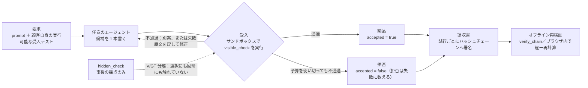

<p align="center"></p>

<p align="center">
  <a href="README.md">繁體中文</a> ·
  <a href="README.en.md">English</a> ·
  <b>日本語</b>
</p>

# Vacant

**Vacant はエージェントの外側に被せる強制層ではなく、もう一つの agent framework でもない。
受付窓口である——検証可能な領収書を伴わない納品は、受理されない。
成果物だけを見てエージェントの走り方を問わないので、どの framework の出力でも載せられる。**

顧客自身の実行可能な受入テストを走らせ、その結果で納品するか拒否するかを決め、失敗した
試行も含めて一回ごとにオフラインで再検証できるハッシュチェーンへ署名する。**マシン全体で
唯一の出口**にするにはコンテナ／ACL／egress policy が要る——それは配備層の仕事であって
Vacant の仕事ではない（`vacant/controller.py:7-8` には以前から逐語でそう書いてあったが、
対外的な文章に出たことが一度も無かった）。

我々の発明ではなく既存のパターンである：サプライチェーン・セキュリティの
**in-toto／SLSA／Sigstore** も同じ——正当な attestation を伴わない artifact は受入時に拒否される。

```bash
pip install vacant-network        # import 名は従来どおり vacant
```

[](https://pypi.org/project/vacant-network/)
[](pyproject.toml)
[](LICENSE)
[](pyproject.toml)
[](tests)
[](ops/gain/replay)
[](AGENTS.md)

> **前提（納品成果に関するどの主張も、この一文と一緒に述べること）**
> すべては「要求を実行可能な受入テストへコンパイルできる」ことの上に成り立つ。要求が
> 走らない場面ではこの機構に無料の審判は存在せず、「モデルに訊く」へ退化する——それは
> まさに計測結果の悪かったものである。
> （`DECISION_20260903_R440P_CONFORMANCE_GATE.md` §五-1 より逐語）

**AI エージェント向けの統合契約は [`AGENTS.md`](https://github.com/cosmopig/Vacant/blob/main/AGENTS.md)**（索引：[`llms.txt`](https://github.com/cosmopig/Vacant/blob/main/llms.txt)）。
本ページ後半の [§AI 向け](#ai-向け) は同じ契約の散文版。

---

## 30 秒クイックスタート

モデル呼び出しゼロ、ネットワークなし、clone 不要。

```python
from vacant.checks import run_python_check
from vacant.identity import Identity, PublicIdentity
from vacant.logbook import Logbook

# 1) 受入：テストは runner プロセス、候補コードは別の worker プロセスで走る
tests = "assert solve([1, 2, 3, 4]) == 6\nassert solve([]) == 0\n"
good  = "def solve(nums):\n    return sum(n for n in nums if n % 2 == 0)\n"
cheat = "def solve(nums):\n    import os; os._exit(0)\n"      # 「全テスト通過」に偽装する試み

print(run_python_check(good,  tests, allowed_entry_points=("solve",)))   # True
print(run_python_check(cheat, tests, allowed_entry_points=("solve",)))   # False

# 2) 領収書：試行ごとに append-only ハッシュチェーンへ署名
me, book = Identity.generate(), Logbook()
who = PublicIdentity(vacant_id=me.vacant_id, pub=me.pub)
book.append("attempt", {"draft": "sha256:aaa", "visible_ok": False}, me, ts_ms=1_700_000_000_000)
book.append("attempt", {"draft": "sha256:bbb", "visible_ok": True},  me, ts_ms=1_700_000_000_001)
book.append("shipped", {"accepted": True, "draft": "sha256:bbb"},    me, ts_ms=1_700_000_000_002)
print(book.verify_chain(who))                                            # True

# 3) 途中の一件を改竄 ⇒ 検証は失敗する
import copy
from vacant.logbook import LogEntry
forged = Logbook([copy.deepcopy(e) for e in book.entries])
e = forged.entries[1]
forged.entries[1] = LogEntry(e.stream_id, e.branch_id, e.seq, e.prev_hash, e.ts_ms, e.type,
                             {"draft": "sha256:aaa", "visible_ok": True}, e.sig)  # False -> True
print(forged.verify_chain(who))                                          # False

# 4) 誠実な境界：末尾を切り落とすと正当な接頭辞になり、これでは検出できない
print(Logbook(list(book.entries[:2])).verify_chain(who))                 # True ← 検出されない
```

4 番目はバグの実演ではなく、**このチェーンの地界**である。`verify_chain` は seq の連続性、
`prev_hash` の連結、各エントリの署名を確認するが、**長さのコミットメントも外部アンカーも
持たない**ため、正当な接頭辞はそのまま通る。文献ではこれを
**truncation／omission attack**（Ma & Tsudik 2009）と呼ぶ。チェーンが与えるのは
**integrity（改変されていないこと）であって completeness（欠落が無いこと）ではない**。
切り落としを検出したいなら、チェーン先頭（`Logbook.head()`）を外部に公示するか連署させる
こと——Vacant は代わりにやってくれない。

```bash
vacant --help                     # インストール後に使える CLI
```

---

## 我々を信じる必要はない

説明責任を掲げるシステムが外部から点検できないなら、その主張に中身は無い。
**次の 4 つは外部の利用者が自分で走らせられる**。我々の言い分を信じる必要は一切ない：

| 何を検証するか | 自分で走らせる | それで足りる理由 |
|---|---|---|
| 領収書チェーンが触られていないこと | `verify_run_receipts.py --selftest`（先に陰性対照）→ `--glob 'runs/g_r532_*'` | まず検証器が壊れた鎖を捕らえることを示し、そのうえで本物に向ける。R532：**86 本 3,895 件、失敗 0** |
| 問題を我々が選んでいないこと | [`docs/BANKS_HOWTO.md`](https://github.com/cosmopig/Vacant/blob/main/docs/BANKS_HOWTO.md) | 問題集の sha256 は固定。日付窓と既知の不良問題は [`runs/INDEX.md`](https://github.com/cosmopig/Vacant/blob/main/runs/INDEX.md) にある |
| 結論が解析器の作り話でないこと | `runs/g_*/rows.jsonl` を自分で数える | 1 行＝1 問 1 腕、`deliv = accepted ∧ meets_demand` |
| 我々が誤りを隠していないこと | [`examples/verdicts.py`](https://github.com/cosmopig/Vacant/blob/main/examples/verdicts.py) と下の〈誠実な境界〉 | 反証された主張は消さない。**自分の監査で見つけた被覆漏れも載せている**（境界 3） |

---

## 60 秒で分かる全体像

三段階：**受入 → ゲート → 領収書**。



1. **受入**：顧客の受入テストは**プログラムではなくデータ**（`SuiteSpec`＝エントリポイント
   ＋リテラルの `(args, expected)`）。実行器は自分がレンダリングしたコードしか走らせない。
   チェーンに載せる前にゲージを通す：参照解がすべて通り、かつ既知の壊れたスタブがすべて弾かれること。
2. **ゲート**：受入を通ったものだけ納品する。予算内に一本も通らなければ**拒否**であり、
   **拒否は失敗に数える**（分母は全問題）。
3. **領収書**：成功した回だけでなく**すべての試行**を append-only ハッシュチェーンへ署名する。
   公開鍵を持つ誰でもオフラインで再検証できる。多者版は k 本の鍵がそれぞれ走り、それぞれ
   署名し、不一致なら**どの鍵かを名指しする**。

---

## 最新の結果

**すべての数字は分母を伴い、かつ上記の前提の下にある。** 数字の単一入口は
[`docs/VACANT_COMPLETE_2026-09-12.md`](https://github.com/cosmopig/Vacant/blob/main/docs/VACANT_COMPLETE_2026-09-12.md)、
裁定の単一の真実の源は [`examples/verdicts.py`](https://github.com/cosmopig/Vacant/blob/main/examples/verdicts.py)。

### 一文で言う主結論

**利得の本体は「実行可能な受入ゲート＋再抽選」であって、フィードバックループではない。**

| 比較 | 12B（gemma-4-12b-it-qat） | 27B（qwen3.8-27b, non-thinking） |
|---|---|---|
| **ゲート＋再抽選 − 一発**（Δ_G） | 同一問題 5 回反復：**+14.17／+18.33／+17.50／+19.17／+18.97 pp**（n=120、p_raw すべて < 0.002） | 836 問・5 問題集の統合：**+7.89 pp** [5.36, 10.04]、p=3.0e-9 |
| **ループ − 一発**（Δ_O） | **15 セルすべて Holm 通過**、+17.5〜+29.2 pp | **+4.67 pp** [1.75, 7.38]、p=0.0015（Holm p_adj 0.0030） |
| **ループ − ゲート＋再抽選**（Δ_C） | 5 回 +5.83／+4.17／+0.83／+2.50／+4.31 pp、**0/5 が Holm 通過**；問題集横断 4 集の統合 +1.12 pp、Holm p_adj **0.341** | 5 集すべて**負号** −5.83／−5.19／−16.67／−1.28／−0.54、統合 **−3.23 pp** [−5.52, −0.75]、p=0.0101 |

⚠ Δ_G は**事前登録した族の外**（族は Δ_C と Δ_O のみ）。したがってその p は
**多重比較補正を受けていない**し、補正済み区間も無い。引用時はこの一文を必ず添えること。

### 何を言ってよく、何を言ってはいけないか

**言ってよい：ループは一発に勝つ。これは安定している。** 12B で 15/15 が Holm を通過し、
27B でも +4.67 pp が通過する。

**言ってはいけない：ループが同予算の再抽選に勝つ。** これは**未確立**である。12B では
9 個のデータ点がすべて同符号（+0.64〜+5.83 pp）だが、5 回反復では 0/5 が Holm を通過せず、
問題集横断 4 集の統合でも Holm p_adj は 0.341。27B では 5 集すべてが**負号に反転**し、
統合では検定を通過する。**同符号で補正を通らないのは「未解決」であり、肯定でも否定でもない。**
（n=54–156 の単集では +10 pp に対する検出力が 0.14〜0.55 しかない。）

27B の回で引用してよい状態は **`RULED_OUT`**：「この 836 問において、ループが同予算の
再抽選に対して ≥+2 pp の実務的利得を持つことは排除された」。**`EFFECTIVE` は引用しては
ならない**——事前登録した 4 状態表には方向のガードが無く、**逆方向**の有意な結果に
`EFFECTIVE` が貼られてしまった。そのラベルが許可する文は、このデータ上では偽である
（`DECISION_20260917_R532_STRONGER_MODEL_PREREG.md` AMEND1）。また「逆方向かつ有意」を
受け止める**事前登録された状態が存在しない**ため、「ループは有害だ」という結論も下さない。

**必ず書くべき誠実な境界：27B の回の前提「より強いモデル」は、その回自身のデータが支持しない。**
`OFF` 腕はハーネスを含まない素のモデル強度そのものであり、27B 74.8% 対 12B 75.2%、しかも
**LiveCodeBench の 3 問題集すべてで劣る**（−9.2／−9.6／−3.7 pp）。優れていたのは EvalPlus
の 2 集だけ。⇒ この回が計測したのは「**別のモデルに替えた**」ことであって「強くなった」
ことではない。「モデルが強くなればループは効かなくなる」とは書けない（AMEND2）。

**禁句**：複製失敗、効果が消えた、等価、引き分け、多数が支持、複製は安定、ループは無意味、
傾向は明らか。差は差として書き、improvement／向上と書かない。

### 規模と完全性（R532 の回）

| 量 | 数字 | 自分で再計算する方法 |
|---|---|---|
| 規模 | 5 問題集 **836 問**、**43 ブロック**、2,508 行、**`infra_void` ゼロ** | `ops/gain/r532/results_r532.json` |
| 隠しテストの漏洩（**1 腕しか見ていない**） | V/GT `--scope v2`：**H-MIX 腕は 43/43 CLEAN**（指紋 199,019 個）。`OFF` と `CONFORM` は**一度も走査されていない**（境界 3） | `ops/gain/harness_vgt_audit.py --run <run> --bank <bank> --scope v2` |
| 領収書チェーン | **86 本 3,895 件**、Ed25519 署名と連結を逐一検証し**全通過、失敗 0** | `python3 ops/gain/replay/verify_run_receipts.py --glob 'runs/g_r532_*'` |
| 仲裁者自身の歯 | `--selftest` PASS（手計算 12/12 組） | `python3 ops/gain/r532/analyze_r532.py --selftest` |

⚠ **「V/GT は全腕クリーン」とは書いてはならない。** このツールは構造上 H 腕しか走査せず
（境界 3）、些末な needle をスキップする——**スキップは検査ではない**。
⚠ このゲージは**本当に漏洩した実 run で検証されたことがない**。陰性対照はすべて人手で植えたもの。

**一括で再実行する方法**は [`docs/BANKS_HOWTO.md`](https://github.com/cosmopig/Vacant/blob/main/docs/BANKS_HOWTO.md) を参照。

---

## 誠実な境界

免責事項ではなく仕様の一部である。数字を引用するときは必ず一緒に運ぶこと。

1. **前提（以下すべてに優越する）**：要求が実行可能な受入テストへコンパイルできること。
   走らない要求に無料の審判は存在しない。
2. **Vacant は、インストールしただけで任意のエージェントを包む強制層になるわけではない。**
   ライブラリ（`vacant/agent.py:51-103`、`self.brain` は公開属性）や MCP ツール
   （`vacant/mcp_server.py:184-210`、ツールの docstring は「勧めている」だけ）の形態では
   **任意**である——エージェントが呼ばなければ存在しないに等しく、それを検知する仕組みも無い。
   コントローラ（`vacant/controller.py:304-530`）、またはハーネス自身がエージェントループを
   所有する形態でのみ、**自分が spawn した子プロセスに対して**強制となる。
   `vacant/controller.py:7-8` 逐語：保証は本コントローラ経由で起動した子プロセスのみを覆う。
   同一 OS ユーザがこのコマンドを迂回してエージェントを直接実行することは阻止できない。
   マシン全体で唯一の出口を強制するにはコンテナ、ACL、egress policy が必要である。
   本ページのどの一文も、この文より楽観的に読まれてはならない。
   正式な用語で言えば、Saltzer & Schroeder 1975 の reference monitor 三条件のうち、
   Vacant は**改竄耐性**と**検証できるほど小さいこと**を満たすが、
   **complete mediation（完全媒介）を満たさない**。これはバグではなく、
   「任意のものは完全媒介できない」ことの必然的帰結である。強制層と書けばそれは嘘になる。
3. **昨日、対外的に誤ったことを述べた。ここで訂正する。** 我々は R532 について
   「V/GT レッドライン 43/43 CLEAN」と書いた。**この文は誤りである。**
   `ops/gain/harness_vgt_audit.py:746` は `if arm not in VARIANTS: continue` であり、
   `harness_arms.py:65` の `VARIANTS = ("HPI", "HOC", "HMIX")` ⇒ **`OFF` と `CONFORM` の
   2 腕は一度も走査されていない**。各ブロックの `per_arm` は `{'HMIX': N}` だけである。
   正しい言い方は「**H-MIX 腕が 43/43 CLEAN、他の 2 腕は未監査**」。
   179 件のアーカイブ済み run の遡及走査は**進行中で結果は出ていない**。それまで本プロジェクトの
   どの文書も「V/GT は全腕クリーン」と書いてはならない。この項を残すのは、
   自分の監査の被覆漏れを自分で見つけて公開することが、どんな性能数値よりも
   「説明責任は実行可能か」に答えるからである。
4. **ゲートが保証するのは「書かれたテストを通った」ことであり、「真の要求を満たした」ことではない。**
   `vacant/suitegauge.py:30-33` の片側保証は逐語で：壊れたスタブを弾けることは、その受入テストが
   何でも通すわけではないことを示すだけで、**真の要求を覆っていることは証明しない**。実測：
   R532 の 836 問のうちゲートが**受理した 811 件**の中に、**可視の受入を通ったが隠しテストを
   通らなかったものが 120 件（14.8%）**あった。ゲート無しでは 211/836＝25.2%。
   ⇒ ゲートは偽納品をおおむね**半減させるが、消しはしない**。
5. **チェーンが与えるのは integrity（改変されていないこと）であって completeness
   （欠落が無いこと）ではない。** `vacant/logbook.py:168-195` は seq の連続性、`prev_hash` の
   連結、各エントリの署名しか見ず、長さのコミットメントも外部アンカーも無い ⇒
   **正当な接頭辞はそのまま通る**（クイックスタート 4 番）。文献にはこれの正式名がある：
   **truncation／omission attack**（Ma & Tsudik 2009）。必ず三点セットで述べること：
   - **`vacant/checkpoint.py:144-155` の チェックポイント鎖に同じ穴がそのまま複製されている。**
     `verify_checkpoint_chain` は `prev_checkpoint_sig` の後ろ向きの連結と先頭が null である
     ことしか見ない ⇒ **末尾を数枚捨てても残りは全通過する**（実測：4 枚全通過、末尾 2 枚を
     落としても全通過、途中の 1 枚を抜くと失敗、先頭を抜くと失敗）。
   - **「件数を各エントリに署名する」では防げない。** `seq` がすでに件数であり、切り詰めた
     接頭辞の各エントリは依然として自己整合的である。**長さのコミットメントが有効であるには
     外生でなければならない**——他人の手元にあるか、切り詰めより時間的に前にあるか。
   - 検出したければ `Logbook.head()` を外部に公示するか連署させること。Vacant は代行しない。
6. **署名が指すのは鍵であって主体ではなく、真偽でもない。** 領収書は「この文をこの鍵が述べ、
   その後改変されていない」ことを証明するが、「その文が真である」ことは証明しない
   （`vacant/peerexec.py:117-120`）。製品経路の領収書は**納品側自身が署名**しており
   （`vacant/ecosystem.py:641-642`）、秘密鍵は同一 OS ユーザが読める平文 PEM である
   （`vacant/body.py:160` は passphrase 無しで `identity.save` を呼ぶ）。鍵の保管は配備上の
   仮定であり、ソフトウェア層では prevents できない。
7. **セキュリティ境界ではない。** `run_python` は独立プロセス・一時 cwd・CPU 制限・タイムアウトの
   下で走り、よくある早期 `exit(0)`、同一ファイルからの隠しテスト読み出し、process/file API を
   防ぐが、**完全な悪性コード境界ではない**。信頼できないコードはコンテナ、gVisor、独立 VM へ。
   `vacant/checks.py` に動作する Windows サンドボックス分岐は無い。
8. **多数決には数学的上限がある**：腐敗した実行器は最大 ⌊(k−1)/2⌋ まで。過半を超えると機構は
   反転し、しかも**自分が閾値のどちら側にいるかを機構は知り得ない**。
9. **受入テスト自体の腐敗には無防備**：テストを「読み込めれば通過」に差し替えると、全票が誠実で、
   全チェーンが検証を通り、指標は満点のまま、システムはゴミを納品する。残余は必ず**二つの数字**で
   述べる：実現可能 +2.72 pp、後知恵の上限 +4.35 pp。
10. **レンダラとサンドボックスは依然として信頼される入力**：信頼は移動しただけで消滅していない。
   レンダラにバグがあれば k 台は**一致して**間違え、係争率は 0 のままになる。
11. **同源／Sybil 対策は raises-cost であって prevents ではない**：新しい身元を作ること自体に
    現状コストは無い。
12. **n が足りない**：LCB v2 の n=120 は約 12 pp 級の差しか判別できない。区間を ±5 pp に
    縮めるには 278 問必要。
13. **問題集の特性**：「可視フィルタは無損失」は部分的に問題集の性質である。受入テストが真の
    要求の部分集合でない配備では、拒否は良い答えを殺す。
14. **5 回の反復は同じ 120 問を共有する**：seed が変えるのは出題順・persona・サンプリングだけで、
    問題は変わらない ⇒ 問題集固有の効果は反復では消えない。
15. **2 台のバックエンドは 2 つの推論条件**（thinking／非 thinking）であり、単なる版番号の差ではない。
16. **汚染は追い切れない**：HumanEval+／MBPP+（2021）はほぼ確実に現代のあらゆるモデルの訓練集合に
    入っている。納品率の上昇は「モデルが強い」と「この問題群が訓練集合に入った」を**区別できない**。
17. **証拠パックは自己整合を保証するだけで、内容の真実性は保証しない**：`SHA256SUMS` は
    書き出し後の改竄を **detects** するが **prevents** はしない。
18. **突合は同一出自である。** `ops/gain/replay/verify_run_receipts.py` の 3 つの突合規則
    （verdict 数 == rows 行数、task_id 集合が一致、attempt 数 ≥ verdict 数）は、
    **同一プロセスが書いた 2 つの記録**を比べている。非対称な書き漏れ（バグ）は捕らえるが、
    **両側が揃って書かないこと（悪意）は捕らえられない**。本来の突合には、少なくとも一方の端が
    利害の異なる者の手にあることが要る——それは現状できていない。
19. **証明ではない**：デモで言えるのは「向上が見える」まで。「向上を証明する」は事前登録した
    バッチ run のために取ってある。

完全な一覧は [`docs/VACANT_COMPLETE_2026-09-12.md`](https://github.com/cosmopig/Vacant/blob/main/docs/VACANT_COMPLETE_2026-09-12.md) §四。

### 強く書いてよいところ

以下は本当であり、コードの裏付けがある。控えめに書く必要はない：

- **受付のところは迂回できない。** `vacant/receipt.py` ＋ `controller.verify_delivery` が
  **5 つの sha256 を再計算**し（request／task／tests／answer／trust card）、Ed25519 署名を検証し、
  `chain_head`／`stream_id`／`branch_id` を**現に生きているチェーン**と突き合わせ、各査読が
  この納品そのものに束縛されていることを確認し、そのうえで初めて `policy.admit` する。
  起動権は `os.O_EXCL` で確保され（`vacant/controller.py:372`）、**1 枚の領収書は一度しか
  消費できない**。強制点は**受入時**にあり、実行時ではない——この部分は実際に機能している。

- **エージェントの自己申告が採用されたことは一度も無い。** エコシステム自身が verifier を走らせ
  （`vacant/ecosystem.py:531`）、コントローラは下流エージェントを起動する前に**独立にもう一度**
  走らせる（`vacant/controller.py:299-300`）。
- **受入サンドボックスは 2 プロセス。** テストコードは runner、候補コードは別の worker にあり、
  stdin/stdout ＋ nonce で RPC する（`vacant/checks.py:577-600`、`444-457`）。
  `ops/gain/gain_run.py:957` のコメント逐語：*"the candidate worker cannot see this test code"*。
  候補コードは**構造的にテストコードを見られない**——ブロックリストではない。
- **「計測できていないことは通過ではない」がコードになっている**：
  `"all_pass": bool(total > 0 and passed == total)`（`ops/gain/r530/acceptance.py:272`）。
  ゲージも同様に `n_broken >= 1` を要求し、空のスタブ集合では空虚に成立しない。
- **拒否は実際に起きる**：R532 の 836 問でゲート腕は 25 件、ループ腕は 68 件を拒否し、
  拒否はすべての比率の分母に入っている。

---

## これは何ではないか

- **エージェントではない。** **任意の**エージェントの納品出口に立つ：ゲート＋領収書＋多者証言。
  誰がコードを書くかは関知しない。
- **プロンプト技法ではない。** 3 本のループ腕はフィードバックテンプレート、切り詰め規則、
  サンドボックス、タイムアウトが逐語で同一（鉄則 KS-1 に実行可能なガードがある）。違いは機構そのもの。
- **「信頼」ではない。** 用語は**説明責任**である。古典的定義（Gambetta 1988、Mayer 1995）は
  「監督に依存しないこと」を信頼の必要条件に含めるが、監督こそ本システムの全内容である。

---

## アーキテクチャ

| 層 | モジュール | 何を支えるか |
|---|---|---|
| L0 暗号 | `vacant/canonical.py`／`identity.py`／`crypto.py` | 全署名が使う唯一の直列化；Ed25519 鍵対＋`vacant_id` |
| L1 台帳 | `vacant/logbook.py`／`envelope.py`／`checkpoint.py`／`attest.py`／`receipt.py` | append-only ハッシュチェーン（`stream_id`＝創世ハッシュ）；署名済み封筒；チェックポイント自身も連鎖 |
| L2 説明責任 | `vacant/registry.py`／`reputation.py`／`router.py`／`auditor.py`／`memory.py`／`dashboard.py` | 発見＋評判索引、5 次元 Beta、on/off 単一スイッチ、決定的な再監査（**ダッシュボードは説明責任の源ではない**） |
| L3 問題集とゲージ | `vacant/codebench.py`／`suitespec.py`／`suitegauge.py` | MBPP+／LiveCodeBench v1–v3／HumanEval+；**受入テストはデータであってプログラムではない**；ゲージは両側（**片側保証**） |
| L4 実験基盤 | `ops/gain/*`／`vacant/peerexec.py`／`record.py`／`research.py` | 9 腕の runner、仲裁者（4 状態、Holm、区間、`--selftest`／`--mutation-check`）、証言層、RECORD_SPEC 証拠パック |
| L5 展示 | `vacant/entrycost.py`／`examples/receipt_viewer_multiparty.html` | 機構シミュレーション（会場で秒単位）、単一ファイルのオフライン領収書ビューア |

**9 本の腕**：`OFF`（一発、1.00 呼び出し）、`ON`（評判ルーティング＋K=3 査読＋一回修正、≈5）、
`OFF5`（5 回投票、5.00）、`CONFORM`（受入ゲート、早期停止、1.3–1.7）、`EQ5`（等予算、常に 5.00）、
`ONR`（ルーティングのみ分離）、`H-PI`／`H-OC`／`H-MIX`（3 本の修正ループ）。
**なぜ `OFF5`／`EQ5` が必須か**：`ON` が `OFF` に勝つのはほぼ必然である。5 倍の呼び出しを
使っているからだ。1 回対 5 回で「機構が効いた」と主張するのは、コストを機構と偽ることである。

---

## ソースから動かす

PyPI のホイールには **`ops/` が入っていない**（実験 runner のため）。実験の数字を再計算するには
clone が必要。

```bash
git clone https://github.com/cosmopig/Vacant.git && cd Vacant
python3 -m venv .venv && .venv/bin/pip install -e '.[dev]'
.venv/bin/python -m pytest tests/ -q

# モデル呼び出しゼロで確認できるもの
open examples/receipt_viewer_multiparty.html                       # Linux: xdg-open
.venv/bin/python ops/gain/replay/verify_run_receipts.py --glob 'runs/g_r532_*'
.venv/bin/python ops/gain/analyze_r529.py --selftest
.venv/bin/python ops/gain/analyze_r529.py --mutation-check
.venv/bin/python ops/gain/r532/analyze_r532.py --selftest
```

⚠ `runs/` 下の **136 個の `_analysis_*` ディレクトリは派生物であって証拠ではない**——入力が
`runs/g_*/rows.jsonl` そのものだからである。run を引用する前に
[`runs/INDEX.md`](https://github.com/cosmopig/Vacant/blob/main/runs/INDEX.md) を読むこと。

---

# AI 向け

コーディングエージェント向けの統合契約。**全関数シグネチャと機械可読な事実ブロックを含む
完全版は [`AGENTS.md`](https://github.com/cosmopig/Vacant/blob/main/AGENTS.md)**（英語）、索引は [`llms.txt`](https://github.com/cosmopig/Vacant/blob/main/llms.txt)。

## A. どの形態が本当に強制なのか

| 形態 | 入口 | エージェントを拘束するか |
|---|---|---|
| **ライブラリ** | `vacant.agent.Vacant`（`vacant/agent.py:51-103`） | **しない——任意。** `self.brain` は公開属性。呼ばなければ関与しない。 |
| **MCP ツール** | `vacant.mcp_server`（`vacant/mcp_server.py:184-210`） | **しない——説得のみ。** `delegate` の docstring は "THE PREFERRED PATH" と書くだけ。無視しても阻止されず、検知もされない。 |
| **コントローラ** | `VacantFirstController.delegate_then_run`（`vacant/controller.py:304-530`） | **する——ただし自分が spawn した子プロセスに対してのみ。** |
| **ハーネスがループを所有** | 例：`ops/gain/r530/openwork_arms.py:642-696` | **する——ハーネスがループそのもの。** |

**正しい位置づけは「強制層」ではなく「受付窓口」である。** 強制点は**受入時**にある——
検証可能な領収書を伴わない納品は受理されず、**その関門は迂回できない**
（`vacant/receipt.py` ＋ `controller.verify_delivery` が 5 つの sha256 を再計算し、Ed25519 を
検証し、`chain_head` を突き合わせ、`os.O_EXCL` により領収書は一度しか消費できない）。
強制点は**実行時にはない**：Vacant をマシン唯一の出口にするにはコンテナ／ACL／egress policy
が必要で、それは配備層の仕事である。サプライチェーン・セキュリティの in-toto／SLSA／Sigstore
と同じパターンである。

正確に言えば、Saltzer & Schroeder 1975 の reference monitor 三条件のうち Vacant は
**改竄耐性**と**検証できるほど小さいこと**を満たし、**complete mediation を満たさない**。
これは任意であることの必然的帰結であって欠陥ではない。ライブラリや MCP 形態では、誠実な
言い方は「エージェントの検証済み成果は説明責任を負える」であって「エージェントが拘束されて
いる」ではない。

## B. どの層で割り込むか

1. **合否の線だけ欲しい** → `vacant.checks.run_python_check` を直接呼ぶ。身元もチェーンも設定も不要。
2. **試行の記録が欲しい** → `Logbook` を足し、試行ごとに append する。他は変えなくてよい。
3. **受入テスト自体の改竄を検知したい** → `SuiteSpec` として表現し、候補を生成する**前に**
   `commit_suite_with_gauge` でチェーンへ載せる。以後、実行器は spec から自分でレンダリング
   したコードしか走らせないため、供給側が「プログラム」を「テスト」に偽装できない。
4. **k 者の独立合意が欲しい** → `peerexec.select_by_quorum`。不一致は**鍵を名指しする**。
5. **エージェントが未検証のものを出せないようにしたい** → `VacantFirstController` ＋ OS 境界（§A）。

**エージェント側に必要な協力**：宣言されたエントリポイントを**定義する**コードを返すこと
（ゲートは `entry_point(*args)` を呼ぶ。散文は読まない）。**拒否を許容すること**
（予算切れ＝拒否であり、最後の候補をそのまま出荷するとゲートが唯一やっていることが消える）。
**隠しテストを受け取らないこと**（保留集合は prompt・再試行メッセージ・教訓のいずれにも
入れない。フィードバックは失敗の**形**まで抽象化する。鉄則 A4）。

## C. 検証可能な不変条件

- **I-1** 途中の改竄・途中の削除・創世の削除はいずれも検出される。
- **I-2** 候補コードは**構造的にテストコードを見られない**——別プロセス、nonce 付きの
  literal-only RPC（`vacant/checks.py:577-600`、`444-457`）。
- **I-3** 自己申告は採用されない（`ecosystem.py:531`、さらに `controller.py:299-300` で独立に再実行）。
- **I-4** 「計測できていない＝不通過」がコードになっている：
  `bool(total > 0 and passed == total)`（`ops/gain/r530/acceptance.py:272`）。ゲージは `n_broken >= 1` を要求。
- **I-5** ゲージは両側：参照解が通ること**かつ**既知の壊れたスタブがすべて弾かれること。
- **I-6** `suitespec.render(spec)` は決定的なので `render_sha256` はマシン横断で比較できる。
- **I-7** 拒否は実際に起き、分母に数えられる：R532 836 問でゲート腕 25 件、ループ腕 68 件。

## D. 統合で効いてくる境界

上の 19 条すべてが適用される。特に効くのは 4 つ：

- **H-1** 前提：実行可能な受入テストが作れなければ無料の審判は無い。
- **H-2** 受入通過 ≠ 要求充足（`suitegauge.py:30-33` の片側保証）。ゲートありでも偽納品 14.8%。
- **H-3** チェーンが与えるのは **integrity であって completeness ではない**：
  **末尾の切り落としを検出しない**（truncation／omission attack、Ma & Tsudik 2009）。
  `checkpoint.py:144-155` にも同じ穴がある。件数を各エントリに署名しても**無意味**
  （`seq` がすでに件数で、接頭辞は自己整合的なまま）——長さのコミットメントは**外生**で
  なければならない。`Logbook.head()` を外部に公示するか連署させること。
- **H-5** **公開ホイールには既定の受入判定器が入っていない。** `suitegauge.default_runner` と
  `peerexec.sandbox_probe` は `ops.gain.gain_run.meets_demand` へ委譲するが、これは git リポジトリ
  にしか無い（実験固有のサンドボックス import 許可リストと `infra_void` 意味論を抱えており、
  ライブラリが利用者に代わってその方針を宣言すべきではないし、判定器の二つ目のコピーは両方の
  docstring が禁じるドリフトそのものだから）。`ops/` 無しで呼ぶと
  `vacant.suitegauge.OpsRunnerUnavailable` が上がり、その本文に対処法が書いてある。
  **正道は注入**：`gauge_suite(..., runner=my_runner)`、`Executor.new(..., probe=my_probe)`。
  `runner(code, check_code, entry_point, timeout_s) -> (ok, message)` であり、
  `vacant.checks.run_python_check` を土台にできる。

## E. よくある誤り

| 誤 | 正 | 理由 |
|---|---|---|
| 実験 runner に `VACANT_ENDPOINT=http://host:8765` | `VACANT_GAIN_API=http://host:8765/v1/chat/completions` | 3 つの変数に 3 つの形。`VACANT_GAIN_API`（`ops/gain/brain_cline.py:134`）は**フルパス**、`VACANT_ENDPOINT`（`vacant/substrate.py:171`）はベース URL、CLI は `VACANT_MCP_BASE`＋`VACANT_MCP_MODEL`＋`VACANT_MCP_API`（最後は `responses` か `openai` のみ）。 |
| `contains`／`regex` でゲートする | `equals`／`json_schema`／`run_python` | 前二者は探索用で、納品や起動認可を支えられない。 |
| 成功した試行だけ記録する | すべて記録する | 成功だけのチェーンは何も答えない。 |
| 検証を通ったチェーンを「仕事が正しい」と読む | 「記録が改変されていない」と読む | 境界 6：署名は鍵を指し、真偽は指さない。 |
| 検証を通ったチェーンを「何も欠けていない」と読む | 先頭を公示するか連署させる | H-3：integrity ≠ completeness。 |
| `seq`／件数を切り詰め対策として使う | 外生の長さコミットメント（他人の手元、または時間的に前） | `seq` は件数そのもの。切り詰めた接頭辞は自己整合的なまま。 |
| `verify_run_receipts.py` の突合を独立監査とみなす | 同一出自の自己点検とみなす | 両側を同じプロセスが書いている：バグは捕らえるが悪意は捕らえない。 |
| Vacant を「強制層」と呼ぶ | 「受付窓口」：検証可能な領収書の無い納品は受理しない | complete mediation を満たさない。マシン唯一の出口は配備層の仕事。 |
| `pip install vacant` | `pip install vacant-network` | PyPI の `vacant` は別人の DNS ツール。**import 名は `vacant` のまま**。 |
| `Executor.new(id).attest(...)` の `ImportError` を捕まえる | probe を注入する：`Executor.new(id, probe=...)` | H-5。例外は `OpsRunnerUnavailable`。 |
| 予算切れで最後の候補を出荷する | 拒否し、失敗として数える | ゲートが唯一やっていることが消える。 |
| 隠しテスト原文を再試行 prompt に貼る | 失敗の**形**だけ返す | 鉄則 A4。保留集合の引用は計測を無効にする。 |
| 「信頼層」と呼ぶ | 「説明責任層」 | 上記参照。 |
| `runs/_analysis_*` を一次資料として引用する | `runs/g_*/rows.jsonl` を引用する | あの 136 ディレクトリは**派生物**。引用は結論を自分に再供給することになる。 |

## F. 機械可読な事実

完全版は [`AGENTS.md` §9](https://github.com/cosmopig/Vacant/blob/main/AGENTS.md#9-machine-readable-facts)。要約：

```json
{
  "schema": "vacant.facts/1",
  "package": {"pypi_name": "vacant-network", "import_name": "vacant", "version": "0.7.0",
              "requires_python": ">=3.11",
              "runtime_dependencies": ["cryptography>=42", "mcp>=1.26,<2", "jsonschema>=4.21"],
              "license": "MIT", "console_script": "vacant", "module_count": 50, "test_files": 78},
  "terminology": {"use": "accountability", "never_use": ["trust layer", "信頼層"]},
  "enforcement": {"model": "receiving desk, not a mandatory wrapper and not an agent framework",
                  "framework_agnostic": "operates on the deliverable, not on how the agent ran",
                  "recommended_shapes": ["library", "mcp_tool", "controller"],
                  "not_recommended_for_integrators": "harness_owns_loop",
                  "enforced_at": "acceptance time", "not_enforced_at": "execution time",
                  "prior_art": ["in-toto", "SLSA", "Sigstore"],
                  "reference_monitor_Saltzer_Schroeder_1975": {
                    "tamper_proof": true, "small_enough_to_verify": true,
                    "complete_mediation": false},
                  "library": "voluntary", "mcp_tool": "advisory",
                  "controller": "binding on its own spawned subprocess only",
                  "harness_owns_loop": "binding",
                  "machine_wide": "requires container / ACL / egress policy"},
  "chain_guarantees": {"integrity": true, "completeness": false,
                       "truncation_attack": "not detected (Ma & Tsudik 2009)",
                       "also_affects": "vacant/checkpoint.py:144-155",
                       "seq_does_not_help": true,
                       "fix": "an exogenous length commitment"},
  "reconciliation": {"tool": "ops/gain/replay/verify_run_receipts.py", "same_origin": true,
                     "catches": "asymmetric omissions (bugs)",
                     "does_not_catch": "both sides omitting together (malice)"},
  "headline": {
    "gate_plus_resample_vs_one_shot_pp": {"12b_five_reps": [14.17, 18.33, 17.50, 19.17, 18.97],
                                          "27b_pooled": 7.89},
    "loop_vs_one_shot": {"12b": "15/15 Holm, +17.5..+29.2 pp", "27b_pooled_pp": 4.67},
    "loop_vs_resample": {"status": "not established",
                         "12b_reps_pp": [5.83, 4.17, 0.83, 2.50, 4.31], "12b_holm": "0/5",
                         "27b_pooled_pp": -3.23, "27b_quotable_state": "RULED_OUT"},
    "false_delivery_pp": {"ungated": 25.24, "gated": 14.80, "n": 836}
  },
  "retracted_claim": {
    "was": "R532 V/GT 43/43 CLEAN (read as: across the run)",
    "is": "the HMIX arm is 43/43 CLEAN; OFF and CONFORM were never scanned",
    "cause": "ops/gain/harness_vgt_audit.py:746 skips any arm not in VARIANTS = (HPI, HOC, HMIX)",
    "status": "retroactive sweep of 179 archived runs in progress, result not in",
    "do_not_claim": "V/GT clean across arms"
  },
  "denominators": {"HumanEval+": "156, not 164", "MBPP+": "371 of 378",
                   "LCB v2": 120, "LCB v3 medium": 135, "LCB v3 hard": 54}
}
```

---

## 研究上の規律

- **事前登録**：閾値、族、分母、区間の算出法、4 状態、そして**反証条件**をデータより前に
  書き切って凍結する。
- **Holm**：族は**その 1 回の反復内**の検定。5 回分をひとつの Holm に投げ込むことは禁止——
  それは「反復」をこっそり「n=600 の単一実験」に変えてしまう。
- **complete-case**：`infra_void` の行は埋め戻さず、最悪界を併記する。
- **反復**：主張のルールは事前に固定し、満たさなければ 1 回ずつそのまま並べる。
  **「まず 3 回走らせる」と「3 回だけで結論する」は別物である。**
- **敵対的な再検証**：対外的な主張はすべて、それを反証する任務の独立エージェントへ渡される。
  第 1 ラウンドでは 12 件中 **3 件が反証、3 件が言い過ぎと判定**され、すべて
  [`examples/verdicts.py`](https://github.com/cosmopig/Vacant/blob/main/examples/verdicts.py) に残っている。
- **事後の修正も記録に残す**：R532 の 4 状態表に方向のガードが無かったこと、その回自身の
  「より強いモデル」という前提が成立していなかったこと——どちらもデータを見た後に判明し、
  どちらも DECISION ファイルへ逐語で残されている（AMEND1／AMEND2）。結果が意に沿わないからと
  凍結した判定基準を変えることはしない。
- **反証されたものは残す**：説明責任を主張するシステムが自分自身に説明責任を負えないなら、
  その主張に中身は無い。

---

## 文書

| ファイル | 内容 |
|---|---|
| [`AGENTS.md`](https://github.com/cosmopig/Vacant/blob/main/AGENTS.md) ／ [`llms.txt`](https://github.com/cosmopig/Vacant/blob/main/llms.txt) | **AI 向け統合契約**と索引 |
| [`CHANGELOG.md`](https://github.com/cosmopig/Vacant/blob/main/CHANGELOG.md) | 0.6.0 → 0.7.0 は別のコードベース |
| [`docs/VACANT_COMPLETE_2026-09-12.md`](https://github.com/cosmopig/Vacant/blob/main/docs/VACANT_COMPLETE_2026-09-12.md) | 数字の単一入口 |
| [`docs/BANKS_HOWTO.md`](https://github.com/cosmopig/Vacant/blob/main/docs/BANKS_HOWTO.md) | 問題集を自分で再実行する方法 |
| [`docs/HMIX_ARCHITECTURE_2026-09-11.md`](https://github.com/cosmopig/Vacant/blob/main/docs/HMIX_ARCHITECTURE_2026-09-11.md) | ループ：6 つの部品、逐語プロンプト、できないこと |
| [`DECISION_20260912_R460R_FABLE_AUDIT_REPLICATIONS.md`](https://github.com/cosmopig/Vacant/blob/main/DECISION_20260912_R460R_FABLE_AUDIT_REPLICATIONS.md) | 5 回反復の収束監査 |
| [`DECISION_20260912_R529_FABLE_AUDIT_CROSS_BANK.md`](https://github.com/cosmopig/Vacant/blob/main/DECISION_20260912_R529_FABLE_AUDIT_CROSS_BANK.md) | 問題集横断の収束監査 |
| [`DECISION_20260917_R532_STRONGER_MODEL_PREREG.md`](https://github.com/cosmopig/Vacant/blob/main/DECISION_20260917_R532_STRONGER_MODEL_PREREG.md) | 27B の回＋AMEND1／AMEND2 |
| [`ops/gain/r532/results_r532.json`](https://github.com/cosmopig/Vacant/blob/main/ops/gain/r532/results_r532.json) | R532 の各数字の引用可能な出典 |
| [`runs/INDEX.md`](https://github.com/cosmopig/Vacant/blob/main/runs/INDEX.md) | どの run が証拠でどれが派生物か |
| [`examples/verdicts.py`](https://github.com/cosmopig/Vacant/blob/main/examples/verdicts.py) | **裁定の単一の真実の源** |

---

## 引用

[`CITATION.cff`](https://github.com/cosmopig/Vacant/blob/main/CITATION.cff) を参照。

```bibtex
@software{vacant_2026,
  author  = {cosmopig},
  title   = {Vacant: an accountability layer for AI agents},
  year    = {2026},
  url     = {https://github.com/cosmopig/Vacant}
}
```

## ライセンス

[MIT](https://github.com/cosmopig/Vacant/blob/main/LICENSE)。
