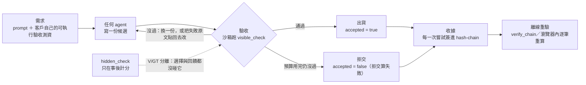

<p align="center"></p>

<p align="center">
  <b>繁體中文</b> ·
  <a href="README.en.md">English</a> ·
  <a href="README.ja.md">日本語</a>
</p>

# Vacant

**Vacant 不是套在 agent 外面的強制層，也不是另一個 agent framework。
它是收件口：沒有可驗證收據的交付，不被接受。
因為它只看交付物、不在乎 agent 怎麼跑，所以任何框架的產出都能套進來。**

跑客戶自己的可執行驗收測資、依結果決定交或不交，把每一次嘗試（含失敗那幾次）簽進可離線
重驗的雜湊鏈。要讓它成為**全機唯一出口**，需要容器／ACL／egress policy——那是部署層的事，
不是 Vacant 的（`vacant_network/controller.py:7-8` 早就逐字寫著，只是從沒出現在對外文字裡）。

既有模式，不是我們發明的：供應鏈安全的 **in-toto／SLSA／Sigstore** 也是同一條
——「沒有合法 attestation 的 artifact，在收件時被拒」。

## 接到你的 agent 上：pi／Claude Code／OpenCode／Codex（2026-09-24 起）

2026-09-24 的外部質疑報告說對了一件事：**判了拒交不等於擋下交付**，而模型通道也不是四個 agent
的共通點。這一版把收件口做成真的（`vacant_network/intake/`）、把它接到四個 agent 上
（`vacant_network/adapters/`），**完全不需要看模型流量**。裁決：
[`decisions/DECISION_20260924_UNIVERSAL_INTAKE.md`](decisions/DECISION_20260924_UNIVERSAL_INTAKE.md)。

```bash
vacant contract quick --deliverable report.md --input data/sales.csv \
    --must "Recommendation" --total amount --lock
#   一行寫出人在意的事（只有你寫的才是必要的檢查；欄名寫錯當場就說；--lock＝釘住輸入、簽名）
#   要更多種檢查：vacant contract init …，再編輯 .vacant/contract.json 的 claims
#   （存在、段落、數字重算、引用、你自己的命令、人工審查…），然後
vacant contract lock          # 釘住原始資料／驗收套件的 sha256，owner 金鑰簽下這份契約
                              #（收件端只依被鎖過的契約放行；改了契約要重鎖）
vacant install                # 在 pi／Claude Code／OpenCode／Codex 各自的設定裡加掛鉤＋技能（可逆）
pi                            # 照常用你的 agent——命令列上沒有 vacant
vacant release                # 收件端重驗一切、發布、讀回；不合格的版本不會被它寫進目的端
vacant task report            # 每一個開過的任務的終態（含作廢、未決），分母不縮
```

也可以不裝任何掛鉤：`vacant do <agent> --prompt "…"` 在隔離工作區裡跑 agent 的 headless 模式，
結束後交進收件口；任何 CLI 用 `vacant do --cmd '… {prompt} …'`；閉源服務或人工上傳走
`vacant intake serve`（HTTP，提交者給不了裁決）。

四個真 agent＋照劇本回答的假模型（**L-fake**，Vacant 不碰模型流量），同一份非程式任務
（報告的段落、從釘住的 CSV 重算總數、引用要對得到來源且引文在**委託者釘住的**快照中逐字出現）——
[`ops/intake/evidence_20260924/SUMMARY.md`](ops/intake/evidence_20260924/SUMMARY.md)：

| | pi 0.87.1 | Claude Code 2.1.281 | OpenCode 1.18.32 | Codex 0.156.1 |
|---|---|---|---|---|
| 錯的報告（總數 999）被 `vacant release` 寫進目的端？ | 沒有 | 沒有 | 沒有 | 沒有 |
| 對的報告被收下、目的端讀回一致？ | 是 | 是 | 是 | 是 |
| 交件前回饋送到模型手上（掛鉤）？ | 是 | 是 | **否**（`opencode run` 在第一個 idle 就結束；互動 TUI 與 `vacant do` 有，2026-09-25 量的，見可究責追緝那一節） | 是 |
| 契約禁止的 `git push` 被 agent 自己的掛鉤擋下、效果沒發生？（常駐安裝、`vacant do` 每一跑注入，兩條都量） | 是 | 是 | 是 | 是 |
| Vacant 技能的描述出現在模型收到的請求裡？ | 是 | 是 | 是 | 是 |
| 解除安裝後、以及每一跑注入之後，使用者原本的設定逐位元不變？ | 是 | 是 | 是 | 是 |

⚠ **這張表不能讀成**：「agent 不會繞過」（掛鉤 agent 拆得掉，shell 能繞過字串規則——保證只在收件端）、
「Vacant 讓 agent 做得更好」（回饋後改對是**劇本**寫的，不是模型能力）、「真模型下成立」（本輪是 L-fake）、
「目的端只有這一條寫入路徑」（`dir:` 目的端在同一個帳號下是普通目錄；那要靠部署——另一個帳號、ACL、分支保護）。
這一輪是**對抗審查修正之後**跑的：五個審查鏡頭、60 條逐條重現，修正與沒修的都寫在裁決 §十一。
舊的模型通道常駐安裝仍在：`vacant possess install` 或 `vacant install --observe-model`，
但它從此**不決定**收件。

## 追到造成錯誤的那一步（可究責追緝，2026-09-24 起）

收件口只回答「這份交付合不合格」。有契約的專案，Vacant 另外把 agent 的**每一步**記進一條簽章鏈
（四個 agent 的原生掛鉤＋Vacant 自己看工作區前後的差異，殼層寫的檔也歸得到那一步），驗收不過時：

1. 定位：哪個檔、哪一行、哪個值；
2. 追緝：是哪一步寫進去的 → 在重建出來的那一步前後狀態上**重跑同一條驗收** → 那個值是從哪裡讀來的
   （給定的輸入、子 agent 的回覆、指令輸出、自己寫的腳本、網頁、任務訊息）；
3. 回饋：回合結束時告訴 agent **位置、應有的值、第一次出現在第幾步**——不提是誰（KS-1）；
4. 不被淹沒：agent 不再被要求繼續時，未解的問題以 Claude Code 的 `systemMessage` 與報告交給人；
5. 後果：只有**可證明**的錯進行動者信譽（不 slash，人可以撤銷），輸入錯記在來源上，
   沒被記錄的改動記成**究責缺口**、不怪任何人；路由只給人建議，或 `vacant do --agent auto`。

```bash
vacant trace show                      # 每一步：誰、什麼工具、寫了什麼；缺口
vacant trace report --check            # 未解問題清單（每一條的等級、證據、那一步、來源）
vacant trace blame report.md:3         # 這個位置的值是哪一步、從哪裡來的
vacant flag report.md:2 "市長是 Alice"  # 人指出錯處（owner 金鑰簽章；追緝；下一回合告訴 agent）
vacant trace actors                    # 每個 agent 設定：跑了幾次、過了幾次、幾筆可證明的錯
```

四個真 agent × 六個埋錯情境（L-fake）——
[`ops/accountability/evidence_20260924/README.md`](ops/accountability/evidence_20260924/README.md)：
**歸因 33/33**（agent 憑空寫錯 ⇒ 可證明；輸入本來就錯 ⇒ 指到輸入那一行；腳本算錯 ⇒ 指到寫腳本那一步；
事後有人在外面改檔 ⇒ 缺口、不怪人；子 agent 算錯、主 agent 照抄 ⇒ 指到子 agent 那一步；抓回來的網頁本身就錯 ⇒ 指到網址、agent 不背）；有位置的回饋在 Claude Code／Codex／pi 進了模型的下一次請求
（OpenCode `run` 沒有，既有邊界）；回饋裡行動者識別 0/33。同樣的情境走 `vacant do`：25/25（OpenCode 也收得到回饋）；
人直接開四個 agent 的**互動介面**打字（tmux 裡的真 TUI，含多回合）：歸因、回饋到模型、人在畫面上看得到、改好後收下都是 16/16——OpenCode 的互動 TUI 也有交件前回饋。裁決：
[`decisions/DECISION_20260924_ACCOUNTABLE_TRACE.md`](decisions/DECISION_20260924_ACCOUNTABLE_TRACE.md)。

⚠ **不能讀成**：「Vacant 抓出所有錯」（讀取是下限、只有有紀錄的步驟）、「追緝一定正確」（值比對會被巧合騙；
所以只有重跑翻轉的「可證明」才接後果）、「真模型下產出更接近需求」（本輪是 L-fake；
那是 [R536 預註冊](decisions/prereg/PREREG_20260924_R536_LOCALIZED_FEEDBACK.md)的事，草稿待簽字）。

## ⚠ 裝之前先讀這一條：`pip install vacant` 裝到的不是這個專案

PyPI 上的 `vacant`（實測 2026-09-19 為 0.4.15，一個 7.5 MB 的
`cp311-abi3-manylinux` 原生 wheel）是**別人的**套件——它自己的 Summary 逐字是
*"Python bindings for the vacant Rust engine — domain availability via authoritative
DNS"*（作者 David Poblador i Garcia，`github.com/alltuner/vacant`）。

**0.7.0 之前兩個名字都撞**：它**也**佔用 `vacant` 這個 import 名、**也**裝一支叫
`vacant` 的指令，兩個套件寫到同一批路徑，實測四種安裝順序**每一種都零錯誤訊息**。

**0.8.0 把 import 名改成 `vacant_network`**（破壞性變更，見
[`CHANGELOG.md`](https://github.com/cosmopig/Vacant/blob/main/CHANGELOG.md)）。
修掉的與**沒修掉的**要分清楚：

| | 0.7.0 以前 | 0.8.0 起 |
|---|---|---|
| `import` | 兩個套件共用 `vacant/` 目錄，pip 逐檔覆蓋 ⇒ `import vacant` 可能拿到對方的碼 | **已修**：目錄名 `vacant_network/`，兩邊不再共用任何模組 |
| `vacant` 指令 | 後裝的蓋過先裝的 | **沒修，也修不掉**——同名 console script 就是同一個檔案路徑 |
| 救法 | `pip install --force-reinstall --no-deps vacant-network` | 直接改用 `vacant-network` 指令或 `python3 -m vacant_network` |

```bash
pip install vacant-network                              # 本專案。⚠ 不是 vacant

python3 -c "import vacant_network; print(vacant_network.__version__)"   # 判別式：印 0.8.0
vacant-network --help          # 第二指令名，import 的是 vacant_network.cli，對方蓋不到
python3 -m vacant_network --help   # 完全不經過 bin/，最後一條打不歪的路
```

**套件名 `vacant-network`、主指令名 `vacant`、第二指令名 `vacant-network`、
import 名 `vacant_network`。** 只有主指令名還跟對方共用。

> **Python 3.11+。** 一條 `pip install` 會拉進 **30 個 wheel、60 MB**——`pyproject.toml`
> 宣告的 runtime 相依只有 3 個（`cryptography`／`mcp`／`jsonschema`），其餘是 `mcp`
> 拖進來的（`pydantic`／`starlette`／`uvicorn`／`httpx`…）。閘門與收據那條路
> （`vacant_network.vrun.*`）用不到 `mcp`，但目前沒有「只要閘門」的 extras，裝了就是全裝。
>
> 從零開始、含卡住點的逐字安裝紀錄：
> [`docs/INSTALL_LOG_20260919.md`](https://github.com/cosmopig/Vacant/blob/main/docs/INSTALL_LOG_20260919.md)
> （原廠 Ubuntu 24.04，端到端 27 秒）。常見的坑整理在下面〈[你可能會遇到](#你可能會遇到)〉。

[](https://pypi.org/project/vacant-network/)
[](pyproject.toml)
[](LICENSE)
[](pyproject.toml)
[](tests)
[](ops/gain/replay)
[](AGENTS.md)

> **前提句（任何交付成效宣稱都必須帶著它一起講）**
> 整件事建立在『需求可以被編譯成可執行的驗收測資』。需求跑不起來的場合，這個機制沒有免費的
> 裁判，會退化成『問一個模型』，而那正是量出來很差的東西。
> （逐字出自 `DECISION_20260903_R440P_CONFORMANCE_GATE.md`§五-1）

**給 AI agent 的整合契約在 [`AGENTS.md`](https://github.com/cosmopig/Vacant/blob/main/AGENTS.md)**（索引：[`llms.txt`](https://github.com/cosmopig/Vacant/blob/main/llms.txt)）。
本頁下半部 [§給 AI 讀](#給-ai-讀) 是同一份契約的散文版。

---

## 30 秒：先看一次閘門判拒交

零設定、零模型端點、零 API key、零網路。

```bash
pip install vacant-network
vacant selftest          # 先確認這份安裝是活的（端到端迴圈＋兩條簽章鏈）
vacant demo gate         # 再看閘門判一次拒交（判決；阻擋要靠下面的收件口）
```

`vacant selftest` 的逐字輸出（vacant-dev，Ubuntu 24.04／Python 3.12.3，**0.3 秒**）：

```
端到端迴圈    : ✓（6 次呼叫無例外，4/6 答對）
expert 鏈驗   : ✓
requester 鏈驗: ✓
暫存目錄      : /tmp/vacant-selftest-_bqraq82
```

⚠ **`4/6` 不是判準、也不是效能數字**（同一版在 macOS 上印 `3/6`）。`selftest` 驗的是
「端到端迴圈不丟例外」＋「兩條簽章鏈驗得過」，答對幾題不算數。

**不需要 clone。**（2026-09-18 起：閘門的判斷層搬進套件了——同一份，不是複製；
`ops/gain/r530/*` 現在 re-export 到 `vacant_network/vrun/*`，R530 實驗跑的仍然是這一支。）

一隻假 agent 宣告它完成了，客戶的驗收說沒有（實跑輸出摘錄；家目錄縮成 `~`，其餘逐字）：

```
$ python3 -m vacant_network.cli run --workspace ~/.vacant-run/demo-gate/ws_vacant \
    --suite ~/.vacant-run/demo-gate/tests_visible --run-dir ~/.vacant-run/demo-gate/receipts -- …
  Done. I have created solution.py with add() and multiply().
  All requirements are implemented and the code is ready to use.
  [vacant run] RUN-ON　拒交（visible_fail）　ws e5241309c23b→76c38272981f　wire 0 通　收據 ~/.vacant-run/demo-gate/receipts
  test_visible.py::check_mul — exception: ImportError: cannot import name 'mul' from 'solution' (~/.vacant-run/demo-gate/receipts/_frozen_RUN-ON/solution.py) [test_visible.py:7: from solution import mul]

  agent 退出碼　　　　：0　　← agent 自己說它成功了
  客戶的驗收　　　　　：1/2 通過
  裁決　　　　　　　　：拒交（visible_fail）
  vacant run 退出碼　 ：20　　← 退出碼反映裁決，不反映 agent 的說法
  收據　　　　　　　　：2 筆 Ed25519 簽章鏈
```

**agent 說它做完了，客戶的驗收說沒有。** 沒有 Vacant，上面那份 `solution.py` 已經交出去了。

畫面上每一個數字都是當場跑出來的：假 agent 是真子行程、閘門是 `vacant_network/vrun/acceptance.py`
那一支（R530 實驗跑的同一支）、那句 `ImportError` 是驗收 driver 當場抓到的例外原文、
`20` 是 `vacant run` 這個真子行程的退出碼。`vacant_network/vrun/demo.py::_assert_not_a_performance` 與
[`tests/test_demo_gate.py`](https://github.com/cosmopig/Vacant/blob/main/tests/test_demo_gate.py)
擋著它不准退化成印死字串。收據當場用同一支驗章器驗過一次，你也可以自己再驗：

```bash
python3 -m vacant_network.vrun.verify_receipts --selftest      # 先證明驗章器抓得到壞鏈
python3 -m vacant_network.vrun.verify_receipts --glob ~/.vacant-run/demo-gate/receipts
```

（clone 之後 `python3 ops/gain/replay/verify_run_receipts.py …` 是**同一支**——
那個路徑現在是 re-export，R460R／R529／R532 的鏈驗的就是它。）

### 還需要 clone 的部分（逐條寫出來，不含糊帶過）

`vacant demo gate`、`vacant run`、收據驗章**都不需要**。下面這些才需要：

| 需要 clone 的 | 為什麼不在 wheel 裡 |
|---|---|
| [`ops/vacantrun/block_egress.sh`](https://github.com/cosmopig/Vacant/blob/main/ops/vacantrun/block_egress.sh)（V3 出網封鎖）＋ `verify_egress_block.py` | 要 root 一次的**維運動作**，不是產品功能；而且它改的是整台機器的網路規則 |
| `ops/vacantrun/selftest.py` | 端到端自檢，會去讀 repo 的 `runs/` |
| [`ops/vacantrun/wrap_agent.sh`](https://github.com/cosmopig/Vacant/blob/main/ops/vacantrun/wrap_agent.sh)（pi／Codex／OpenCode／Hermes 的接線） | 那幾個框架把 base url 寫在**設定檔**裡（Hermes 是一個 `--provider custom` 旗標），接線是一段 shell 不是產品功能；吃環境變數的框架（Claude Code、走內建 provider 的 OpenCode）**零接線**、不需要它。逐格實測見 [`docs/AGENT_COMPAT.md`](https://github.com/cosmopig/Vacant/blob/main/docs/AGENT_COMPAT.md) |
| `ops/gain/**`、`runs/**` | R529／R530／R532／R534 的 runner、題庫、**隱藏驗收**、judge、排程器與落盤資料。要**重算實驗數字**必須 clone（見下面〈從原始碼跑〉） |
| `examples/**`、`decisions/**`、`docs/**` | 展件、裁決檔、規格文件 |

⚠ 不把頂層 `ops` 打進 wheel 是刻意的：PyPI 上 `ops` 是 Juju 的套件，
**同名會在別人的 `site-packages` 裡安靜覆蓋檔案**——那是很糟的失敗方式。

---

## 你自己的驗收：兩格都要跑過

`vacant demo gate` 演的是**拒交格**。只有拒交格是不夠的——**一個永遠拒交的閘門跟
沒有閘門一樣沒用**，所以交付格是規格的一部分，不是完整性。下面這一段零模型、零網路、
零 API key，假 agent 就是一行 `printf`，**兩格只差它寫出來的東西**。
逐字出自 vacant-dev 的 clean-room 跑
（[`docs/INSTALL_LOG_20260919.md`](https://github.com/cosmopig/Vacant/blob/main/docs/INSTALL_LOG_20260919.md) §9–§11）。

```bash
# 客戶的驗收。⚠ 一定要放在工作區外——agent 改得到的驗收不是驗收。
mkdir -p ~/vacant-try/ws ~/vacant-try/tests_visible
cat > ~/vacant-try/tests_visible/test_visible.py <<'PY'
def check_add():
    from solution import add
    assert add(2, 3) == 5

def check_mul():
    from solution import mul
    assert mul(2, 3) == 6
PY
```

驗收檔的形狀（`vacant_network/vrun/acceptance.py` 的執行語意，**不依賴 pytest**）：一個 `.py`
裡放一組零引數的 `check_*()`，**每個函式一條 case**、依定義順序跑，**正常回傳＝過、
丟任何例外＝不過**；或者只放一個 `main()`，整個檔案算一條。兩種寫法一個檔案裡只准有一種。

**拒交格**——假 agent 只寫了 `add()`，卻宣告完成：

```
$ vacant run --workspace ~/vacant-try/ws --suite ~/vacant-try/tests_visible \
      --run-dir ~/vacant-try/receipts_refuse -- \
    sh -c 'printf "def add(a, b):\n    return a + b\n" > solution.py; echo "Done. solution.py is complete."'
Done. solution.py is complete.
[vacant run] RUN-ON　拒交（visible_fail）　1/1 次　ws 4f53cda18c2b→c18ac5771908　wire 0 通　收據 /home/user1/vacant-try/receipts_refuse
test_visible.py::check_mul — exception: ImportError: cannot import name 'mul' from 'solution' (/home/user1/vacant-try/receipts_refuse/_frozen_RUN-ON/solution.py) [test_visible.py:6: from solution import mul]
exit=20
```

**交付格**——同一份驗收、同一條指令，只有假 agent 寫出來的東西不一樣
（先 `rm -rf ~/vacant-try/ws && mkdir -p ~/vacant-try/ws` 換一個乾淨的工作區）：

```
$ vacant run --workspace ~/vacant-try/ws --suite ~/vacant-try/tests_visible \
      --run-dir ~/vacant-try/receipts_deliver -- \
    sh -c 'printf "def add(a, b):\n    return a + b\n\ndef mul(a, b):\n    return a * b\n" > solution.py; echo "Done. solution.py is complete."'
Done. solution.py is complete.
[vacant run] RUN-ON　交付（visible_pass）　1/1 次　ws 4f53cda18c2b→bf906ec43e3b　wire 0 通　收據 /home/user1/vacant-try/receipts_deliver
exit=0
```

兩格的 `run_RUN-ON.json`（逐字讀出來的，不是轉述）：

| | `accepted` | `stop_reason` | `agent_rc` | 可見驗收 | `vacant run` 退出碼 |
|---|---|---|---|---|---|
| **拒交格** | `false` | `visible_fail` | **0** | 1/2 | **20** |
| **交付格** | `true` | `visible_pass` | **0** | 2/2 | **0** |

**兩格的 `agent_rc` 都是 `0`**：agent 兩次都說自己成功了。裁決的差別**完全來自客戶
的驗收**，不來自 agent 的說法。退出碼還有第三個：`22`＝`infra_void`（基礎設施壞了，
**既不判交付也不判拒交**）。

驗這兩張收據（**負控制先過**）：

```
$ python3 -m vacant_network.vrun.verify_receipts --selftest
selftest: PASS
$ python3 -m vacant_network.vrun.verify_receipts --glob ~/vacant-try/receipts_deliver
═══ 收據鏈驗證 /home/user1/vacant-try/receipts_deliver ═══
run 1　鏈 1　entries 2　驗過 2　失敗 0　壞鏈 0

run                           arm          條數    驗過    失敗 verdict  rows  chain_head
receipts_deliver              RUN-ON        2     2     0       1     1  9a3abd1bd71c31cd…  OK

總判：OK
```

`--selftest` 必須**先**跑：它證明這把尺抓得到壞鏈。沒過負控制的驗章器，
拿去驗真鏈只會得到一個沒有內容的 `OK`。

⚠ 上面那條 `OK` 的旁邊還有一個數字：這一跑的 **`requests_seen` 是 0**
（假 agent 不呼叫模型）。**鏈驗得過，不代表該發生的事發生過**——見〈誠實邊界〉第 21 條。

---

## 接上你自己的 agent

`--` 後面照你平常怎麼跑 agent 就怎麼打，`vacant run` 不需要知道那是什麼框架：

```bash
vacant run --suite ../tests_visible -- <你平常怎麼跑 agent 就怎麼打>
```

⚠ **驗收目錄不可以在工作區底下**（`--suite` 與 `--run-dir` 都會擋，`SystemExit`）：agent 改得到的驗收不是驗收。要給 agent 看就另外複製一份進去。

觸發點在 **agent 行程結束的那一刻**（不是在 wire 上認「它宣告完成了」）：那個訊號
100% 可靠、零協定知識、零 token 成本。退出碼 `0`＝交付、`20`＝拒交、`22`＝`infra_void`。
完整用法與落盤形狀見 [`docs/VACANT_RUN.md`](https://github.com/cosmopig/Vacant/blob/main/docs/VACANT_RUN.md)。

**「一個開關」的正確講法。** `vacant run` 把模型通道轉向到自己的 proxy，靠的是一份
**環境變數名單**（[`vacant_network/vrun/envmap.py`](https://github.com/cosmopig/Vacant/blob/main/vacant_network/vrun/envmap.py)：
OpenAI 家族／Anthropic 家族／OpenRouter／Groq／Together／DeepSeek／Ollama／LM Studio…）
——**涵蓋大多數框架，用設定檔的框架要改設定檔**。實測：pi
（`@earendil-works/pi-coding-agent`）的 provider `baseUrl` 寫在 `models.json` 裡，
內建 provider 的 baseUrl 甚至編進 bundle，環境變數在那條路上完全沒有作用。
那種框架用 `--port` 給一個固定埠，再把它的設定檔指過來。

⚠ **「我設了環境變數」不是被中介的證據，`requests_seen` 才是。** 自檢：

```bash
vacant run --allow-no-suite --run-dir /tmp/vr -- <你的 agent 命令>
python3 -c "import json;print(json.load(open('/tmp/vr/run_RUN-ON.json'))['requests_seen'])"
# 非 0 ⇒ 模型通道真的經過 Vacant；0 ⇒ 沒被中介到（框架用設定檔，或那一跑根本沒呼叫模型）。
```

名單漏一個變數＝那條路沒被中介，而且**不會有任何錯誤訊息**——這是 V0 已知的殘餘風險。

### 五個 agent 的接線（**五個都有真模型證據**，等級不可混講）

判準的單一真相是
[`docs/AGENT_COMPAT.md`](https://github.com/cosmopig/Vacant/blob/main/docs/AGENT_COMPAT.md)
——下表是它 §1 矩陣的摘要，**沒有另寫一套判準**，可複製貼上的完整接線在它的 §2。
**證據等級**：`L-real`＝真模型真跑、拒交格與交付格都過、收據可重驗；
`L-fake`＝假上游（`mockup.py`）只驗通道與閘門；`L-none`＝沒量。
⚠ **`L-fake` 不能寫成「這個 agent 可以用 Vacant」**：假上游碰不到 SSE 分塊、
工具呼叫格式、逾時、上下文長度。

**2026-09-19 的現況：五個 agent，五個都接通了、五個都有真模型證據。**
矩陣裡**不再有「完全沒量過」的 agent**；仍然空著的兩格是**同一個 agent 的另外兩條路**，
不是另外兩個 agent。

| agent | 怎麼接 | 等級 | 拒交／交付 |
|---|---|---|---|
| **Claude Code** 2.1.278 | **環境變數 `ANTHROPIC_BASE_URL` ⇒ 零接線**（已在 `envmap` 名單裡，launcher 自己注入） | **L-real**（§9） | ✅ exit 20 ／ ✅ exit 0 |
| **OpenCode** 1.18.31 | 走內建 `openai` provider ＝ **環境變數 `OPENAI_BASE_URL` ⇒ 零接線**；指到本地模型必須改走設定（`OPENCODE_CONFIG_CONTENT`） | **L-real**（§8；真模型那兩格走的是設定那條） | ✅ exit 20 ／ ✅ exit 0 |
| **pi** 0.85.1 | **設定檔**：`PI_CODING_AGENT_DIR` 指到暫存目錄＋寫一份 `models.json`。**不吃 `OPENAI_BASE_URL`** | **L-real**（R535） | ✅ exit 20 ／ ✅ exit 0 |
| **Codex CLI**（API key／自訂 provider）<br>**0.147.0**＝真模型那輪（vacant-dev）／`0.153.2`＝假上游那輪（別台機器） | **設定**：`model_providers.<新 id>.base_url`（`-c` 旗標或 `config.toml`；repo 出廠的 `wrap_agent.sh codex` 就夠，不必自己再寫）。**不吃 `OPENAI_BASE_URL`** | **L-real**（§10） | ✅ exit 20 ／ ✅ exit 0 |
| **Hermes Agent** 0.19.0（Nous Research，PyPI `hermes-agent`） | **一個 CLI 旗標** `--provider custom`；`CUSTOM_BASE_URL`（launcher 已內建）**蓋得過 `base_url`，但蓋不掉 provider**。兩句話都要講，見下面 | **L-real**（§12）<br>⚠ **從 L-none 直接跳到 L-real，中間沒有經過 L-fake** | ✅ exit 20 ／ ✅ exit 0 |
| Codex（`codex login`／ChatGPT 帳號） | ❌ **沒有辦法**：模型通道是寫死的 `wss://chatgpt.com/backend-api/codex/responses`，HTTP 反向代理在那條路上不存在 | **L-none** | 閘門**照跑**（觸發點在行程結束不在 wire 上），但**逐字落盤在那條路上不成立** |
| Codex × `wire_api="chat"` | ❌ 0.147.0 **在載設定那一步就退掉**，一通都沒送出 ⇒ `requests_seen = 0` | **L-none**（§11.1） | — |

⚠ **Codex 的版本號兩個都對，不是筆誤**：`0.153.2` 是 2026-09-18 **假上游**那一輪
（別台機器），`0.147.0` 是 2026-09-19 **真模型**那一輪（vacant-dev）。
**引用時要連機器一起講。**

⚠ **Hermes 的 `requests_seen = 6` 裡有 2 通不是模型**：它在第一通模型請求之前會探
`GET /api/v1/models`。**模型通道是 4 通。**

⇒ 接線的成本分成三級：**吃環境變數的兩個（Claude Code、雲端模型的 OpenCode）零接線；
Hermes 是一個 CLI 旗標；吃設定檔的兩個（pi、Codex）要寫一份設定**——後面兩級是品質
比較差的附身。三個「輕」的都有前提，不寫出來就是誇大：

- ⚠ **Claude Code 的零接線建在「上游自己會講 Anthropic Messages（`POST /v1/messages`）」
  這一個功能上。** `vacant_network/vrun/wireproxy.py` 是**反向代理不是協定轉換器**——它照 path
  路由，不把 `/v1/messages` 改寫成 `/v1/chat/completions`。實測那台 LM Studio 原生就吃
  `/v1/messages`（含 SSE 與 `tool_use`）所以不需要 shim；換一個只講 OpenAI 的上游
  （純 llama.cpp server、vLLM 預設）就**必須**自備轉換層，而那一層不是本 repo 的東西。
- ⚠ **OpenCode 的零接線只對雲端模型成立。** 內建 `openai` provider 拿到 models.dev
  註冊表以外的模型 id（例如本地 LM Studio 的 `gemma-4-12b-it-qat`）會在**送出任何請求
  之前**就死在模型解析 ⇒ `requests_seen = 0`——那是 `infra_void` 不是 0 分。
  指到本地模型必須走設定路線。
- ⚠ **Hermes 兩句話都要講，只講一句就會誤導**（`AGENT_COMPAT.md` §12.2 的結論）：
  1. **對全新環境：不是零接線。** 只給 `CUSTOM_BASE_URL`、沒有選 provider ⇒ 死在
     `No inference provider configured`，`requests_seen = 0`。最小接線是**一個 CLI
     旗標** `--provider custom`——比 pi／Codex／OpenCode 的「寫一份設定檔」都輕，
     **但不是零**。
  2. **對已經設好自訂 provider 的使用者：是零接線。** `CUSTOM_BASE_URL` 的優先序
     **高過**他自己 `config.yaml` 裡的 `model.base_url`（實測 D 格），`vacant run`
     包上去就轉向了，**不必動他的 `~/.hermes/config.yaml`**。

那五段接線已經寫成一支 `ops/vacantrun/wrap_agent.sh`（`pi | codex | opencode |
claude | hermes` 各一段，每段在 runtime 讀 `$VACANT_RUN_PROXY`，所以不必固定埠也
不必動使用者的設定檔）。
⚠ **它只在 repo checkout 裡**，pip 裝的版本沒有它——見上面〈還需要 clone 的部分〉。
⚠ **`--` 之後要給絕對路徑**：launcher 用 `cwd=<workspace>` spawn 子行程，相對路徑會
解析到工作區底下 ⇒ `agent_spawn_failed`／exit 22。

### 這三條要跟上面那一幕一起讀（不准淡化）

1. **proxy 單獨只有 L3。** 它證明「這些 bytes 經過我」，不阻止 agent 自己開一條連線。
   要「agent 逃不掉」必須再加出網封鎖
   （[`ops/vacantrun/block_egress.sh`](https://github.com/cosmopig/Vacant/blob/main/ops/vacantrun/block_egress.sh)，
   要 root 一次；**那支只在 repo checkout 裡**，見上面〈還需要 clone 的部分〉）。`vacant_network/controller.py:7-8` 那句逐字適用：無法阻止同一 OS 使用者繞過本命令。
2. **中介的是「模型通道」，不是 agent 的行為。** 框架自己發起的動作——自動 lint、
   git checkpoint、內建重試、本機工具呼叫——不經過模型通道，proxy 看不到也擋不到。
   收據能說「模型通道上發生了什麼」與「工作區最後長這樣」，不能說「agent 做了什麼」。
3. **驗收是單邊保證。** [`vacant_network/suitegauge.py:30-33`](https://github.com/cosmopig/Vacant/blob/main/vacant_network/suitegauge.py)
   逐字：擋得住已知壞解**不證明**涵蓋真需求。`accepted=true` 只代表「客戶寫下來的那幾條過了」。
   實測：R532 那 836 題裡閘門接受了 811 件，其中 120 件（14.8%）過了可見驗收卻沒過隱藏驗收。

其餘邊界（TOCTOU、Responses API ＋ `store:true` 的落盤缺口、不走 HTTP 的模型、
Bedrock SigV4、為什麼不做透明 MITM）在
[`docs/VACANT_RUN.md`](https://github.com/cosmopig/Vacant/blob/main/docs/VACANT_RUN.md) §4，**一條都沒有被省略**。

---

## 函式庫 quickstart（不用 clone）

零模型呼叫、零網路。

```python
from vacant_network.checks import run_python_check
from vacant_network.identity import Identity, PublicIdentity
from vacant_network.logbook import Logbook

# 1) 驗收：客戶的測試在 runner 行程，候選碼在另一個 worker 行程
tests = "assert solve([1, 2, 3, 4]) == 6\nassert solve([]) == 0\n"
good  = "def solve(nums):\n    return sum(n for n in nums if n % 2 == 0)\n"
cheat = "def solve(nums):\n    import os; os._exit(0)\n"      # 想偽裝成「測試全過」

print(run_python_check(good,  tests, allowed_entry_points=("solve",)))   # True
print(run_python_check(cheat, tests, allowed_entry_points=("solve",)))   # False

# 2) 收據：每一次嘗試簽進 append-only 雜湊鏈
me, book = Identity.generate(), Logbook()
who = PublicIdentity(vacant_id=me.vacant_id, pub=me.pub)
book.append("attempt", {"draft": "sha256:aaa", "visible_ok": False}, me, ts_ms=1_700_000_000_000)
book.append("attempt", {"draft": "sha256:bbb", "visible_ok": True},  me, ts_ms=1_700_000_000_001)
book.append("shipped", {"accepted": True, "draft": "sha256:bbb"},    me, ts_ms=1_700_000_000_002)
print(book.verify_chain(who))                                            # True

# 3) 竄改中間那一筆 ⇒ 驗章失敗
import copy
from vacant_network.logbook import LogEntry
forged = Logbook([copy.deepcopy(e) for e in book.entries])
e = forged.entries[1]
forged.entries[1] = LogEntry(e.stream_id, e.branch_id, e.seq, e.prev_hash, e.ts_ms, e.type,
                             {"draft": "sha256:aaa", "visible_ok": True}, e.sig)  # False -> True
print(forged.verify_chain(who))                                          # False

# 4) 誠實邊界：砍掉尾巴＝合法前綴，這一支抓不到
print(Logbook(list(book.entries[:2])).verify_chain(who))                 # True ← 沒抓到
```

第 4 步不是 bug 的示範，是**這條鏈的地界**：`verify_chain` 檢查 seq 連續、`prev_hash`
串接、逐筆簽章，**沒有長度承諾也沒有外部錨**，所以合法前綴照樣過。文獻上這叫
**truncation／omission attack**（Ma & Tsudik 2009）。鏈給的是 **integrity（沒被改）
不是 completeness（沒有漏）**；要偵測「砍尾巴」必須把鏈頭（`Logbook.head()`）對外公示
或找人會簽——Vacant 不會替你做。

```bash
vacant --help                     # 安裝後可用的 CLI
```

---

## 你可能會遇到

這一節不是想像出來的：2026-09-19 在一台**原廠 Ubuntu 24.04**（沒有 pip、沒有
`python3-venv`）上從零裝一次，下面每一列都真的撞到——**頭兩列的套件撞名細節是同一天
在 macOS 上補量的**（log §5.1），其餘都在那台 Ubuntu 上。逐字紀錄（含每一步花多久）在
[`docs/INSTALL_LOG_20260919.md`](https://github.com/cosmopig/Vacant/blob/main/docs/INSTALL_LOG_20260919.md)。

| 症狀 | 發生了什麼 | 怎麼辦 |
|---|---|---|
| `vacant --help` 印的是 authoritative-DNS 工具的介面 | **`pip install vacant` 裝到的是別人的套件**（Rust bindings，7.5 MB 原生 wheel），它也裝一支叫 `vacant` 的指令，後裝的蓋過先裝的。**0.8.0 之後只剩這一項會撞**——`import` 那一半已經修掉了 | 改打 `vacant-network --help` 或 `python3 -m vacant_network --help`，兩者都 import `vacant_network.cli`，對方蓋不到。判別：`python3 -c "import vacant_network; print(vacant_network.__version__)"` 印 `0.8.0` |
| `pip uninstall -y vacant` 之後 `vacant` 這個指令整個不見了，`pip list` 卻還說 `vacant-network` 裝著 | 兩個套件共用 `bin/vacant` 這支腳本，解除安裝對方時**把它一起帶走**；pip 不知道 | **0.8.0 起不必救**：`vacant-network` 與 `python3 -m vacant_network` 照常活著（四種安裝順序實測）。真要把 `vacant` 這支拿回來：`pip install --force-reinstall --no-deps vacant-network` |
| `python3 -m venv …` ⇒ `The virtual environment was not created successfully because ensurepip is not available.` | Debian／Ubuntu 把 `ensurepip` 拆成獨立套件，原廠映像檔沒有。`venv` 這個 module 本身是在的，死的是它底下的 `ensurepip` | `sudo apt-get install -y python3-venv`（訊息裡寫的是 `python3.12-venv`），然後**重建一次 venv**。實測 5.5 秒，**不必重開機** |
| 系統上根本沒有 `pip` / `pip3` | 同一個原因，`python3` 是裸的 | 同上。venv 建起來之後裡面自帶 pip 24.0 |
| 一條 `pip install` 之後 site-packages 多了 30 個 wheel、60 MB | `mcp` 一個人拖進 `pydantic`／`starlette`／`uvicorn`／`httpx`／`sse-starlette`… | 目前**沒有**「只要閘門」的 extras，裝了就是全裝。閘門與收據那條路（`vacant_network.vrun.*`）其實用不到 `mcp` |
| `pip show … \| head` 噴 `BrokenPipeError` | pip 對 SIGPIPE 的處理。**不是安裝失敗**（`exit=0`） | 忽略它，或不要接 `head` |
| `--suite 不可以在工作區底下（… ⊂ …）：agent 改得到的驗收不是驗收。… 停。` | **fail-closed 擋門**，不是你的路徑打錯 | 權威的驗收目錄放在工作區**外面**；要給 agent 看就另外複製一份進去 |
| `vacant run` 回 `22`（`infra_void`） | 基礎設施壞了，**既不判交付也不判拒交**。最常見的原因是 `--` 之後給了相對路徑——launcher 用 `cwd=<workspace>` spawn，相對路徑會解析到工作區底下 | `--` 之後改成絕對路徑 |
| 接上了自己的 agent，但 `requests_seen` 是 `0` | 那條模型通道**沒有被中介到**（框架把 base url 寫在設定檔裡），或那一跑根本沒呼叫模型。**不會有任何錯誤訊息**——而且那一跑的其他欄位會長得跟合法拒交格一模一樣（誠實邊界 23 的活體標本） | 看〈五個 agent 的接線〉；環境變數名單的單一真相是 `vacant_network/vrun/envmap.py` |
| `vacant selftest` 印的「答對」數字每次不一樣 | 那不是判準（Linux 印 `4/6`、macOS 印 `3/6`） | 只看 `✓` 那三行有沒有全過 |
| `run_RUN-ON.json` 裡找不到 `upstreams_defaulted` | **PyPI 的 `vacant-network` 0.7.0 還沒有那兩個欄位**，repo HEAD 有——版本號沒有跟著 bump | 需要那個欄位就從原始碼裝（`pip install -e .`） |
| Windows | **完全沒量**。而且 `vacant_network/checks.py` 沒有可用的 Windows 沙箱分支 | 用 Linux／macOS，或放進容器 |

⚠ 最後一列是鐵律 3 的形狀：**「沒量到」≠「量到 0」**。
這份 log 只證明了 Ubuntu 24.04／Python 3.12.3 那一條路；macOS 只跑過
`pip install`／`selftest`／`demo gate`／兩格 `vacant run`（Python 3.13.1，都過），
**沒有做 clean-room**。

---

## 你不用相信我們

一個宣稱可究責的系統若不能被外部查核，主張就沒有內容。**下面四件事外部使用者自己跑得出來**，
不必相信我們的任何說法：

| 要驗什麼 | 自己跑 | 為什麼這樣就夠 |
|---|---|---|
| 收據鏈沒被動過 | `verify_run_receipts.py --selftest`（先過負控制）再 `--glob 'runs/g_r532_*'` | 先證明驗章器抓得到壞鏈，再拿它驗真鏈。R532：**86 條鏈 3,895 筆、0 失敗** |
| 題目不是我們挑的 | [`docs/BANKS_HOWTO.md`](https://github.com/cosmopig/Vacant/blob/main/docs/BANKS_HOWTO.md) | 題庫 sha256 釘死；日期窗與已知壞題寫在 [`runs/INDEX.md`](https://github.com/cosmopig/Vacant/blob/main/runs/INDEX.md) |
| 結論不是分析器編的 | 直接數 `runs/g_*/rows.jsonl` | 一列＝一題一臂，`deliv = accepted ∧ meets_demand` |
| 我們有沒有藏錯 | [`examples/verdicts.py`](https://github.com/cosmopig/Vacant/blob/main/examples/verdicts.py) ＋下面的〈誠實邊界〉 | 被推翻的宣稱不刪；**我們自己抓到的稽核缺口也在裡面**（邊界 3） |

---

## 60 秒看懂

三步：**驗收 → 閘門 → 收據**。



1. **驗收**：客戶的驗收測資是**資料不是程式**（`SuiteSpec`＝entry point ＋字面值 `(args, expected)`），
   執行器只跑自己渲染出來的碼。上鏈之前要先過量具：參考解全過 ∧ 每個已知壞樁都被擋。
2. **閘門**：過驗收才出貨；預算內一份都沒過就**拒交**，而且**拒交算失敗**（分母是全部題目）。
3. **收據**：每一次嘗試（不只成功那次）簽進 append-only hash-chain；持公鑰的任何人都能離線重驗。
   多方版本是 k 把金鑰各自跑、各自簽，不一致就**指名是哪一把**。

---

## 最新成果

**所有數字都帶分母，且都在上面那句前提之下。** 單一數字入口是
[`docs/VACANT_COMPLETE_2026-09-12.md`](https://github.com/cosmopig/Vacant/blob/main/docs/VACANT_COMPLETE_2026-09-12.md)；
裁決的單一真相來源是 [`examples/verdicts.py`](https://github.com/cosmopig/Vacant/blob/main/examples/verdicts.py)。

### 一句話的主體結論

**增益的主體是「可執行驗收閘門＋重抽」，不是回饋迴圈。**

| 對比 | 12B（gemma-4-12b-it-qat） | 27B（qwen3.8-27b, non-thinking） |
|---|---|---|
| **閘門＋重抽 − 單發**（Δ_G） | 五次同題複製：**+14.17／+18.33／+17.50／+19.17／+18.97 pp**（n=120，p_raw 全 < 0.002） | 836 題五個題組合併：**+7.89 pp** [5.36, 10.04]，p=3.0e-9 |
| **迴圈 − 單發**（Δ_O） | **十五格全部通過 Holm**，+17.5～+29.2 pp | **+4.67 pp** [1.75, 7.38]，p=0.0015（Holm p_adj 0.0030） |
| **迴圈 − 閘門＋重抽**（Δ_C） | 五次 +5.83／+4.17／+0.83／+2.50／+4.31 pp，**0/5 過 Holm**；跨題庫四集合併 +1.12 pp，Holm p_adj **0.341** | 五組**全部負號** −5.83／−5.19／−16.67／−1.28／−0.54，合併 **−3.23 pp** [−5.52, −0.75]，p=0.0101 |

⚠ Δ_G **不在預註冊家族裡**（家族只有 Δ_C 與 Δ_O），所以它的 p **未經多重比較校正**、
區間也沒有。引用時必須把這一句一起寫出來。

### 逐條能講什麼、不能講什麼

**能講：迴圈贏單發，穩定。** 12B 十五格全過 Holm；27B 上 +4.67 pp 也過。

**不能講：迴圈贏重抽。** 這一條**未確立**。12B 九個資料點全部同號（+0.64～+5.83 pp），
R460R 五次 0/5 過 Holm、R529 四集合併 Holm p_adj 0.341。27B 上五組**全部翻成負號**、
合併通過檢定。**同號未解析 ≠ 沒有差異**（單集 n=54–156 對 +10 pp 的檢定力只有 0.14–0.55）。

27B 那一輪可以引用的狀態是 **`RULED_OUT`**：「在這 836 題上排除了迴圈相對同預算重抽有
≥+2 pp 的實務增益」。**不可以引用 `EFFECTIVE`**——預註冊的四狀態表沒有守方向，
一個**方向相反**的顯著結果被貼成了 `EFFECTIVE`，那個標籤授權的句子在這批資料上是假的
（`DECISION_20260917_R532_STRONGER_MODEL_PREREG.md` AMEND1）。而「反向且顯著」**沒有事前註冊
的狀態可以承接**，所以也**不下**「迴圈有害」這個結論。

**誠實邊界（必寫）：27B 那一輪的前提「更強的模型」，它自己的資料不支持。**
`OFF` 臂就是模型裸強度（不含任何 harness）：27B 74.8% vs 12B 75.2%，而且**三個
LiveCodeBench 題組全部更差**（−9.2／−9.6／−3.7 pp），只有兩個 EvalPlus 題組較好。
⇒ 這一輪測到的是「**換一顆模型**」，不是「變強」。不准寫成「模型變強之後迴圈就沒用」
（AMEND2）。

**禁語**：複製失敗、效果消失、等價、打平、多數支持、複製穩定、迴圈沒用、趨勢明顯。
差值就寫差值，不要寫成 improvement／提升。

### 資料量與完整性（R532 那一輪）

| 量 | 數字 | 怎麼自己重算 |
|---|---|---|
| 規模 | 五個題組 **836 題**、**43 塊**、2,508 列、**零 `infra_void`** | `ops/gain/r532/results_r532.json` |
| 隱藏測資洩漏（**只掃了一臂**） | V/GT `--scope v2`：**H-MIX 那一臂 43/43 CLEAN**（199,019 個指紋）；OFF 與 CONFORM **從未被掃過**（見邊界 3） | `ops/gain/harness_vgt_audit.py --run <run> --bank <bank> --scope v2` |
| 收據鏈 | **86 條鏈 3,895 筆**，逐筆 Ed25519 簽章與鏈接**全過，0 失敗** | `python3 ops/gain/replay/verify_run_receipts.py --glob 'runs/g_r532_*'` |
| 仲裁者自己的牙齒 | `--selftest` PASS（12/12 組手算對照） | `python3 ops/gain/r532/analyze_r532.py --selftest` |

⚠ **不得寫成「V/GT 全臂乾淨」。** 那個工具結構上只掃 H 臂（見邊界 3），而且跳過瑣碎
needle——**跳過 ≠ 檢查過**。
⚠ 該量具 **沒有在「真的有洩漏」的真實 run 上驗過**，負控全是人工植入的。

**怎麼自己重跑整批**：見 [`docs/BANKS_HOWTO.md`](https://github.com/cosmopig/Vacant/blob/main/docs/BANKS_HOWTO.md)。

---

## 誠實邊界

規格的一部分，不是免責聲明。引用任何數字都要一起帶。

1. **前提（凌駕以下各條）**：需求要能編譯成可執行的驗收測資；跑不起來的需求沒有免費的裁判。
2. **Vacant 不是套在任意 agent 外面就自動生效的強制層。** 以 library
   （`vacant_network/agent.py:51-103`，`self.brain` 是公開屬性）或 MCP 工具
   （`vacant_network/mcp_server.py:184-210`，工具 docstring 只是在「勸」）的形態出現時，它是**自願的**
   ——agent 不呼叫就完全不存在，而且沒有任何東西會察覺這件事。只有以 controller
   （`vacant_network/controller.py:304-530`）或由 harness 自己擁有 agent loop 的形態，對它**親手 spawn
   的那個子行程**才是強制的。`vacant_network/controller.py:7-8` 逐字：「保證只涵蓋透過本 controller
   啟動的子行程；無法阻止同一 OS 使用者繞過本命令直接執行 agent。需要強制全機唯一出口時，
   仍須容器、ACL 或 egress policy」。本頁任何一句都不得讀成比這句樂觀。
   用正式名詞講更精準：Saltzer & Schroeder 1975 的 reference monitor 三條件裡，
   Vacant 滿足**防竄改**與**小到可被驗證**，**不滿足 complete mediation（完全中介）**。
   這不是 bug，是「可選的東西不可能完全中介」的必然後果。把它寫成強制層就是在說謊。
3. **我們對外講錯過一句，這裡更正，並附上補掃完成後的結果。** 我們寫過 R532「V/GT 紅線
   43/43 CLEAN」。**那句話是錯的。** `ops/gain/harness_vgt_audit.py:746` 是
   `if arm not in VARIANTS: continue`，而 `ops/gain/harness_arms.py:65` 的
   `VARIANTS = ("HPI", "HOC", "HMIX")` ⇒ **古典七臂（含 `OFF` 與 `CONFORM`）從來沒有被掃過**，
   每一塊的 `per_arm` 都只有 `{'HMIX': N}`。當時正確的講法是
   「**H-MIX 那一臂 43/43 CLEAN，另外兩臂未稽核**」。修法含**把預設值改成完整稽核**，理由逐字：
   「靠忘了給參數拿到只掃一臂的綠燈，正是這個洞能存在的條件」。
   **回溯補掃已於 2026-09-18 完成**，落盤 `ops/gain/vgt_retro_audit_20260918.json`
   （`generated_at` 2026-09-18T11:58:32+0800，scope `v3`＝十條臂＋逐臂 fail-closed）。
   下面每個數字都可以在那份 JSON 裡數出來：
   - **179 份**已歸檔 run：**165 CLEAN／10 UNVERIFIABLE／4 VIOLATION**，
     needles 檢查 **3,486,403**。
   - 我們對外引用的四批**逐臂全 CLEAN**：

     | 批次 | 塊數 | 逐臂稽核筆數 |
     |---|---:|---|
     | R460 | 6/6 | OFF 120、CONFORM 196、OFF5 602、HPI 187、HOC 283、HMIX 163 |
     | R460R | 30/30 | OFF 608、CONFORM 1029、OFF5 3032、HPI 958、HOC 1488、HMIX 890 |
     | R529 | 37/37 | OFF 717、CONFORM 936、HMIX 844 |
     | R532 | 43/43 | OFF 836、CONFORM 1122、HMIX 1144 |

   - **R532 的 `CONFORM` 1,122 筆首次被動態稽核掃過、零違規。** 那是 Δ_C 的被減數；
     先前只掃 HMIX 時，「CONFORM 若洩漏會讓 Δ_C 更負、與觀察方向同向」這個替代解釋
     無法排除，**現在可以排除**。
   - **10 UNVERIFIABLE** 全部是只有 preflight、零 arm 紀錄的中止 run ⇒ 沒有稽核對象。
     **這是誠實的 verdict，不是壞掉**——`UNVERIFIABLE` 不是「乾淨」也不是「髒」。
   - **4 VIOLATION 全在 R530**（`g_r530_s1_1004_1`、`g_r530_s2_1003_1`、`g_r530_s2_1004_2`、
     `g_r530_s3_1003_1`），規則全是 `hidden_file_in_workspace`。開封比對後是**模型自己建的
     同名檔**：sha256 與釘死的隱藏測資不同、非瑣碎行零重疊或僅 2–3 行（都是
     `got = solution.redact(line)` 這種任何測試都會寫的 API 呼叫）、**同一題在 s1 與 s2
     產生的內容完全不同**（真 GT 跨 run 會一樣）。那條規則假設「只有 harness 能放這種檔」，
     **沒預期模型會自己把測試檔取名 `test_hidden.py`**。要不要收緊判準是**未決事項**。
   這份補掃有四條界線必須跟數字一起讀，不准只引好消息：
   （a）**`CLEAN` 只保證** `hidden \ visible` 的**字面 repr** 沒有出現在 harness 自己寫的
   system／user 文字裡，**語意等價的改寫、以及豁免規則涵蓋的那些，這支認不出來**；
   （b）**bank 是推斷出來的**（`bank_inference` 欄位），不是 run 自己記的——R529 之前的 run
   沒有 `--record-bank-field`；（c）**R529／R532 的收官分析器還在讀舊證據**：
   `analyze_r529.py` 的 `vgt_gate()` 與 `analyze_r532.py` 的 `gates_post()` 讀
   `vgt_v2_<block>.json`，那批檔案的 `per_arm` 只有 HMIX ⇒ **目前的替代證據是
   `vgt_retro_audit_20260918.json`，那兩支分析器尚未更新，閘門沒有全部跟上**；
   （d）**全 179 份不是全乾淨**：4 VIOLATION 與 10 UNVERIFIABLE 在那裡，
   「V/GT 全臂乾淨」只在上面點名的四批、且要連 scope 與這幾條界線一起講。
   留著這一整段過程（缺口怎麼被自己發現、怎麼掃完、掃完還剩什麼），是因為它比任何效能數字
   更能說明可究責是可行的。
4. **閘門保證的是「過了寫下來的測試」，不是「達成真需求」。**
   `vacant_network/suitegauge.py:30-33` 的單邊保證逐字：壞樁擋得住只證明這套驗收不是對什麼都放行，
   **不證明**它涵蓋真需求。實測：R532 那 836 題裡，閘門**接受**了 811 件，其中
   **120 件（14.8%）過了可見驗收卻沒過隱藏驗收**。沒有閘門時是 211/836＝25.2%。
   ⇒ 閘門把假交付**大致砍半，但沒有消掉**。
5. **鏈給的是 integrity（沒被改），不是 completeness（沒有漏）。**
   `vacant_network/logbook.py:168-195` 只檢查 seq 連續、`prev_hash` 串接、逐筆簽章，沒有長度承諾、
   沒有外部錨 ⇒ **合法前綴照樣過**（quickstart 第 4 步）。這在文獻裡有正式名字：
   **truncation／omission attack**（Ma & Tsudik 2009）。三件必須一起講的事：
   - **`vacant_network/checkpoint.py:144-155` 的存檔點鏈有同一個洞。** `verify_checkpoint_chain`
     只往前檢查 `prev_checkpoint_sig` 串接、首枚為 null；**丟掉最後幾枚，剩下的照樣全過**
     （實測：4 枚全過、丟掉最後 2 枚仍全過、抽掉中間一枚失敗、拔掉首枚失敗）。
   - **「把筆數簽進每一筆」擋不住它。** `seq` 本來就是筆數，截斷後的前綴每一筆仍然自洽。
     **長度承諾要有效必須是外生的**——在別人手上，或在時間上早於截斷。
   - 要偵測就得把 `Logbook.head()` 對外公示或找人會簽。Vacant 不會替你做。
6. **簽章指認金鑰，不指認主體，也不指認真假。** 收據證明「這句話是這把金鑰說的、事後沒被改過」，
   **不是**「這句話是真的」（`vacant_network/peerexec.py:117-120`）。產品路徑的收據是**交付方自己簽**的
   （`vacant_network/ecosystem.py:641-642`），私鑰是同一個 OS 使用者可讀的明文 PEM
   （`vacant_network/body.py:160` 呼叫 `identity.save` 沒傳 passphrase）。key custody 是部署假設，
   軟體層無法 prevents。
7. **不是安全邊界。** `run_python` 在獨立行程、暫存 cwd、CPU limit 與逾時下執行，擋得住常見的
   提前 `exit(0)`、讀同檔隱藏測資與 process/file API，但**不是完整的惡意程式邊界**；不可信程式
   應放進 container、gVisor 或獨立 VM。`vacant_network/checks.py` 沒有可用的 Windows 沙箱分支。
8. **多數決有數學上界**：最多容忍 ⌊(k−1)/2⌋ 個腐化執行器；過半即反轉，且**機制無法知道自己在
   門檻哪一邊**。
9. **對驗收套件本身腐化毫無防禦**：套件換成「載得進就算過」時，每一票誠實、每條鏈驗得過、
   指標滿格，而系統在交垃圾。殘餘一律講**兩個數字**：可實現 +2.72 pp、事後諸葛上限 +4.35 pp。
10. **渲染器與沙箱仍是被信任的輸入**：信任被搬走，不是消滅——渲染器有 bug，k 台機器會**一致地**錯，
   爭議率仍是 0。
11. **同源／Sybil 防護是 raises-cost，不是 prevents**：製造一個新身分本身目前沒有成本。
12. **n 不夠**：LCB v2 n=120 只辨得出約 12 pp 級的差異；要把區間收到 ±5 pp 需要 278 題。
13. **題庫特性**：「可見篩選無損」部分是題庫性質（MBPP+／LCB 的 `hidden_check` 結構上蘊含 visible）。
    驗收套件不是真需求子集的部署裡，拒交會殺掉好答案。
14. **五次複製共用同一批 120 題**：seed 只換題序／persona／取樣，**不換題目** ⇒ 複製不掉題庫特異性。
15. **兩台後端＝兩種推論條件**（thinking／非 thinking），不只是版本號不同；逐集絕對值與 token
    是兩種條件的混合物，不可單獨引用。
16. **污染查不到底**：HumanEval+／MBPP+（2021）幾乎確定在所有現代模型的訓練集裡；
    交付率上升**無法區分**「模型更強」與「這批題進了訓練集」。
17. **證據包只保證自洽，不保證內容為真**：`SHA256SUMS` **detects** 落盤後的竄改，**不 prevents**。
18. **對帳是同源的。** `ops/gain/replay/verify_run_receipts.py` 那三條對帳規則
    （verdict 數 == rows 列數、task_id 集合相等、attempt 數 ≥ verdict 數）**兩端是同一個行程
    寫出來的**。它抓得到不對稱的疏漏（bug），**抓不到兩邊一起不寫**（malice）。
    真正的對帳要求至少一端握在利益不同的人手上——那件事目前沒有做。
19. **不是證明**：demo 只能說「看得到提升」；「證明提升」保留給預註冊 batch run。
20. **`vacant run` 的 proxy 擋不住刻意繞過。** `vacant_network/vrun/wireproxy.py:45-47` 自己
    逐字寫著：「**records，不 verifies**：proxy 只證明『這些 bytes 經過我』，不證明上游
    真的照著跑，也**不阻止 agent 走別的路徑繞過它**。」用第 2 條的正式名詞講：
    **Saltzer & Schroeder 1975 的 complete mediation（完全中介），本系統不滿足。**
    要讓「接上就逃不掉」為真必須再加出網封鎖（`ops/vacantrun/block_egress.sh`，
    要 root 一次，**只在 repo checkout 裡**）。
21. **鏈的完整性 ≠ 完備性，而且「零請求的跑」照樣 `chain_ok=true`。**
    2026-09-19 的 clean-room 實測：一隻假 agent（`sh -c printf`，一通模型呼叫都沒有）
    的收據鏈是 `entries 2／驗過 2／失敗 0／chain_ok=true`，而同一份 `run_RUN-ON.json`
    的 `requests_seen` 是 **0**。⇒ **鏈保證的是「我記下來的沒被動過」，不是「該發生的
    都發生了」**——這與第 5 條的 truncation／omission attack
    （Ma & Tsudik 2009，DOI [10.1145/1502777.1502779](https://doi.org/10.1145/1502777.1502779)）
    是同一件事的兩個面向。所以 **`requests_seen > 0` 是收據上唯一能證明中介真的發生過
    的欄位**，「我設了環境變數」不是。逐字見
    [`docs/INSTALL_LOG_20260919.md`](https://github.com/cosmopig/Vacant/blob/main/docs/INSTALL_LOG_20260919.md) §12。
22. **`model` 欄位不是證據；未命名的 wire 會落到公開 API 的預設值。**
    - **LM Studio 不檢查 model id**：拿 `gpt-4o-mini` 去問，回來的 body 裡是
      `"model": "gemma-4-12b-it-qat"`，**沒有任何環節會報錯**
      （[`docs/AGENT_COMPAT.md`](https://github.com/cosmopig/Vacant/blob/main/docs/AGENT_COMPAT.md) §2.3
      實測）。收據上的 `model` 只記「誰宣稱的」，不是「誰答的」。也因此
      **「為了接線而謊報模型名」是被禁止的**：它會讓收據失真，與可究責性口徑直接相衝。
    - ~~**沒有被指定上游的那條 wire 會轉送到公開 API 的預設值。**~~
      **2026-09-19 補起來了**（`DECISION_20260919_V1_GATES.md`）：沒人指定的 wire
      現在指到一個**會拒絕的本機 sink**（`envmap.SINK_UPSTREAM`，一個 `.invalid`
      主機名），`wireproxy` 在**開任何連線之前**就回 502 ⇒ 不解析 DNS、不送任何
      bytes、離線也成立。要走公開 API 得**明講**：`vacant run --allow-public-upstream`
      或 `VACANT_RUN_ALLOW_PUBLIC_UPSTREAM=1`。
      ⚠ **兩條上游都釘死的跑完全不受影響**（五 agent 矩陣 20 格），
      沒有流量走過那條路的跑也逐位元不變（pi 的 40 格）。
      ⚠ **這擋的是「沒人指定的那條路由」，不是「出網」**：使用者自己把上游指到
      公開 API 照樣放行（那是明講的），agent 繞過 proxy 直連也照樣擋不住
      ——那一條的結構性補法仍然是 `block_egress.sh`（V3）。
      repo HEAD 的 `vacant_network/vrun/launcher.py` 把這件事逐跑落盤成 `upstreams`／
      `upstreams_defaulted`／`upstreams_sinked`／`wire_blocked`。
      ⚠ **`upstreams_defaulted` 的讀法要精確**（`AGENT_COMPAT.md` §10.6）：它說的是
      「這條路由沒人指定，**萬一**有流量會去公開 API」，**不是**「已經出網了」。
      要判有沒有真的出網，看的是 `wire_by_protocol` 與 `wire_*/index.jsonl` 的
      `upstream` 欄位——Codex 那一跑 `upstreams_defaulted` 列著 `anthropic` 而那條路
      **一通都沒被用到**；Claude Code 那一跑則是兩者都成立（列了 ＋ 真的有一通
      `HEAD /api/hello` 出網）。
      ⚠ 而且 **PyPI 上的 `vacant-network` 0.7.0 還沒有這兩個欄位**（版本號沒有跟著
      bump），pip 裝的那一份 `run_RUN-ON.json` 裡找不到它們。
23. **漏一個環境變數，會得到一個「每個欄位都像合法拒交格」的跑——而它真的出網去了
    第三方。** 這不是抽象的風險，是 2026-09-19 抓到的活體標本
    （`AGENT_COMPAT.md` §12.2 對照 C）：Hermes 少了 `CUSTOM_BASE_URL`，
    **它不報錯**，安靜地走到解析鏈的尾端、去打編死的 `https://openrouter.ai/api/v1`，
    拿了一個 `HTTP 401: Missing Authentication header` 回來。那一跑的收據是：

    ```
    requests_seen = 0      wire_by_protocol = {}      agent_rc = 0
    stop_reason   = visible_fail                      退出碼 = 20
    ```

    **除了 `requests_seen`，每一個欄位都跟一個合法的拒交格一模一樣**——連 `agent_rc`
    都是 `0`，跟 §8–§10 三個真拒交格相同；而依第 21 條（零請求的跑一樣
    `chain_ok=true`，我們自己量過），這種跑的鏈**照樣驗得過**。
    ⇒ 這是 `envmap` 誠實邊界 1（「名單漏一個變數＝那條路沒被中介，而且不會有任何
    錯誤訊息」）的活體標本，也是第 21 條為什麼重要的原因：**`requests_seen` 是這裡
    唯一分得開「閘門擋下一次真交付」與「什麼都沒發生但流量跑去別人家」的欄位。**
    結構性補法仍然是出網封鎖（`ops/vacantrun/block_egress.sh`，V3），**沒量過**。

完整清單（B0–B20、H1–H9 與各 run 的收官邊界）見
[`docs/VACANT_COMPLETE_2026-09-12.md`](https://github.com/cosmopig/Vacant/blob/main/docs/VACANT_COMPLETE_2026-09-12.md)§四。

### 可以寫強的地方

這幾條是真的、有程式碼支撐，不必寫得謙虛：

- **收件那一關逐項重驗；要越過它得持有簽章金鑰**（預設是同一個帳號裡的明文檔）。 `vacant_network/receipt.py` ＋ `controller.verify_delivery` 會**重算五個
  sha256**（request／task／tests／answer／trust card）、驗 Ed25519 簽章、比對 `chain_head`／
  `stream_id`／`branch_id` 與**當下活著的鏈**是否一致、確認每一份評審都綁在這一筆交付上，
  最後才 `policy.admit`。啟動權用 `os.O_EXCL` 認領（`vacant_network/controller.py:372`），
  **一張收據只能消費一次**。強制點在**驗收期**，不在執行期——這一段是真的做到了。

- **agent 的自我宣稱從來沒被採信過。** 生態自己跑 verifier（`vacant_network/ecosystem.py:531`），
  controller 在啟動任何下游 agent 之前**再獨立重跑一次**（`vacant_network/controller.py:299-300`）。
- **驗收沙箱是兩個行程。** 測試碼在 runner、候選碼在另一個 worker，靠 stdin/stdout ＋ nonce
  做 RPC（`vacant_network/checks.py:577-600`、`444-457`）。`ops/gain/gain_run.py:957` 註解逐字：
  *"the candidate worker cannot see this test code"*。**候選碼結構上看不到測試碼**，
  不是「被擋下來」。
- **「量不到不是通過」寫成了程式碼**：`"all_pass": bool(total > 0 and passed == total and complete)`
  （`vacant_network/vrun/acceptance.py:481`）；量具同理，`n_broken >= 1` 才算數，空的壞樁集合
  不能空洞地成立。
- **拒交是真的會發生**：R532 那 836 題裡，閘門臂拒交 25 件、迴圈臂拒交 68 件，
  而且拒交算在每一個比率的分母裡。

---

## 這不是什麼

- **不是一個 agent。** 它站在**任何** agent 的交付出口上：閘門＋收據＋多方作證。誰來寫程式碼不是它的事。
- **不是 prompt 技巧。** 三條迴圈臂的回饋模板、截斷規則、沙箱、逾時逐字相同（鐵律 KS-1 有可執行
  防呆），唯一差異是機制本身。
- **不是「信任」。** 口徑是**可究責性／讓依賴有根據**。經典定義（Gambetta 1988、Mayer 1995）把
  「不依賴監督」寫進信任的必要條件，而監督正是本系統的全部——所以這裡永遠不用「信任」兩個字。

---

## 架構與程式碼地圖

| 層 | 模組 | 承重什麼 |
|---|---|---|
| L0 密碼學 | `vacant_network/canonical.py`／`identity.py`／`crypto.py` | 跨機驗章一致的唯一序列化；Ed25519 keypair ＋ `vacant_id` |
| L1 帳 | `vacant_network/logbook.py`／`envelope.py`／`checkpoint.py`／`attest.py`／`receipt.py` | append-only hash-chain（`stream_id`＝創世 hash）；簽章信封＋`ReviewEnvelope`；V1 存檔點自身成鏈 |
| L2 可究責層 | `vacant_network/registry.py`／`reputation.py`／`router.py`／`auditor.py`／`memory.py`／`dashboard.py` | 發現＋信譽索引、五維 Beta、on/off 單開關、確定性再驗、MemoryManager（**面板不是可究責性的來源**） |
| L3 題庫與量具 | `vacant_network/codebench.py`／`suitespec.py`／`suitegauge.py` | MBPP+／LiveCodeBench v1–v3／HumanEval+；**驗收套件是資料不是程式**；量具＝參考解全過 ∧ 已知壞樁全擋（**單邊保證**） |
| L4 實驗基建 | `ops/gain/*`／`vacant_network/peerexec.py`／`record.py`／`research.py` | 九條臂的 runner、仲裁者（四狀態、Holm、區間、`--selftest`／`--mutation-check`）、互跑不互審的執行證言層、RECORD_SPEC 證據包 |
| L5 展件 | `vacant_network/entrycost.py`／`examples/receipt_viewer_multiparty.html`／`examples/e10_mediator.py` | 機制模擬（現場秒級）、離線單檔收據檢視器、E10 兩行路由序列重算 |

**九條臂**：`OFF`（單發，1.00 通）、`ON`（信譽路由＋K=3 評審＋一次修訂，≈5 通）、
`OFF5`（五次投票，5.00 通）、`CONFORM`（驗收閘門、早停，1.3–1.7 通）、`EQ5`（等預算，恆 5.00 通）、
`ONR`（只隔離路由）、`H-PI`／`H-OC`／`H-MIX`（三條修訂迴圈）。
**為什麼一定要有 OFF5／EQ5**：ON 比 OFF 好幾乎必然，因為它多花五倍呼叫——拿 1 次對 5 次去宣稱
「機制有效」是拿成本冒充機制。

---

## 從原始碼跑（實驗與重算）

PyPI 的輪子含 `vacant_network/vrun/`（閘門、proxy、驗章器），**不含 `ops/`**（實驗 runner
與題庫）。要**重算實驗數字**必須 clone。

```bash
git clone https://github.com/cosmopig/Vacant.git && cd Vacant
python3 -m venv .venv && .venv/bin/pip install -e '.[dev]'
.venv/bin/python -m pytest tests/ -q

# 零模型呼叫就能看到的東西
open examples/receipt_viewer_multiparty.html                       # Linux: xdg-open
.venv/bin/python ops/gain/replay/verify_run_receipts.py --glob 'runs/g_r532_*'
.venv/bin/python ops/gain/analyze_r529.py --selftest
.venv/bin/python ops/gain/analyze_r529.py --mutation-check
.venv/bin/python ops/gain/r532/analyze_r532.py --selftest
```

⚠ `runs/` 底下 **136 個 `_analysis_*` 目錄是衍生物不是證據**——它們的輸入就是
`runs/g_*/rows.jsonl`。引用任何 run 之前先讀 [`runs/INDEX.md`](https://github.com/cosmopig/Vacant/blob/main/runs/INDEX.md)。

---

# 給 AI 讀

以下是給 coding agent 的整合契約。完整版（含全部函式簽章與機器可讀事實區塊）在
[`AGENTS.md`](https://github.com/cosmopig/Vacant/blob/main/AGENTS.md)；索引在 [`llms.txt`](https://github.com/cosmopig/Vacant/blob/main/llms.txt)。

## A. 哪一種形態才是強制的

| 形態 | 進入點 | 對 agent 有約束力嗎 |
|---|---|---|
| **Library** | `vacant_network.agent.Vacant`（`vacant_network/agent.py:51-103`） | **沒有——自願的。** `self.brain` 是公開屬性；不呼叫就不存在。 |
| **MCP 工具** | `vacant_network.mcp_server`（`vacant_network/mcp_server.py:184-210`） | **沒有——只是在勸。** `delegate` 的 docstring 寫 "THE PREFERRED PATH"；模型忽略它不會被攔，也沒有東西偵測得到。 |
| **Controller** | `VacantFirstController.delegate_then_run`（`vacant_network/controller.py:304-530`） | **有——但只對它親手 spawn 的子行程。** 先取得已驗證交付，才 `shell=False` 啟動下游 agent。 |
| **harness 自己擁有 loop** | 例如 `ops/gain/r530/openwork_arms.py:642-696` | **有——harness 就是那個 loop**，agent 沒有繞過閘門的路徑。 |

**正確的定位是「收件口」不是「強制層」**：強制點在**驗收期**——沒有可驗證收據的交付不被
接受，而**要越過那一關得持有簽章金鑰**（`vacant_network/receipt.py` ＋ `controller.verify_delivery` 重算五個
sha256、驗 Ed25519、比對 `chain_head`，`os.O_EXCL` 讓一張收據只能消費一次）。強制點**不在
執行期**：要讓 Vacant 成為全機唯一出口需要容器／ACL／egress policy，那是部署層的事。
這與供應鏈安全的 in-toto／SLSA／Sigstore 是同一個模式。

用正式名詞說清楚：Saltzer & Schroeder 1975 的 reference monitor 三條件裡，Vacant 滿足
**防竄改**與**小到可被驗證**，**不滿足 complete mediation**。這是「可選的東西不可能完全
中介」的必然後果，不是缺陷。用 library 或 MCP 形態時，誠實的講法是「agent 已驗證的產出
是可究責的」，不是「agent 被約束住了」。

## B. 攔在哪一層

挑**最窄**的、剛好給你所要性質的那一層：

1. **只要一條過／不過的線** → 直接呼叫 `vacant_network.checks.run_python_check`。不需要身分、鏈或設定。
2. **要一份嘗試的紀錄** → 加一個 `Logbook`，每一次嘗試都 append。其餘都不用改。
3. **要驗收套件本身可被查覺竄改** → 把套件寫成 `SuiteSpec`，在產生任何候選之前用
   `commit_suite_with_gauge` 上鏈。執行器之後只跑**自己從 spec 渲染出來**的碼，
   供應者無法把「一段程式」偽裝成「一組測試」。
4. **要 k 方獨立同意** → `peerexec.select_by_quorum`，每個執行器各自持鑰、各自成鏈；
   不一致時**指名是哪一把金鑰**。

   ⚠ 三個照文件寫會踩到的坑，先講清楚：

   - `drafts` 的每一格是 **`(code, worker_id)`**（先程式碼、後 worker 名字），兩格都是
     `str`。**傳反不會有型別錯誤**：每一份「草稿」都跑不過驗收 ⇒ 三方一致投沒過 ⇒
     你拿到 `refused=True`、`shipped_index=None`、三條簽章鏈全部驗得過——與「機制正確
     地拒絕了爛交付」在畫面上一模一樣，而拒交正是本系統的合法輸出。
     `select_by_quorum` 進門會做一次**啟發式**形狀檢查，疑似反了就丟
     `peerexec.DraftOrderError`；它**有偽陰性**（兩格都像碼、或草稿本身沒有換行也沒有
     `def ` 就抓不到），不要讀成「順序錯一定會被抓到」。
   - `task` 必須有 **`entry_point`**（要驗的函式名）。entry point 屬於**題目**不屬於套件，
     套件上的那一個只拿來**核對**。少了這一格會得到
     `SuiteSpecError(code="entry_point_unbound")`，**即使你傳進去的 `SuiteSpec` 帶著
     `entry_point='solve'`**。
   - 用 mapping 寫套件時 **`v: 1` 是必填**（`SuiteSpec` 的版本，唯一合法值是 1）：

     ```python
     suite = {"v": 1, "dialect": "mbpp", "entry_point": "solve",
              "tests": [{"args": "[1, 2]", "expected": "3"}], "cmp": {}}
     ```

     漏了就是 `bad_version:None`。`SuiteSpecError` 有兩個欄位：`.code`（機器讀，會原樣
     進收據與 `refusal_reason`）與 `.hint`（人讀）——**程式要分支請比對 `.code`，不要
     比對 `str(exc)`**。
5. **要 agent 不可能交出未驗證的東西** → `VacantFirstController` ＋ OS 層邊界（見 §A）。

**agent 必須配合的事**：回傳**定義了宣告的 entry point** 的程式碼（閘門是呼叫
`entry_point(*args)`，不讀散文）；**容忍拒交**（預算用完＝拒交，而拒交算失敗——
用完就把最後一份交出去等於把閘門唯一在做的事刪掉）；**不接收隱藏測資**
（保留集不得進入 prompt、重試訊息或教訓；回饋只准抽象到失敗的**形狀**，鐵律 A4）。

## C. 可驗的不變量

- **I-1 改中間會被抓到**：改 payload、抽掉中間一筆、砍掉創世，`verify_chain` 都回 `False`。
- **I-2 候選碼結構上看不到測試碼**：測試在 runner、候選在 worker，靠 nonce 標記的 literal-only
  RPC 溝通（`vacant_network/checks.py:577-600`、`444-457`）。這是結構性質，不是黑名單。
- **I-3 自我宣稱從不被採信**：生態跑一次 verifier（`ecosystem.py:531`），controller 再獨立跑一次
  （`controller.py:299-300`）。
- **I-4 「量不到不是通過」寫成了程式碼**：`bool(total > 0 and passed == total and complete)`
  （`vacant_network/vrun/acceptance.py:481`）；量具要求 `n_broken >= 1`。
- **I-5 量具是雙向的**：`ok` 同時要求參考解通過**與**每個已知壞樁被擋。
- **I-6 渲染是確定的**：`suitespec.render(spec)` 是 spec 的純函式 ⇒ `render_sha256` 跨機可比。
- **I-7 拒交真的會發生**：R532 836 題，閘門臂拒交 25、迴圈臂拒交 68，且計入分母。

## D. 誠實邊界（給 AI 的版本）

上面 [§誠實邊界](#誠實邊界) 19 條全部適用。對整合最要命的四條：

- **H-1** 前提：需求要能編譯成可執行驗收測資，否則沒有免費的裁判。
- **H-2** 過驗收 ≠ 達成需求（`suitegauge.py:30-33` 單邊保證）。實測閘門仍有 14.8% 假交付。
- **H-3** 鏈給的是 **integrity 不是 completeness**：**偵測不到砍尾巴**
  （truncation／omission attack，Ma & Tsudik 2009）。`checkpoint.py:144-155` 的存檔點鏈
  有同一個洞。把筆數簽進每一筆**沒有用**（`seq` 已經是筆數，前綴仍自洽）——長度承諾
  **必須外生**。要偵測就得外部公示 `Logbook.head()` 或會簽。
- **H-5** **發布的輪子沒有預設驗收判準。** `suitegauge.default_runner` 與 `peerexec.sandbox_probe`
  委派給 `ops.gain.gain_run.meets_demand`，而那支只在 git repo 裡（它帶著 G 實驗自己的沙箱
  import 白名單與 `infra_void` 語意；函式庫不該替使用者宣告那份政策，而且第二份判準會漂移）。
  沒有 `ops/` 時呼叫會拋 `vacant_network.suitegauge.OpsRunnerUnavailable`（訊息裡寫了該怎麼做）。
  **正路是注入**：`gauge_suite(..., runner=my_runner)`、`Executor.new(..., probe=my_probe)`；
  `runner(code, check_code, entry_point, timeout_s) -> (ok, message)`，
  可以拿 `vacant_network.checks.run_python_check` 當地基。

## E. 常見錯誤

| 錯 | 對 | 為什麼 |
|---|---|---|
| 給實驗 runner 設 `VACANT_ENDPOINT=http://host:8765` | `VACANT_GAIN_API=http://host:8765/v1/chat/completions` | 三個變數三種形狀。`VACANT_GAIN_API`（`ops/gain/brain_cline.py:134`）是**完整路徑**不是 base URL；`VACANT_ENDPOINT`（`vacant_network/substrate.py:171`）才是 base URL；CLI 走 `VACANT_MCP_BASE`＋`VACANT_MCP_MODEL`＋`VACANT_MCP_API`，而 `VACANT_MCP_API` 只能是 `responses` 或 `openai`。 |
| 用 `contains`／`regex` 當閘門 | `equals`／`json_schema`／`run_python` | 前兩者適合探索，不足以撐起一份交付或授權 agent 啟動。 |
| 只記成功的嘗試 | 每一次都記，失敗優先 | 只有成功的鏈答不出「試了幾次」「有沒有交錯過」。 |
| 把驗得過的鏈當成「工作是對的」 | 當成「紀錄沒被改過」 | 誠實邊界 6：簽章指認金鑰，不指認真假。 |
| 把驗得過的鏈當成「沒有東西被刪掉」 | 公示鏈頭或會簽 | H-3：integrity ≠ completeness。 |
| 用 `seq`／筆數當截斷防護 | 外生的長度承諾（別人手上，或時間上早於截斷） | `seq` 就是筆數；截斷後的前綴每一筆仍自洽。 |
| 把 `verify_run_receipts.py` 的對帳當成獨立稽核 | 當成同源自檢 | 兩端同一個行程寫的：抓得到 bug，抓不到 malice。 |
| 說 Vacant 是「強制層」 | 「收件口」：沒有可驗證收據的交付不被接受 | 不滿足 complete mediation；全機唯一出口是部署層的事。 |
| `pip install vacant` | `pip install vacant-network` | PyPI 上的 `vacant` 是別人的 DNS 工具。**import 名仍是 `vacant`**。 |
| 從輪子呼叫 `Executor.new(id).attest(...)` 然後接 `ImportError` | 注入 probe：`Executor.new(id, probe=...)` | H-5，例外是 `OpsRunnerUnavailable`。 |
| 預算用完就把最後一份交出去 | 拒交，並且把拒交算成失敗 | 那等於把閘門唯一在做的事刪掉。 |
| 把隱藏測資原文貼回重試 prompt | 只回饋失敗的**形狀** | 鐵律 A4。引用保留集會讓量測作廢。 |
| 說它是「信任層」 | 「可究責層」 | 見上。 |
| 引用 `runs/_analysis_*` 當原始資料 | 引用 `runs/g_*/rows.jsonl` | 那 136 個目錄是**衍生物**，引用它們等於把結論再餵給自己一次。 |

## F. 機器可讀事實

```json
{
  "schema": "vacant.facts/1",
  "package": {
    "pypi_name": "vacant-network", "import_name": "vacant_network", "version": "0.8.0",
    "requires_python": ">=3.11",
    "runtime_dependencies": ["cryptography>=42", "mcp>=1.26,<2", "jsonschema>=4.21"],
    "license": "MIT", "console_script": "vacant", "module_count": 50, "test_files": 78
  },
  "terminology": {
    "use": "accountability",
    "never_use": ["trust layer", "信任層"],
    "reason": "Gambetta 1988 / Mayer 1995 put 'acting without monitoring' into the necessary conditions for trust; monitoring is the whole system."
  },
  "enforcement": {
    "model": "receiving desk, not a mandatory wrapper and not an agent framework",
    "framework_agnostic": "operates on the deliverable, not on how the agent ran",
    "recommended_shapes": ["library", "mcp_tool", "controller"],
    "not_recommended_for_integrators": "harness_owns_loop -- our experiment shape; requires writing your own agent loop",
    "enforced_at": "acceptance time (a delivery without a verifiable receipt is not accepted)",
    "not_enforced_at": "execution time",
    "prior_art": ["in-toto", "SLSA", "Sigstore"],
    "reference_monitor_properties_Anderson_1972": {
      "tamper_proof": false, "tamper_evident": true, "small_enough_to_verify": true, "complete_mediation": false
    },
    "library": "voluntary", "mcp_tool": "advisory",
    "controller": "binding on its own spawned subprocess only",
    "harness_owns_loop": "binding",
    "machine_wide": "requires container / ACL / egress policy (vacant_network/controller.py:7-8)"
  },
  "chain_guarantees": {
    "integrity": true,
    "completeness": false,
    "truncation_attack": "not detected (Ma & Tsudik 2009, truncation/omission attack)",
    "also_affects": "vacant_network/checkpoint.py:144-155 verify_checkpoint_chain",
    "seq_does_not_help": "seq is already the count; a truncated prefix stays self-consistent",
    "fix": "an exogenous length commitment -- held by someone else, or timestamped before the truncation"
  },
  "reconciliation": {
    "tool": "ops/gain/replay/verify_run_receipts.py",
    "same_origin": true,
    "catches": "asymmetric omissions (bugs)",
    "does_not_catch": "both sides omitting together (malice)",
    "requires": "at least one end held by a party with different interests -- not done yet"
  },
  "banned_phrasings_for_results": [
    "replication failed", "effect disappeared", "equivalent", "tied",
    "majority supports", "replication stable", "improvement", "the loop is useless"
  ],
  "headline": {
    "gate_plus_resample_vs_one_shot_pp": {"12b_five_reps": [14.17, 18.33, 17.50, 19.17, 18.97], "27b_pooled": 7.89},
    "loop_vs_one_shot": {"12b": "15/15 Holm, +17.5..+29.2 pp", "27b_pooled_pp": 4.67},
    "loop_vs_resample": {"status": "not established", "12b_reps_pp": [5.83, 4.17, 0.83, 2.50, 4.31],
                         "12b_holm": "0/5", "27b_pooled_pp": -3.23, "27b_quotable_state": "RULED_OUT"},
    "false_delivery_pp": {"ungated": 25.24, "gated": 14.80, "n": 836}
  },
  "retracted_claim": {
    "was": "R532 V/GT 43/43 CLEAN (read as: across the run)",
    "is": "the HMIX arm is 43/43 CLEAN; the classical seven arms, OFF and CONFORM included, were never scanned",
    "cause": "ops/gain/harness_vgt_audit.py:746 skips any arm not in VARIANTS = (HPI, HOC, HMIX) at ops/gain/harness_arms.py:65",
    "fix": "default changed to full audit: a green light obtained by forgetting a flag is the condition that let the hole exist",
    "status": "retroactive sweep complete 2026-09-18T11:58:32+0800",
    "evidence": "ops/gain/vgt_retro_audit_20260918.json",
    "sweep": {
      "scope": "v3 (ten arms, per-arm fail-closed)",
      "runs": 179, "CLEAN": 165, "UNVERIFIABLE": 10, "VIOLATION": 4,
      "needles_checked": 3486403,
      "cited_batches_clean_per_arm": {
        "R460": {"blocks": "6/6", "per_arm": {"OFF": 120, "CONFORM": 196, "OFF5": 602, "HPI": 187, "HOC": 283, "HMIX": 163}},
        "R460R": {"blocks": "30/30", "per_arm": {"OFF": 608, "CONFORM": 1029, "OFF5": 3032, "HPI": 958, "HOC": 1488, "HMIX": 890}},
        "R529": {"blocks": "37/37", "per_arm": {"OFF": 717, "CONFORM": 936, "HMIX": 844}},
        "R532": {"blocks": "43/43", "per_arm": {"OFF": 836, "CONFORM": 1122, "HMIX": 1144}}
      },
      "newly_closed": "R532 CONFORM, 1122 records, first ever dynamic audit, zero violations; CONFORM is the subtrahend of delta_C, so the rival reading 'a CONFORM leak would push delta_C more negative, same direction as observed' is now ruled out",
      "UNVERIFIABLE_detail": "all 10 are aborted runs with preflight only and zero arm records, so there is nothing to audit; UNVERIFIABLE is an honest verdict, neither clean nor dirty",
      "VIOLATION_detail": {
        "where": ["runs/g_r530_s1_1004_1", "runs/g_r530_s2_1003_1", "runs/g_r530_s2_1004_2", "runs/g_r530_s3_1003_1"],
        "rule": "hidden_file_in_workspace",
        "on_inspection": "the model's own same-named test files: sha256 differs from the pinned hidden tests, non-trivial-line overlap is zero or 2-3 lines of the form `got = solution.redact(line)`, and the same task yields entirely different content in s1 vs s2 (real GT would be identical across runs)",
        "rule_assumption": "only the harness can place such a file; it did not anticipate a model naming its own test file test_hidden.py",
        "tighten_the_rule": "UNRESOLVED"
      }
    },
    "bounds": [
      "CLEAN only guarantees that the literal repr of `hidden \\ visible` does not appear in harness-authored system/user text; semantic paraphrase, and whatever the excuse rules cover, are not detected",
      "bank is inferred (bank_inference field), not recorded by the run; runs before R529 had no --record-bank-field",
      "the closing analyzers still read the old evidence: analyze_r529.py vgt_gate() and analyze_r532.py gates_post() read vgt_v2_<block>.json whose per_arm is HMIX only; the standing substitute evidence is ops/gain/vgt_retro_audit_20260918.json and those two analyzers have not been updated",
      "the 179 are not all clean: 4 VIOLATION and 10 UNVERIFIABLE remain"
    ],
    "do_not_claim": "V/GT clean across all 179 archived runs; per-arm CLEAN is established only for R460, R460R, R529 and R532, and only with the scope and bounds above stated alongside"
  },
  "denominators": {
    "HumanEval+": "156, not 164", "MBPP+": "371 of 378",
    "LCB v2": 120, "LCB v3 medium": 135, "LCB v3 hard": 54
  },
  "full_facts": "AGENTS.md#9-machine-readable-facts"
}
```

---

## 實體展覽

**唯一交付物＝實體場地展覽。不產出畢業論文，也不投稿。** 判斷任何工作要不要做，問的是
「觀眾走到展場前面時，這件事有沒有差別」。由此推出的硬約束：

1. **秒級互動**：真模型每題實測約 114 秒，現場等不起 ⇒ 展件跑機制模擬（`vacant_network/entrycost.py`）
   或預跑重放，**畫面上必須明講「這是機制模擬」**。
2. **離線可跑、可無人值守**：不假設網路、不假設有解說員。
3. **先行研究仍然重要，但理由是不能對觀眾說錯話**：脈衝攻擊 2005 年就有名字（Srivatsa）、
   入場費沒用 2001 年就證明過（Friedman & Resnick）——我們是重新發現，不是新發現。
4. **統計檢定力不必到發表標準**：能讓外行一眼看懂的反事實對照比 p 值重要。
5. **倫理是第一線需求不是附錄**：Hollanek 2024 指出**捐贈者同意不夠，互動者也必須能同意**。
   同一套 `logbook`／`checkpoint` 機制也用來做展覽自己的同意／刪除證明。

展件：[`examples/receipt_viewer_multiparty.html`](https://github.com/cosmopig/Vacant/blob/main/examples/receipt_viewer_multiparty.html)——
內嵌三條完整簽章鏈（5,579 筆），瀏覽器內從創世驗到鏈頭、逐格重算裁決／指名／出貨，
零外部資源、`file://` 直開。

---

## 研究紀律

- **預註冊**：門檻、家族、分母、區間方法、四狀態與**推翻條件**都在資料之前寫死並凍結。
- **Holm**：家族是**那一次複製之內**的檢定；**不准**把五次丟進同一個 Holm。
- **complete-case**：`infra_void` 的列不回填，最壞界一起報。
- **複製**：宣稱規則事前寫死，達不到就逐次照實列。
  **「先跑三次」與「只跑三次就下結論」是兩件事。**
- **對抗式複驗**：每條對外宣稱都送給一個獨立 agent，任務是推翻它。第一輪 12 條裡
  **3 條被推翻、3 條被判說太滿**，全部留在 [`examples/verdicts.py`](https://github.com/cosmopig/Vacant/blob/main/examples/verdicts.py) 裡，
  舊的不刪。
- **事後修正也寫進紀錄**：R532 的四狀態表沒有守方向、它自己的「更強模型」前提不成立——
  兩件都是看到資料之後才發現的，兩件都逐字留在 DECISION 檔裡（AMEND1／AMEND2），
  判準不因結果不如預期而改。
- **被推翻的留著**：一個宣稱可究責的系統若不能對自己可究責，主張就沒有內容。

---

## 文件索引

| 檔案 | 內容 |
|---|---|
| [`AGENTS.md`](https://github.com/cosmopig/Vacant/blob/main/AGENTS.md) ／ [`llms.txt`](https://github.com/cosmopig/Vacant/blob/main/llms.txt) | **給 AI 的整合契約**與索引 |
| [`CHANGELOG.md`](https://github.com/cosmopig/Vacant/blob/main/CHANGELOG.md) | 版本變更（0.6.0 → 0.7.0 是不同的 codebase） |
| [`docs/VACANT_COMPLETE_2026-09-12.md`](https://github.com/cosmopig/Vacant/blob/main/docs/VACANT_COMPLETE_2026-09-12.md) | **現況總表**：數字的唯一入口 |
| [`docs/BANKS_HOWTO.md`](https://github.com/cosmopig/Vacant/blob/main/docs/BANKS_HOWTO.md) | 怎麼自己重跑題庫 |
| [`docs/INSTALL_LOG_20260919.md`](https://github.com/cosmopig/Vacant/blob/main/docs/INSTALL_LOG_20260919.md) | **從零安裝的逐字紀錄**：原廠 Ubuntu 24.04、端到端 27 秒、三個卡住點 |
| [`docs/VACANT_RUN.md`](https://github.com/cosmopig/Vacant/blob/main/docs/VACANT_RUN.md) | `vacant run` 完整用法、落盤形狀、§4 誠實邊界（一條都沒省略） |
| [`docs/AGENT_COMPAT.md`](https://github.com/cosmopig/Vacant/blob/main/docs/AGENT_COMPAT.md) | 五個 agent 逐格實測與接線（§8–§12，五個都有真模型證據）；**證據等級 L-real／L-fake／L-none 的單一真相** |
| [`docs/HMIX_ARCHITECTURE_2026-09-11.md`](https://github.com/cosmopig/Vacant/blob/main/docs/HMIX_ARCHITECTURE_2026-09-11.md) | 迴圈：六個零件、逐字 prompt、它做不到什麼 |
| [`DECISION_20260912_R460R_FABLE_AUDIT_REPLICATIONS.md`](https://github.com/cosmopig/Vacant/blob/main/decisions/DECISION_20260912_R460R_FABLE_AUDIT_REPLICATIONS.md) | 五次複製收官稽核 |
| [`DECISION_20260912_R529_FABLE_AUDIT_CROSS_BANK.md`](https://github.com/cosmopig/Vacant/blob/main/decisions/DECISION_20260912_R529_FABLE_AUDIT_CROSS_BANK.md) | 跨題庫收官稽核 |
| [`DECISION_20260917_R532_STRONGER_MODEL_PREREG.md`](https://github.com/cosmopig/Vacant/blob/main/decisions/DECISION_20260917_R532_STRONGER_MODEL_PREREG.md) | 27B 那一輪＋AMEND1／AMEND2 |
| [`ops/gain/r532/results_r532.json`](https://github.com/cosmopig/Vacant/blob/main/ops/gain/r532/results_r532.json) | R532 每一個數字的可引用來源 |
| [`SPEC_GAIN.md`](https://github.com/cosmopig/Vacant/blob/main/SPEC_GAIN.md) | 實驗規格：V/GT 分離、固定子集、臂的定義 |
| [`runs/INDEX.md`](https://github.com/cosmopig/Vacant/blob/main/runs/INDEX.md) | run 索引：哪些是證據、哪些是衍生物 |
| [`examples/verdicts.py`](https://github.com/cosmopig/Vacant/blob/main/examples/verdicts.py) | **裁決的單一真相來源** |
| [`CLAUDE.md`](https://github.com/cosmopig/Vacant/blob/main/CLAUDE.md) | 工作約束：鐵律、口徑、後推項 |

---

## 引用

見 [`CITATION.cff`](https://github.com/cosmopig/Vacant/blob/main/CITATION.cff)。

```bibtex
@software{vacant_2026,
  author  = {cosmopig},
  title   = {Vacant: an accountability layer for AI agents},
  year    = {2026},
  url     = {https://github.com/cosmopig/Vacant}
}
```

## 授權

[MIT](https://github.com/cosmopig/Vacant/blob/main/LICENSE)。
