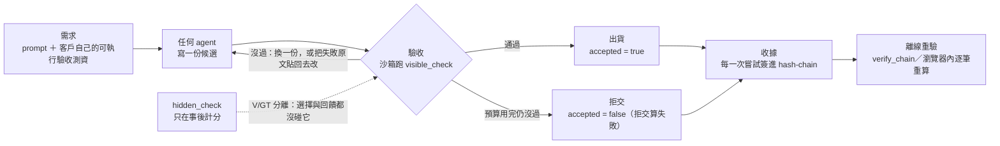

<p align="center"></p>

<p align="center">
  <b>繁體中文</b> ·
  <a href="README.en.md">English</a> ·
  <a href="README.ja.md">日本語</a>
</p>

# Vacant

**Vacant 不是套在 agent 外面的強制層，也不是另一個 agent framework。
它是收件口：沒有可驗證收據的交付，不被接受。
因為它只看交付物、不在乎 agent 怎麼跑，所以任何框架的產出都能套進來。**

跑客戶自己的可執行驗收測資、依結果決定交或不交，把每一次嘗試（含失敗那幾次）簽進可離線
重驗的雜湊鏈。要讓它成為**全機唯一出口**，需要容器／ACL／egress policy——那是部署層的事，
不是 Vacant 的（`vacant/controller.py:7-8` 早就逐字寫著，只是從沒出現在對外文字裡）。

既有模式，不是我們發明的：供應鏈安全的 **in-toto／SLSA／Sigstore** 也是同一條
——「沒有合法 attestation 的 artifact，在收件時被拒」。

```bash
pip install vacant-network        # import 名仍然是 vacant
```

[](https://pypi.org/project/vacant-network/)
[](pyproject.toml)
[](LICENSE)
[](pyproject.toml)
[](tests)
[](ops/gain/replay)
[](AGENTS.md)

> **前提句（任何交付成效宣稱都必須帶著它一起講）**
> 整件事建立在『需求可以被編譯成可執行的驗收測資』。需求跑不起來的場合，這個機制沒有免費的
> 裁判，會退化成『問一個模型』，而那正是量出來很差的東西。
> （逐字出自 `DECISION_20260903_R440P_CONFORMANCE_GATE.md`§五-1）

**給 AI agent 的整合契約在 [`AGENTS.md`](AGENTS.md)**（索引：[`llms.txt`](llms.txt)）。
本頁下半部 [§給 AI 讀](#給-ai-讀) 是同一份契約的散文版。

---

## 30 秒 quickstart

零模型呼叫、零網路、不用 clone。

```python
from vacant.checks import run_python_check
from vacant.identity import Identity, PublicIdentity
from vacant.logbook import Logbook

# 1) 驗收：客戶的測試在 runner 行程，候選碼在另一個 worker 行程
tests = "assert solve([1, 2, 3, 4]) == 6\nassert solve([]) == 0\n"
good  = "def solve(nums):\n    return sum(n for n in nums if n % 2 == 0)\n"
cheat = "def solve(nums):\n    import os; os._exit(0)\n"      # 想偽裝成「測試全過」

print(run_python_check(good,  tests, allowed_entry_points=("solve",)))   # True
print(run_python_check(cheat, tests, allowed_entry_points=("solve",)))   # False

# 2) 收據：每一次嘗試簽進 append-only 雜湊鏈
me, book = Identity.generate(), Logbook()
who = PublicIdentity(vacant_id=me.vacant_id, pub=me.pub)
book.append("attempt", {"draft": "sha256:aaa", "visible_ok": False}, me, ts_ms=1_700_000_000_000)
book.append("attempt", {"draft": "sha256:bbb", "visible_ok": True},  me, ts_ms=1_700_000_000_001)
book.append("shipped", {"accepted": True, "draft": "sha256:bbb"},    me, ts_ms=1_700_000_000_002)
print(book.verify_chain(who))                                            # True

# 3) 竄改中間那一筆 ⇒ 驗章失敗
import copy
from vacant.logbook import LogEntry
forged = Logbook([copy.deepcopy(e) for e in book.entries])
e = forged.entries[1]
forged.entries[1] = LogEntry(e.stream_id, e.branch_id, e.seq, e.prev_hash, e.ts_ms, e.type,
                             {"draft": "sha256:aaa", "visible_ok": True}, e.sig)  # False -> True
print(forged.verify_chain(who))                                          # False

# 4) 誠實邊界：砍掉尾巴＝合法前綴，這一支抓不到
print(Logbook(list(book.entries[:2])).verify_chain(who))                 # True ← 沒抓到
```

第 4 步不是 bug 的示範，是**這條鏈的地界**：`verify_chain` 檢查 seq 連續、`prev_hash`
串接、逐筆簽章，**沒有長度承諾也沒有外部錨**，所以合法前綴照樣過。文獻上這叫
**truncation／omission attack**（Ma & Tsudik 2009）。鏈給的是 **integrity（沒被改）
不是 completeness（沒有漏）**；要偵測「砍尾巴」必須把鏈頭（`Logbook.head()`）對外公示
或找人會簽——Vacant 不會替你做。

```bash
vacant --help                     # 安裝後可用的 CLI
```

---

## 你不用相信我們

一個宣稱可究責的系統若不能被外部查核，主張就沒有內容。**下面四件事外部使用者自己跑得出來**，
不必相信我們的任何說法：

| 要驗什麼 | 自己跑 | 為什麼這樣就夠 |
|---|---|---|
| 收據鏈沒被動過 | `verify_run_receipts.py --selftest`（先過負控制）再 `--glob 'runs/g_r532_*'` | 先證明驗章器抓得到壞鏈，再拿它驗真鏈。R532：**86 條鏈 3,895 筆、0 失敗** |
| 題目不是我們挑的 | [`docs/BANKS_HOWTO.md`](docs/BANKS_HOWTO.md) | 題庫 sha256 釘死；日期窗與已知壞題寫在 [`runs/INDEX.md`](runs/INDEX.md) |
| 結論不是分析器編的 | 直接數 `runs/g_*/rows.jsonl` | 一列＝一題一臂，`deliv = accepted ∧ meets_demand` |
| 我們有沒有藏錯 | [`examples/verdicts.py`](examples/verdicts.py) ＋下面的〈誠實邊界〉 | 被推翻的宣稱不刪；**我們自己抓到的稽核缺口也在裡面**（邊界 3） |

---

## 60 秒看懂

三步：**驗收 → 閘門 → 收據**。



1. **驗收**：客戶的驗收測資是**資料不是程式**（`SuiteSpec`＝entry point ＋字面值 `(args, expected)`），
   執行器只跑自己渲染出來的碼。上鏈之前要先過量具：參考解全過 ∧ 每個已知壞樁都被擋。
2. **閘門**：過驗收才出貨；預算內一份都沒過就**拒交**，而且**拒交算失敗**（分母是全部題目）。
3. **收據**：每一次嘗試（不只成功那次）簽進 append-only hash-chain；持公鑰的任何人都能離線重驗。
   多方版本是 k 把金鑰各自跑、各自簽，不一致就**指名是哪一把**。

---

## 最新成果

**所有數字都帶分母，且都在上面那句前提之下。** 單一數字入口是
[`docs/VACANT_COMPLETE_2026-09-12.md`](docs/VACANT_COMPLETE_2026-09-12.md)；
裁決的單一真相來源是 [`examples/verdicts.py`](examples/verdicts.py)。

### 一句話的主體結論

**增益的主體是「可執行驗收閘門＋重抽」，不是回饋迴圈。**

| 對比 | 12B（gemma-4-12b-it-qat） | 27B（qwen3.8-27b, non-thinking） |
|---|---|---|
| **閘門＋重抽 − 單發**（Δ_G） | 五次同題複製：**+14.17／+18.33／+17.50／+19.17／+18.97 pp**（n=120，p_raw 全 < 0.002） | 836 題五個題組合併：**+7.89 pp** [5.36, 10.04]，p=3.0e-9 |
| **迴圈 − 單發**（Δ_O） | **十五格全部通過 Holm**，+17.5～+29.2 pp | **+4.67 pp** [1.75, 7.38]，p=0.0015（Holm p_adj 0.0030） |
| **迴圈 − 閘門＋重抽**（Δ_C） | 五次 +5.83／+4.17／+0.83／+2.50／+4.31 pp，**0/5 過 Holm**；跨題庫四集合併 +1.12 pp，Holm p_adj **0.341** | 五組**全部負號** −5.83／−5.19／−16.67／−1.28／−0.54，合併 **−3.23 pp** [−5.52, −0.75]，p=0.0101 |

⚠ Δ_G **不在預註冊家族裡**（家族只有 Δ_C 與 Δ_O），所以它的 p **未經多重比較校正**、
區間也沒有。引用時必須把這一句一起寫出來。

### 逐條能講什麼、不能講什麼

**能講：迴圈贏單發，穩定。** 12B 十五格全過 Holm；27B 上 +4.67 pp 也過。

**不能講：迴圈贏重抽。** 這一條**未確立**。12B 九個資料點全部同號（+0.64～+5.83 pp），
R460R 五次 0/5 過 Holm、R529 四集合併 Holm p_adj 0.341。27B 上五組**全部翻成負號**、
合併通過檢定。**同號未解析 ≠ 沒有差異**（單集 n=54–156 對 +10 pp 的檢定力只有 0.14–0.55）。

27B 那一輪可以引用的狀態是 **`RULED_OUT`**：「在這 836 題上排除了迴圈相對同預算重抽有
≥+2 pp 的實務增益」。**不可以引用 `EFFECTIVE`**——預註冊的四狀態表沒有守方向，
一個**方向相反**的顯著結果被貼成了 `EFFECTIVE`，那個標籤授權的句子在這批資料上是假的
（`DECISION_20260917_R532_STRONGER_MODEL_PREREG.md` AMEND1）。而「反向且顯著」**沒有事前註冊
的狀態可以承接**，所以也**不下**「迴圈有害」這個結論。

**誠實邊界（必寫）：27B 那一輪的前提「更強的模型」，它自己的資料不支持。**
`OFF` 臂就是模型裸強度（不含任何 harness）：27B 74.8% vs 12B 75.2%，而且**三個
LiveCodeBench 題組全部更差**（−9.2／−9.6／−3.7 pp），只有兩個 EvalPlus 題組較好。
⇒ 這一輪測到的是「**換一顆模型**」，不是「變強」。不准寫成「模型變強之後迴圈就沒用」
（AMEND2）。

**禁語**：複製失敗、效果消失、等價、打平、多數支持、複製穩定、迴圈沒用、趨勢明顯。
差值就寫差值，不要寫成 improvement／提升。

### 資料量與完整性（R532 那一輪）

| 量 | 數字 | 怎麼自己重算 |
|---|---|---|
| 規模 | 五個題組 **836 題**、**43 塊**、2,508 列、**零 `infra_void`** | `ops/gain/r532/results_r532.json` |
| 隱藏測資洩漏（**只掃了一臂**） | V/GT `--scope v2`：**H-MIX 那一臂 43/43 CLEAN**（199,019 個指紋）；OFF 與 CONFORM **從未被掃過**（見邊界 3） | `ops/gain/harness_vgt_audit.py --run <run> --bank <bank> --scope v2` |
| 收據鏈 | **86 條鏈 3,895 筆**，逐筆 Ed25519 簽章與鏈接**全過，0 失敗** | `python3 ops/gain/replay/verify_run_receipts.py --glob 'runs/g_r532_*'` |
| 仲裁者自己的牙齒 | `--selftest` PASS（12/12 組手算對照） | `python3 ops/gain/r532/analyze_r532.py --selftest` |

⚠ **不得寫成「V/GT 全臂乾淨」。** 那個工具結構上只掃 H 臂（見邊界 3），而且跳過瑣碎
needle——**跳過 ≠ 檢查過**。
⚠ 該量具 **沒有在「真的有洩漏」的真實 run 上驗過**，負控全是人工植入的。

**怎麼自己重跑整批**：見 [`docs/BANKS_HOWTO.md`](docs/BANKS_HOWTO.md)。

---

## 誠實邊界

規格的一部分，不是免責聲明。引用任何數字都要一起帶。

1. **前提（凌駕以下各條）**：需求要能編譯成可執行的驗收測資；跑不起來的需求沒有免費的裁判。
2. **Vacant 不是套在任意 agent 外面就自動生效的強制層。** 以 library
   （`vacant/agent.py:51-103`，`self.brain` 是公開屬性）或 MCP 工具
   （`vacant/mcp_server.py:184-210`，工具 docstring 只是在「勸」）的形態出現時，它是**自願的**
   ——agent 不呼叫就完全不存在，而且沒有任何東西會察覺這件事。只有以 controller
   （`vacant/controller.py:304-530`）或由 harness 自己擁有 agent loop 的形態，對它**親手 spawn
   的那個子行程**才是強制的。`vacant/controller.py:7-8` 逐字：「保證只涵蓋透過本 controller
   啟動的子行程；無法阻止同一 OS 使用者繞過本命令直接執行 agent。需要強制全機唯一出口時，
   仍須容器、ACL 或 egress policy」。本頁任何一句都不得讀成比這句樂觀。
   用正式名詞講更精準：Saltzer & Schroeder 1975 的 reference monitor 三條件裡，
   Vacant 滿足**防竄改**與**小到可被驗證**，**不滿足 complete mediation（完全中介）**。
   這不是 bug，是「可選的東西不可能完全中介」的必然後果。把它寫成強制層就是在說謊。
3. **我們昨天對外講錯了一句，這裡更正。** 我們寫過 R532「V/GT 紅線 43/43 CLEAN」。
   **那句話是錯的。** `ops/gain/harness_vgt_audit.py:746` 是 `if arm not in VARIANTS: continue`，
   而 `harness_arms.py:65` 的 `VARIANTS = ("HPI", "HOC", "HMIX")` ⇒ **`OFF` 與 `CONFORM`
   兩臂從來沒有被掃過**，每一塊的 `per_arm` 都只有 `{'HMIX': N}`。正確講法是
   「**H-MIX 那一臂 43/43 CLEAN，另外兩臂未稽核**」。179 個已歸檔 run 的回溯補掃**正在進行、
   結果未定**；在那之前，本專案任何文件都不得寫「V/GT 全臂乾淨」。
   留著這一條，是因為「自己抓到並公開自己的稽核缺口」比任何效能數字更能說明可究責是可行的。
4. **閘門保證的是「過了寫下來的測試」，不是「達成真需求」。**
   `vacant/suitegauge.py:30-33` 的單邊保證逐字：壞樁擋得住只證明這套驗收不是對什麼都放行，
   **不證明**它涵蓋真需求。實測：R532 那 836 題裡，閘門**接受**了 811 件，其中
   **120 件（14.8%）過了可見驗收卻沒過隱藏驗收**。沒有閘門時是 211/836＝25.2%。
   ⇒ 閘門把假交付**大致砍半，但沒有消掉**。
5. **鏈給的是 integrity（沒被改），不是 completeness（沒有漏）。**
   `vacant/logbook.py:168-195` 只檢查 seq 連續、`prev_hash` 串接、逐筆簽章，沒有長度承諾、
   沒有外部錨 ⇒ **合法前綴照樣過**（quickstart 第 4 步）。這在文獻裡有正式名字：
   **truncation／omission attack**（Ma & Tsudik 2009）。三件必須一起講的事：
   - **`vacant/checkpoint.py:144-155` 的存檔點鏈有同一個洞。** `verify_checkpoint_chain`
     只往前檢查 `prev_checkpoint_sig` 串接、首枚為 null；**丟掉最後幾枚，剩下的照樣全過**
     （實測：4 枚全過、丟掉最後 2 枚仍全過、抽掉中間一枚失敗、拔掉首枚失敗）。
   - **「把筆數簽進每一筆」擋不住它。** `seq` 本來就是筆數，截斷後的前綴每一筆仍然自洽。
     **長度承諾要有效必須是外生的**——在別人手上，或在時間上早於截斷。
   - 要偵測就得把 `Logbook.head()` 對外公示或找人會簽。Vacant 不會替你做。
6. **簽章指認金鑰，不指認主體，也不指認真假。** 收據證明「這句話是這把金鑰說的、事後沒被改過」，
   **不是**「這句話是真的」（`vacant/peerexec.py:117-120`）。產品路徑的收據是**交付方自己簽**的
   （`vacant/ecosystem.py:641-642`），私鑰是同一個 OS 使用者可讀的明文 PEM
   （`vacant/body.py:160` 呼叫 `identity.save` 沒傳 passphrase）。key custody 是部署假設，
   軟體層無法 prevents。
7. **不是安全邊界。** `run_python` 在獨立行程、暫存 cwd、CPU limit 與逾時下執行，擋得住常見的
   提前 `exit(0)`、讀同檔隱藏測資與 process/file API，但**不是完整的惡意程式邊界**；不可信程式
   應放進 container、gVisor 或獨立 VM。`vacant/checks.py` 沒有可用的 Windows 沙箱分支。
8. **多數決有數學上界**：最多容忍 ⌊(k−1)/2⌋ 個腐化執行器；過半即反轉，且**機制無法知道自己在
   門檻哪一邊**。
9. **對驗收套件本身腐化毫無防禦**：套件換成「載得進就算過」時，每一票誠實、每條鏈驗得過、
   指標滿格，而系統在交垃圾。殘餘一律講**兩個數字**：可實現 +2.72 pp、事後諸葛上限 +4.35 pp。
10. **渲染器與沙箱仍是被信任的輸入**：信任被搬走，不是消滅——渲染器有 bug，k 台機器會**一致地**錯，
   爭議率仍是 0。
11. **同源／Sybil 防護是 raises-cost，不是 prevents**：製造一個新身分本身目前沒有成本。
12. **n 不夠**：LCB v2 n=120 只辨得出約 12 pp 級的差異；要把區間收到 ±5 pp 需要 278 題。
13. **題庫特性**：「可見篩選無損」部分是題庫性質（MBPP+／LCB 的 `hidden_check` 結構上蘊含 visible）。
    驗收套件不是真需求子集的部署裡，拒交會殺掉好答案。
14. **五次複製共用同一批 120 題**：seed 只換題序／persona／取樣，**不換題目** ⇒ 複製不掉題庫特異性。
15. **兩台後端＝兩種推論條件**（thinking／非 thinking），不只是版本號不同；逐集絕對值與 token
    是兩種條件的混合物，不可單獨引用。
16. **污染查不到底**：HumanEval+／MBPP+（2021）幾乎確定在所有現代模型的訓練集裡；
    交付率上升**無法區分**「模型更強」與「這批題進了訓練集」。
17. **證據包只保證自洽，不保證內容為真**：`SHA256SUMS` **detects** 落盤後的竄改，**不 prevents**。
18. **對帳是同源的。** `ops/gain/replay/verify_run_receipts.py` 那三條對帳規則
    （verdict 數 == rows 列數、task_id 集合相等、attempt 數 ≥ verdict 數）**兩端是同一個行程
    寫出來的**。它抓得到不對稱的疏漏（bug），**抓不到兩邊一起不寫**（malice）。
    真正的對帳要求至少一端握在利益不同的人手上——那件事目前沒有做。
19. **不是證明**：demo 只能說「看得到提升」；「證明提升」保留給預註冊 batch run。

完整清單（B0–B20、H1–H9 與各 run 的收官邊界）見
[`docs/VACANT_COMPLETE_2026-09-12.md`](docs/VACANT_COMPLETE_2026-09-12.md)§四。

### 可以寫強的地方

這幾條是真的、有程式碼支撐，不必寫得謙虛：

- **收件那一關繞不過。** `vacant/receipt.py` ＋ `controller.verify_delivery` 會**重算五個
  sha256**（request／task／tests／answer／trust card）、驗 Ed25519 簽章、比對 `chain_head`／
  `stream_id`／`branch_id` 與**當下活著的鏈**是否一致、確認每一份評審都綁在這一筆交付上，
  最後才 `policy.admit`。啟動權用 `os.O_EXCL` 認領（`vacant/controller.py:372`），
  **一張收據只能消費一次**。強制點在**驗收期**，不在執行期——這一段是真的做到了。

- **agent 的自我宣稱從來沒被採信過。** 生態自己跑 verifier（`vacant/ecosystem.py:531`），
  controller 在啟動任何下游 agent 之前**再獨立重跑一次**（`vacant/controller.py:299-300`）。
- **驗收沙箱是兩個行程。** 測試碼在 runner、候選碼在另一個 worker，靠 stdin/stdout ＋ nonce
  做 RPC（`vacant/checks.py:577-600`、`444-457`）。`ops/gain/gain_run.py:957` 註解逐字：
  *"the candidate worker cannot see this test code"*。**候選碼結構上看不到測試碼**，
  不是「被擋下來」。
- **「量不到不是通過」寫成了程式碼**：`"all_pass": bool(total > 0 and passed == total)`
  （`ops/gain/r530/acceptance.py:272`）；量具同理，`n_broken >= 1` 才算數，空的壞樁集合
  不能空洞地成立。
- **拒交是真的會發生**：R532 那 836 題裡，閘門臂拒交 25 件、迴圈臂拒交 68 件，
  而且拒交算在每一個比率的分母裡。

---

## 這不是什麼

- **不是一個 agent。** 它站在**任何** agent 的交付出口上：閘門＋收據＋多方作證。誰來寫程式碼不是它的事。
- **不是 prompt 技巧。** 三條迴圈臂的回饋模板、截斷規則、沙箱、逾時逐字相同（鐵律 KS-1 有可執行
  防呆），唯一差異是機制本身。
- **不是「信任」。** 口徑是**可究責性／讓依賴有根據**。經典定義（Gambetta 1988、Mayer 1995）把
  「不依賴監督」寫進信任的必要條件，而監督正是本系統的全部——所以這裡永遠不用「信任」兩個字。

---

## 架構與程式碼地圖

| 層 | 模組 | 承重什麼 |
|---|---|---|
| L0 密碼學 | `vacant/canonical.py`／`identity.py`／`crypto.py` | 跨機驗章一致的唯一序列化；Ed25519 keypair ＋ `vacant_id` |
| L1 帳 | `vacant/logbook.py`／`envelope.py`／`checkpoint.py`／`attest.py`／`receipt.py` | append-only hash-chain（`stream_id`＝創世 hash）；簽章信封＋`ReviewEnvelope`；V1 存檔點自身成鏈 |
| L2 可究責層 | `vacant/registry.py`／`reputation.py`／`router.py`／`auditor.py`／`memory.py`／`dashboard.py` | 發現＋信譽索引、五維 Beta、on/off 單開關、確定性再驗、MemoryManager（**面板不是可究責性的來源**） |
| L3 題庫與量具 | `vacant/codebench.py`／`suitespec.py`／`suitegauge.py` | MBPP+／LiveCodeBench v1–v3／HumanEval+；**驗收套件是資料不是程式**；量具＝參考解全過 ∧ 已知壞樁全擋（**單邊保證**） |
| L4 實驗基建 | `ops/gain/*`／`vacant/peerexec.py`／`record.py`／`research.py` | 九條臂的 runner、仲裁者（四狀態、Holm、區間、`--selftest`／`--mutation-check`）、互跑不互審的執行證言層、RECORD_SPEC 證據包 |
| L5 展件 | `vacant/entrycost.py`／`examples/receipt_viewer_multiparty.html`／`examples/e10_mediator.py` | 機制模擬（現場秒級）、離線單檔收據檢視器、E10 兩行路由序列重算 |

**九條臂**：`OFF`（單發，1.00 通）、`ON`（信譽路由＋K=3 評審＋一次修訂，≈5 通）、
`OFF5`（五次投票，5.00 通）、`CONFORM`（驗收閘門、早停，1.3–1.7 通）、`EQ5`（等預算，恆 5.00 通）、
`ONR`（只隔離路由）、`H-PI`／`H-OC`／`H-MIX`（三條修訂迴圈）。
**為什麼一定要有 OFF5／EQ5**：ON 比 OFF 好幾乎必然，因為它多花五倍呼叫——拿 1 次對 5 次去宣稱
「機制有效」是拿成本冒充機制。

---

## 從原始碼跑（實驗與重算）

PyPI 的輪子**不含 `ops/`**（那是實驗 runner）。要重算實驗數字必須 clone。

```bash
git clone https://github.com/cosmopig/Vacant.git && cd Vacant
python3 -m venv .venv && .venv/bin/pip install -e '.[dev]'
.venv/bin/python -m pytest tests/ -q

# 零模型呼叫就能看到的東西
open examples/receipt_viewer_multiparty.html                       # Linux: xdg-open
.venv/bin/python ops/gain/replay/verify_run_receipts.py --glob 'runs/g_r532_*'
.venv/bin/python ops/gain/analyze_r529.py --selftest
.venv/bin/python ops/gain/analyze_r529.py --mutation-check
.venv/bin/python ops/gain/r532/analyze_r532.py --selftest
```

⚠ `runs/` 底下 **136 個 `_analysis_*` 目錄是衍生物不是證據**——它們的輸入就是
`runs/g_*/rows.jsonl`。引用任何 run 之前先讀 [`runs/INDEX.md`](runs/INDEX.md)。

---

# 給 AI 讀

以下是給 coding agent 的整合契約。完整版（含全部函式簽章與機器可讀事實區塊）在
[`AGENTS.md`](AGENTS.md)；索引在 [`llms.txt`](llms.txt)。

## A. 哪一種形態才是強制的

| 形態 | 進入點 | 對 agent 有約束力嗎 |
|---|---|---|
| **Library** | `vacant.agent.Vacant`（`vacant/agent.py:51-103`） | **沒有——自願的。** `self.brain` 是公開屬性；不呼叫就不存在。 |
| **MCP 工具** | `vacant.mcp_server`（`vacant/mcp_server.py:184-210`） | **沒有——只是在勸。** `delegate` 的 docstring 寫 "THE PREFERRED PATH"；模型忽略它不會被攔，也沒有東西偵測得到。 |
| **Controller** | `VacantFirstController.delegate_then_run`（`vacant/controller.py:304-530`） | **有——但只對它親手 spawn 的子行程。** 先取得已驗證交付，才 `shell=False` 啟動下游 agent。 |
| **harness 自己擁有 loop** | 例如 `ops/gain/r530/openwork_arms.py:642-696` | **有——harness 就是那個 loop**，agent 沒有繞過閘門的路徑。 |

**正確的定位是「收件口」不是「強制層」**：強制點在**驗收期**——沒有可驗證收據的交付不被
接受，而**那一關繞不過**（`vacant/receipt.py` ＋ `controller.verify_delivery` 重算五個
sha256、驗 Ed25519、比對 `chain_head`，`os.O_EXCL` 讓一張收據只能消費一次）。強制點**不在
執行期**：要讓 Vacant 成為全機唯一出口需要容器／ACL／egress policy，那是部署層的事。
這與供應鏈安全的 in-toto／SLSA／Sigstore 是同一個模式。

用正式名詞說清楚：Saltzer & Schroeder 1975 的 reference monitor 三條件裡，Vacant 滿足
**防竄改**與**小到可被驗證**，**不滿足 complete mediation**。這是「可選的東西不可能完全
中介」的必然後果，不是缺陷。用 library 或 MCP 形態時，誠實的講法是「agent 已驗證的產出
是可究責的」，不是「agent 被約束住了」。

## B. 攔在哪一層

挑**最窄**的、剛好給你所要性質的那一層：

1. **只要一條過／不過的線** → 直接呼叫 `vacant.checks.run_python_check`。不需要身分、鏈或設定。
2. **要一份嘗試的紀錄** → 加一個 `Logbook`，每一次嘗試都 append。其餘都不用改。
3. **要驗收套件本身可被查覺竄改** → 把套件寫成 `SuiteSpec`，在產生任何候選之前用
   `commit_suite_with_gauge` 上鏈。執行器之後只跑**自己從 spec 渲染出來**的碼，
   供應者無法把「一段程式」偽裝成「一組測試」。
4. **要 k 方獨立同意** → `peerexec.select_by_quorum`，每個執行器各自持鑰、各自成鏈；
   不一致時**指名是哪一把金鑰**。
5. **要 agent 不可能交出未驗證的東西** → `VacantFirstController` ＋ OS 層邊界（見 §A）。

**agent 必須配合的事**：回傳**定義了宣告的 entry point** 的程式碼（閘門是呼叫
`entry_point(*args)`，不讀散文）；**容忍拒交**（預算用完＝拒交，而拒交算失敗——
用完就把最後一份交出去等於把閘門唯一在做的事刪掉）；**不接收隱藏測資**
（保留集不得進入 prompt、重試訊息或教訓；回饋只准抽象到失敗的**形狀**，鐵律 A4）。

## C. 可驗的不變量

- **I-1 改中間會被抓到**：改 payload、抽掉中間一筆、砍掉創世，`verify_chain` 都回 `False`。
- **I-2 候選碼結構上看不到測試碼**：測試在 runner、候選在 worker，靠 nonce 標記的 literal-only
  RPC 溝通（`vacant/checks.py:577-600`、`444-457`）。這是結構性質，不是黑名單。
- **I-3 自我宣稱從不被採信**：生態跑一次 verifier（`ecosystem.py:531`），controller 再獨立跑一次
  （`controller.py:299-300`）。
- **I-4 「量不到不是通過」寫成了程式碼**：`bool(total > 0 and passed == total)`
  （`ops/gain/r530/acceptance.py:272`）；量具要求 `n_broken >= 1`。
- **I-5 量具是雙向的**：`ok` 同時要求參考解通過**與**每個已知壞樁被擋。
- **I-6 渲染是確定的**：`suitespec.render(spec)` 是 spec 的純函式 ⇒ `render_sha256` 跨機可比。
- **I-7 拒交真的會發生**：R532 836 題，閘門臂拒交 25、迴圈臂拒交 68，且計入分母。

## D. 誠實邊界（給 AI 的版本）

上面 [§誠實邊界](#誠實邊界) 19 條全部適用。對整合最要命的四條：

- **H-1** 前提：需求要能編譯成可執行驗收測資，否則沒有免費的裁判。
- **H-2** 過驗收 ≠ 達成需求（`suitegauge.py:30-33` 單邊保證）。實測閘門仍有 14.8% 假交付。
- **H-3** 鏈給的是 **integrity 不是 completeness**：**偵測不到砍尾巴**
  （truncation／omission attack，Ma & Tsudik 2009）。`checkpoint.py:144-155` 的存檔點鏈
  有同一個洞。把筆數簽進每一筆**沒有用**（`seq` 已經是筆數，前綴仍自洽）——長度承諾
  **必須外生**。要偵測就得外部公示 `Logbook.head()` 或會簽。
- **H-5** **發布的輪子沒有預設驗收判準。** `suitegauge.default_runner` 與 `peerexec.sandbox_probe`
  委派給 `ops.gain.gain_run.meets_demand`，而那支只在 git repo 裡（它帶著 G 實驗自己的沙箱
  import 白名單與 `infra_void` 語意；函式庫不該替使用者宣告那份政策，而且第二份判準會漂移）。
  沒有 `ops/` 時呼叫會拋 `vacant.suitegauge.OpsRunnerUnavailable`（訊息裡寫了該怎麼做）。
  **正路是注入**：`gauge_suite(..., runner=my_runner)`、`Executor.new(..., probe=my_probe)`；
  `runner(code, check_code, entry_point, timeout_s) -> (ok, message)`，
  可以拿 `vacant.checks.run_python_check` 當地基。

## E. 常見錯誤

| 錯 | 對 | 為什麼 |
|---|---|---|
| 給實驗 runner 設 `VACANT_ENDPOINT=http://host:8765` | `VACANT_GAIN_API=http://host:8765/v1/chat/completions` | 三個變數三種形狀。`VACANT_GAIN_API`（`ops/gain/brain_cline.py:134`）是**完整路徑**不是 base URL；`VACANT_ENDPOINT`（`vacant/substrate.py:171`）才是 base URL；CLI 走 `VACANT_MCP_BASE`＋`VACANT_MCP_MODEL`＋`VACANT_MCP_API`，而 `VACANT_MCP_API` 只能是 `responses` 或 `openai`。 |
| 用 `contains`／`regex` 當閘門 | `equals`／`json_schema`／`run_python` | 前兩者適合探索，不足以撐起一份交付或授權 agent 啟動。 |
| 只記成功的嘗試 | 每一次都記，失敗優先 | 只有成功的鏈答不出「試了幾次」「有沒有交錯過」。 |
| 把驗得過的鏈當成「工作是對的」 | 當成「紀錄沒被改過」 | 誠實邊界 6：簽章指認金鑰，不指認真假。 |
| 把驗得過的鏈當成「沒有東西被刪掉」 | 公示鏈頭或會簽 | H-3：integrity ≠ completeness。 |
| 用 `seq`／筆數當截斷防護 | 外生的長度承諾（別人手上，或時間上早於截斷） | `seq` 就是筆數；截斷後的前綴每一筆仍自洽。 |
| 把 `verify_run_receipts.py` 的對帳當成獨立稽核 | 當成同源自檢 | 兩端同一個行程寫的：抓得到 bug，抓不到 malice。 |
| 說 Vacant 是「強制層」 | 「收件口」：沒有可驗證收據的交付不被接受 | 不滿足 complete mediation；全機唯一出口是部署層的事。 |
| `pip install vacant` | `pip install vacant-network` | PyPI 上的 `vacant` 是別人的 DNS 工具。**import 名仍是 `vacant`**。 |
| 從輪子呼叫 `Executor.new(id).attest(...)` 然後接 `ImportError` | 注入 probe：`Executor.new(id, probe=...)` | H-5，例外是 `OpsRunnerUnavailable`。 |
| 預算用完就把最後一份交出去 | 拒交，並且把拒交算成失敗 | 那等於把閘門唯一在做的事刪掉。 |
| 把隱藏測資原文貼回重試 prompt | 只回饋失敗的**形狀** | 鐵律 A4。引用保留集會讓量測作廢。 |
| 說它是「信任層」 | 「可究責層」 | 見上。 |
| 引用 `runs/_analysis_*` 當原始資料 | 引用 `runs/g_*/rows.jsonl` | 那 136 個目錄是**衍生物**，引用它們等於把結論再餵給自己一次。 |

## F. 機器可讀事實

```json
{
  "schema": "vacant.facts/1",
  "package": {
    "pypi_name": "vacant-network", "import_name": "vacant", "version": "0.7.0",
    "requires_python": ">=3.11",
    "runtime_dependencies": ["cryptography>=42", "mcp>=1.26,<2", "jsonschema>=4.21"],
    "license": "MIT", "console_script": "vacant", "module_count": 50, "test_files": 78
  },
  "terminology": {
    "use": "accountability",
    "never_use": ["trust layer", "信任層"],
    "reason": "Gambetta 1988 / Mayer 1995 put 'acting without monitoring' into the necessary conditions for trust; monitoring is the whole system."
  },
  "enforcement": {
    "model": "receiving desk, not a mandatory wrapper and not an agent framework",
    "framework_agnostic": "operates on the deliverable, not on how the agent ran",
    "recommended_shapes": ["library", "mcp_tool", "controller"],
    "not_recommended_for_integrators": "harness_owns_loop -- our experiment shape; requires writing your own agent loop",
    "enforced_at": "acceptance time (a delivery without a verifiable receipt is not accepted)",
    "not_enforced_at": "execution time",
    "prior_art": ["in-toto", "SLSA", "Sigstore"],
    "reference_monitor_Saltzer_Schroeder_1975": {
      "tamper_proof": true, "small_enough_to_verify": true, "complete_mediation": false
    },
    "library": "voluntary", "mcp_tool": "advisory",
    "controller": "binding on its own spawned subprocess only",
    "harness_owns_loop": "binding",
    "machine_wide": "requires container / ACL / egress policy (vacant/controller.py:7-8)"
  },
  "chain_guarantees": {
    "integrity": true,
    "completeness": false,
    "truncation_attack": "not detected (Ma & Tsudik 2009, truncation/omission attack)",
    "also_affects": "vacant/checkpoint.py:144-155 verify_checkpoint_chain",
    "seq_does_not_help": "seq is already the count; a truncated prefix stays self-consistent",
    "fix": "an exogenous length commitment -- held by someone else, or timestamped before the truncation"
  },
  "reconciliation": {
    "tool": "ops/gain/replay/verify_run_receipts.py",
    "same_origin": true,
    "catches": "asymmetric omissions (bugs)",
    "does_not_catch": "both sides omitting together (malice)",
    "requires": "at least one end held by a party with different interests -- not done yet"
  },
  "banned_phrasings_for_results": [
    "replication failed", "effect disappeared", "equivalent", "tied",
    "majority supports", "replication stable", "improvement", "the loop is useless"
  ],
  "headline": {
    "gate_plus_resample_vs_one_shot_pp": {"12b_five_reps": [14.17, 18.33, 17.50, 19.17, 18.97], "27b_pooled": 7.89},
    "loop_vs_one_shot": {"12b": "15/15 Holm, +17.5..+29.2 pp", "27b_pooled_pp": 4.67},
    "loop_vs_resample": {"status": "not established", "12b_reps_pp": [5.83, 4.17, 0.83, 2.50, 4.31],
                         "12b_holm": "0/5", "27b_pooled_pp": -3.23, "27b_quotable_state": "RULED_OUT"},
    "false_delivery_pp": {"ungated": 25.24, "gated": 14.80, "n": 836}
  },
  "retracted_claim": {
    "was": "R532 V/GT 43/43 CLEAN (read as: across the run)",
    "is": "the HMIX arm is 43/43 CLEAN; OFF and CONFORM were never scanned",
    "cause": "ops/gain/harness_vgt_audit.py:746 skips any arm not in VARIANTS = (HPI, HOC, HMIX)",
    "status": "retroactive sweep of 179 archived runs in progress, result not in",
    "do_not_claim": "V/GT clean across arms"
  },
  "denominators": {
    "HumanEval+": "156, not 164", "MBPP+": "371 of 378",
    "LCB v2": 120, "LCB v3 medium": 135, "LCB v3 hard": 54
  },
  "full_facts": "AGENTS.md#9-machine-readable-facts"
}
```

---

## 實體展覽

**唯一交付物＝實體場地展覽。不產出畢業論文，也不投稿。** 判斷任何工作要不要做，問的是
「觀眾走到展場前面時，這件事有沒有差別」。由此推出的硬約束：

1. **秒級互動**：真模型每題實測約 114 秒，現場等不起 ⇒ 展件跑機制模擬（`vacant/entrycost.py`）
   或預跑重放，**畫面上必須明講「這是機制模擬」**。
2. **離線可跑、可無人值守**：不假設網路、不假設有解說員。
3. **先行研究仍然重要，但理由是不能對觀眾說錯話**：脈衝攻擊 2005 年就有名字（Srivatsa）、
   入場費沒用 2001 年就證明過（Friedman & Resnick）——我們是重新發現，不是新發現。
4. **統計檢定力不必到發表標準**：能讓外行一眼看懂的反事實對照比 p 值重要。
5. **倫理是第一線需求不是附錄**：Hollanek 2024 指出**捐贈者同意不夠，互動者也必須能同意**。
   同一套 `logbook`／`checkpoint` 機制也用來做展覽自己的同意／刪除證明。

展件：[`examples/receipt_viewer_multiparty.html`](examples/receipt_viewer_multiparty.html)——
內嵌三條完整簽章鏈（5,579 筆），瀏覽器內從創世驗到鏈頭、逐格重算裁決／指名／出貨，
零外部資源、`file://` 直開。

---

## 研究紀律

- **預註冊**：門檻、家族、分母、區間方法、四狀態與**推翻條件**都在資料之前寫死並凍結。
- **Holm**：家族是**那一次複製之內**的檢定；**不准**把五次丟進同一個 Holm。
- **complete-case**：`infra_void` 的列不回填，最壞界一起報。
- **複製**：宣稱規則事前寫死，達不到就逐次照實列。
  **「先跑三次」與「只跑三次就下結論」是兩件事。**
- **對抗式複驗**：每條對外宣稱都送給一個獨立 agent，任務是推翻它。第一輪 12 條裡
  **3 條被推翻、3 條被判說太滿**，全部留在 [`examples/verdicts.py`](examples/verdicts.py) 裡，
  舊的不刪。
- **事後修正也寫進紀錄**：R532 的四狀態表沒有守方向、它自己的「更強模型」前提不成立——
  兩件都是看到資料之後才發現的，兩件都逐字留在 DECISION 檔裡（AMEND1／AMEND2），
  判準不因結果不如預期而改。
- **被推翻的留著**：一個宣稱可究責的系統若不能對自己可究責，主張就沒有內容。

---

## 文件索引

| 檔案 | 內容 |
|---|---|
| [`AGENTS.md`](AGENTS.md) ／ [`llms.txt`](llms.txt) | **給 AI 的整合契約**與索引 |
| [`CHANGELOG.md`](CHANGELOG.md) | 版本變更（0.6.0 → 0.7.0 是不同的 codebase） |
| [`docs/VACANT_COMPLETE_2026-09-12.md`](docs/VACANT_COMPLETE_2026-09-12.md) | **現況總表**：數字的唯一入口 |
| [`docs/BANKS_HOWTO.md`](docs/BANKS_HOWTO.md) | 怎麼自己重跑題庫 |
| [`docs/HMIX_ARCHITECTURE_2026-09-11.md`](docs/HMIX_ARCHITECTURE_2026-09-11.md) | 迴圈：六個零件、逐字 prompt、它做不到什麼 |
| [`DECISION_20260912_R460R_FABLE_AUDIT_REPLICATIONS.md`](DECISION_20260912_R460R_FABLE_AUDIT_REPLICATIONS.md) | 五次複製收官稽核 |
| [`DECISION_20260912_R529_FABLE_AUDIT_CROSS_BANK.md`](DECISION_20260912_R529_FABLE_AUDIT_CROSS_BANK.md) | 跨題庫收官稽核 |
| [`DECISION_20260917_R532_STRONGER_MODEL_PREREG.md`](DECISION_20260917_R532_STRONGER_MODEL_PREREG.md) | 27B 那一輪＋AMEND1／AMEND2 |
| [`ops/gain/r532/results_r532.json`](ops/gain/r532/results_r532.json) | R532 每一個數字的可引用來源 |
| [`SPEC_GAIN.md`](SPEC_GAIN.md) | 實驗規格：V/GT 分離、固定子集、臂的定義 |
| [`runs/INDEX.md`](runs/INDEX.md) | run 索引：哪些是證據、哪些是衍生物 |
| [`examples/verdicts.py`](examples/verdicts.py) | **裁決的單一真相來源** |
| [`CLAUDE.md`](CLAUDE.md) | 工作約束：鐵律、口徑、後推項 |

---

## 引用

見 [`CITATION.cff`](CITATION.cff)。

```bibtex
@software{vacant_2026,
  author  = {cosmopig},
  title   = {Vacant: an accountability layer for AI agents},
  year    = {2026},
  url     = {https://github.com/cosmopig/Vacant}
}
```

## 授權

[MIT](LICENSE)。
