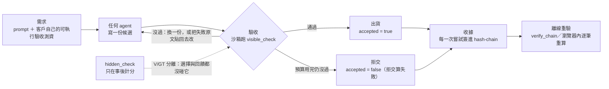

<p align="center"></p>

<p align="center">
  <b>繁體中文</b> ·
  <a href="README.en.md">English</a> ·
  <a href="README.ja.md">日本語</a>
</p>

<details>
<summary>ASCII 字樣（不渲染 SVG 的地方）</summary>

```text
█   █  ███   ███   ███  █   █ █████
█   █ █   █ █   █ █   █ ██  █   █
█   █ █   █ █     █   █ ██  █   █
█   █ █████ █     █████ █ █ █   █
█   █ █   █ █     █   █ █  ██   █
 █ █  █   █ █   █ █   █ █  ██   █
  █   █   █  ███  █   █ █   █   █
```

</details>

# Vacant

**接在任何 AI agent 外面的可究責層：跑客戶的可執行驗收、決定交或不交、把每一步簽進收據。**

Vacant 是接在任何 **AI agent** 外面的**可究責層（accountability layer）**：跑客戶自己的
**可執行驗收測資（executable acceptance tests）**、依結果決定交或不交，並把每一次嘗試簽進
可離線重驗的 **hash chain**（**signed receipts**）。全部量測都**預註冊（pre-registered）**，
主要比較跑過**五次同題複製（replication）**＋四個互斥題目集的跨題庫實驗，
題材是 **LLM code generation**（**LiveCodeBench**、**HumanEval+**、**MBPP+**）；
**五次的結果逐次照實列在下面**，沒有合併成一個數字。

[](pyproject.toml)
[](LICENSE)
[](tests)
[](runs/INDEX.md)
[](ops/gain/replay)
[](DECISION_20260911_R460R_FIVE_REPLICATIONS_PREREG.md)

> **前提句（任何交付成效宣稱都必須帶著它一起講）**
> 整件事建立在『需求可以被編譯成可執行的驗收測資』。需求跑不起來的場合，這個機制沒有免費的
> 裁判，會退化成『問一個模型』，而那正是量出來很差的東西。
> （逐字出自 `DECISION_20260903_R440P_CONFORMANCE_GATE.md`§五-1）

---

## 60 秒看懂

三步：**驗收 → 閘門 → 收據**。



1. **驗收**：客戶的驗收測資是**資料不是程式**（`SuiteSpec`＝entry point ＋字面值 `(args, expected)`），
   執行器只跑自己渲染出來的碼。上鏈之前要先過量具：參考解全過 ∧ 每個已知壞樁都被擋。
2. **閘門**：過驗收才出貨；預算內一份都沒過就**拒交**，而且**拒交算失敗**（分母是全部題目）。
3. **收據**：每一次嘗試（不只成功那次）簽進 append-only hash-chain；持公鑰的任何人都能離線重驗。
   多方版本是 k 把金鑰各自跑、各自簽，不一致就**指名是哪一把**。

---

## 量到什麼

**所有數字都帶分母，且都在上面那句前提之下。** 單一數字入口是
[`docs/VACANT_COMPLETE_2026-09-12.md`](docs/VACANT_COMPLETE_2026-09-12.md)；
裁決的單一真相來源是 [`examples/verdicts.py`](examples/verdicts.py)。

### A. 五次同題複製（LCB v2 120 題、gemma-4-12b-it-qat、六臂交錯、五通等預算）

| 臂 | R460 主 run | r1 | r2 | r3 | r4 | r5 |
|---|---:|---:|---:|---:|---:|---:|
| 單發（OFF） | 58.33% | 57.50% | 54.17% | 57.50% | 51.67% | 51.26% |
| 閘門＋重抽（CONFORM） | 70.83% | 71.67% | 72.50% | 75.00% | 70.83% | 70.94% |
| 五次投票（OFF5） | 65.00% | 60.83% | 61.67% | 59.17% | 66.67% | 68.64% |
| 迴圈（H-MIX） | 84.17% | 77.50% | 76.67% | 75.83% | 73.33% | 74.79% |
| **H-MIX − CONFORM** | **+13.33 pp** | +5.83 | +4.17 | +0.83 | +2.50 | +4.31 |
| b／c | 22/6 | 15/8 | 17/12 | 12/11 | 13/10 | 14/9 |
| 95% 區間（未調整） | [4.22, 19.46] | [−2.79, 12.89] | [−5.35, 12.80] | [−7.44, 8.89] | [−5.94, 10.28] | [−4.54, 12.01] |
| Holm p_adj（家族 6） | 0.011 | 0.630 | 0.917 | 1.000 | 0.678 | 0.922 |

分母皆 120，**r5 例外**：2026-09-13 後端模型崩潰後被 JIT 重載（TTL 1 小時、每小時卸載）造成 7 列
`infra_void`，所以 r5 那一欄是**逐臂自己的分母**（OFF 119／CONFORM 117／OFF5 118／H-PI 120／H-OC 120／
H-MIX 119），而主指標 H-MIX − CONFORM 用 **complete-case n=116**，作廢列不回填。
（來源：`DECISION_20260912_R460R_FABLE_AUDIT_REPLICATIONS.md`§八-1）

**預註冊的宣稱規則逐字**：「5/5 同號（Δ_C > 0）且 ≥4/5 Holm 顯著 ⇒ 可以寫『複製穩定』；否則逐次照實列。」
同號 5/5 成立、Holm 顯著 **0/5** 不成立 ⇒ **逐次照實列**。能寫的句型只有：

> 五次的 Δ_C 分別是 +5.83／+4.17／+0.83／+2.50／+4.31 pp，其中 **0 次通過 Holm**。

同一段必須同時出現的五件事（缺一件就是報喜不報憂）：
(1) 五次同號；(2) 0/5 通過 Holm；(3) 五個未調整區間**全部與 R460 的 [4.22, 19.46] 相交**——以區間看
沒有任何一次與 R460 互斥；(4) 五個上界（12.89／12.80／8.89／10.28／12.01）**全低於** R460 的點估計
13.33（這是描述，不是檢定）；(5) 事前寫死的檢定力——n=120 對 +10 pp 只有 **0.43–0.63** ⇒ 五次**預期
2–3 次**通過，真值若真是 +10 pp，出現 0/5 的機率約 0.007–0.06，**落在下尾**（下尾不等於反證）。

**⚠ 不要單獨引用「84%」。** R460 的 84.17%／+13.33 pp 是**單次上偏點估計**（贏家詛咒：能被判顯著的
點估計被截斷在 MDE 以上），**在後續九次量測裡一次都沒有重現**。
**不准寫**：複製穩定、多數支持、複製失敗、效果消失、等價、打平、迴圈沒用；**不准**併 n、不准平均、
不准挑一次。`RULED_OUT`（r3）的語意是**排除 ≥+10 pp**，不是「排除任何效果」。

**五次都站得住的兩件事**：
- **有迴圈就贏單發**：H-MIX／H-PI／H-OC 對 OFF **十五格全部通過 Holm**（+17.5～+29.2 pp）。
- **假交付（交出去卻是錯的）H-MIX < CONFORM**：5/5 成立。

### B. 跨題庫（R529：四個互斥題目集、三個真來源、三臂）

| 題目集 | n | 單發 OFF | 閘門 CONFORM | 迴圈 H-MIX | H−C（b/c） | H−O（b/c） |
|---|---:|---:|---:|---:|---|---|
| LCB v3 medium | 135 | 115/135＝85.19% | 125/135＝92.59% | 126/135＝93.33% | +0.74 pp（6/5） | +8.15 pp（17/6） |
| LCB v3 hard | 54 | 38/54＝70.37% | 41/54＝75.93% | 43/54＝79.63% | +3.70 pp（5/3） | +9.26 pp（7/2） |
| HumanEval+ | 156 | 129/156＝82.69% | 147/156＝94.23% | 148/156＝94.87% | +0.64 pp（5/4） | +12.18 pp（24/5） |
| MBPP+ | 371 | 277/371＝74.66% | 295/371＝79.51% | 299/371＝80.59% | +1.08 pp（15/11） | +5.93 pp（31/9） |
| **合併** | **716** | 559/716＝78.07% | 608/716＝84.92% | 616/716＝86.03% | +1.12 pp（31/23、Holm **p_adj 0.341**） | +7.96 pp（79/22、Holm **p_adj 2.0e-8**） |

- **能講**：回饋迴圈**對單發**的增益跨題庫成立（四集全正、合併 p_adj 2.0e-8）。
- **能講**：回饋迴圈**對同預算重抽**的增益在這四集**小到量不到**（+0.6～+3.7 pp，合併 p 0.341）。
- **不能講**：「H-MIX 跨題庫贏過重抽」，也**不能**反過來寫「H-MIX 對重抽無效」——
  **同號未解析 ≠ 沒有差異**（單集 n=54–156 對 +10 pp 的檢定力只有 0.14–0.55）。
- HumanEval+ 的分母是 **156 不是 164**（8 題因沙箱信封排除）；四集裡兩集是同來源的難度切片 ⇒ **真來源＝3**。
- ⚠ **兩台後端不是同一個推論條件**：1003（LM Studio 0.4.24）對 gemma-4 啟用 thinking、1004（0.4.17）沒有
  （同一顆模型檔，探針：59 個 completion token／53 reasoning vs 2／0）。配對主指標在**塊內同一台**故不受影響；
  **逐集絕對值與 token／tpc 是兩種推論條件的混合物，不可再單獨引用**。
  （來源：`DECISION_20260912_R529_FABLE_AUDIT_CROSS_BANK.md`§十一）

### C. 增益的主體在哪裡（稽核判斷，非預註冊主指標）

把「迴圈對單發」的增益拆開，**可執行驗收閘門＋重抽已經拿走絕大部分**：

- CONFORM − OFF 五次：**+14.17／+18.33／+17.50／+19.17／+18.97 pp**（全 p_raw < 0.002，**未校正**）；
  R529 四集 +4.85～+11.54 pp。
- 同一批資料裡，H-MIX 只比 CONFORM 再多 +5.83／+4.17／+0.83／+2.50／+4.31 pp（0/5 過 Holm）。
- **分解不是因果**：CONFORM 與 H-MIX 是兩條各自跑的臂，不是「先閘門再迴圈」的兩階段；
  「+14 pp 來自閘門、+4 pp 來自迴圈」是**相減得到的敘述**，不是被實驗分離出來的成分。
- **多數決輸給閘門**：OFF5 − CONFORM 五次 −10.83／−10.83／−15.83／−4.17／−1.74 pp，
  **5/5 同號但只有 3/5 顯著**，而且後端最乾淨（零共租）的兩次不顯著 ⇒ **同號未解析**，不得寫成「贏」。

### D. 可究責層自己被驗了什麼

| 量 | 數字 | 怎麼自己重算 |
|---|---|---|
| 收據鏈 | **9,841 筆**（67 個 run／194 條鏈）逐筆 Ed25519 簽章與鏈接**全部通過，0 失敗、0 斷鏈** | `ops/gain/replay/verify_run_receipts.py --glob 'runs/g_r460r*'`（30 run／120 鏈／6,674 筆）**＋**`--glob 'runs/g_r529_*'`（37 run／74 鏈／3,167 筆），兩次相加＝9,841；`--glob` 只吃一個 pattern，一次呼叫湊不出全部 |
| V/GT 分離（隱藏測資零洩漏） | `--scope v2` **67/67 塊 CLEAN**、violations 0 | `ops/gain/harness_vgt_audit.py --run <run> --bank <bank> --scope v2`（bank 名＝`evalplus`＝MBPP+／`humanevalplus`／`lcb2`／`lcb3`） |
| 量具自身的牙齒 | `--selftest` PASS、`--mutation-check` **9/9 抓到** | `ops/gain/analyze_r529.py --mutation-check` |
| 索引沒有漂 | `OK：索引與資料一致（290 個目錄、117 個有 summary.json）` | `ops/gain/build_runs_index.py --check` |

⚠ V/GT 工具**只掃 H 臂**，且跳過瑣碎 needle（R460R r1–r3：needle 總數 95,090，實檢 57,248、跳過 37,842＝39.8%）——**跳過 ≠ 檢查過**，其餘由人工抽查補。
⚠ 量具 v2 **沒有在「真的有洩漏」的真實 run 上驗過**，負控全是人工植入的。

---

## 這不是什麼

- **不是一個 agent。** 它接在**任何** agent 外面：閘門＋收據＋多方作證。誰來寫程式碼不是它的事。
- **不是 prompt 技巧。** 三條迴圈臂的回饋模板、截斷規則、沙箱、逾時逐字相同（鐵律 KS-1 有可執行防呆），
  唯一差異是機制本身。R460 的離線歸因把增益定位在迴圈：Δ(最終 − 第一輪) 兩次重放都落在 **+16 到 +19 pp**；
  而 pi 式那條臂的第一輪 prompt 效果**約等於零（±2 pp 內，隨重放機器負載變動）**。
  ⚠ 歸因是離線重算（`--rescore-turn1`）：**R460 的兩次重放每臂差 1–3 題**（R460R r1 的三次本機重評差 1 題／120），
  引用時要標明是哪一次重評。
- **不是「信任」。** 口徑是**可究責性／讓依賴有根據**。經典定義（Gambetta 1988、Mayer 1995）把
  「不依賴監督」寫進信任的必要條件，而監督正是本系統的全部——所以這裡永遠不用「信任」兩個字。
- **不是安全邊界。** `run_python` 在獨立行程、暫存 cwd、CPU limit 與逾時下執行，擋得住常見的
  提前 `exit(0)`、讀同檔隱藏測資與 process/file API，但**不是完整的惡意程式邊界**；不可信程式應放進
  container、gVisor 或獨立 VM。
- **不是證明。** demo 只能說「看得到提升」；「證明提升」保留給預註冊 batch run，而
  `docs/PREREG_V2.md` 的 C-3 兩個前件都還沒到位。

---

## 架構與程式碼地圖

| 層 | 模組 | 承重什麼 |
|---|---|---|
| L0 密碼學 | `vacant/canonical.py`／`identity.py`／`crypto.py` | 跨機驗章一致的唯一序列化；Ed25519 keypair ＋ `vacant_id`（私鑰放閘道、agent 推理看不到身分） |
| L1 帳 | `vacant/logbook.py`／`envelope.py`／`checkpoint.py`／`attest.py`／`receipt.py`／`trustcard.py` | append-only hash-chain（`stream_id`＝創世 hash、真 `head()`）；簽章信封＋`ReviewEnvelope`；V1 存檔點自身成鏈；可攜憑證與委派收據 |
| L2 可究責層 | `vacant/registry.py`／`reputation.py`／`router.py`／`auditor.py`／`memory.py`／`dashboard.py` | 發現＋信譽索引（非中央路由器）、五維 Beta（key＝stream/branch/substrate，credit 跟著記憶走）、on/off 單開關、確定性再驗、MemoryManager M0/M1/M2、觀測台（**面板不是可究責性的來源**） |
| L3 題庫與量具 | `vacant/codebench.py`／`suitespec.py`／`suitegauge.py` | MBPP+（sha256 釘死、371 題固定子集）＋LiveCodeBench v1/v2/v3＋HumanEval+；**驗收套件是資料不是程式**；量具＝參考解全過 ∧ 已知壞樁全擋（**單邊保證**） |
| L4 實驗基建 | `ops/gain/gain_run.py`／`harness_arms.py`／`analyze_r460.py`／`analyze_r460r.py`／`analyze_r529.py`／`vacant/peerexec.py`／`record.py`／`research.py` | 九條臂的 runner（OFF／ON／OFF5／CONFORM／EQ5／ONR ＋ H-PI／H-OC／H-MIX）、仲裁者（四狀態、Holm、區間、守門指標、`--selftest`／`--mutation-check`）、互跑不互審的執行證言層、RECORD_SPEC 證據包、McNemar＋bootstrap＋預註冊四函式 |
| L5 展件 | `vacant/entrycost.py`／`examples/receipt_viewer_multiparty.html`／`examples/e10_mediator.py`／`examples/publish_*.py`／`examples/verdicts.py` | 機制模擬（現場秒級）、離線單檔收據檢視器（r454 三條鏈 5,579 筆）、E10 兩行路由序列重算、對外發布與**裁決單一真相來源** |

**九條臂**：`OFF`（單發，1.00 通）、`ON`（信譽路由＋K=3 評審＋一次修訂，≈5 通）、
`OFF5`（五次投票，5.00 通）、`CONFORM`（驗收閘門、早停，1.3–1.7 通，依題庫）、`EQ5`（等預算，恆 5.00 通）、
`ONR`（只隔離路由）、`H-PI`／`H-OC`／`H-MIX`（三條修訂迴圈）。
**為什麼一定要有 OFF5**：ON 比 OFF 好幾乎必然，因為它多花五倍呼叫——拿 1 次對 5 次去宣稱「機制有效」
是拿成本冒充機制。

---

## 安裝與最小可跑範例

需要 Python 3.11 以上。runtime 依賴只有 `cryptography`（外加 MCP 相容層的 `mcp`）。

```bash
git clone https://github.com/cosmopig/Vacant.git
cd Vacant
python3 -m venv .venv
.venv/bin/pip install -e '.[dev]'
.venv/bin/python -m pytest tests/ -q      # 1,507 個收集到的測試
```

### 零模型呼叫就能看到的東西

```bash
# 1) 收據檢視器（離線單檔、file:// 直開，零外部資源）
open examples/receipt_viewer_multiparty.html     # Linux: xdg-open

# 2) 收據鏈逐筆重驗（Ed25519 ＋ 鏈接，指得出壞在第幾筆）
#    --glob 是單值旗標 ⇒ 跑兩次才湊得出 9,841 筆（6,674 ＋ 3,167）
.venv/bin/python ops/gain/replay/verify_run_receipts.py --glob 'runs/g_r460r*'
.venv/bin/python ops/gain/replay/verify_run_receipts.py --glob 'runs/g_r529_*'

# 3) 仲裁者自己的牙齒
.venv/bin/python ops/gain/analyze_r460r.py --selftest
.venv/bin/python ops/gain/analyze_r529.py --selftest
.venv/bin/python ops/gain/analyze_r529.py --mutation-check

# 4) run 索引沒有漂
.venv/bin/python ops/gain/build_runs_index.py --check
```

### 要真的跑一次閘門（需要一個 OpenAI-compatible 端點）

```bash
export VACANT_MCP_BASE=http://localhost:1234
export VACANT_MCP_MODEL=your-model
export VACANT_MCP_API=openai

.venv/bin/vacant run \
  "Write solve(nums), returning the sum of all even integers." \
  --test "assert solve([1, 2, 3, 4]) == 6" \
  --test "assert solve([]) == 0"
```

流程：最多生成三次（前一版沒過客觀 check 才重作）→ 其他 resident 簽章互審＋確定性稽核重跑 check →
產生完整綁定 task／check／answer／trust card 的 Ed25519 receipt → **本機再驗一次**，全部成立才算 gate 通過。
`--agent` 或 `--agent-argv` 可以把已驗證交付交給下游 CLI agent（JSON argv、`shell=False`、
`argv[0]` 不允許 placeholder）。

⚠ **要授權 agent launch 的 gate 只接受 `equals`／`json_schema`／`run_python` 三種強 check。**
`contains`／`regex` 適合探索，但不足以撐起一份交付。

---

## 自己重算

```bash
# 五次複製的彙總（--selftest 會在 R460 六塊上對釘已知答案）
python3 ops/gain/analyze_r460r.py --reps 1 2 3 4 5 --bank lcb2 --json /tmp/r460r.json

# R460 六臂收官的仲裁量
python3 ops/gain/analyze_r460.py \
  --run runs/g_r460_harness_lcb2_{a1,a2,a3,b1,b2,b3} \
  --bank lcb2 --rescore-turn1 --json /tmp/r460.json

# 跨題庫四集
python3 ops/gain/analyze_r529.py --json /tmp/r529.json

# V/GT 稽核（v2 應全 CLEAN；--scope v1 會逐字重現 R460 那 90 筆偽陽性）
# ⚠ MBPP+ 的 bank 名是 evalplus。`--bank` 沒有 choices，打錯的名字會掉進 builtin 的無限產生器 ⇒ 不報錯、直接掛死。
python3 ops/gain/harness_vgt_audit.py --run runs/g_r529_mbpp_a1 --bank evalplus --scope v2 --out /tmp/vgt.json

# E10 那兩行路由序列（展件主視覺；只讀已歸檔 JSONL，零機時）
python3 examples/e10_mediator.py

# README 頂端那張 8-bit 字樣（重建＝重跑產生器，不手改 SVG）
python3 docs/assets/make_vacant_8bit.py --check
```

⚠ `examples/e10_mediator.py` 讀的是 iCloud 裡的歸檔資料集，**不在本 repo 內**；
外部使用者跑不出來是預期的，不是壞掉。
⚠ `runs/` 底下 **136 個 `_analysis_*` 目錄是衍生物不是證據**——它們的輸入就是 `runs/g_*/rows.jsonl`，
把它們當原始資料引用等於把自己的結論再餵給自己一次。引用任何 run 之前先讀
[`runs/INDEX.md`](runs/INDEX.md)。
⚠ `ops/gain/analyze_r447.py` 的 `PREREG` 常數不准改——那是別人的事前註冊。

---

## 誠實邊界

1. **前提（凌駕以下各條）**：需求要能編譯成可執行的驗收測資；跑不起來的需求沒有免費的裁判。
2. **n 不夠**：LCB v2 n=120 只辨得出約 12 pp 級的差異；要把區間收到 ±5 pp 需要 278 題。
3. **題庫特性**：「可見篩選無損」部分是題庫性質（MBPP+／LCB 的 `hidden_check` 結構上蘊含 visible）。
   驗收套件不是真需求子集的部署裡，拒交會殺掉好答案。
4. **五次複製共用同一批 120 題**：seed 只換題序／persona／取樣，**不換題目** ⇒ 題目層級效果在五次之間
   完全相關，複製不掉題庫特異性。
5. **五次的後端負載不同質**（與另一個 run 的共租率 8.5／71.3／2.1／0／0%；r5 橫跨一次模型崩潰與四次卸載）
   ——描述，不校正，也**不准把跨次差異全歸給取樣**。
6. **兩台後端＝兩種推論條件**（thinking／非 thinking），不只是版本號不同。
7. **多數決有數學上界**：最多容忍 ⌊(k−1)/2⌋ 個腐化執行器；過半即反轉，且**機制無法知道自己在門檻哪一邊**。
8. **對驗收套件本身腐化毫無防禦**：套件換成「載得進就算過」時，每一票誠實、每條鏈驗得過、指標滿格，
   而系統在交垃圾。殘餘一律講**兩個數字**：可實現 +2.72 pp、事後諸葛上限 +4.35 pp。
9. **渲染器與沙箱仍是被信任的輸入**：信任被搬走，不是消滅——渲染器有 bug，k 台機器會**一致地**錯，
   爭議率仍是 0。
10. **簽章指認金鑰，不指認主體**：收據證明「這句話是這把金鑰說的、事後沒被改過」，**不是**「這句話是真的」。
11. **同源／Sybil 防護是 raises-cost，不是 prevents**：**製造一個新身分本身目前沒有成本**——
    這是機制的地界，不是可以用參數調掉的。
12. **key custody 是部署假設**：同一 OS 使用者或 root 能讀私鑰時，軟體層無法 prevents 偽造。
13. **軟體 gate 只涵蓋透過 controller 啟動的行程**：使用者直接執行下游 agent 當然能繞過。
14. **Windows 沙箱跑不起來**（`vacant/checks.py` 非 posix 分支）；展場機器是 Linux VM，不受影響。
15. **`g_*` run 目錄不是 RECORD_SPEC 證據包**：目前符合全部必要項的只有 `blayer_1000_v2`／`v3` 兩個。
16. **證據包只保證自洽，不保證內容為真**：`SHA256SUMS` **detects** 落盤後的竄改，**不 prevents**。

完整清單（B0–B20、H1–H9 與 R460R／R529 各自的收官邊界）見
[`docs/VACANT_COMPLETE_2026-09-12.md`](docs/VACANT_COMPLETE_2026-09-12.md)§四。

---

## 實體展覽

**唯一交付物＝實體場地展覽。不產出畢業論文，也不投稿。** 判斷任何工作要不要做，問的是
「觀眾走到展場前面時，這件事有沒有差別」。由此推出的硬約束，每一條都改變技術決策：

1. **秒級互動**：真模型每題實測約 114 秒，現場等不起 ⇒ 展件跑機制模擬（`vacant/entrycost.py`）
   或預跑重放，**畫面上必須明講「這是機制模擬」**——把模擬講成證明是鐵律 5 的展場版本。
2. **離線可跑、可無人值守**：不假設網路、不假設有解說員；依賴外部端點的東西都要有 fallback。
   （同一條理由讓 harness 把「doom-loop 問人類」改成自動拒交。）
3. **先行研究仍然重要，但理由是不能對觀眾說錯話**：脈衝攻擊 2005 年就有名字（Srivatsa）、
   入場費沒用 2001 年就證明過（Friedman & Resnick）——我們是重新發現，不是新發現。
4. **統計檢定力不必到發表標準**：能讓外行一眼看懂的反事實對照比 p 值重要。
5. **倫理是第一線需求不是附錄**：展覽用真人資料生成分身，而 Hollanek 2024 指出
   **捐贈者同意不夠，互動者也必須能同意**——動物園的性質就是有人在旁邊看。
   同一套 `logbook`／`checkpoint` 機制也用來做展覽自己的同意／刪除證明：用自己展示的機制證明自己守約。

展件：[`examples/receipt_viewer_multiparty.html`](examples/receipt_viewer_multiparty.html)（4.48 MB，
內嵌 r454 真跑三條完整鏈＝5,579 筆，瀏覽器內從創世驗到鏈頭、逐格重算裁決／指名／出貨，
並示範翻票⇒簽章紅、少一票誠實⇒平手不指名、換平台字串⇒毫無反應）；
展場 Linux VM headless Chrome 以 `file://` 實測渲染 **2.1 秒**。
**展件解說要知道**：那一格收據（`Mbpp/100` 第 0 份）是**排序後第一個說謊格，不是挑的**。

---

## 研究紀律

- **預註冊**：門檻、家族、分母、區間方法、四狀態與**推翻條件**都在資料之前寫死並凍結；
  發射前掃過所有 `summary.json` 確認 seed 一次都沒被用過（命中集合必須**恰好等於**授權集合——
  少一個也停，因為「量不到不是通過」）。
- **Holm**：家族是**那一次複製之內**的 6 個檢定；**不准**把五次的 30 個檢定丟進同一個 Holm——
  那會把「複製」偷偷變成「一個 n=600 的實驗」。
- **complete-case**：`infra_void` 的列不回填；r5 的主指標分母是 **116 不是 120**，最壞界一起報。
- **複製**：宣稱規則事前寫死（5/5 同號且 ≥4/5 Holm 顯著才可寫「複製穩定」），達不到就逐次照實列。
  **「先跑三次」與「只跑三次就下結論」是兩件事。**
- **對抗式複驗**：每條對外宣稱都送給一個獨立 agent，任務是推翻它。第一輪 12 條裡
  **3 條被推翻、3 條被判說太滿**，全部留在 `examples/verdicts.py` 裡，舊的不刪。
  R452 第一版寫的「三種攻擊不可表達」**是錯的**——`entry_point="exec"` 一擊打穿（368/371 上鏈、
  假交付 31.5%），那一次也留在紀錄裡。
- **事故揭露**：1003 兩次 `bad alloc`／`Context size has been exceeded`（作廢的塊整組移進
  `runs/_aborted/` 留證、不進任何分析）；排程器死於 `UnicodeDecodeError`（發射器按位元組截中文）；
  V/GT 量具 v1 報的 90 筆違規**逐筆分類後全是偽陽性**（量具偽陽性會把真訊號淹掉）；
  分析器的併發窗曾把完成時刻當送出時刻 ⇒ 假超賣，修正後**所有仲裁值逐位元不變**。
- **被推翻的留著**：一個宣稱可究責的系統若不能對自己可究責，主張就沒有內容。

---

## 文件索引

| 檔案 | 內容 |
|---|---|
| [`docs/VACANT_COMPLETE_2026-09-12.md`](docs/VACANT_COMPLETE_2026-09-12.md) | **現況總表**：有什麼、量到什麼、誠實邊界、怎麼自己驗（數字的唯一入口） |
| [`docs/VACANT_ARCHITECTURE_AND_RESULTS_2026-09-07.md`](docs/VACANT_ARCHITECTURE_AND_RESULTS_2026-09-07.md) | 正典（到 R455／R461 為止，逐字沿用未被取代） |
| [`docs/HMIX_ARCHITECTURE_2026-09-11.md`](docs/HMIX_ARCHITECTURE_2026-09-11.md) | H-MIX 迴圈：六個零件、逐字 prompt、它做不到什麼 |
| [`docs/HARNESS_STUDY_2026-09-07.md`](docs/HARNESS_STUDY_2026-09-07.md) | 外部 harness 的原始碼事實與「九條傳說」逐條檢驗 |
| [`DECISION_20260911_R460R_FIVE_REPLICATIONS_PREREG.md`](DECISION_20260911_R460R_FIVE_REPLICATIONS_PREREG.md) | 五次複製預註冊（宣稱規則、禁令、中止準則） |
| [`DECISION_20260912_R460R_FABLE_AUDIT_REPLICATIONS.md`](DECISION_20260912_R460R_FABLE_AUDIT_REPLICATIONS.md) | 五次複製收官稽核（§八＝五次齊了） |
| [`DECISION_20260911_R529_CROSS_BANK_PREREG.md`](DECISION_20260911_R529_CROSS_BANK_PREREG.md) | 跨題庫預註冊 |
| [`DECISION_20260912_R529_FABLE_AUDIT_CROSS_BANK.md`](DECISION_20260912_R529_FABLE_AUDIT_CROSS_BANK.md) | 跨題庫收官稽核（§十一＝兩台後端推論模式不同） |
| [`DECISION_20260911_R460_FABLE_AUDIT_HARNESS.md`](DECISION_20260911_R460_FABLE_AUDIT_HARNESS.md) | R460 六臂收官（四狀態、守門指標、winner's curse 免責） |
| [`DECISION_20260903_R440P_CONFORMANCE_GATE.md`](DECISION_20260903_R440P_CONFORMANCE_GATE.md) | 前提句出處＋候選池天花板（17–19% 的題目五份候選全錯） |
| [`SPEC_GAIN.md`](SPEC_GAIN.md) | G 實驗規格：V/GT 分離、題庫固定子集、臂的定義 |
| [`docs/RECORD_SPEC.md`](docs/RECORD_SPEC.md) ／ [`docs/PREREG_V2.md`](docs/PREREG_V2.md) | 證據包規格／宣稱階梯（**待人類簽字凍結**） |
| [`runs/INDEX.md`](runs/INDEX.md) | run 索引：哪些是證據、哪些是衍生物、題庫 sha256 與已知壞題 |
| [`examples/verdicts.py`](examples/verdicts.py) | **裁決的單一真相來源**（held／unresolved／no_effect／overstated／refuted） |
| [`CLAUDE.md`](CLAUDE.md) | 工作約束：鐵律、口徑、後推項 |

---

## 引用

見 [`CITATION.cff`](CITATION.cff)。

```bibtex
@software{vacant_2026,
  author  = {cosmopig},
  title   = {Vacant: an accountability layer for AI agents},
  year    = {2026},
  url     = {https://github.com/cosmopig/Vacant}
}
```

## 授權

[MIT](LICENSE)。
