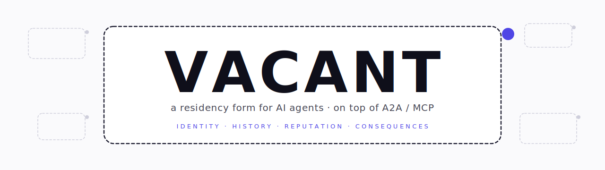

<div align="center">



<!--
  Demo 影片插槽。錄好的 60 秒 screencast 會放在 `assets/demo.gif`；
  分鏡劇本見 `docs/DEMO_RECORDING_SCRIPT.md`。在錄製完成前這個註解
  區塊作為定位標記，未來 commit 直接把檔案放進來不會動到其他段落。
-->
<sub><em>📹 60 秒 demo screencast — 錄製中（<a href="docs/DEMO_RECORDING_SCRIPT.md">分鏡劇本</a>）。會走過 <code>vacant demo law_firm</code>、dashboard 的對抗頁、以及 <code>vacant serve --mcp</code> 接 Claude Desktop。</em></sub>

# Vacant

[English](README.md) · [繁體中文](README.zh-TW.md)

[](https://github.com/cosmopig/Vacant/actions/workflows/ci.yml)
[](LICENSE)
[](https://www.python.org/downloads/release/python-3120/)
[](https://docs.astral.sh/uv/)
[](#測試)
[](#測試)
[](https://mypy.readthedocs.io/)
[](https://cosmopig.github.io/Vacant/)
[](https://vacant.zeabur.app/)

</div>

一個給 AI agent 的**責任層居民形式**，疊在 A2A / MCP 之上。讓 agent 有身份、有歷史、有信譽、有後果。

> A residency form for AI agents on top of A2A / MCP — identity, history, reputation, consequences.

畢業專題 · 2026 · Theory V5 · 14 週 MVP 完成。

---

## 為什麼需要這個？

今天的 agent 很會講話，**但無法被問責**。LLM 給錯答案，誰賠？兩個 agent 串通刷分，網路怎麼辦？跨 session 還叫同一個 agent，你怎麼確認下次見到的還是同一個？現在的 stack — A2A（agent-to-agent 傳輸）、MCP（model context protocol）— 只管 *agent 怎麼講話*，完全不管 *講錯話誰扛*。

**Vacant 補這一層。** 它**不是另一個 agent framework**，而是 *agent 自願選擇採納的形式* — 像「街上一個人」跟「有護照、有信用紀錄、要負後果的公民」的差別。Agent 沒有義務變成 vacant，但一旦選擇採納，就帶著身份（Ed25519 keypair）、歷史（簽章 append-only logbook）、跟一份**要花探索成本才建得起來、也會被失去的信譽**。

專題核心主張：

> 沒有責任層的多 agent 網路會退化成對抗性、不可究責的 LLM 呼叫集合。Vacant 是其中一種可能的責任層 — cost-aware 設計（接受 Skalse 2022 不可能定理為真），38 種攻擊向量列舉，三層防禦語言（P/D/C）量化標記，14 週 MVP 證明核心機制可實作。

---

## 整體架構

```
                   ┌──────────────────────────────────────┐
                   │  人類 / Operator                       │
                   └─────────────────┬────────────────────┘
                                     │
                   ┌─────────────────▼────────────────────┐
                   │  客戶端（OpenClaw / Hermes / Claude   │  ← 平行物種
                   │   Code / 你自己的 A2A 工具）           │     不是 vacant 宿主
                   └─────────────────┬────────────────────┘
                                     │  A2A v0.4 / MCP v1.0
                                     │（傳輸層，不管責任）
─────────────────────────────────────┼──────────────────────────────────
                                     │
                   ┌─────────────────▼────────────────────┐
                   │       VACANT — 責任層                  │
                   │                                       │
                   │   ┌──────────┐    ┌──────────┐       │
                   │   │ vacant_A │←──→│ vacant_B │  …    │  ← 網路上的居民
                   │   │  halo    │    │  halo    │       │
                   │   └──────────┘    └──────────┘       │
                   │                                       │
                   │   發現透過 halo 聚合（per-vacant，    │
                   │   不是中央節點）                       │
                   └─────────────────┬────────────────────┘
                                     │
                   ┌─────────────────▼────────────────────┐
                   │  Substrate（LLM、工具、實體 actuator、  │
                   │   別的 vacant — multi-spec 可換）       │
                   └──────────────────────────────────────┘
```

三個關鍵設計決策：

1. **Vacant 跟客戶端是平行物種，不是內嵌。** OpenClaw / Hermes 是人類進入網路的*客戶端*。Vacant 是*網路上的居民*。雙方透過 A2A 或 MCP 對話。
2. **身份是密碼學的，不是 session 的。** Vacant 的 *idem*（數值同一性）是 Ed25519 keypair。Substrate（這次思考用哪個 LLM）**可以換** — 換完還是同一個 vacant。
3. **Registry 是 per-vacant，不是中央。** 每個 vacant 自帶 *halo*（自簽 capability_card）。「Registry」是對 halo 的聚合 / 索引層 — 三種實作模型（central MVP / federated / DHT）— **絕不是 routed-through 的中介**。

---

## Claude Code 使用者（一條指令）

已經在用 [Claude Code](https://claude.com/claude-code) 的話，最快的
方式是用 plugin marketplace：

```text
/plugin marketplace add cosmopig/Vacant
/plugin install vacant@cosmopig-vacant
```

裝完 restart session，Claude Code 直接就能 call **`vacant_describe`** /
**`vacant_call`** 這兩個 MCP tool。Plugin manifest 背後跑的是
[`uvx --from git+https://github.com/cosmopig/Vacant vacant mcp`](.claude-plugin/plugin.json)，沒
有要手動裝什麼。

> 還沒在本機 `vacant init` 過？`vacant mcp` 會跑一個 *ephemeral*
> demo 身份（每次 launch 重 keygen、不寫盤），plugin 裝完立刻能
> 用。事後再跑 `vacant init <name>` 換成永久身份。驗證流程見
> [`docs/INTEGRATION.md`](docs/INTEGRATION.md) §0。

---

## 不用 Claude Code 也能跑

同一份 code 不用 plugin 也能跑。兩條路：

```bash
# 1. curl + script（clone 進 ~/Vacant）
curl -LsSf https://raw.githubusercontent.com/cosmopig/Vacant/main/install.sh | bash
cd ~/Vacant

# 跑 demo scenario（決定性 mock substrate，不需要 API key）
uv run vacant demo law_firm                       # 複合 vacant + 子 vacant
uv run vacant demo self_replication --seed=314    # D 系列 lineage 樹
uv run vacant demo code_review                    # 多 reviewer 平行，信譽分化
uv run vacant demo multilingual_translation       # 跨 substrate 派發

# 啟動互動式 Streamlit dashboard
uv run streamlit run src/vacant/mvp/dashboard.py
```

```bash
# 2. uvx — 不 clone、不安裝
uvx --from git+https://github.com/cosmopig/Vacant vacant demo law_firm
uvx --from git+https://github.com/cosmopig/Vacant vacant mcp   # 純 stdio MCP server
```

**用真的 LLM — substrate 矩陣**（substrate 是可換的；見 THEORY_V5 §2 — LLM 是 *資源*，不是 *身份*）：

```bash
uv run vacant demo law_firm --substrate=mock           # 預設、決定性、不需 key
uv run vacant demo law_firm --substrate=anthropic      # ANTHROPIC_API_KEY（Claude）
uv run vacant demo law_firm --substrate=openai         # OPENAI_API_KEY（也支援任何 OAI-
                                                       #   compatible endpoint，靠
                                                       #   OPENAI_BASE_URL：Together /
                                                       #   Fireworks / Groq / vLLM /
                                                       #   LMStudio / llama.cpp …）
uv run vacant demo law_firm --substrate=gemini         # GOOGLE_API_KEY（Gemini）
uv run vacant demo law_firm --substrate=mistral        # MISTRAL_API_KEY
uv run vacant demo law_firm --substrate=ollama         # 本機 Ollama，不需 key
# hermes / openclaw 在 D1 是 stub；嫁接到 client 的 load-bearing 整合是
# `--substrate=client-inherited`（D2）：vacant 透過 MCP 服務時用呼叫端
# 的 LLM（sampling/createMessage），vacant 端不用任何 key。
```

複製 `.env.example` → `.env`，只填你會用到的那幾組 key。

---

## 嫁接到客戶端跑（host a vacant under your client）

Vacant 是網路上的居民、不嵌進你的 agent 客戶端。設想的部署方式是：
**`vacant serve --mcp` 同時開 A2A 跟 MCP 兩種傳輸**；你的客戶端
（Claude Desktop / OpenClaw / Hermes / 任何 MCP-aware 工具）接上去，
vacant 透過 `tools/list` 公告自己的 capability，*呼叫端負責出 LLM*
（用 MCP 的 `sampling/createMessage`）。Vacant 簽自己 logbook 上的
entry；客戶端的 LLM 是 substrate；**vacant 端完全不需要 API key**。

```bash
# 終端機 — 起一個 vacant
vacant init alice
vacant serve --mcp --port 8443 --name alice
```

把你的 MCP 客戶端（例如 Claude Desktop 的 `mcp.json`）指向
`http://localhost:8443/mcp`，就能呼叫 alice 的所有 tool。alice 的
`substrate_spec.allowed_substrates` 內含 `client-inherited`；記錄下來的
substrate identity 是 `client-inherited:<caller_vid>:<model>`，所以
per-substrate 信譽計算跟其他 backend 一視同仁。

接線正確與否可以用 `npx @modelcontextprotocol/inspector` 或 `mcp` Python
SDK 的 client 從外部驗證。針對這個流程的 integration test 是
`tests/integration/test_mcp_external_client.py`。安全模型在 ADR
`architecture/decisions/D017_client_inherited_substrate.md`：vacant
信任呼叫端的 LLM 輸出，但自己簽自己的 logbook entry；substrate identity
記下來，per-substrate 信譽機制照走。

非 MCP 部署的場合，挑一個有 key 的 substrate
（`anthropic`、`openai`、`gemini`、`mistral`、`ollama`）即可 — 完整矩陣
見 `docs/RUNBOOK.md`。

---

## 什麼是 *vacant*？

一個 vacant 是 *居民形式* — agent 自願採納六樣構件，換取在網路上「可以被找到、可以被評鑑、可以持續存在」這件事：

| # | 構件 | 用途 | 由誰實作 |
|---|---|---|---|
| 1 | `identity` | Ed25519 keypair；*idem*（數值同一性） | P2 |
| 2 | `logbook` | Append-only 簽章歷史；*ipse*（在變化中延續） | P2 |
| 3 | `behavior_bundle` | System prompt + policy DSL + 工具白名單；idem 與 ipse 之間的橋樑 | P0 |
| 4 | `substrate_spec` | 宣告可接受的 substrate（LLM / 工具 / actuator） | P0 |
| 5 | `runtime` | 最小生命週期 — heartbeat、state machine、shadow-self drift 偵測 | P1 |
| 6 | `capability_card` | 自簽自發布的公告（*halo*）— 這個 vacant 提供什麼 | P4 / P6 |

身份是*密碼學的*，不是 session-based。延續是*簽章可驗證的*，不是嘴上說說。能力是*自我宣告* + 同儕審查 + 信譽加權。Agent **選擇**成為 vacant。任何人都可以把 vacant 丟上網 — 沒有履歷審查、沒有資格門檻、沒有中央授權。

---

## 四個 demo scenario

每個 scenario 是一個可跑的腳本，演練不同的跨模組流程。全部用固定 seed 確保可重現。

### `law_firm`（seed=42）— 複合 vacant + 子 vacant

1 個複合 parent（「法律問答」）派發給 2 個封閉 sub vacants（「專利查詢」、「條款草擬」）。展示：子代封閉（Tree-Only protocol）、跨 vacant logbook attestation、複合 reputation 累積到 parent 同時子 reputation 也獨立累積。30 次呼叫後，parent factual μ ≥ 0.7，兩個 sub 都還是 `LOCAL`（封閉預設值不變）。

### `code_review`（seed=137）— 平行 reviewer，信譽分化

5 個 ACTIVE vacant 競標審同一個 PR-shape 查詢。前 3 名靠 UCB 拿 `caller_review` credit，後 2 名只拿 `peer_review`。100 次查詢後信譽分布穩定 — 前 2 名 μ_F ≥ 0.8，最後 1 名 ≤ 0.4。Same-controller detection 對種好的串通配對 fire；那對的 reviewer credibility 被降權 ≥ 0.5。

### `multilingual_translation`（seed=271）— 跨 substrate 派發

6 個翻譯 vacant，各自宣告不同的 `substrate_spec.allowed_substrates`。40 次跨 en→{zh, ja, es, fr} 查詢。展示：substrate-aware 派發、`(vacant, substrate)` 各自獨立 posterior、跨 substrate 成功服務的 `portability_factor` 加分。

### `self_replication`（seed=314）— D 系列 lineage

1 個 root vacant 在 200 個模擬 tick 內依序 spawn：D1（clone-with-mutation）、D2（subagent-bud）、D3（capability-fork）、D5（cross-substrate respawn）。展示：parent_id 鏈、**graduation 過程 keypair 不變**（D2 子代從 `LOCAL` → `ACTIVE`，**同一把 keypair 保留**）、STYLO discount 讓個體 vacant 在 epoch 5 後自我演化停滯，但新 D1 spawn 重設 lineage clock — **關鍵 §4.3 機制**：lineage 無限演化，個體會死。

每個 scenario 把結構化 JSON 印到 stdout，**同時**把每筆事件寫進 SQLite event store `var/demo.db`。Streamlit dashboard 從這個 store 讀資料 — 跑完 `vacant demo` 之後打開 dashboard，看到的就是剛剛那次的 replay，不重新計算、不需要 cache invalidation。`vacant demo --tail` 串流同樣的事件到 stdout，給只開終端機的場合用。

---

## 核心機制怎麼運作

| 機制 | 在做什麼 | 程式位置 |
|---|---|---|
| **5 維 Beta posterior** | 每個 `(vacant, substrate)` 一份信譽 — factual / logical / relevance / honesty / adoption。遞迴信任加權；STYLO 距離 discount rollover。 | `src/vacant/reputation/posterior.py` |
| **UCB 探索** | 新 vacant 拿探索 bonus；隨 `n_eff` 成長自動轉成 exploitation。冷啟動 §3.6 機制：誕生路徑啟動訊號 + 利基稀缺加分 + 低風險試探 + 閒置 peer review。 | `src/vacant/reputation/ucb.py` |
| **Same-* 偵測（三軸）** | Same-controller（時序/IP/ASN）、same-substrate（LLM 指紋）、same-stylo（行為）。三軸都是 **抬高成本、不阻擋** — 對可疑 cluster 的 review 降權。 | `src/vacant/reputation/same_detect.py` |
| **Halo 聚合** | 每個 active vacant 自簽自發布 capability_card。Discovery 對 halo，不對 routed registry。 | `src/vacant/registry/halo.py` |
| **5 態生命週期** | `ACTIVE` / `LOCAL` / `HIBERNATING` / `STALE` / `SUNK` / `ARCHIVED`。狀態-事件 transition table；`can_review` / `can_be_called` 在 API 層強制執行。 | `src/vacant/runtime/state_machine.py` |
| **Sunk = 身份託管 attestation** | Sunk vacant 的 heartbeat **不是** 存活宣告。是 keypair 仍在受信託管的簽章證明 — lineage 死後歸屬的關鍵載荷。Sunk vacant **不能 review**（§4.1）。 | `src/vacant/runtime/heartbeat.py` |
| **Lineage 才是進化主體** | 個體 vacant 累積 STYLO drift discount（自我演化停滯）。Lineage（parent_id 鏈）不會 — 每個 D 系列 spawn 重設 clock。**Lineage 無限演化，個體會死。**（§4.3） | `src/vacant/runtime/spawn.py` |
| **封閉子代 + graduation** | 複合 parent 的子代預設 `LOCAL`（陌生人查不到也叫不到）。可透過 parent 同意 + 速率限制 + 三層共謀偵測 graduate 成 `ACTIVE`。**同 keypair、同 logbook 過程不換。** | `src/vacant/composite/graduation.py` |
| **直接 A2A 派發** | Halo lookup 之後 vacant 直接 call 對方。Registry **絕不是** 中介 routing。Per-pair envelope chain 防 replay。 | `src/vacant/protocol/dispatch.py` |
| **簽章 review 事件** | `record_review` 先把簽過的 REVIEW_EVENT 寫進 logbook，再 atomic 更新 posterior。信譽永遠可追溯到可審計歷史（不會漂移）。 | `src/vacant/reputation/aggregator.py` |

完整機制集合 + 推導：[`architecture/THEORY_V5.md`](architecture/THEORY_V5.md)。攻防矩陣（38 種攻擊 × P/D/C 防禦層）：THEORY_V5 §6。

---

## 這**不是**什麼

常見誤解，明白寫死：

- **不是裝在 OpenClaw / Hermes / Claude Code 裡面的插件。** 那些是人類進入網路用的*客戶端*；vacant 是這些客戶端會*呼叫的對端*（透過 A2A 或 MCP）。從客戶端視角看 vacant 體感像「多了能呼叫的能力」（有點像插件），但架構上是反過來的 — 不是「裝進去」。
- **不是 wrapper / middleware。** Runtime *本身就是 vacant* — 如果只是包一層在現有 agent 上面，換掉底下的 agent 就等於換 vacant，違反「keypair 才是身份」的設計。詳見 `architecture/components/P1_runtime.md` §D1。
- **不是 protocol。** A2A 跟 MCP 才是 protocol（線上的強制格式）。Vacant 是 *居民形式* — 自願採納。你可以用純 A2A / MCP 跟 vacant 講話、不用自己變成 vacant。
- **不是 token / 區塊鏈專案。** 沒上鏈。Stake 是信譽 bonus 的輸入（§3.7），不是支付系統。設計目標是「token 免費的未來」（3+ 年後），inference 便宜到網路可以持續循環。
- **不是 anti-LLM。** Vacant 反而靠 LLM。重點是讓「使用 LLM 的 agent」可被問責，不是廢掉 LLM。
- **沒有中央 judge / oracle / 仲裁者。** 沒有中央 LLM 決定誰對誰錯。驗證透過簽章 logbook + 同儕 review + 信譽 + 紅隊探測。

---

## 現狀

| 面向 | 狀態 |
|---|---|
| **理論** | V5 定稿；經過 **codex 三輪對抗審查**，`no fatal issues remain`。見 [`architecture/THEORY_V5.md`](architecture/THEORY_V5.md)（45KB、8 層、38 攻擊矩陣、13 條誠實開放問題）。 |
| **實作** | 14 週 MVP 完成。8 個元件（P0-P7）全部 merge。5 輪 Padv 對抗審查（Padv-P2 / P3 / P4 / P5 / P6）。1 輪 codex 獨立合併後審查（5 個 finding 全處理；ADR D015）。 |
| **測試** | 736 個測試全綠（711 unit/property + 25 slow integration）。91% 行覆蓋率。mypy `--strict` 通過。 |
| **Demo 完整度** | 4 個 scenario 都能在 `MockSubstrate`（位元一致）跟 `AnthropicSubstrate`（統計重現）跑。Streamlit dashboard 渲染 network / lineage / scenarios / metrics / adversarial 五頁。 |
| **文件網站** | https://vacant.zeabur.app/ — 著陸頁、敘事版（7 章）、完整技術版（7 段互動）、生態模擬器（拖拉建構 vacant）、文件閱讀器。 |

---

## 對抗審查歷程

這個專案的正確性 claim 建立在多輪對抗審查之上。少掉任何一輪都會放過某類 bug：

1. **理論硬化（codex × 3 輪）** — V3 → V4 → V5，2026 年 4 月底到 5 月初。每輪：codex 生成 38 攻擊矩陣、找出不一致、起草不可能性 / 誠實證明。V5 達到 `no fatal issues remain`，13 條誠實開放問題（H1-H13）明示標記。
2. **每元件實作審查（雲端 Claude Code × 8 場）** — P0 到 P7 各自獨立 session、隔離 context、各開一個 PR。失敗隔離：P3 卡住不會擋住 P5。
3. **每敏感元件對抗審查（Padv × 5 場）** — P2 / P3 / P4 / P5 / P6 merge 後，專屬 session 在 `tests/adversarial/` 寫攻擊測試。每場列舉每個介面 ≥3 個攻擊、寫成 `pytest`、修補找到的殘留漏洞。
4. **整合審查（人類 + codex）** — 13 個 branch 全 merge 進 main 後，抓到 3 個整合層 bug（per-target rate limit 語意、constants 重複、demo scenario rate limit）。再 spawn 一輪 codex 獨立合併後審查，找到 5 個（theory invariant 違反 + 跨模組 contract 斷裂 + demo 真實性問題 — 見 ADR D015）。

`architecture/decisions/` 共 15 個 ADR。`tests/adversarial/` 共 23 個攻擊測試檔。所有 finding 不是「修了 + 加 regression test」就是「在 ADR 裡記錄為殘留風險」。

---

## 手動安裝 / 開發

如果你想自己控制每一步：

```bash
git clone https://github.com/cosmopig/Vacant.git && cd Vacant
uv sync --all-extras                  # 裝 runtime + dev deps
uv run vacant --help                  # CLI 命令樹
uv run pytest                         # 711 個 unit + property 測試
uv run pytest -m slow                 # 25 個 slow integration 測試
uv run pytest --cov=vacant            # 含 coverage 報告
uv run ruff check . && uv run ruff format --check .
uv run mypy src/                      # 嚴格 typecheck
```

要用 LLM substrate：`cp .env.example .env`、填 `ANTHROPIC_API_KEY`（Claude）或 / 跟跑本機 Ollama server（`ollama serve`）。

---

## 程式庫結構

```
Vacant/
├── architecture/               ← 規格文件（實作的合約）
│   ├── THEORY_V5.md            ← 標準理論，8 層、38 攻擊矩陣
│   ├── ARCHITECTURE.md         ← 元件導航
│   ├── BRIEFING.md             ← 原始研究簡報（V1，留作歷史）
│   ├── FAQ.md                  ← 50 題問答
│   ├── CONSTANTS.md            ← 所有數值閾值的單一來源
│   ├── components/  P1-P7      ← 各元件規格（每個約 25KB）
│   ├── research/   T1-T7 + P2/P4 ← 研究依據（STYLO、distillation 等）
│   ├── decisions/  D001-D015   ← ADR（設計決策的不可變記錄）
│   └── tasks/      P1-P8       ← 實作 roadmap
│
├── dispatch/                   ← 雲端 Claude Code 派發提示詞
│   ├── README.md               ← DAG + 平行性表
│   ├── MASTER.md               ← 每段 starter prompt
│   ├── HOW_TO_DISPATCH.md      ← 三種派發模式
│   ├── Padv_review.md          ← 對抗審查協議
│   ├── P7_demo_seed.md         ← 可重現 demo seeds + 預期不變式
│   └── P0..P7_*.md             ← 一個實作階段一個 prompt
│
├── src/vacant/                 ← 實作
│   ├── core/        types.py constants.py crypto.py errors.py
│   ├── identity/    keys + L0-L3 多層 ID + wash cost + federation
│   ├── runtime/     5 態 state machine + heartbeat + shadow_self + D1-D5 spawn
│   ├── reputation/  Beta5D + UCB + STYLO discount + cold start + same-* 偵測
│   ├── registry/    SQLite schema（13 表）+ 25 RPC + halo 聚合
│   ├── composite/   ChildManifest + Tree-Only + graduation
│   ├── protocol/    A2A/MCP envelope + dispatch + replay protect + MCP bridge
│   ├── substrate/   抽象 backend + Mock/Deterministic/Anthropic/Ollama/OpenAI/Gemini/Mistral/Hermes-stub/OpenClaw-stub
│   ├── mvp/         scenarios + dashboard + demo CLI + metrics
│   └── cli.py       `vacant` console-script 入口
│
├── tests/                      ← 736 個測試
│   ├── unit/                   ← 單模組（核心路徑 ≥ 90% 覆蓋）
│   ├── property/               ← Hypothesis-based（chain、state machine）
│   ├── adversarial/            ← Padv 攻擊測試（每個 Padv-P* 一個資料夾）
│   └── integration/            ← 多 vacant scenario（`pytest -m slow`）
│
├── docs/                       ← Runtime / demo 文件
│   ├── RUNBOOK.md              ← Demo operator 手冊
│   └── DEMO_SCRIPT.md          ← 5 分鐘答辯流程
│
├── alembic/                    ← DB migrations
├── install.sh                  ← 一行安裝（curl|bash）
├── pyproject.toml              ← uv 管理的 Python 專案
└── CLAUDE.md                   ← Claude Code 工作指南
```

---

## 理論不變式（load-bearing — 不要靜默違反）

這 8 條決策經 codex 三輪對抗審查硬化，code 層強制 + ADR 雙重保險。動其中一條沒開 ADR 就破壞整條正確性 claim。

1. **D 系列自我複製是主要誕生路徑。** Path A（人類手寫 vacant）已棄用、未實作。Path Zero / B / C 留作 bootstrap，但是次要。
2. **Registry 是 per-vacant，不是中央。** 每個 vacant 自帶 capability_card。Registry 是聚合層，三種實作模型（central MVP / federated / DHT）。
3. **Sunk 狀態的 heartbeat 是身份託管 attestation，不是 liveness。** Sunk vacant 不能 review。Heartbeat 證明 keypair 還在受信託管，是死後 lineage 歸屬的關鍵。
4. **Lineage（不是個體 vacant）才是「無限進化」的主體。** 個體因 STYLO discount 停滯；lineage 透過每個 D 系列 spawn 重設 clock。
5. **Same-* 偵測抬高成本、不阻擋。** 採納「對抗者會適應」的框架。Floor `SAME_SIGNAL_DISCOUNT_FLOOR = 0.1` 確保即便 `strength=1.0` 仍保留*某些*貢獻。
6. **信譽 = 5 維 Beta 後驗，per-substrate，含 STYLO discount，含 portability_factor。** 遞迴信任加權收尾在 L0 root weights。
7. **封閉子代 + graduation = 可見性 flag flip，不是實體升格。** 同 keypair、同 logbook 過程不換。要 parent 同意 + 速率限制 + 三層共謀偵測。
8. **沒有中央 LLM、沒有中央 judge。** 驗證靠簽章 logbook + 同儕 review + 信譽 + 紅隊探測。Skalse 2022 不可能定理假設為真；防禦是抬高成本、量化邊界。

完整列表 + 強制執行點引用：[`CLAUDE.md`](CLAUDE.md) §"Load-bearing theory decisions"。

---

## 文件

完整的 **API reference + 理論 + 操作 runbook** 會在每次 push `main` 自動 build，部署於：

> **<https://cosmopig.github.io/Vacant/>**

該站包含：

- 10 個模組的 API 參考（`vacant.core`、`vacant.identity`、…、`vacant.cli`），由 source docstring 透過 [mkdocstrings](https://mkdocstrings.github.io/) 自動產生。
- 完整理論：`BRIEFING`、`ARCHITECTURE`、`THEORY_V5`、`FAQ`、`CONSTANTS`。
- Demo / 維運素材：`RUNBOOK.md` 跟 5 分鐘 `DEMO_SCRIPT.md`。

如果你想直接走 repo，入口表：

| 讀者 | 該讀 | 時間 |
|---|---|---|
| **快速 demo / 評委** | 這份 README + 跑 `vacant demo law_firm` | 10 分鐘 |
| **答辯委員** | [`architecture/THEORY_V5.md`](architecture/THEORY_V5.md) §0–§4 + [`docs/DEMO_SCRIPT.md`](docs/DEMO_SCRIPT.md) | 45 分鐘 |
| **實作者 / 貢獻者** | [`CLAUDE.md`](CLAUDE.md) + [`architecture/ARCHITECTURE.md`](architecture/ARCHITECTURE.md) + 對應的 `components/P*.md` + [API reference](https://cosmopig.github.io/Vacant/api/) | 2 小時 |
| **對抗審查者** | THEORY_V5 §6 + `tests/adversarial/` + `architecture/decisions/D*.md` | 4 小時 |
| **好奇路人 — 敘事版** | https://vacant.zeabur.app/ — 圖文版本 | 5–30 分鐘 |

---

## 測試

```bash
uv run pytest                                 # 711 unit + property（約 30s）
uv run pytest -m slow                         # 25 integration（約 60s）
uv run pytest --cov=vacant --cov-report=term  # 91% 行覆蓋率
uv run pytest tests/adversarial/              # 23 個攻擊測試
uv run pytest tests/integration/test_mvp_full.py  # 4 個 scenario 端到端
```

CI（`.github/workflows/ci.yml`）每次 push / PR 都跑 ruff + ruff format + mypy --strict + pytest（含 `--cov-fail-under=90`）。`main` 上的 branch protection 要 PR review + CI 綠才能 merge。

---

## 引用

學術寫作引用方式：

```bibtex
@misc{vacant2026,
  title  = {Vacant: A Responsibility-Layer Residency Form for AI Agents},
  author = {cosmopig},
  year   = {2026},
  note   = {Capstone project. Theory V5, 14-week MVP.},
  url    = {https://github.com/cosmopig/Vacant}
}
```

---

## 致謝

- **理論對抗審查**：codex 三輪，每輪生出具體攻擊情境、硬化 V3 → V4 → V5。
- **實作派發**：14 週內 13 個雲端 Claude Code session，每個元件 + 每輪 Padv 各一場。
- **獨立合併後審查**：codex（第四輪）找出 5 個跨模組整合 finding — 任何單 PR 審查都抓不到。
- **參考著作**：CrS / DRF / A-Trust（文獻探勘 in `資料/文獻探勘`）；Skalse et al. 2022（不可能定理框架）；STYLO Vec16 + PROBE（T1 行為指紋研究）。
- **技術棧**：Python 3.12 · uv（Astral）· FastAPI · SQLModel · pynacl · pytest + hypothesis · ruff + mypy --strict · Streamlit · Anthropic Claude · Ollama。

---

## 授權

[MIT](LICENSE)。
