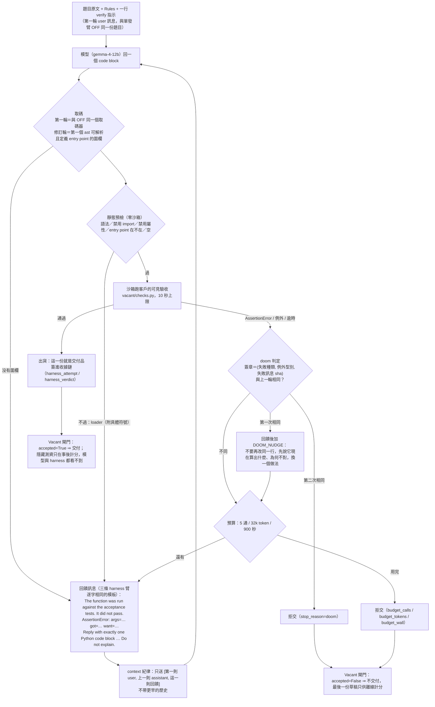

# H-MIX 架構圖：它是怎麼在同樣的 token 下多交付 13 個百分點的

（2026-09-11，Fable 依 `ops/gain/harness_arms.py` 原始碼與 `DECISION_20260911_R460_FABLE_AUDIT_HARNESS.md` 整理。
數字全部來自 R460（LCB v2 120 題、gemma-4-12b-it-qat、六臂交錯、五通等預算）。）

## 一、一句話

**H-MIX 不是更聰明的 prompt，是一個「把執行結果當成下一則輸入」的迴圈**：模型寫一份函式 → harness 先做零成本的靜態檢查 →
在沙箱跑**客戶自己的可見驗收測資** → 沒過就把失敗原文（哪個輸入、算出什麼、該是什麼）貼回去要它改 → 通過就出貨，
五通用完或原地打轉就拒交。Vacant 的閘門與收據站在這個迴圈外面：出貨的每一份都通過了驗收，拒交的每一題都有收據。

## 二、流程圖



## 三、六個零件，各自從哪來、各自值多少

| 零件 | 做什麼 | 來源 | R460 量到的證據 |
|---|---|---|---|
| **執行回饋迴圈** | 可見驗收失敗的原文貼回去（`args=… got=… want=…`），狀態寫在第一個 token | pi：失敗是一則輸入不是結局；bash 的 stdout+stderr 合流、exit 狀態明寫 | **增益幾乎全在這裡**：Δ(最終 − 第一輪)＝+19.17pp，迴圈救回 21 題；第一輪可見通過 74.2%，其餘 26% 才進迴圈 |
| **靜態預檢先行** | 語法錯／禁用 import／禁用屬性／函式名不對／空，不進沙箱就回「could not be loaded: 原因（符號）」 | OpenCode：edit 後把 LSP 診斷直接餵回；我們用 `ast`＋白名單（不加 pyflakes 是因為 runtime 只准 cryptography） | 擋下 6.1% 的輪次（P-H5 MISS，比預期多）；讓模型收到的不是「壞了」而是「哪裡壞」 |
| **一行 verify 指示** | 「Before you answer, check your function against the examples in the task by hand」 | OpenCode `meta.txt:17` 的改寫（模型沒有 execution，只能 by hand） | prompt 效果 Δ(第一輪 − OFF)＝+6.67pp；pi 式沒有這行是 −0.83pp。**小，且不是主力** |
| **doom-loop 偵測** | 同一種失敗連兩輪同樣的訊息 ⇒ 第一次加 nudge 換做法，第二次直接拒交 | OpenCode `processor.ts` 的 doom_loop（門檻 3 → 2，因為只有 5 通；`ask` → 自動，因為展場無人值守） | 3 題以 doom 拒交；是 context 紀律的對沖 |
| **context 紀律** | 每一輪只送 [第一則 user、上一則 assistant、這一則回饋]，不帶更早歷史 | OpenCode `compaction.ts` 的 **prune**（不是 compaction：prune 零呼叫） | token/題 5,677，是 pi 式全留 context 的 0.60 倍（P-H6 HIT）；也是 1003 那台 49k 視窗下只有全留 context 的臂撞到 context 超限的原因 |
| **拒交語意** | 五通內沒有一份通過可見驗收 ⇒ 不交付（與 CONFORM 逐字同義） | Vacant 既有的 CONFORM 閘門 | 拒交 5 題；拒交題最後一份「其實對」0 件（無損） |

**三條 harness 臂共用的東西**（刻意逐字相同，否則分不清增益來自「有回饋」還是「回饋寫得比較好」）：回饋模板、六種失敗區塊的寫法、
截斷規則（訊息超過 2,000 字保留前 1,000＋後 1,000、區塊 30 行上限）、`finish_reason=length` 時丟棄那一輪重發一次、
沙箱、import 白名單、10 秒逾時、出貨與拒交語意。

## 四、第一輪的 prompt（逐字）

```
Write a complete Python solution.

Reply with exactly one Python code block and nothing else:

```python
def {entry_point}(...):
    ...
```

Rules:
- Define a top-level function named `{entry_point}`. Do not rename it.
- Only these modules can be imported: bisect, cmath, collections, functools,
  heapq, itertools, math, operator, re, sys, typing.
- Do not call input(), open(), eval(), exec(), locals(), globals() or getattr().
- Return the value. Do not print it.

Before you answer, check your function against the examples in the task by
hand and fix anything that does not match.

Task:
{task}
```

修訂輪的 user 訊息就是第二節流程圖裡那個回饋模板；doom 第一次命中時在末尾加：

```
The same failure happened twice with the same input. Do not adjust the same
line again. State in one sentence what the function currently computes for
that input and why that is not what the task asks for, then write a different
approach.
```

## 五、它為什麼贏過「重抽」與「五次投票」

| 對手 | 它做什麼 | 差在哪 |
|---|---|---|
| CONFORM（重抽不回饋） | 沒過驗收就換一個人重寫一份，最多五份，第一份過的出貨 | 每一份都是**從零開始**，失敗的資訊丟掉了。H-MIX 把「哪個輸入錯、算出什麼、該是什麼」交回給同一個 worker。同樣約 5,700 token，H-MIX 多交付 13.3pp，交錯的成品 29 → 14 |
| OFF5（五次投票） | 五份各自生成，投多數 | 五份錯得**高度相關**（同模型同題），投票救不了；花 15,000 token 只到 65%。H-MIX 用 0.38 倍 token 到 84% |
| 單發 | 一份交出去 | 58%，交錯的成品 50 件。H-MIX +25.8pp |

候選池天花板：R440P 量到 17–19% 的題目五份候選全錯——**選擇規則**（重抽、投票）打不破它，因為它只能在錯的候選裡挑；
**修訂迴圈**在原理上可以，因為它改變候選本身。R460 的 84.17% 已經越過 CONFORM 所在的那個天花板區間。

## 六、它做不到、以及必須一起講的

1. **前提**：整件事建立在「需求可以被編譯成可執行的驗收測資」。需求跑不起來的場合，這個機制沒有免費的裁判，會退化成「問一個模型」。
2. **worker 看得到客戶可見測資的內容與期望值**（本 repo 第一次這樣做）；隱藏測資只計分，動態稽核逐筆核過零洩漏。
3. 假交付沒有升反而降（29 → 14），但那是 LCB v2 每題 2–4 條可見測資下的結果；可見測資更少、更鬆的場合，迴圈朝可見測資過擬合的風險更高。
4. 只在一個題庫、一顆 12B 模型、n=120 上量到；點估計是上偏的（n=120 對 +10pp 的檢定力 0.43–0.63）。
5. 全留 context 的 pi 式在小視窗會撞 context 上限；H-MIX 的 prune 避開了這個，代價是模型看不到前兩輪試過什麼——doom 偵測是對沖，不是解。
6. 外部證據不支持「harness 才是關鍵」的一般性質（同模型四個 harness 全距 2.7pp）；本 run 的動機掛在自家的候選池天花板證據上。

## 七、接進 Vacant 的位置

`ops/gain/gain_run.py` 把 H-MIX 當一條臂（`HMIX`）與 OFF／CONFORM／OFF5 交錯在同一個 run；每一輪的嘗試與最終裁決簽進與 CONFORM 同一條 hash-chain
（`harness_attempt`／`harness_verdict`），出貨規則沿用 CONFORM 的 `accepted`。Vacant 的多方執行層（peerexec）不在這條 run 裡，但它接在同一個位置：
出貨那一份可以交給 k 把金鑰各自再跑一次驗收、各自簽名——H-MIX 決定「交什麼」，peerexec 決定「誰能為它作證」。

實作：`ops/gain/harness_arms.py`（`run_harness_arm`、`_context_for`、`static_precheck`、`visible_report`、`render_feedback`）；
規格與出處：`docs/HARNESS_STUDY_2026-09-07.md` §4.3；預註冊：`DECISION_20260907_R460_HARNESS_PREREG.md`；收官：`DECISION_20260911_R460_FABLE_AUDIT_HARNESS.md`。
