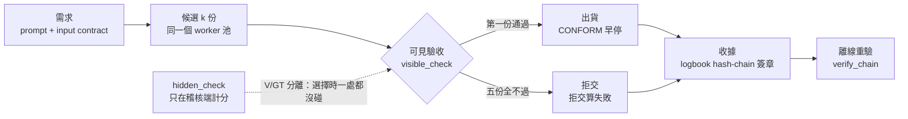
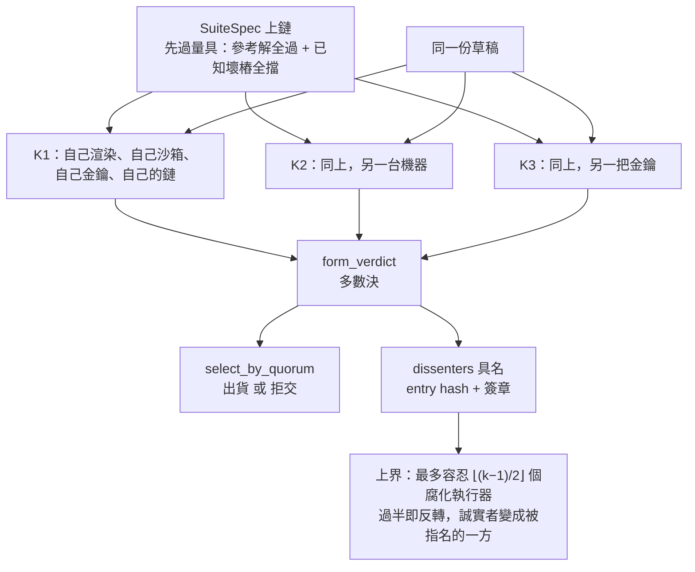

# Vacant：目前的完整架構與成效（2026-09-07 正典）

**這份文件是什麼**：把 Vacant 現在**實際有的東西**與**實際量到的數字**收在一頁，
供人類閱讀，並作為官網／展場文案取數字的唯一入口。

**紀律**：每一個數字後面都帶
（來源：`檔案`§節 或 json 路徑）。**沒有落盤來源的數字一律寫「未量測」**，
不寫估計、不寫「大約」。被推翻的說法**留在文件裡並標示更正後版本**，不悄悄刪掉
（同 `examples/verdicts.py` 模組 docstring 的理由：索引若比網頁樂觀，就是主動誤導）。

**版本**：branch `feat/v2-four-stages`、HEAD `3f85ed5`（撰寫時 `git status` 乾淨）。
本文件零模型呼叫、零遠端連線，只讀已落盤的檔案。

**修訂**：round456b（2026-09-07，修訂前 HEAD `74a54f8`）——依 R440P／R440Z／R445／R446／
R452–R455 原文補上 §1.1 的強制前提句、§3.1 的候選池天花板、r447 與 E3 的樣本重疊、
展件格「不是挑的」聲明、`same_choice` 的語意更正，並修正一批指向錯誤的來源標記
（`SPEC_GAIN.md`§5.3 不存在、`RECORD_SPEC` infra_void 在§5、`gain_run.py` 硬擋行號、
0/895 與 0/735 在 R440P§二、0/455 在 R440T§八）。修訂處都保留原數字，只補限定與出處。

---

## 一、一句話定位、交付物、口徑紅線

### 1.1 一句話

> Vacant 是一層**可究責層**：它讓「誰做了什麼、誰檢查過、檢查結果是什麼」變成
> 一筆事後改不掉、任何人都能離線重驗的簽章紀錄，好讓你對一個 agent 的**依賴有根據**。

**強制前提（逐字，任何對外宣稱都必須帶著它一起講）**：

> 整件事建立在『需求可以被編譯成可執行的驗收測資』。……需求跑不起來的場合，這個機制沒有免費的裁判，會退化成『問一個模型』，而那正是量出來很差的東西。

R440P §五-1 同時寫死了它的適用範圍：**展場與任何對外宣稱都必須帶這一句**。
這句話不是註腳，是本文件第三節每一個數字的成立條件——第三節 3.1 量到的全部交付成效，
都發生在「需求已經被編譯成可執行驗收測資」的題庫上（MBPP+／LCB）。
（來源：`DECISION_20260903_R440P_CONFORMANCE_GATE.md`§五-1 逐字，`……` 處略去題庫附帶
說明「MBPP+ 有 3 條 base assert 可跑；」；同一條誠實邊界複述於
`ops/gain/gain_run.py::arm_conform` docstring 誠實邊界第 1 條、
`vacant/peerexec.py` docstring 誠實邊界 1「這條是 R440P §五-1 的原句，搬到這裡一樣有效」）

它不宣稱讓 agent 變聰明，也不宣稱擋住壞人。目前量到的價值集中在一句可操作的話：
**用執行取代意見、用收據取代投票**——跑客戶自己的驗收測資、交第一份通過的、
全不通過就拒交，並把每一次嘗試簽進 hash-chain。

### 1.2 交付物

**畢業專題＝實體場地展覽。不產出論文，也不投稿。**
（來源：`CLAUDE.md`§唯一交付物：畢業專題 ＝ 實體場地展覽，L12–14）

由此推出的四條硬約束，每一條都改變技術決策：

| # | 約束 | 後果 | 來源 |
|---|---|---|---|
| 1 | 秒級互動 | 真模型每題實測約 114 秒，現場等不起 ⇒ 展件跑機制模擬或預跑重放，**畫面必須明講「這是機制模擬」** | `CLAUDE.md`§唯一交付物 第 1 條（L24–26） |
| 2 | 離線可跑、可無人值守 | 不假設網路、不假設有解說員；依賴外部端點者要有 fallback | 同上 第 2 條（L27–28） |
| 3 | 先行研究仍重要，但理由是**不能對觀眾說錯話** | 例：脈衝攻擊 2005 年就有名字（Srivatsa） | 同上 第 3 條（L29–30） |
| 4 | 統計檢定力**不必**到發表標準 | E10 的 p=0.332 對展覽不是問題；反事實對照比 p 值重要 | 同上 第 4 條（L31–32） |

### 1.3 口徑紅線（措辭層級的鐵律）

1. **用「可究責性／讓依賴有根據」，不要用「信任」。** 經典定義（Gambetta 1988、
   Mayer 1995）把「不依賴監督」寫進信任的必要條件，而監督正是本系統的全部；
   觀眾比口委更容易被誤導，所以展場措辭要求**更嚴格**不是更寬鬆。
   （來源：`CLAUDE.md`§唯一交付物 第 5 條，L33–35）
2. **不用「防止」「保證」。** 程式碼裡的誠實邊界句（raises-cost 非 prevents、
   detects 非 prevents）是規格的一部分，改碼不得刪。
   （來源：`CLAUDE.md`§慣例 第 3 點；`docs/RECORD_SPEC.md`§4）
3. **demo 只能說「看得到提升」；「證明提升」保留給預註冊 batch run。**
   （來源：`CLAUDE.md`§鐵律 5）
4. **模擬就標模擬。** 把模擬講成證明是鐵律 5 的展場版本。
   （來源：`CLAUDE.md`§唯一交付物 第 1 條）

---

## 二、架構全圖

### 2.1 分層與承重

#### L0 — 密碼學與序列化（一切簽章的地基）

| 模組 | 承重什麼 | 來源 |
|---|---|---|
| `vacant/canonical.py` | 跨機驗章一致的**唯一**序列化規則（sort_keys、緊湊分隔、UTF-8 不轉義）；簽章覆蓋的永遠是 canonical bytes，不是 Python dict | `vacant/canonical.py` module docstring |
| `vacant/identity.py` | Ed25519 keypair ＋ `vacant_id`；私鑰放閘道、0o600、**agent 推理看不到身分** | `vacant/identity.py` docstring |
| `vacant/crypto.py` | Ed25519 簽／驗的底層 | 同上 import |

#### L1 — 帳：簽章鏈與存檔點

| 模組 | 承重什麼 | 來源 |
|---|---|---|
| `vacant/logbook.py` | append-only hash-chain：`seq` 真單調、`prev_hash` 串接、簽章覆蓋全欄位；`stream_id`＝創世事件 hash。**任何中間竄改都驗不過（tamper-evident）**，且持公鑰者都能 `verify_chain` | `vacant/logbook.py` docstring |
| `vacant/envelope.py` | 每筆 A2A 訊息的簽章信封＋`ReviewEnvelope`（簽章 review）；body 是黑箱，閘道只簽／驗／記 | `vacant/envelope.py` docstring |
| `vacant/checkpoint.py` | V1 存檔點認證＋回溯稽核：結算不只發生在交付瞬間，而是**沿鏈累積**（docstring 原文用「信任」二字，此處照口徑紅線改寫）；存檔點**自身成鏈**，「記憶沒了，帳還在」 | `vacant/checkpoint.py` docstring |
| `vacant/attest.py`／`vacant/receipt.py`／`vacant/trustcard.py` | 可攜的通過憑證與委派收據：讓「已驗證」離開 vacant 仍可被獨立核對（key custody 假設下是 prevents，私鑰外洩即退化為 detects） | `vacant/attest.py`、`vacant/receipt.py` docstring |

#### L2 — 可究責層（Phase-1 本體）

| 模組 | 承重什麼 | 來源 |
|---|---|---|
| `vacant/registry.py` | 發現＋信譽索引；**不是中央路由器**（查到後點對點直連）。`record_review` 只收驗簽＋head 新鮮＋去重；reviewer weight 內生；同源非線性降權（raises-cost，非 prevents） | `vacant/registry.py` docstring |
| `vacant/reputation.py` | 五維 Beta 信譽，key＝(stream_id, branch_id, substrate[, family])——**credit 跟著記憶走，不跟身體走**；牙齒：decay 半衰期 200 事件、slash 乘法扣減 | `vacant/reputation.py` docstring |
| `vacant/router.py` | trust on/off 單開關：on＝UCB 信譽路由、off＝確定性隨機。這就是「掛勾」的產品化表示 | `vacant/router.py` docstring |
| `vacant/auditor.py` | 確定性再驗：在 `checks.py` 沙箱重跑客觀 check（環境真值，不是「再問一次 LLM」）；抽樣確定性（sha256(seed:task_id)），同 seed 完全可重放 | `vacant/auditor.py` docstring |
| `vacant/memory.py` | MemoryStream（episode 上鏈）＋MemoryManager **M0／M1／M2**：M0 無記憶、M1 最近 k 筆原文、M2 只有被稽核／被審確認過的 episode 才蒸餾成教訓。KS-1／A4 是**可執行防呆**（`assert_ks1_clean`、`lesson_leaks_test_data`） | `vacant/memory.py` docstring |
| `vacant/dashboard.py` | 觀測台＋`/api/roster`／`/api/scoreboard`／`/api/snapshot`。**面板不是信任來源**：面板與 ledger 不符時以 ledger 為準 | `vacant/dashboard.py` docstring |

#### L3 — 題庫、V/GT 分離與量具

| 模組 | 承重什麼 | 來源 |
|---|---|---|
| `vacant/codebench.py` | 自帶客觀 verifier 的題庫；`EvalPlusMBPPLoader`（MBPP+ v0.2.0，sha256 釘死、fail-closed）＋`LiveCodeBenchLoader`（v1／v2 120 題／v3 189 題，明表映射） | `vacant/codebench.py` docstring；`ops/gain/gain_run.py::load_tasks` |
| V/GT 分離 | **需求**＝prompt＋input contract＋`hidden_check`；**選擇時只准碰 `visible_check`**。這個分離是整件事的要害：agent 可以通過看得到的測試卻不滿足真需求 | `SPEC_GAIN.md`§二 |
| 題庫固定子集 | MBPP+ 378 題中 7 題連 canonical 都跑不完 10 秒／128 MiB 沙箱 ⇒ 固定排除，餘 **371 題** | `SPEC_GAIN.md`§二；`ops/gain/gain_run.py::GAIN_EVALPLUS_RESOURCE_EXCLUSIONS` |
| `vacant/suitegauge.py` | 套件量具的**純函式核心**：參考解要過 ∧ 每個已知壞樁都要被擋 ∧ `n_broken ≥ 1`。`probe_instrument` 與 `peerexec.commit_suite` 共用同一份判準（兩份實作＝兩條會漂移的判準） | `vacant/suitegauge.py` docstring |
| `vacant/suitespec.py` | **驗收套件是資料不是程式**：`SuiteSpec = {v, dialect, entry_point, tests:[{args, expected}], cmp}`，執行器只跑**自己的**渲染器產生的碼 | `vacant/suitespec.py` docstring |

#### L4 — 實驗與裁決基建

| 模組 | 承重什麼 | 來源 |
|---|---|---|
| `ops/gain/gain_run.py` | G 實驗 runner，五條臂（下節）＋量具驗證＋全 I/O 落盤（`calls.jsonl`／`rows.jsonl`／`summary.json`） | `ops/gain/gain_run.py` docstring |
| `vacant/peerexec.py` | 「互跑不互審」的去中心化執行證言層 | `vacant/peerexec.py` docstring |
| `vacant/record.py`＋`docs/RECORD_SPEC.md` | 一次 run 的最小證據包：`pack`／`check`。缺必要項＝記錄層 `infra_void`，不得進統計 | `docs/RECORD_SPEC.md`§2（必要項 vs 可缺項）、**§5（infra_void／retry×4／parse_void 規律）** |
| `vacant/research.py` | McNemar＋bootstrap＋預註冊四函式（holm_bonferroni／tost_equiv_boot／wilcoxon_signed_rank_exact／mcnemar_power） | `CLAUDE.md`§程式碼地圖 |
| `vacant/blayer.py`／`vacant/batch.py` | B 層六情境驗收（判準寫死）／RunLedger 斷點續跑＋Watchdog | `CLAUDE.md`§程式碼地圖 |

#### L5 — 展件與對外發布

| 模組 | 承重什麼 | 來源 |
|---|---|---|
| `vacant/entrycost.py` | 入場成本的**機制模擬**：路由走真 `Registry.route`、稽核走真 `Auditor`、扣分走真 `Reputation.slash`，模擬的只有「交付好壞」這一件事。現場的雙世界對照跑這個，不跑真模型 | `vacant/entrycost.py` docstring；`CLAUDE.md`§展件可直接複用的 |
| `examples/receipt_viewer.html` | 展件「收據牆」（單機 r445 那條鏈），離線單檔 | `tests/test_receipt_viewer.py` L1–L33；`DECISION_20260906_R455_FABLE_AUDIT_VIEWER.md`§一 |
| `examples/receipt_viewer_multiparty.html` | 展件「三把金鑰的收據」：內嵌 r454 真跑的三條完整鏈（1840／1840／1899＝5,579 筆），瀏覽器內從創世驗到鏈頭、逐格重算裁決／指名／出貨，並示範三種竄改。零外部資源、`file://` 直開。**展件格＝`Mbpp/100` 第 0 份，是排序後第一個說謊格，不是挑的** | `CLAUDE.md`§展件可直接複用的（L98–105）；`DECISION_20260906_R455_FABLE_AUDIT_VIEWER.md`§一；`DECISION_20260906_R454_FABLE_AUDIT_NAMED_DISSENT.md`§三-4 |
| `examples/e10_mediator.py` | 重算 E10 那兩行路由序列（零機時，只讀已歸檔 JSONL） | `CLAUDE.md`§展件可直接複用的（L97） |
| `examples/publish_now.py`／`publish_archive.py`／`verdicts.py` | 對外三類資料（站得住／還不確定／自己搞錯的）；**裁決的單一真相來源在 `verdicts.py`** | `examples/verdicts.py` docstring |

### 2.2 gain_run 的五條臂與 CONFORM 的閘門規則

| 臂 | 做法 | 呼叫／題 | 來源 |
|---|---|---|---|
| **OFF** | 隨機路由，交回來就收 | 1 | `ops/gain/gain_run.py` docstring |
| **ON** | 信譽路由（UCB）＋K=3 同儕評審＋一次修訂＋抽樣稽核 | ≈5 | `ops/gain/gain_run.py::arm_on` docstring |
| **OFF5** | 同題跑 5 次取多數決（self-consistency）；票以**行為簽名**分桶（同義寫法不拆票） | 5 | `ops/gain/gain_run.py::arm_off5` docstring |
| **CONFORM** | **驗收閘門**：逐一跑 `visible_check`，第一份通過就出貨並**早停**，全不通過就**拒交** | 實測 1.51（MBPP+）／1.71（LCB v2）／1.55（LCB v3） | `arm_conform` docstring；`CONCLUSION_20260904_R445_CONFORM_SETTLEMENT.md`§三；`DECISION_20260905_R440Z_WRAPUP_LCB2.md`§一；`DECISION_20260906_R461_FABLE_AUDIT.md`§一 |
| **EQ5** | **等預算臂**：一次生成 5 份候選（不早停 ⇒ calls/task 恆為 5.00），把**同一組候選**餵給兩條選擇規則（閘門 vs 多數決） | 5.00 | `ops/gain/gain_run.py::arm_eq5` docstring |

（另有 `ONR`＝把 ON 的路由段單獨成臂，僅 1 呼叫，用於隔離「挑誰來做」這一個因子。
來源：`ops/gain/gain_run.py::arm_onr` docstring；`KNOWN_ARMS` 在 `gain_run.py:1271`。）

**為什麼一定要有 OFF5**：ON 比 OFF 好幾乎必然，因為多花五倍呼叫。
拿 1 次對 5 次去宣稱「機制有效」是拿成本冒充機制。
（來源：`SPEC_GAIN.md`§三；`ops/gain/gain_run.py` docstring）

**CONFORM／EQ5 的閘門規則（逐字語意）**：

1. 只用 `visible_check` 決定去留——碰 `hidden_check` 就是 V/GT 分離破功
   （**V/GT 分離的定義在 `SPEC_GAIN.md`§二**；程式碼註解沿用舊編號寫「SPEC §5.3」
   ——`gain_run.py:581`／`:649`、`vacant/peerexec.py:124`——但現行 `SPEC_GAIN.md` 只有§一–§七，
   **沒有 §5.3 這一節**，引用時一律指§二）；
2. 第一份通過的出貨（CONFORM 早停；EQ5 不早停但選擇語意逐字相同）；
3. 全不通過＝拒交，**拒交算失敗**（分母是全部題目）；
4. 每一次嘗試都簽進 hash-chain，`receipt_head` 是鏈頭 hash。
   （來源：`ops/gain/gain_run.py::arm_conform`／`arm_eq5` docstring；
   `CONCLUSION_20260904_R445_CONFORM_SETTLEMENT.md`§二 deliv 口徑）

**決策量具的硬擋**：`visible_check` 對 OFF／ON／OFF5 只是落盤欄位，但對 CONFORM／EQ5 是
**出貨閘門**，所以跑之前要在同一批題目上用同一組正／反樣本驗一次——
「閘門根本沒有閘」會長得跟「機制很便宜」一模一樣。
（來源：`ops/gain/gain_run.py::probe_instrument` docstring；硬擋在
`gain_run.py:1330–1331`（兩方向量具，全臂適用）與 `gain_run.py:1341–1352`
（CONFORM／EQ5 的決策量具：覆蓋率不足即停、兩方向沒都答對即停））

### 2.3 流程圖一：需求 → 候選 → 可見驗收 → 出貨／拒交 → 收據

### 2.4 流程圖二：k 把金鑰各自跑、各自簽 → 合票 → 指名

**機制只有三件事，沒有第四件**：`Executor.attest`（各自跑、各自簽進自己的鏈）、
`form_verdict`（取多數，並回傳**少數方是誰**）、`select_by_quorum`（CONFORM 的選擇
語意不變，只是「通過」改由法定人數決定）。
（來源：`vacant/peerexec.py` docstring 機制段）

**為什麼是「互跑」不是「互審」**：驗收測資是確定性的程式，誠實執行器**必須**得到
同一個結果 ⇒ **意見分歧沒有資訊，執行分歧有資訊**；而執行分歧只有兩種可能——
有人沒真的跑，或有人簽了跟自己跑出來不一樣的東西，兩者都是可歸屬的過錯。
（來源：`vacant/peerexec.py` docstring；`DECISION_20260905_R449_PEEREXEC_ARCHITECTURE_AUDIT.md`§一）

---

## 三、成效

分三級：**站得住**（事前判準通過）／**同號未解析**（方向一致但區間沒排除 0）／
**被推翻或說太滿**（照更正後版本講）。

⚠ **「站得住」這一級有一個例外要先聲明**：3.1-E 的 peerexec 結果（R449 §三 那三張表）
**是模擬掃描，不是事前判準通過**——R449 那一輪沒有預註冊窗口，數字來自 r446／r443 已歸檔
候選上的參數掃描（腐化比例 0–70%、五種攻擊、k∈{1,3,5,7}）。真跑側（R453／R454）才有
事前寫死的預測窗，那兩張表逐條標了 HIT。引用 3.1-E 時要分清哪一半是模擬、哪一半是真跑。
（來源：`DECISION_20260905_R449_PEEREXEC_ARCHITECTURE_AUDIT.md`§三 標題；
`DECISION_20260906_R453_...`§二；`DECISION_20260906_R454_...`§二）

### 3.1 站得住

**先讀天花板：綁定約束不是選擇器，是候選池。** 以下每一條 CONFORM／EQ5 的成效
都在這個上限之下，引用任何一個 headline 數字時要一起講：

| 重放批次 | 池子上限（≥1 個候選正確） | 五個候選全錯 |
|---|---|---|
| `g_r441_gemma_only_mbpp_b`（gemma-12b、179 題） | **82.68%** | **31 題** |
| `g_r356_3arm_20260830`（qwen35b＋gemma12b 混池、147 題） | **85.03%** | **22 題** |

> 綁定約束不是選擇器，是候選池。17–19% 的題目五個候選全錯，任何選擇機制都救不了。
> 這是任何「選得更聰明」路線的天花板，也解釋了為什麼加預算沒用：worker 的錯誤高度相關。

R440P 另把這個上限當成否決「更聰明的選擇器」路線的理由（tie-break 規則、fuzz 一致性、
專長路由：fuzz 只加 +0.33pp／+0.20pp，「最長程式碼」在 r441 有效 +3.91pp、在 r356
消失 +0.68pp ⇒ 過擬合，已記為負向對照）。
（來源：`DECISION_20260903_R440P_CONFORMANCE_GATE.md`§二 表「池子上限」列與「三句話讀懂」
第 3 點逐字；否決理由在同檔§四「放棄的選項與理由」第 2 點）

#### A. 早停閘門 vs 單抽（CONFORM vs OFF）

| 題庫／run | 閘門 | 單抽 OFF | 配對差 | p | 呼叫／題 | 來源 |
|---|---|---|---|---|---|---|
| MBPP+ 371（r444+r445 併庫，配對） | 邊際見下註 | 邊際見下註 | **+4.58pp**，CI [+0.57, +8.04] | 未列（區間不含 0） | 1.51 vs 1.00 | `CONCLUSION_20260904_R445_CONFORM_SETTLEMENT.md`§一 |
| **LCB v2 120（r447）** | 84/120＝70.0%（失敗率 30.0%） | 61/120（失敗率 **49.2%**） | **+19.17pp**，CI [+10.0, +28.3] | **0.0003**（b=31／c=8） | 1.71 vs 1.00 | `DECISION_20260905_R440Z_WRAPUP_LCB2.md`§一 |
| **LCB v3 189（r461）** | 152/189（失敗率 19.6%） | 137/189（失敗率 27.5%） | **+7.94pp**，CI [+2.12, +14.29] | **0.0167**（b=25／c=10） | 1.55 vs 1.00 | `DECISION_20260906_R461_FABLE_AUDIT.md`§一 |

**MBPP+ 那一列的邊際數字要分開講**：`R445`§三 的成本表列 OFF deliv **70.31%**
（失敗率 29.69%）、CONFORM deliv **76.04%**、拒交率 **8.33%**、每正確交付呼叫數
1.42 vs 1.99；而 +4.58pp 是**併庫 371 題的配對差**（§一）。兩者分母不同，
**不可相減、不可混用**。（來源：`CONCLUSION_20260904_R445_CONFORM_SETTLEMENT.md`§一、§三）

**能講**（逐字，末句不得截掉）：

> 在 120 題 LeetCode 中高難度題上，「跑客戶自己的驗收再換人」比單抽多交付 19 個百分點
>（p=0.0003），平均只多花 0.71 通呼叫；拒交的 7 題事後檢查五份草稿全部是錯的。

（來源：`DECISION_20260905_R440Z_WRAPUP_LCB2.md`§三「能講」逐字。先前版本漏掉分號後那半句，
而那半句正是「拒交沒有殺掉好答案」的證據，屬本文件 3.1-D 的同一件事。）

⚠ **r447 與 E3／r443 不是獨立樣本**：R440Z §五 逐字記「與 E3 共用 91 題，非獨立樣本」。
所以引用 **+19.17pp** 時，不可把它與 E3 的 LCB v1 重放（+20.88pp、b=19 c=0）當成兩次
獨立複製；LCB v2 的 120 題裡有 91 題就是 E3 那批。
（來源：`DECISION_20260905_R440Z_WRAPUP_LCB2.md`§五；`DECISION_20260904_R440T_E3_WRAPUP.md`§八）

**R445 的事前預測記分要一起報**：P-E1..P-E8 為 **7 HIT／1 MISS**（ABORT／NOT_EVALUATED／
BROKEN 皆 0）。MISS 的是 **P-E2**——併庫 CI 半寬 **3.29pp** 大於事前預測的 3.0pp，
原因是 r445 的 discordant 密度 14.06% 高於 r444 的 7.26%，外推假設不成立。
另 P-R687-6 擦邊照記：disc_rate 0.1406、上緣 0.145，再多 1 個 discordant 對就會令投影作廢。
（來源：`CONCLUSION_20260904_R445_CONFORM_SETTLEMENT.md`§四）

⚠ 區間口徑差異：同一批資料的 CONFORM−OFF，`R445` 收官報 [+0.57, +8.04]、
`R440Z`§四 的獨立重算報 [+0.81, +8.36]；點估計相同（+4.58pp），區間因方法不同略異，
引用時必須說明用的是哪一份。（來源：兩檔對照）

#### B. 閘門規則 vs 多數決，**同一組候選、同樣 5 通呼叫**（EQ5）

| run／題庫 | 閘門 | 多數決 | b／c | Δ（95% 區間） | p | 來源 |
|---|---|---|---|---|---|---|
| r446 MBPP+ 371 | 280/371＝75.47% | 265/371＝71.43% | 24／9 | **+4.04pp** [+0.796, +6.529]（精確條件區間） | **0.0135** | `CONCLUSION_20260904_R446_EQUAL_BUDGET.md`§一、§二 |
| r448 MBPP+ 371（新 seed） | 286/371＝77.09% | 273/371＝73.58% | 21／8 | **+3.50pp** [+0.81, +6.47] | **0.0241** | `DECISION_20260906_R448_FABLE_AUDIT_REPLICATED.md`§一 |
| **r449b LCB v2 120（難題）** | 85/120＝70.83% | 75/120＝62.50% | 15／5 | **+8.33pp** [+0.30, +13.78] | **0.0414** | `DECISION_20260906_R449B_FABLE_AUDIT_REPLICATED_ON_HARD.md`§二 |
| r449c LCB v3 189 | 157/189＝83.07% | 149/189＝78.84% | 13／5 | **+4.23pp** [−0.66, +7.68] | 0.0963 | `DECISION_20260907_R449C_FABLE_AUDIT_UNRESOLVED.md`§二（**UNRESOLVED**，見 3.2） |

**現在准講的範圍（逐字）**：「閘門規則贏多數決——MBPP+（兩個 seed）與 LCB v2 上顯著；
LCB v3 上同號（+4.23pp）但未解析。」
（來源：`DECISION_20260907_R449C_FABLE_AUDIT_UNRESOLVED.md`§三）

**四次 b 都大於 c（合計 73／27）**，但**不准併成 n=1051 做檢定**（預註冊禁令 2）。
（來源：同上§三）

跨 seed 的逐題四格顯示：r446→r448 兩個 seed 裡「閘門贏」的題目只有 **6 題重疊**——
效應不是集中在少數幾題，是規則對整個分佈的性質。
（來源：`DECISION_20260906_R448_FABLE_AUDIT_REPLICATED.md`§三）

**`same_choice`（兩條規則選到同一份的比率）四個 run 都要照實列，而且要帶語意更正**：

| run | `same_choice_effective` | 事前窗 | 裁決 |
|---|---|---|---|
| r446 MBPP+ 371 | **20.49%**（raw 22.91%、`false_same_choice_n`=9） | [40, 95]% | **MISS** |
| r448 MBPP+ 371 | **21.0%** | [10, 40]% | HIT |
| r449b LCB v2 120 | **22.5%**（raw 25.0、false 3） | [5, 35]% | HIT |
| r449c LCB v3 189 | **24.34%**（raw 24.87、false 1） | [10, 40]% | HIT |

r446 的 **P-R446-5 是 MISS，要照實記，而且要記它偏的方向對我方有利**：窗口下界 40%
是無先例的寬窗猜測，實測低出下界近 20pp，而低同選率讓這個比較**更有對比**。
所以不准把它讀成「預測大致成立」——事前的先驗錯了。這與 3.2 列的 **r449c 主判準 P-2
（`paired.ci95_lo_pp` > 0，實測 −0.66）MISS** 同樣處理：MISS 就寫 MISS，不追認、不補判準。
（來源：`CONCLUSION_20260904_R446_EQUAL_BUDGET.md`§三；
`DECISION_20260907_R449C_FABLE_AUDIT_UNRESOLVED.md`§二）

⚠ **語意更正（R446 §四，事後描述性、不改任何判定）**：兩條規則選到**不同 sha** 的有
**286／371** 格，其中 **253 格（88.5%）結果仍然相同** ⇒ `same_choice` 量的是
**產物是否同一份碼**，不是**結果是否等價**；兩份都對但字面不同的候選會被記成「不同選擇」。
這就是同選率只有 20% 卻仍只有 33 格 discordant 的原因，兩者不矛盾。後續若還要用
「幾乎總是選到同一份 ⇒ 沒有對比」當推翻條件，**應該改綁 discordant 率**，不是 sha 同一性。
（來源：`CONCLUSION_20260904_R446_EQUAL_BUDGET.md`§四）

#### C. 委員會 ON 在等預算下**不贏** OFF5；OFF5 買到什麼要分題庫講

| 問題 | 答案 | 證據 | 來源 |
|---|---|---|---|
| ON 等預算贏 OFF5？ | **不能**（3 個 run） | 完整配對 p=0.45；難題子集 ON=OFF5=28.57%（p=1.0） | `examples/verdicts.py` · `gain.equal_budget_on_beats_off5`（refuted）；`DECISION_20260906_R448_FABLE_AUDIT_REPLICATED.md`§五 |
| 是不是 worker 太強？ | 不是 | 換 12b 單模型後 OFF 失敗率升到 **31.8%**，ON vs OFF5 仍 **p=1.0** | `examples/verdicts.py` · `gain.ceiling_hypothesis`（refuted） |
| 是不是題目太簡單？ | 不是 | LCB 難題把 OFF 失敗率推到 **48.4%**，ON vs OFF5 仍 **p=0.4244** | `examples/verdicts.py` · `gain.hard_bench_hypothesis`（refuted） |
| 五倍預算的 self-consistency（OFF5 vs OFF）在 MBPP+ 買到什麼？ | **買不到** | +0.81pp、CI [−2.78, +4.28] ⇒ 落 `RULED_OUT` 格＝**排除了 ≥5pp 的實務增益** | `CONCLUSION_20260904_R445_CONFORM_SETTLEMENT.md`§一、§三 |
| 同上，難題上呢？ | **有用** | LCB v2 +12.50pp（b=22／c=7、p=0.0081）；LCB v3 +6.35pp（b=22／c=10、p=0.0501） | `DECISION_20260905_R440Z_WRAPUP_LCB2.md`§一；`DECISION_20260906_R461_FABLE_AUDIT.md`§一 |

**因此「加預算沒用」那句必須收窄成**：在 MBPP+ 上加預算沒用；難題上有用，
但**改花法更有用**（+19.2pp @1.71 通 vs +12.5pp @5 通）。
（來源：`DECISION_20260905_R440Z_WRAPUP_LCB2.md`§三 第三點逐字）

#### D. 無損性與拒交

**無損性**＝「hidden 過但 visible 沒過」（可見篩選誤丟正解）的違反數：

| 資料集 | 違反 | 來源 |
|---|---|---|
| MBPP+（第一批重放，`g_r441`，179 題×5） | 0／895 | `DECISION_20260903_R440P_CONFORMANCE_GATE.md`§二 |
| MBPP+（第二批重放，`g_r356`，147 題×5） | 0／735 | 同上§二 |
| MBPP+ 三個 run 合計 | 0／1630 | `DECISION_20260906_R461_FABLE_AUDIT.md`§二-3 |
| LCB v1 重放（E3／r443，91 題×5） | 0／455 | `DECISION_20260904_R440T_E3_WRAPUP.md`§八 |
| LCB v2 真跑（r447，120 題） | 0／120 | `DECISION_20260905_R440Z_WRAPUP_LCB2.md`§二 P-Z6 |
| LCB v3 真跑（r461，189 題） | 0／189 | `DECISION_20260906_R461_FABLE_AUDIT.md`§一 |
| **累計** | **六個資料集零違反** | `DECISION_20260906_R461_FABLE_AUDIT.md`§二-3 |

⚠ **這六個資料集不是六個獨立樣本**：LCB v1 重放（E3／r443 的 91 題）與 LCB v2 真跑
（r447 的 120 題）**共用 91 題**——R440Z §五 逐字：「與 E3 共用 91 題，非獨立樣本」。
講「六個資料集零違反」時要一起講這個重疊，不可讀成六次獨立複製。
（來源：`DECISION_20260905_R440Z_WRAPUP_LCB2.md`§五）

**拒交題事後檢查「五份全錯」**：

| run／題庫 | 拒交題數 | 五份全錯 | 來源 |
|---|---|---|---|
| r447 LCB v2 | 7（5.8%） | **7／7** | `DECISION_20260905_R440Z_WRAPUP_LCB2.md`§二 P-Z5 |
| r449b LCB v2 | 8（6.67%） | **8／8**（逐份重放 40 份候選） | `DECISION_20260906_R449B_FABLE_AUDIT_REPLICATED_ON_HARD.md`§四-3 |
| r449c LCB v3 | 10（5.29%） | **10／10**（重放 50 份候選） | `DECISION_20260907_R449C_FABLE_AUDIT_UNRESOLVED.md`§四 |
| r461 LCB v3 | 15 | **15／15** | `DECISION_20260906_R461_FABLE_AUDIT.md`§一 |
| r446 MBPP+ | 26（7.01%） | 未以此口徑量；量到的是**多數決在那 26 格交付成功 0 格** | `CONCLUSION_20260904_R446_EQUAL_BUDGET.md`§二、§四 |
| r448 MBPP+ | 23（6.2%） | 未量測 | `DECISION_20260906_R448_FABLE_AUDIT_REPLICATED.md`§一 |

#### E. peerexec：「互跑不互審」買到什麼、買不到什麼

**校準（k=1、無腐化）**：371/371 的閘門決定與 r446 真跑**逐位相同**
（1855/1855 可見標籤、345/345 交付 sha、26/26 拒交）。分數差 1（279 vs 280）是
這台 Mac 的 libm 對 `l**2` 與 `l*l` 差 1 ULP、而 MBPP+ 隱藏測資用 `atol=0` 比對——
**計分端的可攜性問題，不是機制**。
（來源：`DECISION_20260905_R449_PEEREXEC_ARCHITECTURE_AUDIT.md`§二）

**它買到的三件事（模擬掃描；r446 371 題×5 候選、r443 91 題×5；k∈{1,3,5,7}）**：

| # | 結果 | 來源 |
|---|---|---|
| 1 | **多數門檻以下**（腐化數 ≤ ⌊(k−1)/2⌋）：交付準確率與無腐化基線**逐位相同**（100 格），說謊者 **100% 被指名**、誠實者 **0% 被誣告**，四種吵鬧型攻擊全部如此 | `DECISION_20260905_R449_...`§三 |
| 2 | **單點容忍**：1 個腐化執行器在 k=1 致命（−7.8pp、偵測 0），在 k=3 完全無害（偵測 1.000） | 同上 |
| 3 | **成本**：簽章＋上鏈 1.0 ms、驗簽 1.2 ms、沙箱 ~630 ms ⇒ **可歸屬性只佔整個 run 的 0.2%**；執行器天生平行 ⇒ 每題牆鐘約 0.9 秒（展場秒級成立） | 同上 |

**它買不到的三件事（全部量到，不是猜的）**：

| # | 買不到什麼 | 數字 | 來源 |
|---|---|---|---|
| 1 | **對「腐化比例」沒有抵抗力** | 固定比例下 k 從 1 到 7 交付率一字不變（串謀 67.39%、破壞 0%）；過門檻後裁決與指名一起翻轉，誣告率 0.175／0.374。**機制無法知道自己在門檻哪一邊** | `DECISION_20260905_R449_...`§三-1 |
| 2 | **抓不到有耐心的說謊者** | 只在不會被抓時說謊者：四個 k、兩個題庫偵測率全部 **0.000**；代價是它 93–95% 機會得放棄，傷害 −1.35／−2.20pp。抖動 0.5%／1% 下腐化者被指名比率仍是誠實者的 34 倍／12 倍（歸屬會退化、不會崩潰）；repo 資料另顯示 2310 個可見標籤跨機重跑 **0 個不一致** | `DECISION_20260905_R449_...`§三-2 |
| 3 | **對驗收套件本身腐化毫無防禦** | 套件換成「載得進就算過」：交付率 −6.47pp／−18.68pp，假交付 31%／49%，四個 k 的**爭議率全是 0.0%**——每一票誠實、每條鏈驗得過、指標滿格，系統在交垃圾 | `DECISION_20260905_R449_...`§三-3 |

**跨機真跑（R453，k=2）**：r446 的 368 題（可轉 SuiteSpec）×5 份已歸檔候選，
在 Mac（macOS 15.7.3 x86_64、Py 3.12.10）與 vacant-dev（Linux 6.8 x86_64、Py 3.12.3）
上各自渲染、各自沙箱、各自金鑰簽進各自的鏈：

| 預測 | 窗 | 實際 | 來源 |
|---|---|---|---|
| 跨機可見標籤一致 | ≥1831/1840 | **1840/1840**（含 first_failing_test 與三個 sha 逐格相同） | `DECISION_20260906_R453_FABLE_AUDIT_REAL_MULTIPARTY.md`§二 P-1 |
| quorum 出貨 sha ＝ r446 runtime | 340/340＋拒交 26/26 | **340/340、26/26**，量具擋 2 | 同上 P-2 |
| 誠實執行器被指名 | 0 | **0** | 同上§三-2 |
| 每台鏈驗證為真 | 2/2 | mac True、vacantdev True（負控制：換公鑰／翻一位元皆 False） | 同上 P-4 |
| 每題牆鐘中位 | ≤5 s | mac **1.07 s**、vacantdev **0.25 s** | 同上 P-5a |
| spec／render sha 跨機相同 | 368/368 | **368/368**，`render_mismatch` 0 筆 | 同上 P-6 |
| （非預註冊）與既有單執行器快取比對 | — | **3680/3680 標籤相同** | 同上§二 末行 |

判定 **REAL_MATCHES_REPLAY**：R449 §七-1 的推翻條件未觸發，「逐位相同」不是重放假象。
（來源：同上§三-1、§三-3）

**真跑指名（R454，k=3、1 把說謊）**：K3 真的跑完沙箱之後才說謊（種子決定的 274 格翻票、
另 59 格對同一格簽兩份互相矛盾的證言）：

| 預測 | 實際 | 來源 |
|---|---|---|
| 說謊格 `dissenters` 恰為 {K3} | **273／273** | `DECISION_20260906_R454_FABLE_AUDIT_NAMED_DISSENT.md`§二 P-1 |
| 誠實金鑰出現在任何指名欄 | **0**（分母 1840） | 同上 P-2 |
| 自相矛盾格：K3 兩票作廢、裁決仍正確 | **58／58** | 同上 P-3 |
| 出貨 sha 與 r446 runtime 相同 | **340／340**＋拒交 26／26＋量具擋 2 | 同上 P-4 |
| 三條鏈驗真（說謊者的鏈同樣驗得過） | **3／3**，鏈長 1840／1840／1899 | 同上 P-5 |
| K1 vs K2 跨機一致（重量） | **1840／1840** | 同上 P-6 |
| 5519 筆證言逐筆驗簽失敗 | **0** | 同上§二 |

判定 **NAMING_HOLDS**：「說謊者 100% 被指名、誠實者 0% 被誣告」從模擬證據升級為
真簽章真鏈的實測，**在「1 把腐化／k=3、恰在門檻上」這一格**成立。
（來源：同上§三-1）

**展件收據那一格（`Mbpp/100` 第 0 份）不是挑出來的**：R454 §三-4 逐字
「**這一格是排序後第一個說謊格，不是挑的**」。該格三把金鑰、三票、被指名 K3、鏈頭與
驗證結果、出貨與單機版相同；第 0 份草稿事後對答案確實是錯的——K3 的謊是想把錯的交出去，
多數把它擋下。隱藏測資只出現在「給觀眾的答案」欄並明確圍起來。
（來源：`DECISION_20260906_R454_FABLE_AUDIT_NAMED_DISSENT.md`§三-4；
`ops/gain/replay/r454/r454_exhibition_receipt.{json,txt}`）

**套件即資料（R451→R452）：一個固定點被縮小，殘餘變成兩個數字**

| 階段 | 發生什麼 | 來源 |
|---|---|---|
| R451 把量具綁進 commit | 「載得進就算過」的 trivial 套件 **371/371 在 commit 就被拒**（`gauge_failed`），沒花一次沙箱 | `DECISION_20260906_R451_FABLE_AUDIT_SUITE_GAUGE.md`§二、§三-1 |
| 但攻擊者造出 `stateful` 變體 | 量具兩方向滿分、`gauge_status="ok"`、鏈全驗得過，**交付率 −75.20pp、交付 0.00%**，假交付 24.8% ⇒ **R449 §七-2 推翻條件成立**，量具作為套件固定點的部分解**作廢** | 同上§二、§三-2、§三-3 |
| R452 把套件改成資料 | `exec` 走私從「上鏈 368/371、假交付 31.5%」變成「上鏈 **0/371**、`entry_point_mismatch` 368」；超大十六進位整數從「裸 ValueError 穿過 11/11 道門」變成 **0/11** | `DECISION_20260906_R452_FABLE_AUDIT_SUITE_AS_DATA.md`§二 |
| 無損轉換 | 真套件轉資料後，在 **1840（MBPP+）＋455（LCB）** 個候選上可見標籤逐格相同、0 個不一致；兩位攻擊者各自全量重量 **11430 格**逐格相同 | 同上§二 |
| **殘餘（唯一可表達的攻擊＝覆蓋不足），一律講兩個數字** | **可實現**（`generic_gauged`，只用供應者手上資訊）：假交付 17.93%→20.65%＝**+2.72pp**；**事後諸葛上限**（`weak_oracle`，看得到候選與隱藏標籤）：**+4.35pp** | 同上§二；`vacant/peerexec.py` docstring 誠實邊界 2 |

⚠ 舊講法「殘餘＝−8.70pp」（`weak_first`）**停用**：那個數字大半是量具把它擋掉
（上鏈 331/371 vs 完整套件 366），是機制在運作，不是攻擊上界。
（來源：`DECISION_20260906_R452_FABLE_AUDIT_SUITE_AS_DATA.md`§二；`vacant/peerexec.py` docstring）

**這三輪都 break 了 wire-format**（`ATTEST_VERSION`=2、`SUITE_COMMIT_VERSION`=2）：
round452 起證言多帶 `render_sha256`、`suite_sha256` 語意從「驗收碼的雜湊」改成
「spec 資料的雜湊」；round452b 起承諾 payload 多一個明碼 `entry_point`。舊證言會被
`verify_attestation` 以 `bad_version` 拒收，**這是刻意的**——同 CLAUDE.md 鐵律 6
（wire-format 一 break，舊資料就清掉重鑄，不做相容層）。repo 內無舊證言需遷移。
（來源：`DECISION_20260906_R452_FABLE_AUDIT_SUITE_AS_DATA.md`§四；
`vacant/peerexec.py` `ATTEST_VERSION`／`SUITE_COMMIT_VERSION` 註解；`CLAUDE.md`§鐵律 6）

**展件檢視器（R455）**：`examples/receipt_viewer_multiparty.html`（4.48 MB）內嵌
r454 三條完整的鏈，瀏覽器內純 JS SHA-256 重算 entry hash、seq／prev_hash 串接、
WebCrypto Ed25519 逐筆驗簽；裁決／指名／出貨由頁面自己重算。攻擊者做八種竄改、
**七種在頁面邏輯上變紅**；唯一全綠的是 T8（整條鏈用攻擊者自己的金鑰重鑄＋同步改內嵌收據）
——那是離線單檔檢視器的結構性界線，頁面在「沒驗什麼」第一項寫明。
`tests/test_receipt_viewer.py` **37 passed**。展場機器（Linux VM）headless Chrome
以 `file://` 實測渲染 **2.1 秒**（含全鏈驗證、5,579 筆全綠）。
（來源：`DECISION_20260906_R455_FABLE_AUDIT_VIEWER.md`§一、§二、§四、§六）

### 3.2 同號但未解析（「沒量出來」不是「沒有差異」）

| 項目 | 數字 | 判定與必講的話 | 來源 |
|---|---|---|---|
| r449c EQ5 @ LCB v3 189 題 | Δ **+4.23pp**、b/c=13/5、p=0.0963、CI **[−0.66, +7.68]** | **UNRESOLVED**（不是 NOT_REPLICATED：方向沒翻）。必報 `mde_at_n_pp=5.29`、`n80=38` 對（本 run 18 對）、`n_needed_halfwidth_5pp=189`。准講的話：**「沒量出來，不是沒有差異。」** | `DECISION_20260907_R449C_FABLE_AUDIT_UNRESOLVED.md`§二、§三 |
| CONFORM vs OFF5（獨立抽樣） | LCB v2 +6.67pp p=0.15；LCB v3 +1.59pp [−3.17, +6.35] p=0.6636 | 準確率上分不開；便宜是確定的（1.55 通拿到 OFF5 花 5 通的結果） | `DECISION_20260905_R440Z_WRAPUP_LCB2.md`§一；`DECISION_20260906_R461_FABLE_AUDIT.md`§一、§二-1 |
| CONFORM vs OFF5（MBPP+ 乾淨複製） | 新 192 題 +4.69pp、CI **[−1.11, +9.42]** | **NON_INFERIOR_BUT_UNRESOLVED**——沒測出劣化，也沒測出 ≥5pp 的增益。併庫 371 題那份（+3.77pp [+0.19, +6.78]）是**序貫加樣本**，名目 p 偏樂觀，不准當乾淨檢定 | `CONCLUSION_20260904_R445_CONFORM_SETTLEMENT.md`§二 |
| MBPP+ 的解析度已用盡 | 收官後 MDE@371 = **4.31pp**；若真實效果＝觀測值，80% power 需 **≈491 個配對任務**，題庫只有 378 題 ⇒ **不可達** | 「加大 n 就能答」這條路在 MBPP+ 上已走到底 | 同上§五 |
| E10 真模型 | n_pairs=60、ON 36／OFF 31、Δ **+8.33%**、CI **[−5.0%, +21.67%]**、McNemar **p=0.3323** | 看得到方向，不能說證明有效；且測的是「能不能避開被刻意做壞的代理」，不是自然品質差異 | `~/Library/Mobile Documents/com~apple~CloudDocs/專題/實驗記錄/真模型_2026-07-26/E10.json` · `paired.n_pairs`／`arms.on.passed`／`arms.off.passed`／`paired.delta`／`paired.ci95`／`paired.mcnemar_p`；「不是自然品質差異」那句出自同檔 `note` 欄 |

### 3.3 被推翻或說太滿（照更正後版本講）

裁決的**單一真相來源**是 `examples/verdicts.py`；下表逐條照抄它的判定。

#### 脈衝攻擊系列（3 條 refuted、3 條 overstated）

| 宣稱 id | 裁決 | 原本說 | 更正後 | 來源 |
|---|---|---|---|---|
| `pulse.crossover` | **refuted** | 盲區升高時脈衝攻擊變弱（0.5–0.75 有反轉） | 那個反轉是雜訊：0.75 配對差 −0.57、95%CI 跨 0、17/30 seed 反而較高、中位數相同；真正分離點 ≈0.90。盲區升高改變的是**最佳蓄積長度往 0 移動**，不是脈衝家族變弱（pulse(20,2)/(20,1)/(50,1) 在盲區 1.0 得手 81/84/87，全高過 patient 的 79） | `examples/verdicts.py` · `pulse.crossover` |
| `pulse.audit_cannot_close_blindspot` | **refuted** | 多查沒用，抽樣率與盲區正交 | 偵測機率是單一乘積 (1−盲區)×抽樣率×準確率，三者同軸；盲區 0.5 下把稽核率 0.1→1.0 讓總得手掉 **82%**（Wilcoxon p=5.5e-6）、盲區類得手掉 70%；抽樣 0.5→1.0 剛好抵銷 50% 盲區（配對差 0.03、p=0.78）。「盲區 0＋全稽核＝全擋」是程式寫死的**恆等式**，不是量測 | `examples/verdicts.py` · `pulse.audit_cannot_close_blindspot` |
| `pulse.crude_wins_under_blindspot` | **refuted** | 等預算下最笨的攻擊最強 | E19 根本不是等預算比較：預算 12 只對 whitewash（29/30）與 sybil（30/30）生效，實際作惡 **11.97 對 4.87**。真綁住後排名反轉（budget=2：patient/pulse 1.67 vs whitewash 0.97、配對 p=0.0015）；whitewash 的優勢來自**免費換身份**，那是入場成本問題 | `examples/verdicts.py` · `pulse.crude_wins_under_blindspot` |
| `pulse.timing_minor` | **overstated** | 攻擊者調節奏只差 1.81 倍 | 那 1.81 倍是雜訊寬度：ANOVA F=1.27、η²=0.039、permutation p=0.115、檢定力僅 25%，且十五格全跑在效應為零的盲區 0.5（p=0.868）。拆成「路由次數 × 每次得手率」後，攻擊**能力**差 **8.45 倍** | `examples/verdicts.py` · `pulse.timing_minor` |
| `pulse.blindspot_dominates` | **overstated** | 真正的變數是盲區（8.9 倍／54 倍） | 幾乎全靠 blind=1.0 這個退化端點撐著（30 seed 同一條軌跡、sd=0、有效 n=1）；排掉後只剩 pulse 3.28 倍、patient 5.68 倍。盲區與時間結構有強交互作用（η²=0.264），所以「真正的變數是 X」這個句型本身不成立 | `examples/verdicts.py` · `pulse.blindspot_dominates` |
| `pulse.starvation` | **overstated** | 一次被抓就永久除名（16/16） | 同格「從未被抓」的 14 個 seed 也一樣停擺 ⇒ 不能歸因於被抓；「恢復不可能」也是錯的（slash 0.9 在 177 輪回歸、0.8 在 520 輪）。乾淨隔離後更強：被抓的 3/3 其後 3961 輪零路由。真機制是 **slash 的 β += (α+β) 同時砍半均值並加倍 n**，而 n 是回歸時間的指數係數——懲罰把自己的赦免管道一起關小了 | `examples/verdicts.py` · `pulse.starvation` |

#### G 實驗系列

| 宣稱 id | 裁決 | 一句話 | 來源 |
|---|---|---|---|
| `gain.signal_exists` | **held** | OFF 失敗率 26.44%（n=174 有效、CI [20.4%, 33.4%]），窗內 | `examples/verdicts.py` · `gain.signal_exists` |
| `gain.arms_differ` | **no_effect** | raw p=0.79、typing 修正 p=0.45；點估計方向隨一個無關 bug 翻轉 ⇒ ON 與 OFF5 的交付品質**量不出可分辨差異** | `examples/verdicts.py` · `gain.arms_differ` |
| `gain.equal_budget_on_beats_off5` | **refuted** | 等預算下打不贏：完整配對 p=0.45、難題子集 ON=OFF5=28.57%（p=1.0）。ON 比 self-consistency 多做的事（評審＋單輪修訂）在這批 worker 與題目上**沒有交付可量測的價值** | `examples/verdicts.py` · `gain.equal_budget_on_beats_off5` |
| `gain.ceiling_hypothesis` | **refuted** | 「量不到增益是因為 worker 太強」不成立：12b 單模型讓 OFF 失敗率升到 31.8%，ON vs OFF5 仍 p=1.0 | `examples/verdicts.py` · `gain.ceiling_hypothesis` |
| `gain.hard_bench_hypothesis` | **refuted** | 「題目太簡單」不成立：LCB 把 OFF 失敗率推到 48.4%（+16.6pp），ON vs OFF5 仍 p=0.4244 | `examples/verdicts.py` · `gain.hard_bench_hypothesis` |
| `gain.mechanism` | **held** | 評審票準確率 0.7552 vs 全判可基線 0.7522（**+0.29pp**）；revise 盲採淨 −3.5pp、真修正 1/113 | `examples/verdicts.py` · `gain.mechanism` |
| `gain.reviewer_tracks_difficulty` | **held** | MBPP+ 上近乎一律 PASS、LCB 上 89.7% 主張 FAIL，兩邊都貼著常數基線（−2.99pp／+0.77pp） | `examples/verdicts.py` · `gain.reviewer_tracks_difficulty` |
| `gain.clean_dataset` | **overstated** | 「第一個乾淨的完整資料集」說太滿：ON 臂 infra_void **66/179＝36.9%**，`equal_budget_comparison_valid=false`。更正：應說「無已知 bug 污染、配對子集 n=101」，void 率照實列 | `examples/verdicts.py` · `gain.clean_dataset` |

#### 入場成本系列（機制模擬，`vacant/entrycost.py`）

| 結論 | 數字 | 來源 |
|---|---|---|
| 「先繳保證金才能進場」沒用 | 保證金 0 時 `accepted_bad`＝**0**（shutout 1.0）；改成「先做 2 件白工」反而得手 **5.00** 次、ROI **2.35**（>1＝作惡划算）；拉到 20 件才把 ROI 壓到 **0.09**，得手仍 1.90，**沒有一格回到零保證金的完全封鎖** | `實驗記錄/入場成本_2026-07-26/E4.json` · `cells[stake=0].accepted_bad.mean`／`cells[stake=2]`／`cells[stake=20]`／`.roi.mean`／`.shutout_rate` |
| **綁定約束是「檢查的人看不看得懂」** | 評審準確率 1.0→0.0：得手 **1.90 → 16.65**，ROI **0.119 → 1.041**（第一次越過 1.0） | `實驗記錄/入場成本_2026-07-26/E12.json` · `cells[acc=1.0].accepted_bad.mean`／`cells[acc=0.0].accepted_bad.mean`／`.roi.mean` |
| 先行研究歸屬 | 入場費結果 **Friedman & Resnick 2001** 已證明（身分可免費重造時，對新人課稅只換一種無效率的形式）；脈衝攻擊 **Srivatsa 2005** 已命名（"oscillate between building and milking reputation"），2009 進 ACM Computing Surveys 分類表。我們是重新發現，**不是新發現** | `examples/publish_now.py` · `EXTERNAL[ext.entry-fee-known-2001]`／`EXTERNAL[ext.oscillation-2005]` |

#### 交付包敘述與實物的落差（2026-08-20 外部交付包 22db0d7）

四條**不在**實際交付物內、引用時不可當成已存在：
（1）deadline quorum；（2）五呼叫重配（generator＋2 反例搜尋者＋裁決者＋reviser）；
（3）corpus 13/4/9 命名修正與 canonical aliases；
（4）「OFF5 不再是安全漏洞」——**不成立**，`behavior_signature` 當時直接
`subprocess.run` 執行模型產生的程式，無 RLIMIT／無 import 白名單／無 env 清理。
該缺口已於同分支修掉（`run_python_capture` 走受限 worker，測試釘住，全套 565 passed）。
（來源：`ops/gain/VERIFICATION_2026-08-20.md`§五、§八）

#### 本輪自我更正（實作宣稱被獨立攻擊者打穿的紀錄）

| 被打穿的宣稱 | 更正 | 來源 |
|---|---|---|
| 56a1221 commit 訊息「殘餘上限＝targeted −6.47pp」 | **作廢**（`stateful` 變體交付 0.00%） | `DECISION_20260906_R451_FABLE_AUDIT_SUITE_GAUGE.md`§三-2 |
| R452 第一版「三種攻擊不可表達」 | **是錯的**——錯在把資料／程式的界線畫在字面值上、漏掉名字綁定；`entry_point="exec"` 一擊打穿（368/371 上鏈、假交付 31.5%）。修法是結構性的（綁題目＋命名空間查找），不是黑名單。**這一段要進展場的誠實敘事：每一版都被獨立攻擊者打過，打穿的那次也留在紀錄裡** | `DECISION_20260906_R452_FABLE_AUDIT_SUITE_AS_DATA.md`§三-2；`vacant/suitespec.py` docstring round452b／452c |
| R453 預註冊 P-3a 窗口 | **窗口寫壞了**（把 `rejected` 灌進聯集、與 P-2 重複計數）；作者沒有事後改窗，而是加報 P-3b 並把 FAIL 照印，報的是對自己較不利的數字 | `DECISION_20260906_R453_FABLE_AUDIT_REAL_MULTIPARTY.md`§三-2 |

---

## 四、誠實邊界總表

| # | 邊界 | 具體內容 | 來源 |
|---|---|---|---|
| **B0** | **前提：需求要能編譯成可執行的驗收測資**（最大的外部效度限制，凌駕以下各條） | 逐字（`……` 處略去題庫附帶說明「MBPP+ 有 3 條 base assert 可跑；」）：「整件事建立在『需求可以被編譯成可執行的驗收測資』。……需求跑不起來的場合，這個機制沒有免費的裁判，會退化成『問一個模型』，而那正是量出來很差的東西。」R440P §五-1 並寫死**展場與任何對外宣稱都必須帶這一句** | `DECISION_20260903_R440P_CONFORMANCE_GATE.md`§五-1；`ops/gain/gain_run.py::arm_conform` docstring 誠實邊界 1；`vacant/peerexec.py` docstring 誠實邊界 1 |
| B1 | **n 不夠** | LCB v2 n=120 只辨得出約 12pp 級差異；r449b 下界只有 +0.30pp，事前檢定力表說 n=120 在效果成立時只有 18–53% 機會讓下界過 0。要把區間收到 ±5pp 需要 **278 題**，LCB v2 沒有 | `DECISION_20260905_R440Z_WRAPUP_LCB2.md`§五；`DECISION_20260906_R449B_...`§四-1 |
| B2 | **題庫特性** | 「可見篩選無損」部分是題庫性質：MBPP+ 的 `hidden_check` ＝ base＋plus assert，「可見沒過」結構上蘊含「隱藏沒過」。驗收套件不是真需求子集的部署裡，拒交會殺掉好答案 | `DECISION_20260903_R440P_CONFORMANCE_GATE.md`§（誠實邊界 2）；`ops/gain/gain_run.py::arm_conform` docstring |
| B3 | **量具覆蓋 12/120** | LCB v2 上量具只覆蓋 12/120 題；lcb_3026 是 2023 年題；lcb_3763／lcb_3613 已知量具問題在池內。LCB（r443）只有 **12/91** 題可量具，n=12 的區間全部跨 0、**不作證據**——因此 3.1-E 的**殘餘表（+2.72pp／+4.35pp）只在 MBPP+ 上有意義**，不可搬到 LCB 講 | `DECISION_20260905_R440Z_WRAPUP_LCB2.md`§五；`DECISION_20260906_R451_...`§二；`DECISION_20260906_R452_...`§四 |
| B4 | **hidden `atol=0` 跨機不可攜** | MBPP+ 隱藏測資 `atol=0` 比對，1 ULP 差異即翻。R453 實測一格（Mbpp/266 浮點面積題）出貨 sha 相同但重算 hidden 為 false ⇒ 計分口徑 274/66 與 runtime 275/65 差此一格 | `DECISION_20260905_R449_...`§六；`DECISION_20260906_R453_...`§三-5 |
| B5 | **第三把金鑰在同一台機器** | R454 的 K3 與 K2 同機（同 libm、同 `checks.py`），這一軸比 R453 弱；且 k=2 時全票 ⇒ R453 **沒有量到少數方被指名那條路徑**；跨 CPU 架構（arm64，正是 1 ULP 邊界來源）未測；**量具白名單仍只在 Mac 一台算**（R454 §三-2 的限定清單逐條之一） | `DECISION_20260906_R454_...`§三-2；`DECISION_20260906_R453_...`§三-3 |
| B6 | **耐心說謊者零量測** | 只在不會被抓時說謊者：四個 k、兩個題庫偵測率全部 0.000；真跑側完全沒量 | `DECISION_20260905_R449_...`§三-2；`DECISION_20260906_R454_...`§三-2 |
| B7 | **套件覆蓋是殘餘固定點** | 改成資料之後唯一可表達的攻擊是「覆蓋不足＋比對旗標放寬」；殘餘一律講**兩個數字**：可實現 +2.72pp、事後諸葛上限 +4.35pp。`weak_oracle` 是上限不是攻擊；`generic_gauged` 只是攻擊者設計的一種，不是所有可實現攻擊的上確界。**這張殘餘表只在 MBPP+ 上有意義**：LCB 只有 12/91 題可量具（同檔§四）；MBPP+ mimic 交付列從未量過 | `DECISION_20260906_R452_...`§二、§四；`vacant/peerexec.py` docstring |
| B8 | **渲染器與沙箱仍是被信任的輸入** | 信任被搬走，不是消滅：渲染器與它渲染給的沙箱（`vacant/checks.py`）現在是全體共用的被信任輸入；渲染器有 bug，k 台機器會**一致地**錯，爭議率仍是 0。k 台跑同一份 `checks.py`＝相關失效，本模組不提供也不宣稱提供實作多樣性 | `DECISION_20260906_R452_...`§三-3；`vacant/peerexec.py` docstring 誠實邊界 3 |
| B9 | **Windows 沙箱跑不起來** | win1003 未能參加 R453：`vacant/checks.py` 的非 posix 分支看起來有、實際跑不起來（`selectors.DefaultSelector` 監看 pipe，Windows 的 select 只吃 socket）。展場用 Mac／Linux VM 不受影響；要在 Windows 跑展件是前置修補 | `DECISION_20260906_R453_...`§三-4；`DECISION_20260906_R455_...`§六 |
| B10 | **多數決有數學上界** | 容忍上界是 ⌊(k−1)/2⌋；過半即反轉，誠實者成為被指名的一方，且**機制無法知道自己在門檻哪一邊**。k=3／quorum=2 時，只要任一把誠實證言缺席或被拒，1-1 平手 ⇒ 未決、不指名——「指名」的前提是**誠實多數在場**，不是「有簽章」 | `vacant/peerexec.py`§`MAJORITY_BOUND_NOTE`；`DECISION_20260906_R454_...`§三-3 |
| B11 | **簽章指認金鑰，不指認主體** | 收據能證明「這筆證言事後沒被改過、且與同一把金鑰的其他證言同源」，**不能**證明背後是哪一個主體。R455 的 T8（整條鏈用自己的金鑰重鑄）是離線單檔檢視器的結構性界線；緩解是把三把金鑰的 `vacant_id` 印在實體標示牌上 | `vacant/peerexec.py` docstring 誠實邊界 5；`DECISION_20260906_R455_...`§二 |
| B12 | **證據包只保證自洽，不保證內容為真** | `pack` 只能保證「這個包完整且自洽」；內容真實性由簽章鏈與稽核承擔。`SHA256SUMS` **detects** 落盤後的竄改，**不 prevents**；`repo_commit` 不等於「照這個 commit 就重現得出這個 run」（`-uno` ⇒ 未追蹤的新原始碼檔偵測不到） | `docs/RECORD_SPEC.md`§4 |
| B13 | **區間口徑不一致要照講** | 同一批資料的區間隨方法而異：r446 Δ 收官報精確條件區間 [+0.796, +6.529]、R448 稽核以 bootstrap 重算 [+1.08, +7.01]；r449b analyzer 配對區間下界 +0.30 比 bootstrap [+1.67, +15.83] 保守（**仲裁以 analyzer 為準**）；r449c analyzer [−0.66, +7.68] vs bootstrap [0.00, +8.47] | `CONCLUSION_20260904_R446_EQUAL_BUDGET.md`§一；`DECISION_20260906_R448_...`§三；`DECISION_20260906_R449B_...`§二；`DECISION_20260907_R449C_...`§二 |
| B14 | **不准合併樣本** | 三個 EQ5 run 不准併成 n=862；四個不准併成 n=1051；r446→r448 只准報逐題四格，禁寫 n=742 | `DECISION_20260906_R449B_...`§三；`DECISION_20260907_R449C_...`§三；`DECISION_20260906_R448_...`§三 |
| B15 | **重放不等於真跑** | R451／R452 的全部數字來自重放與模擬（真簽章真鏈，但候選是 r446／r443 已歸檔草稿）；MBPP+ mimic 交付列未量；3/371 題不可轉 SuiteSpec（參考解回傳 `re.Match`）——資料形態排除「期望輸出是物件」的需求 | `DECISION_20260906_R451_...`§六；`DECISION_20260906_R452_...`§四 |
| B16 | **來源存疑的舊數字** | r443 的「61/91」在 repo 裡找不到來源（另兩個算法得 63/91、舊標籤 60/91，可見側 455/455 相同）；引用前要先確認出處 | `DECISION_20260905_R449_...`§六 |
| B17 | **模擬不是生態** | `entrycost` 回答「在這套規則下攻擊者的最佳策略值多少」，**不**回答「真實世界的攻擊者會不會這樣做」；攻擊者策略空間是我們寫死的三種 ⇒ 它給的是攻擊成本的**上界的下界**，證不了安全 | `vacant/entrycost.py` docstring 誠實邊界 |
| B18 | **盲區 β 未在自己系統上量過** | 外部有四組相鄰量測（Kim 2025 兩模型都錯時的同答案率 HELM **0.600（隨機基線 1/3）**、HuggingFace **0.423（隨機基線 0.127）**，且越準的模型錯得越像；Begin 2026 ρ=0.70、N=10 有效獨立數 1.38；Bugaud 2026 1.5–6.5%；Krumdick 2025 κ 0.86→0.16），但量的是「錯得像不像」與「有效獨立數」，**不是**我們的 β；換算需要未驗證的假設。**隨機基線一定要一起報**——0.600 對 1/3 與 0.423 對 0.127 是不同量級的超額一致 | `examples/publish_now.py` · `EXTERNAL[ext.correlated-errors]`（隨機基線在 `publish_now.py:437–438`）；`build_unknowns`[blindspot-unanchored] |
| B18b | **人類同儕評審本身信度接近零**（所以「開評審會」這條路的地基本來就軟） | 三個獨立來源：Bornmann 2010（PLoS ONE，48 篇研究、70 個係數、**19,443 篇稿件**）平均 ICC/r²=.34、平均 **κ=.17**，且涵蓋稿件越多的研究回報信度越低；Cortes & Lawrence 2021 的 NeurIPS 2014 雙委員會實驗 166 篇中 43 篇（**26%**）決定不一致；Pier 2018（PNAS）真實 NIH 評審重評已獲資助案，整體評分 **ICC=0**（95% CI 0–0.14）。這是地基問題：模擬裡 `reviewer_accuracy=0.7` 這個預設**沒有依據**，它應該是要量的東西不是要設的參數。Cicchetti 的補充有救：評審在**拒絕**上的一致度顯著高於接受——與 E10「擅長避開持續失敗者、不擅長排序好的」一致 | `examples/publish_now.py` · `EXTERNAL[ext.peer-review-unreliable]`（`publish_now.py:739–766`） |
| B19 | **`gain_run` 那條路沒被 SuiteSpec 保護** | CONFORM／EQ5 臂仍跑 loader 產生的驗收碼（裸名字），不經 SuiteSpec——那份碼由題庫產生不是供應者寫的，不是破口；但「peerexec 這條路安全了」≠「gain_run 那條路安全了」 | `DECISION_20260906_R452_...`§三-4 |
| B20 | **測試現況（該輪紀錄，本文件未重跑）** | R451 §六 原記：全套另有 3 個失敗，皆非該輪所致——`tests/test_archive_index.py` 兩個（`gain.signal_exists` 裁決值 `'held'` 不在合法集合，屬另一 session 的改動）、`tests/test_r448_launcher_prereg.py` 一個（環境性）。**其中 `tests/test_archive_index.py` 那兩個已於 `2d6e4cd` 修正，現況為通過**（round459 重跑確認）；`tests/test_r448_launcher_prereg.py` 那一個是環境性，未變 | `DECISION_20260906_R451_...`§六；`2d6e4cd` |

---

## 五、展場能講的三句話（逐字）與絕不能講的清單

### 5.1 三句話（逐字引用，不得改寫）

**第一句——互跑不互審是什麼、做不到什麼**
（來源：`DECISION_20260905_R449_PEEREXEC_ARCHITECTURE_AUDIT.md`§五）

> 這是機制模擬，不是真模型。k 台互不認識的機器各自跑同一套客戶自己的驗收測資、各自簽名。
> 結果一致，你手上多的是一張自己驗得完的收據；結果不一致，收據會指名是哪一把金鑰說了不一樣的話
> ——這就是可究責性：讓你的依賴有根據。它做不到的兩件事也寫在同一張收據上：說謊的機器一旦過半，
> 指名的方向會反過來指向誠實的那一台；而如果那套驗收測資本身是爛的，k 台機器會一致地、可驗證地
> 交出一個錯的答案，畫面上一個警告都不會亮。

**第二句——驗收清單是資料，殘餘是什麼**
（來源：`DECISION_20260906_R452_FABLE_AUDIT_SUITE_AS_DATA.md`§五）

> 驗收測資只能是「輸入與期望輸出」的清單，機器用自己的解釋器跑它，清單本身跑不了任何程式；
> 清單要先證明擋得住已知的壞答案、而且正確答案全過，才能上鏈；之後剩下的問題只有一個：清單夠不夠多。
> 我們量過「不夠多」值多少：一個只用自己手上資訊挑最鬆測資的供應者，能讓錯的答案多交付約 3 個百分點，
> 而且收據上看不出來。這個數字就印在每一張收據上。

**第三句——真跑指名發生了什麼**
（來源：`DECISION_20260906_R454_FABLE_AUDIT_NAMED_DISSENT.md`§四）

> 三把金鑰各自跑同一份驗收清單、各自簽名。其中一把在 274 次裡說了謊、59 次自己打自己的臉。
> 每一次說謊，收據都指到它；誠實的兩把一次都沒被冤枉；交出去的東西一格都沒變。
> 收據證明的是「這句話是這把金鑰說的、事後沒改過」，不是「這句話是真的」——說謊那把的鏈同樣驗得過。
> 指名靠多數：說謊的過半，指名會反過來；少一票誠實的，就平手、不指名。驗收清單本身是爛的，三把金鑰會一致地、可驗證地交錯答案。

（第一句因為講的是模擬掃描，句首的「這是機制模擬」不可刪；第三句講的是 2026-09-06
的真跑，可據 R453／R454 標為真跑。第三句在展場搭配的收據是 `Mbpp/100` 第 0 份，
解說時要講明**這一格是排序後第一個說謊格，不是挑的**——來源：R454 §三-4 逐字。跨機真跑另有一句可用：
「兩台互不認識的機器（一台 Mac、一台 Linux）各自跑同一份客戶驗收清單、各自簽名。
1840 次執行，兩台一次都沒有不一致；340 題的交付決定與單機版逐題相同。這證明的是
『一致的時候，多一台機器不會改變答案』；『不一致的時候會指名誰』這件事，這次沒有發生，
所以仍只有模擬證據。Windows 那台沒能參加：它的沙箱跑不起來。」
來源：`DECISION_20260906_R453_FABLE_AUDIT_REAL_MULTIPARTY.md`§四）

### 5.2 絕不能講的清單

| # | 不能講 | 為什麼 | 來源 |
|---|---|---|---|
| **0** | **不准在不帶 R440P §五-1 那句前提的情況下，講任何交付成效**（不論是 +19.17pp、+4.04pp 還是「零違反」） | 那句是全部成效的成立條件（**以下為改寫，不是逐字**；逐字原文見 §1.1 與 B0）：需求跑不起來就沒有免費的裁判，機制退化成「問一個模型」，而那正是量出來很差的東西。R440P 寫死「展場與任何對外宣稱都必須帶這一句」 | `DECISION_20260903_R440P_CONFORMANCE_GATE.md`§五-1 |
| 1 | 「信任」「防止」「保證」 | 口徑紅線；經典定義把「不依賴監督」寫進信任的必要條件 | `CLAUDE.md`§唯一交付物 第 5 條 |
| 2 | 「證明提升」（在 demo 場合） | demo 只能說「看得到提升」 | `CLAUDE.md`§鐵律 5 |
| 3 | 「CONFORM 贏過 self-consistency」 | LCB v2 +6.67pp 在 n=120 不顯著、區間跨 0 | `DECISION_20260905_R440Z_...`§三 |
| 4 | 「等預算下 Vacant 打贏 OFF5」 | r445 是 1.51 vs 5.00 通，**不是**等預算；准寫的是「用約 1/3 的呼叫打贏」 | `CONCLUSION_20260904_R445_...`§一、§三 |
| 5 | 「Vacant 這個系統在等預算下打贏了 OFF5」（拿 EQ5 講） | EQ5 換了估計量（同一組候選下哪條**選擇規則**交付得多），不是「兩個獨立抽樣的系統誰贏」 | `CONCLUSION_20260904_R446_...`§一 |
| 6 | 把 EQ5 的 5.00 呼叫當成出貨形態 | 出貨形態會早停（1.51 通）；成本結論以 r445 的 1.51 vs 5.00 為準 | 同上 |
| 7 | 「≥5pp 的實務增益」 | **四個** EQ5 run 的上界都沒排除 <5pp：+7.01（r446，R448 稽核的 bootstrap 口徑；收官報的精確條件區間上界是 +6.529，見 B13）／+6.47（r448）／+13.78 但下界只有 +0.30（r449b）／**+7.68（r449c）**；r445 併庫上緣 +6.78 也跨 5pp 線 | `DECISION_20260906_R448_...`§四；`DECISION_20260906_R449B_...`§三；`DECISION_20260907_R449C_...`§三；`CONCLUSION_20260904_R445_...`§二 |
| 8 | 把三／四個 EQ5 run 併成 n=862／n=1051 | 預註冊禁令 | `DECISION_20260906_R449B_...`§三；`DECISION_20260907_R449C_...`§三 |
| 9 | 「無損是普遍性質」 | 它在 MBPP+（3 run）與 LCB（2 run）成立，兩者 hidden 都包含 visible 的結構；驗收套件不是需求子集的場合另當別論 | `DECISION_20260905_R440Z_...`§三 |
| 10 | 「加預算沒用」（不加限定） | 要收窄成「MBPP+ 上沒用；難題上有用，但改花法更有用」 | 同上 |
| 11 | 「套件固定點已解」 | 量具是**單邊保證**、是下界；R451 證明量具量的是一次執行不是一件工件 | `vacant/suitegauge.py` docstring 邊界 3；`DECISION_20260906_R451_...`§三-3 |
| 12 | 「抗 Sybil」 | 對稱的信譽函數不可能同時是 sybilproof（Cheng & Friedman 2005） | `examples/publish_now.py` · `DIRECTIONS_DONE[dir.ext.reputation-attacks]` |
| 13 | 「我們發現脈衝攻擊／入場費沒用」 | Srivatsa 2005 已命名；Friedman & Resnick 2001 已證明 | `examples/publish_now.py` · `EXTERNAL[ext.oscillation-2005]`／`[ext.entry-fee-known-2001]` |
| 14 | 把 r449b 當成 r447 的複製 | 同一批 120 題、不同設計 | `DECISION_20260906_R449B_...`§三 |
| 15 | 把 r461 當「難題複製」 | lcb3 的 OFF 失敗率 27.5% 已回到 MBPP+ 量級（31.8%）；難題證據仍只有 r449b／r447 一次 | `DECISION_20260906_R461_...`§二-2；`DECISION_20260907_R449C_...`§四 |
| 16 | 交付包那四條敘述（deadline quorum／五呼叫重配／corpus 13-4-9／「OFF5 不再是安全漏洞」） | 不在實際交付物內 | `ops/gain/VERIFICATION_2026-08-20.md`§五 |
| 17 | 「殘餘＝−8.70pp」 | 停用：那個數字大半是量具擋掉的，是機制在生效 | `DECISION_20260906_R452_...`§二 |
| 18 | 面板／指標好看＝系統可信 | 面板不是信任來源；套件腐化時所有健康指標滿格而系統在交垃圾 | `vacant/dashboard.py` docstring；`DECISION_20260905_R449_...`§三-3 |
| 19 | **外推到 LCB／MBPP+ 以外**（任何「在別的題庫上也會這樣」的話） | 預註冊逐條沿用的禁令：EQ5 四個 run 全部落在這兩個題庫，且兩者的 hidden 都包含 visible；R448 §四 另註明 LCB 上 CONFORM vs OFF5 的獨立抽樣比較（r447／r461）仍分不開，那是不同估計量 | `DECISION_20260906_R448_...`§四；`DECISION_20260906_R449B_...`§三 |

---

## 六、還沒做的（有意識地不做／後推）

### 6.1 CLAUDE.md 明列的後推項

- **仍後推**：Thompson 路由、工具面 v2 再擴、V0 離線重放、X2/X3/X4 主跑、THEORY_V5 回灌。
  （來源：`CLAUDE.md`§後推項 L132–133）
- **2026-08-06 凍結項**（證據都很強，但不影響展場，排在展件可運作之後）：
  通道分離六改（commit-reveal 評審、專長 profile、拒絕原語＋calibration 維、面板拓撲控制、
  Delphi 第二輪、評審期間不揭露信譽）、X-attr 跨基質遷移、X-cap 能力階梯、
  X-check 可查證度分層、`slash` 改成只動均值不動 n（會改變牙齒形狀 ⇒ 要重跑 B 層六情境）。
  **凍結不等於刪掉。**（來源：`CLAUDE.md`§後推項 L135–140、§唯一交付物 L41–42）
- **未動（機時／人類事項）**：P1-0 思考探針、X1 pilot 真跑（harness 已就緒，展覽不強制需要，
  v1 不排）、G12 行政（教授簽字、倫理遞件、機時裁決）；`docs/PREREG_V2.md` **待人類簽字凍結**。
  （來源：`CLAUDE.md`§已完成缺口 L147–149）

### 6.2 各 DECISION 明寫的推翻條件（＝下一步該做什麼的清單）

| 條件成立時 | 現有結論會怎麼變 | 來源 |
|---|---|---|
| 第三個 seed 的 EQ5 判 NOT_REPLICATED | 兩次顯著降為「2/3」，措辭改「多數 seed 顯著」 | `DECISION_20260906_R448_...`§六 |
| 任何後續 EQ5 run（任一題庫）出現 c ≥ b | R449B §三 的話降為「三次中兩次」 | `DECISION_20260906_R449B_...`§七 |
| lcb3 上以新 seed 重跑 EQ5 得 c ≥ b | R449C §三「同號」改成「三次同號、一次翻轉」 | `DECISION_20260907_R449C_...`§五 |
| 合併 lcb2＋lcb3 建成 ≥300 題新 bank 並預註冊後跑出下界 > 0 | 宣稱範圍可加回 LCB v3；**在那之前不准** | 同上 |
| 任何未來 run 出現 P-Z6 違反（可見沒過但隱藏過） | 拒交規則改「交出最佳者並標記未驗收」 | `DECISION_20260905_R440Z_...`§六 |
| lcb2 的 `visible_check` 被證明鬆到足以解釋 8.33pp 的大部分 | R449B §四-2 的兩個解釋要拆開重講 | `DECISION_20260906_R449B_...`§七 |
| lcb3 建庫紀錄顯示混入與 MBPP+ 重疊或 2023 前的題目 | R461 §二-2 要註明污染定界對 v3 無效 | `DECISION_20260906_R461_...`§四 |
| k≥3 真跑出現少數方且指名指向誠實機器 | R449 §三-1 的「門檻以下」措辭要改成真跑口徑 | `DECISION_20260906_R453_...`§五 |
| arm64 機器參加後可見側出現不一致格 | P-1 加架構限定，渲染確定性加平台限定 | 同上 |
| K3 移到第三台獨立機器後 P-1／P-2 任一掉窗 | R454 §三-1 的實測口徑要加「同機」限定 | `DECISION_20260906_R454_...`§五 |
| 耐心說謊者真跑造成出貨改變 | R449 §三-2 的「傷害只有 −1.35／−2.20pp」要用真跑數字取代 | 同上 |
| 有人造出通過 `validate` 的 spec 讓供應者位元組在執行器上執行 | R452 §三-1 作廢，回到 R451 的結論 | `DECISION_20260906_R452_...`§六 |
| 找到可實現攻擊的假交付超過 `weak_oracle` 的 22.28% | 「上限」措辭作廢 | 同上 |
| 相關性沙箱故障被實測（同一 bug 讓 k 台一致錯） | 需要實作異質沙箱才能宣稱 R449 §三 的表 | `DECISION_20260905_R449_...`§七 |
| 發現 r444/r445 兩層處置條件其實不同 | R445 結論被推翻（**目前最軟的一塊：碼版本從來沒被機器驗過**，`C2 = UNVERIFIABLE_NO_CODE_VERSION`） | `CONCLUSION_20260904_R445_...`§六 |

### 6.3 已知待辦（展場施工）

- 把三把金鑰的 `vacant_id` 印在**實體標示牌**上，讓觀眾有一個不在檔案裡的比對點
  （R455 攻擊者 T8 的緩解，屬展場施工項）。
  （來源：`DECISION_20260906_R455_...`§二）
- 「第幾份」編號不在簽章裡（3 格因相鄰草稿位元組相同而無法從鏈內容判定）——
  已是頁面明講的被信任輸入，**展場解說要知道**。
  （來源：`DECISION_20260906_R455_...`§三-3）
- Windows 沙箱不修（展場機器＝Linux VM，不適用）。
  （來源：`DECISION_20260906_R455_...`§六）

---

## 附註：這份文件怎麼維護

1. **數字只從這裡取，改數字要連來源一起改。** 官網／展場文案若與本文件不符，以本文件為準；
   本文件若與來源檔不符，以來源檔為準。
2. **裁決不在這裡改。** 宣稱的裁決（refuted／overstated／held／no_effect／unresolved／未複驗）
   單一真相來源是 `examples/verdicts.py`；本文件只是抄它。
   `unresolved`（同號但區間跨 0，2026-09-07 為 r449c／CONFORM vs OFF5 新增）與 `no_effect`
   是兩個不同的值，不可互相代用：`no_effect` 是「量到了，沒有可分辨的差異」，
   `unresolved` 是「這一次的 n 不夠，方向沒翻但 0 沒被排除」——沒量出來，不是沒有差異。
3. **被推翻的留著。** 第 3.3 節是這份文件主張的一部分：一個宣稱可究責的系統
   若不能對自己可究責，主張就沒有內容。
   （來源：`examples/publish_now.py` module docstring）
