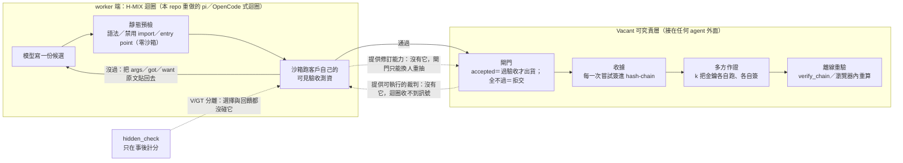
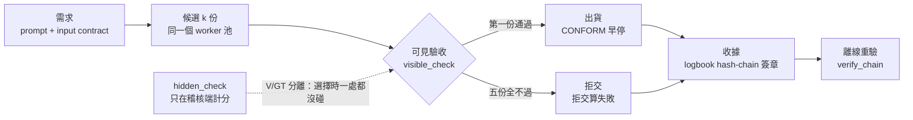
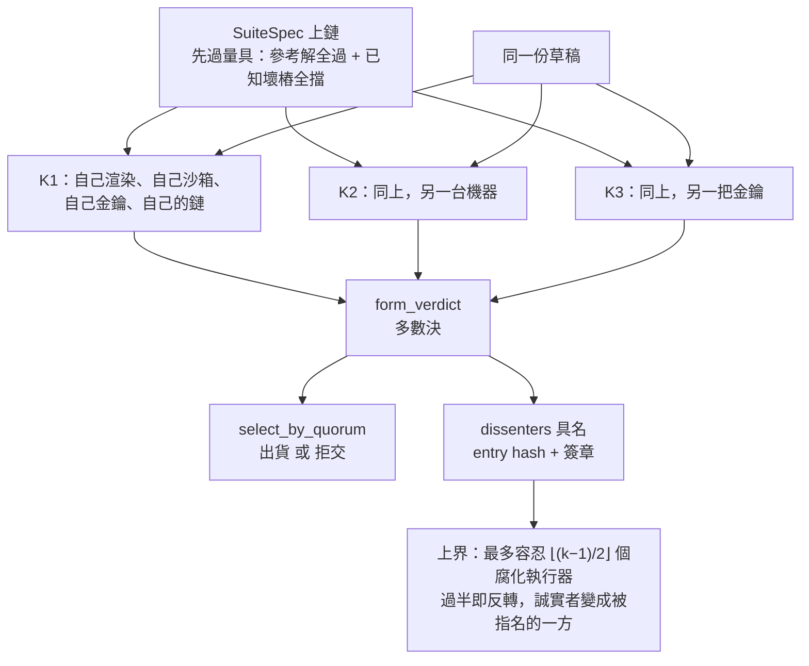
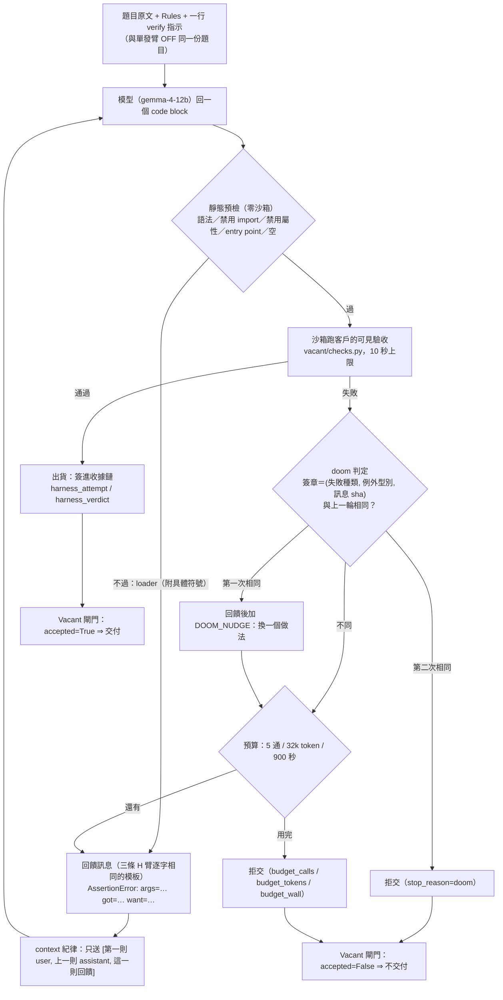

# Vacant：現在是什麼、做了什麼、量到什麼（2026-09-12 完整版）

**這份文件是什麼**：把 Vacant 現在**實際有的東西**與**實際量到的數字**收在一頁，
供人類閱讀，並作為官網／展場文案取數字的唯一入口。

**它與 2026-09-07 正典的關係**：`docs/VACANT_ARCHITECTURE_AND_RESULTS_2026-09-07.md`
（以下稱**正典**）到 R455／R461 為止的結果與來源標記，本檔**逐字沿用、一條都不刪**；
本檔新增的是 (1) worker 端 harness（H-MIX）這一層與它和可究責層的依存關係、
(2) R460 六臂收官的全部數字、(3) 正在跑的 R460R 三次複製、(4) 隨之新增的誠實邊界。
**正典沒有被取代**：兩份不一致時以來源檔為準，來源檔在兩份裡是同一批。

**紀律**：每一個數字後面都帶（來源：`檔案`§節 或 json 路徑）。
**沒有落盤來源的數字一律寫「未量測」**，不寫估計、不寫「大約」。
被推翻的說法**留在文件裡並標示更正後版本**，不悄悄刪掉（同 `examples/verdicts.py`
模組 docstring 的理由：索引若比網頁樂觀，就是主動誤導）。

**版本**：branch `doc/vacant-complete-2026-09-12`（從 `feat/v2-four-stages` HEAD
`03336fe` 切出）、隔離 worktree 撰寫，主 worktree 未被動到。
本文件**零模型呼叫、零遠端連線**，只讀已落盤的檔案；文中標「本輪重算」的數字
由 `ops/gain/replay/r460/r460_analyze.json` 逐鍵讀出（零沙箱、零 API）。

**口徑**：全文用**可究責性／讓依賴有根據**，不用「信任」「防止」「保證」。
少數地方必須引用程式碼 docstring 的原字（那裡寫「信任」），一律標明是引用並改寫。

---

## 〇、一句話：兩層東西，各自在做什麼，為什麼互相需要

### 0.1 三句話定位

1. **Vacant 不是一個 agent。** 它是接在**任何** agent 外面的一層**可究責層**：
   閘門（跑客戶自己的驗收測資才准出貨，全不過就拒交）＋收據（每一次嘗試簽進
   事後改不掉的 hash-chain）＋多方作證（k 把金鑰各自跑、各自簽，不一致就指名是誰）。
   （來源：正典§1.1、§2.2、§2.4）
2. **H-MIX 不是更聰明的 prompt。** 它是 worker 那一端的**迴圈**：模型寫一份 →
   零成本靜態檢查 → 沙箱跑可見驗收 → 沒過就把失敗原文貼回去要它改 → 通過就出貨，
   預算用完或原地打轉就拒交。它是本 repo 依 `badlogic/pi-mono` 與 `sst/opencode`
   兩個公開 harness 的**原始碼事實**重做的版本，不是套用它們的程式。
   （來源：`docs/HMIX_ARCHITECTURE_2026-09-11.md`§一；
   `docs/HARNESS_STUDY_2026-09-07.md`§1.1 版本釘死表）
3. **兩者互相需要，而且在同一個 run 上增益是相加的。**
   同一批 120 題、同一顆 12B 模型：單發 58.33% → 閘門重抽 70.83% → H-MIX 84.17%。
   （來源：`DECISION_20260911_R460_FABLE_AUDIT_HARNESS.md`§二；本輪自
   `ops/gain/replay/r460/r460_analyze.json` · `per_arm.{OFF,CONFORM,HMIX}.deliv_n`
   ＝70／85／101、`measured`＝120 逐鍵重算相同）

### 0.2 依存關係（逐句）

> **harness 依賴 Vacant 的可執行裁判**：迴圈的每一步都要有人回答「這份對不對」。
> 那個答案在本設計裡是**執行**（跑客戶自己的驗收測資），不是「再問一個模型」。
> 沒有可執行的裁判，迴圈收不到訊號，就退化成模型自說自話。
>
> **Vacant 依賴 harness 的修訂能力**：閘門、多數決、投票都是**選擇規則**——
> 它們只能從 k 份既有候選裡挑，交付率的上限就是「至少一份對」的比例。
> 修訂迴圈不是選擇規則：第 t 輪的候選是用第 t−1 輪的執行結果生出來的新東西，
> 不在原本那 k 份裡面。
>
> （前半的機制位置：`docs/HMIX_ARCHITECTURE_2026-09-11.md`§七；
> 後半逐字出自 `docs/HARNESS_STUDY_2026-09-07.md`§2.1。）

**⚠ 這一節的成效句與下面每一節的成效句，都要帶§1.4 那句前提。**



---

## 一、交付物與口徑

### 1.1 唯一交付物

**畢業專題＝實體場地展覽。不產出論文，也不投稿。**
（來源：`CLAUDE.md`§唯一交付物：畢業專題 ＝ 實體場地展覽，L12–14）

### 1.2 由此推出的四條硬約束（每一條都改變技術決策）

| # | 約束 | 後果 | 來源 |
|---|---|---|---|
| 1 | 秒級互動 | 真模型每題實測約 114 秒，現場等不起 ⇒ 展件跑機制模擬或預跑重放，**畫面必須明講「這是機制模擬」** | `CLAUDE.md`§唯一交付物 第 1 條（L24–26） |
| 2 | 離線可跑、可無人值守 | 不假設網路、不假設有解說員；依賴外部端點者要有 fallback | 同上 第 2 條（L27–28） |
| 3 | 先行研究仍重要，但理由是**不能對觀眾說錯話** | 例：脈衝攻擊 2005 年就有名字（Srivatsa） | 同上 第 3 條（L29–30） |
| 4 | 統計檢定力**不必**到發表標準 | E10 的 p=0.332 對展覽不是問題；反事實對照比 p 值重要 | 同上 第 4 條（L31–32） |

⚠ 第 2 條在 harness 這一層多了一個具體後果：`DECISION_20260907_R460_HARNESS_PREREG.md`
把 OpenCode 的 doom-loop 預設處置（`doom_loop: "ask"`＝**問人類**）改成自動拒交，
理由逐字是「展場無人值守」。（來源：`docs/HMIX_ARCHITECTURE_2026-09-11.md`§三 doom-loop 列；
`docs/HARNESS_STUDY_2026-09-07.md`§1.2 F7）

### 1.3 口徑紅線（措辭層級的鐵律）

1. **用「可究責性／讓依賴有根據」，不要用「信任」。** 經典定義（Gambetta 1988、
   Mayer 1995）把「不依賴監督」寫進信任的必要條件，而監督正是本系統的全部；
   觀眾比口委更容易被誤導，所以展場措辭要求**更嚴格**不是更寬鬆。
   （來源：`CLAUDE.md`§唯一交付物 第 5 條，L33–35）
2. **不用「防止」「保證」。** 程式碼裡的誠實邊界句（raises-cost 非 prevents、
   detects 非 prevents）是規格的一部分，改碼不得刪。
   （來源：`CLAUDE.md`§慣例 第 3 點；`docs/RECORD_SPEC.md`§4）
3. **demo 只能說「看得到提升」；「證明提升」保留給預註冊 batch run。**
   （來源：`CLAUDE.md`§鐵律 5）
4. **模擬就標模擬。** 把模擬講成證明是鐵律 5 的展場版本。
   （來源：`CLAUDE.md`§唯一交付物 第 1 條）

### 1.4 強制前提句（逐字；任何交付成效宣稱都必須帶著它一起講）

> 整件事建立在『需求可以被編譯成可執行的驗收測資』。……需求跑不起來的場合，這個機制沒有免費的裁判，會退化成『問一個模型』，而那正是量出來很差的東西。

（來源：`DECISION_20260903_R440P_CONFORMANCE_GATE.md`§五-1 逐字，`……` 處略去題庫附帶
說明「MBPP+ 有 3 條 base assert 可跑；」；同一條複述於 `ops/gain/gain_run.py::arm_conform`
docstring 誠實邊界 1、`vacant/peerexec.py` docstring 誠實邊界 1）

R440P §五-1 同時寫死了它的適用範圍：**展場與任何對外宣稱都必須帶這一句**。
本文件第三節量到的全部交付成效，都發生在「需求已經被編譯成可執行驗收測資」的
題庫上（MBPP+／LCB）。R460 的收官把同一句原樣搬過去，並加了一條本 repo 第一次出現的
限定：**worker 看得到客戶可見測資的內容與期望值；隱藏測資只計分**。
（來源：`DECISION_20260911_R460_FABLE_AUDIT_HARNESS.md`§七「必帶的前提」）

---

## 二、架構全圖

### 2.1 分層與承重

#### L0 — 密碼學與序列化（一切簽章的地基）

| 模組 | 承重什麼 | 來源 |
|---|---|---|
| `vacant/canonical.py` | 跨機驗章一致的**唯一**序列化規則；簽章覆蓋的永遠是 canonical bytes | `vacant/canonical.py` docstring |
| `vacant/identity.py` | Ed25519 keypair ＋ `vacant_id`；私鑰放閘道、0o600、**agent 推理看不到身分** | `vacant/identity.py` docstring |
| `vacant/crypto.py` | Ed25519 簽／驗的底層 | 同上 import |

#### L1 — 帳：簽章鏈與存檔點

| 模組 | 承重什麼 | 來源 |
|---|---|---|
| `vacant/logbook.py` | append-only hash-chain：`seq` 真單調、`prev_hash` 串接、簽章覆蓋全欄位；`stream_id`＝創世事件 hash。中間竄改驗不過（tamper-evident），持公鑰者都能 `verify_chain` | `vacant/logbook.py` docstring |
| `vacant/envelope.py` | 每筆 A2A 訊息的簽章信封＋`ReviewEnvelope`；body 是黑箱，閘道只簽／驗／記 | `vacant/envelope.py` docstring |
| `vacant/checkpoint.py` | V1 存檔點認證＋回溯稽核；存檔點**自身成鏈**，「記憶沒了，帳還在」（docstring 原文用「信任」二字，此處照口徑紅線改寫） | `vacant/checkpoint.py` docstring |
| `vacant/attest.py`／`receipt.py`／`trustcard.py` | 可攜憑證與委派收據：讓「已驗證」離開 vacant 仍可被獨立核對（key custody 假設下是 prevents，私鑰外洩即退化為 detects） | 兩檔 docstring |

#### L2 — 可究責層（Phase-1 本體）

| 模組 | 承重什麼 | 來源 |
|---|---|---|
| `vacant/registry.py` | 發現＋信譽索引；**不是中央路由器**。`record_review` 只收驗簽＋head 新鮮＋去重；同源非線性降權（raises-cost，非 prevents） | `vacant/registry.py` docstring |
| `vacant/reputation.py` | 五維 Beta，key＝(stream_id, branch_id, substrate[, family])——**credit 跟著記憶走不跟身體走**；decay 半衰期 200 事件、slash 乘法扣減 | `vacant/reputation.py` docstring |
| `vacant/router.py` | on/off 單開關（程式碼裡的旗標名是 `trust`）：on＝UCB 信譽路由、off＝確定性隨機 | `vacant/router.py` docstring |
| `vacant/auditor.py` | 確定性再驗：`checks.py` 沙箱重跑客觀 check（環境真值，不是再問一次 LLM）；抽樣 sha256(seed:task_id)，同 seed 可重放 | `vacant/auditor.py` docstring |
| `vacant/memory.py` | MemoryStream＋MemoryManager M0／M1／M2；KS-1／A4 是**可執行防呆**（`assert_ks1_clean`、`lesson_leaks_test_data`） | `vacant/memory.py` docstring |
| `vacant/dashboard.py` | 觀測台＋`/api/roster`／`/api/scoreboard`／`/api/snapshot`。**面板不是可究責性的來源**（docstring 原字為「面板不是信任來源」）：面板與 ledger 不符時以 ledger 為準 | `vacant/dashboard.py` docstring |

#### L3 — 題庫、V/GT 分離與量具

| 模組 | 承重什麼 | 來源 |
|---|---|---|
| `vacant/codebench.py` | `EvalPlusMBPPLoader`（MBPP+ v0.2.0、sha256 釘死、fail-closed）＋`LiveCodeBenchLoader`（v1 91／v2 120／v3 189 題） | `vacant/codebench.py` docstring；`runs/INDEX.md`§五 |
| V/GT 分離 | **需求**＝prompt＋input contract＋`hidden_check`；**選擇時只准碰 `visible_check`** | `SPEC_GAIN.md`§二 |
| 題庫固定子集 | MBPP+ 378 題中 7 題連 canonical 都跑不完沙箱 ⇒ 固定排除，餘 **371 題** | `SPEC_GAIN.md`§二；`gain_run.py::GAIN_EVALPLUS_RESOURCE_EXCLUSIONS` |
| `vacant/suitegauge.py` | 套件量具的**純函式核心**：參考解要過 ∧ 每個已知壞樁都要被擋 ∧ `n_broken ≥ 1`；`probe_instrument` 與 `peerexec.commit_suite` 共用同一份判準 | `vacant/suitegauge.py` docstring |
| `vacant/suitespec.py` | **驗收套件是資料不是程式**：`SuiteSpec = {v, dialect, entry_point, tests:[{args, expected}], cmp}`，執行器只跑**自己的**渲染器產生的碼 | `vacant/suitespec.py` docstring |

#### L4 — 實驗、harness 與裁決基建

| 模組 | 承重什麼 | 來源 |
|---|---|---|
| `ops/gain/gain_run.py` | G 實驗 runner：OFF／ON／OFF5／CONFORM／EQ5／ONR ＋ **HPI／HOC／HMIX** 三條 harness 臂，量具驗證＋全 I/O 落盤 | `ops/gain/gain_run.py` docstring；`DECISION_20260911_R460_FABLE_AUDIT_HARNESS.md`§二 |
| **`ops/gain/harness_arms.py`** | 三條 H 臂的實作（`run_harness_arm`、`_context_for`、`static_precheck`、`visible_report`、`render_feedback`）。docstring 逐字：既有六臂**沒有任何一條**把「候選跑出來的失敗訊息」餵回同一個 worker；KS-1 的實質禁令照樣適用，import 時就對每個常數跑 `assert_ks1_clean` | `ops/gain/harness_arms.py` docstring |
| `ops/gain/harness_vgt_audit.py` | V/GT 動態稽核：掃 harness 送出去的文字裡有沒有隱藏測資。v1／v2 兩個 scope，見§4.3 | `DECISION_20260911_R460R_FIVE_REPLICATIONS_PREREG.md`§五 |
| `ops/gain/analyze_r460.py`／`analyze_r460r.py` | R460／R460R 的**仲裁者**：四狀態、Holm、區間、拓撲、守門指標、`--selftest`／`--mutation-check` | `DECISION_20260907_R460_HARNESS_PREREG.md`§六-(0)；同 R460R 預註冊§二-2 |
| `vacant/peerexec.py` | 「互跑不互審」的去中心化執行證言層（`Executor.attest`／`form_verdict`／`select_by_quorum`） | `vacant/peerexec.py` docstring |
| **`ops/gain/replay/peer_exec_real.py`** | R449 §七-1 那條推翻條件的**唯一實驗裝置**：把 k 個執行器搬到真機器上，各自渲染、各自沙箱、各自金鑰（在它之前 k 個「執行器」共用同一份 cache ⇒「k 台一致」是恆真句不是量測） | `ops/gain/replay/peer_exec_real.py` docstring |
| `vacant/record.py`＋`docs/RECORD_SPEC.md` | 一次 run 的最小證據包：`pack`／`check`；缺必要項＝記錄層 `infra_void`，不得進統計 | `docs/RECORD_SPEC.md`§2、§5 |
| `vacant/research.py` | McNemar＋bootstrap＋預註冊四函式（holm_bonferroni／tost_equiv_boot／wilcoxon_signed_rank_exact／mcnemar_power） | `CLAUDE.md`§程式碼地圖 |
| `vacant/blayer.py`／`vacant/batch.py` | B 層六情境驗收（判準寫死）／RunLedger 斷點續跑＋Watchdog | `CLAUDE.md`§程式碼地圖 |

#### L5 — 展件與對外發布

| 模組 | 承重什麼 | 來源 |
|---|---|---|
| `vacant/entrycost.py` | 入場成本的**機制模擬**：路由走真 `Registry.route`、稽核走真 `Auditor`、扣分走真 `Reputation.slash`，模擬的只有「交付好壞」。現場雙世界對照跑這個，不跑真模型 | `vacant/entrycost.py` docstring；`CLAUDE.md`§展件可直接複用的 |
| **`examples/receipt_viewer.html`** | 展件「收據牆」（單機 r445 那條鏈），離線單檔 | `tests/test_receipt_viewer.py` L1–L33；`DECISION_20260906_R455_FABLE_AUDIT_VIEWER.md`§一 |
| **`examples/receipt_viewer_multiparty.html`**（4.48 MB） | 展件「三把金鑰的收據」：內嵌 r454 真跑三條完整鏈（1840／1840／1899＝5,579 筆），瀏覽器內從創世驗到鏈頭、逐格重算裁決／指名／出貨，示範三種竄改；零外部資源、`file://` 直開 | `DECISION_20260906_R455_FABLE_AUDIT_VIEWER.md`§一；`CLAUDE.md`§展件可直接複用的（L98–105） |
| `ops/gain/replay/build_multiparty_viewer.py` | 上面那張頁面的產生器（重建＝重跑它，不手改 HTML） | 檔案本身；`DECISION_20260906_R455_...`§一 |
| `examples/e10_mediator.py` | 重算 E10 那兩行路由序列（零機時，只讀已歸檔 JSONL） | `CLAUDE.md`§展件可直接複用的（L97） |
| `examples/publish_now.py`／`publish_archive.py`／`verdicts.py` | 對外三類資料；**裁決的單一真相來源在 `verdicts.py`** | `examples/verdicts.py` docstring |

### 2.2 臂表：選擇規則六條 ＋ 修訂迴圈三條

| 臂 | 做法 | 呼叫／題 | 來源 |
|---|---|---|---|
| **OFF** | 隨機路由，交回來就收 | 1.00 | `gain_run.py` docstring |
| **ON** | 信譽路由（UCB）＋K=3 同儕評審＋一次修訂＋抽樣稽核 | ≈5 | `gain_run.py::arm_on` docstring |
| **OFF5** | 同題跑 5 次取多數決；票以**行為簽名**分桶 | 5.00 | `gain_run.py::arm_off5` docstring |
| **CONFORM** | **驗收閘門**：逐一跑 `visible_check`，第一份通過就出貨並早停，全不通過就拒交 | 1.51（MBPP+）／1.71（LCB v2 r447）／1.55（LCB v3）／**1.62（LCB v2 r460）** | `arm_conform` docstring；`CONCLUSION_20260904_R445_...`§三；`DECISION_20260905_R440Z_...`§一；`DECISION_20260906_R461_...`§一；`DECISION_20260911_R460_...`§二 |
| **EQ5** | **等預算臂**：一次生成 5 份候選（不早停 ⇒ 恆 5.00），同一組候選餵給兩條選擇規則 | 5.00 | `gain_run.py::arm_eq5` docstring |
| **ONR** | 把 ON 的路由段單獨成臂（隔離「挑誰來做」） | 1 | `gain_run.py::arm_onr` docstring |
| **H-PI** | pi 式極簡回饋迴圈（全留 context） | 1.51 | `DECISION_20260911_R460_...`§二 |
| **H-OC** | 先計畫、後動手，加靜態診斷 | 2.36 | 同上 |
| **H-MIX** | 回饋＋診斷＋一行 verify 指示＋doom 偵測＋只留最後一次失敗 | 1.36 | 同上 |

**為什麼一定要有 OFF5**：ON 比 OFF 好幾乎必然，因為多花五倍呼叫。拿 1 次對 5 次
去宣稱「機制有效」是拿成本冒充機制。（來源：`SPEC_GAIN.md`§三；`gain_run.py` docstring）

**閘門規則（逐字語意）**：只用 `visible_check` 決定去留（V/GT 分離定義在
`SPEC_GAIN.md`§二）；第一份通過的出貨；全不通過＝拒交，**拒交算失敗**（分母是全部題目）；
每一次嘗試都簽進 hash-chain。三條 H 臂沿用**逐字相同**的出貨與拒交語意。
（來源：`gain_run.py::arm_conform`／`arm_eq5` docstring；
`docs/HMIX_ARCHITECTURE_2026-09-11.md`§三 拒交語意列）

### 2.3 流程圖一：需求 → 候選 → 可見驗收 → 出貨／拒交 → 收據



（來源：正典§2.3 原圖）

### 2.4 流程圖二：k 把金鑰各自跑、各自簽 → 合票 → 指名



**機制只有三件事，沒有第四件**：`Executor.attest`、`form_verdict`（取多數並回傳
**少數方是誰**）、`select_by_quorum`。**為什麼是「互跑」不是「互審」**：驗收測資是
確定性的程式，誠實執行器**必須**得到同一個結果 ⇒ **意見分歧沒有資訊，執行分歧有資訊**。
（來源：`vacant/peerexec.py` docstring；`DECISION_20260905_R449_PEEREXEC_ARCHITECTURE_AUDIT.md`§一）

### 2.5 流程圖三：H-MIX 迴圈（節錄；完整圖與逐字 prompt 見 `docs/HMIX_ARCHITECTURE_2026-09-11.md`§二、§四）



**六個零件、各自從哪來、各自值多少**（數字全部來自 R460）：

| 零件 | 來源 | R460 量到的證據 |
|---|---|---|
| 執行回饋迴圈 | pi：失敗是一則輸入不是結局；bash 的 stdout+stderr 合流、exit 狀態明寫（F3／F4） | **增益幾乎全在這裡**：Δ(最終 − 第一輪) 在兩次重放間為 **+17.50 到 +19.17pp**，迴圈救回 21 題 |
| 靜態預檢先行 | OpenCode：edit 後把 LSP 診斷直接餵回（F9）；我們用 `ast`＋白名單 | 擋下 **6.1%** 的輪次（P-H5 MISS，比預期多） |
| 一行 verify 指示 | OpenCode `prompt/meta.txt:17` 的改寫 | prompt 效果 **約等於零（±2pp 內，隨重放機器負載變動）**，見§3.1-A 與§4.2 |
| doom-loop 偵測 | OpenCode `processor.ts`（門檻 3 → 2；`ask` → 自動，因展場無人值守）（F7） | **3 題**以 doom 拒交 |
| context 紀律 | OpenCode 的 **prune**（不是 compaction） | token/題 **5,677**，是 pi 式全留 context 的 **0.60 倍**（P-H6 HIT） |
| 拒交語意 | Vacant 既有的 CONFORM 閘門 | 拒交 **5 題**；拒交題最後一份「其實對」**0 件** |

（來源：`docs/HMIX_ARCHITECTURE_2026-09-11.md`§三；F3／F4／F7／F9 的原始碼出處在
`docs/HARNESS_STUDY_2026-09-07.md`§1.2；迴圈／prompt 兩個區間見
`DECISION_20260911_R460_FABLE_AUDIT_HARNESS.md`§五與§十）

**三條 H 臂共用、刻意逐字相同的東西**（否則分不清增益來自「有回饋」還是「回饋寫得比較好」）：
回饋模板、六種失敗區塊寫法、截斷規則、`finish_reason=length` 時丟棄重發一次、沙箱、
import 白名單、10 秒逾時、出貨與拒交語意。
（來源：`docs/HMIX_ARCHITECTURE_2026-09-11.md`§三 末段）

---

## 三、成效總表

分三級：**站得住**（事前判準通過）／**同號未解析**（方向一致但區間沒排除 0）／
**被推翻或說太滿**（照更正後版本講）。**本節每一句成效都要帶§1.4 的前提句。**

⚠ **「站得住」這一級有一個例外要先聲明**：3.1-F 的 peerexec 結果（R449 §三 那三張表）
**是模擬掃描，不是事前判準通過**——R449 那一輪沒有預註冊窗口，數字來自 r446／r443
已歸檔候選上的參數掃描（腐化比例 0–70%、五種攻擊、k∈{1,3,5,7}）。真跑側（R453／R454）
才有事前寫死的預測窗。引用 3.1-F 時要分清哪一半是模擬、哪一半是真跑。
（來源：`DECISION_20260905_R449_...`§三 標題；`DECISION_20260906_R453_...`§二；
`DECISION_20260906_R454_...`§二）

### 3.0 先讀天花板：綁定約束不是選擇器，是候選池

| 重放批次 | 池子上限（≥1 個候選正確） | 五個候選全錯 |
|---|---|---|
| `g_r441_gemma_only_mbpp_b`（gemma-12b、179 題） | **82.68%** | **31 題** |
| `g_r356_3arm_20260830`（qwen35b＋gemma12b 混池、147 題） | **85.03%** | **22 題** |

> 綁定約束不是選擇器，是候選池。17–19% 的題目五個候選全錯，任何選擇機制都救不了。
> 這是任何「選得更聰明」路線的天花板，也解釋了為什麼加預算沒用：worker 的錯誤高度相關。

（來源：`DECISION_20260903_R440P_CONFORMANCE_GATE.md`§二 表「池子上限」列與「三句話讀懂」
第 3 點逐字）

**這張表是 harness 路線唯一站得住的動機**，而且它是一句可以寫下來的機制陳述：
選擇規則（CONFORM／OFF5／EQ5）只能從既有候選裡挑，上限就是「至少一份對」；
修訂迴圈改變候選本身，**在原理上**可以越過它。
（來源：`docs/HARNESS_STUDY_2026-09-07.md`§2.1 逐字）
⚠ 誠實邊界（同節逐字）：「原理上可以」不等於「實際上會」。

R440P 另把這個上限當成否決「更聰明的選擇器」路線的理由（fuzz 一致性只加 +0.33pp／
+0.20pp；「最長程式碼」在 r441 有效 +3.91pp、在 r356 消失 +0.68pp ⇒ 過擬合，
已記為負向對照）。（來源：同檔§四「放棄的選項與理由」第 2 點）

---

### 3.1 站得住

#### A.（新）R460：修訂迴圈 vs 選擇規則，LCB v2 難題 120 題、六臂交錯、五通等預算

設定：gemma-4-12b-it-qat 單一模型、六塊 × 20 題、`--arms OFF,CONFORM,OFF5,HPI,HOC,HMIX`、
六臂交錯（`for task: for arm`）。E-1..E-5、E-7 綠（E-4 附分類），E-6 `equal_budget_comparison_valid=false` 如預期：`broken_reasons == []`、
六塊 `run_terminal`／`run_complete` 皆 true、**六臂 720 列、`infra_void` 全 0**。
（來源：`DECISION_20260911_R460_FABLE_AUDIT_HARNESS.md`§一）

| 臂 | 交付正確 | 假交付（交出去卻錯） | 拒交 | 呼叫／題 | token／題 | 對 OFF 倍數 | 每份正確成品 token |
|---|---|---|---|---|---|---|---|
| OFF（單發） | 70/120＝**58.33%** | **50**（41.7%） | 0 | 1.00 | 2,913 | 1.00× | 4,994 |
| CONFORM（重抽不回饋） | 85/120＝**70.83%** | **29**（24.2%） | 6 | 1.62 | 5,805 | 1.99× | 8,195 |
| OFF5（五次投票） | 78/120＝**65.00%** | **42**（35.0%） | 0 | 5.00 | 15,004 | 5.15× | 23,084 |
| H-PI（pi 式原始回饋迴圈） | 91/120＝**75.83%** | **17**（14.2%） | 12 | 1.51 | 9,448 | 3.24× | 12,459 |
| H-OC（計畫＋診斷＋自測） | 96/120＝**80.00%** | **18**（15.0%） | 6 | 2.36 | 7,432 | 2.55× | 9,290 |
| **H-MIX**（回饋＋診斷＋verify 一行＋doom＋只留最後失敗） | **101/120＝84.17%** | **14**（11.7%） | 5 | **1.36** | **5,677** | **1.95×** | **6,745** |

（來源：`DECISION_20260911_R460_FABLE_AUDIT_HARNESS.md`§二。本輪逐鍵重算相同：
`ops/gain/replay/r460/r460_analyze.json` · `per_arm.<ARM>.{deliv_n,measured,false_delivery_n,
false_delivery_pp,calls_per_task}` 與 `tokens.<ARM>.{tokens_per_task,tpc_incl_void,multiple_vs_off}`）

**配對**（complete-case，`n_common` 六對全為 120；**區間未做多重比較調整；仲裁以 analyzer 為準**）：

| 配對 | b／c | Δ | 95% CI | p（精確） | Holm p_adj |
|---|---|---|---|---|---|
| **H-MIX vs OFF** | 34／3 | **+25.83pp** | [+17.32, +29.78] | <1e-6 | 7.4e-7 |
| **H-MIX vs CONFORM**（主要假設） | 22／6 | **+13.33pp** | [+4.22, +19.46] | 0.0037 | **0.0112** |
| H-OC vs OFF | 33／7 | +21.67pp | [+11.48, +28.44] | <1e-4 | 0.0002 |
| H-OC vs CONFORM | 22／11 | +9.17pp | [−1.00, +17.62] | 0.0801 | 0.160 |
| H-PI vs OFF | 26／5 | +17.50pp | [+8.41, +23.02] | 0.0002 | 0.0008 |
| H-PI vs CONFORM | 17／11 | +5.00pp | [−4.40, +13.30] | 0.3449 | 0.345 |
| **H-MIX vs OFF5**（家族外） | 26／3 | **+19.17pp** | [+10.95, +23.11] | 1.52e-5 | — |
| CONFORM vs OFF（同 run 對照） | 24／9 | **+12.50pp** | [+2.46, +20.19] | 0.0135 | — |

（來源：同檔§二；Holm 家族逐字是「3 條 H 臂 × {OFF, CONFORM}＝6 個檢定」，
`holm.family_size == 6`——本輪自 `r460_analyze.json` · `paired.*`／`holm.*` 逐鍵重算相同）

**四狀態裁決**（照 `DECISION_20260907_R460_HARNESS_PREREG.md`§六-(4) 在資料之前寫死的順序判）：

| 臂 | (i) Δ_O≥25 ∧ Δ_C≥10 | (ii) Holm 兩者 <0.05 | (iii) TPC ≤ OFF5 | (iv) 假交付 ≤ CONFORM+5 | 裁決 |
|---|---|---|---|---|---|
| **H-MIX** | +25.83／+13.33 ✓ | 7e-7／0.011 ✓ | 6,745 ≤ 23,084 ✓ | 11.7 ≤ 29.2 ✓ | **EFFECTIVE** |
| H-OC | +21.67／+9.17 ✗ | 0.0002／0.160 ✗ | ✓ | ✓ | **INCONCLUSIVE**（上界 +17.62 未排除 10pp） |
| H-PI | +17.50／+5.00 ✗ | 0.0008／0.345 ✗ | ✓ | ✓ | **INCONCLUSIVE**（上界 +13.30 未排除 10pp） |

（來源：`DECISION_20260911_R460_FABLE_AUDIT_HARNESS.md`§三；本輪 `r460_analyze.json` ·
`decision.{HMIX,HOC,HPI}.verdict` ＝ EFFECTIVE／INCONCLUSIVE／INCONCLUSIVE 相同。
主要假設成立 ⇒ `stage2_triggered=false`，不走階段二）

**winner's curse 免責（強制，不寫＝裁決不得結算）**：n=120 對 +10pp 的檢定力只有
**0.43–0.63**；能被判顯著的點估計被截斷在 MDE 以上 ⇒ **H-MIX 的 +13.33pp 是效果量的
上偏估計**。跨臂比幅度只報區間重疊：H-MIX 對 H-PI +8.33pp [+0.30, +13.78]（探索量、
家族外，**不作「哪條 harness 較好」的宣稱**）。
（來源：同檔§三；門檻與免責原文在 `DECISION_20260907_R460_HARNESS_PREREG.md`§五、§六-(5)）

**歸因（`--rescore-turn1`，離線重算，零模型呼叫）**：

| 臂 | 第一輪可見通過 | Δ(第一輪 − OFF)＝prompt 效果 | Δ(最終 − 第一輪)＝迴圈效果 | 迴圈救回題數 |
|---|---|---|---|---|
| H-PI | 71.7% | −0.83 → +1.67（兩次重放） | +18.33 → +15.83 | 19 |
| H-OC | （計畫輪不出碼） | +2.50 → +3.33 | +19.17 → +18.33 | 96（build 輪起算） |
| H-MIX | 74.2% | +6.67 → +8.33 | +19.17 → +17.50 | 21 |

**照§十 補記的處置**：「H-PI 的 prompt 效果是負的」**降為「約等於零（±2pp 內，
隨重放機器負載變動）」**；**「增益幾乎全來自迴圈」不變——兩次重放都落在 +16 到 +19pp**。
歸因附表日後要報「重放區間」而非單一數字。差異來源已定位：離線重跑 `meets_demand(hidden)`
時沙箱 10 秒逾時在不同負載下的非決定性（`turn1_visible_pass_pp` 與 `loop_gain_n` 兩次完全相同）。
**仲裁裁決（EFFECTIVE）不受影響**：`per_arm`／`paired`／`holm`／`decision`／`tokens`／
`prereg`／`gates` 逐鍵相同。
（來源：`DECISION_20260911_R460_FABLE_AUDIT_HARNESS.md`§五、§十）

**九條事前預測：6 HIT／3 MISS**——P-H0（前 60 題 OFF ∈[38.3,68.3]，實測 60.0）HIT、
P-H1（三臂 > OFF）HIT、P-H2（至少一臂 > CONFORM）HIT、P-H6（HMIX token ÷ HPI ≤0.8，
實測 0.60）HIT、P-H7（撞牆鐘 ≤5%，實測 0／0／0）HIT、P-H8（nocode ≤3%，實測 0／0／0）HIT；
**MISS 三條**：P-H3（呼叫／題預期 [1.8,3.2]，實測 1.51／2.36／1.36——比預期省，
71–74% 第一輪就過）、P-H4（預期假交付 > CONFORM，實測 14.2／15.0／11.7 **低於** CONFORM 24.2
——方向相反）、P-H5（loader 輪次 ≤0.5%，實測 1.06／6.13）。
**三個 MISS 都是預測寫錯方向，不是機制壞掉；照實記，不改窗。**
（來源：同檔§四逐條）

**守門指標（缺一項裁決不得結算）**：
G1 假交付絕對件數 OFF 50／OFF5 42／CONFORM 29／H-OC 18／H-PI 17／**H-MIX 14**；
G2 無損性——六臂「拒交題最後一份其實對」**0 件**，拒交理由 H-PI 12（budget_calls 3、
budget_tokens 9）／H-OC 6／H-MIX 5（doom 3、budget_tokens 2）；
G3 載入器人為因素——OFF 只有 **2 題（1.67%）** 因禁用屬性表被擋，排除後 H 臂優勢未掉一半
⇒ 不觸發§六-(6)-e 的句子；
G4 難度分層——H-MIX medium **90.3%**／hard **75.0%**，CONFORM **77.8%**／**60.4%**（難題差距更大）；
G5 呼叫直方圖——H-MIX 1 通 89、2 通 21、3 通 8、4 通 2（沒有平均值掩蓋的雙峰）；
G6 wire mode——三臂全 multiturn。
（來源：同檔§六；本輪 `r460_analyze.json` · `gates.{G1_false_delivery,
G2_refusal_losslessness,G3_loader_artifact,G4_difficulty_date,G5_calls_per_task,G6_wire_mode}` 逐鍵重算相同）

**與天花板的關係**：R460 的 84.17% 已經越過 CONFORM 所在的那個天花板區間
（82.68%／85.03%，§3.0）。（來源：`docs/HMIX_ARCHITECTURE_2026-09-11.md`§五末段）
⚠ 兩者是**不同題庫、不同批次**的數字（天花板量在 MBPP+ 重放批次上，84.17% 量在 LCB v2），
**不是同一條尺上的刻度**；這句話能講的是「修訂迴圈不受選擇規則的上限約束」這個機制陳述，
不是「越過了這批題目的上限」。（來源：§3.0 兩批次的題庫欄；`runs/INDEX.md`§五）

#### B. 早停閘門 vs 單抽（CONFORM vs OFF）

| 題庫／run | 閘門 | 單抽 OFF | 配對差 | p | 呼叫／題 | 來源 |
|---|---|---|---|---|---|---|
| MBPP+ 371（r444+r445 併庫，配對） | 邊際見下註 | 邊際見下註 | **+4.58pp**，CI [+0.57, +8.04] | 未列（區間不含 0） | 1.51 vs 1.00 | `CONCLUSION_20260904_R445_CONFORM_SETTLEMENT.md`§一 |
| **LCB v2 120（r447）** | 84/120＝70.0% | 61/120（失敗率 **49.2%**） | **+19.17pp**，CI [+10.0, +28.3] | **0.0003**（b=31／c=8） | 1.71 vs 1.00 | `DECISION_20260905_R440Z_WRAPUP_LCB2.md`§一 |
| **LCB v3 189（r461）** | 152/189（失敗率 19.6%） | 137/189（失敗率 27.5%） | **+7.94pp**，CI [+2.12, +14.29] | **0.0167**（b=25／c=10） | 1.55 vs 1.00 | `DECISION_20260906_R461_FABLE_AUDIT.md`§一 |
| **LCB v2 120（r460，同 run 對照）** | 85/120＝70.83% | 70/120＝58.33% | **+12.50pp**，CI [+2.46, +20.19] | **0.0135**（b=24／c=9） | 1.62 vs 1.00 | `DECISION_20260911_R460_FABLE_AUDIT_HARNESS.md`§二 |

**MBPP+ 那一列的邊際數字要分開講**：R445§三 的成本表列 OFF deliv **70.31%**、
CONFORM deliv **76.04%**、拒交率 **8.33%**、每正確交付呼叫數 1.42 vs 1.99；
而 +4.58pp 是**併庫 371 題的配對差**（§一）。兩者分母不同，**不可相減、不可混用**。
（來源：`CONCLUSION_20260904_R445_CONFORM_SETTLEMENT.md`§一、§三）

**能講**（逐字，末句不得截掉）：

> 在 120 題 LeetCode 中高難度題上，「跑客戶自己的驗收再換人」比單抽多交付 19 個百分點
>（p=0.0003），平均只多花 0.71 通呼叫；拒交的 7 題事後檢查五份草稿全部是錯的。

（來源：`DECISION_20260905_R440Z_WRAPUP_LCB2.md`§三「能講」逐字）

⚠ **r447 與 E3／r443 不是獨立樣本**：R440Z§五 逐字記「與 E3 共用 91 題，非獨立樣本」。
⚠ **r460 與 r447 也不是獨立樣本**：同一個 120 題 bank、**完全重疊**
（`CRITERION_20260903_R680_POOL_PRECONDITIONS.md` 的 Q1 要求交集＝∅ ⇒ **Q1 MISS**）。
r460 的 CONFORM vs OFF **是同一個 run 內部的對照**，不是 r447 的獨立複製。
（來源：`DECISION_20260905_R440Z_...`§五；`DECISION_20260907_R460_HARNESS_PREREG.md`§七）

**R445 的事前預測記分**：P-E1..P-E8 為 **7 HIT／1 MISS**。MISS 的是 **P-E2**——併庫 CI
半寬 **3.29pp** 大於事前預測的 3.0pp，原因是 r445 的 discordant 密度 14.06% 高於 r444 的
7.26%。另 P-R687-6 擦邊照記：disc_rate 0.1406、上緣 0.145。
（來源：`CONCLUSION_20260904_R445_CONFORM_SETTLEMENT.md`§四）

⚠ 區間口徑差異：同一批資料的 CONFORM−OFF，R445 收官報 [+0.57, +8.04]、R440Z§四 的獨立
重算報 [+0.81, +8.36]；點估計相同（+4.58pp）。引用時必須說明用的是哪一份。（來源：兩檔對照）

#### C. 閘門規則 vs 多數決，**同一組候選、同樣 5 通呼叫**（EQ5）

| run／題庫 | 閘門 | 多數決 | b／c | Δ（95% 區間） | p | 來源 |
|---|---|---|---|---|---|---|
| r446 MBPP+ 371 | 280/371＝75.47% | 265/371＝71.43% | 24／9 | **+4.04pp** [+0.796, +6.529]（精確條件區間） | **0.0135** | `CONCLUSION_20260904_R446_EQUAL_BUDGET.md`§一、§二 |
| r448 MBPP+ 371（新 seed） | 286/371＝77.09% | 273/371＝73.58% | 21／8 | **+3.50pp** [+0.81, +6.47] | **0.0241** | `DECISION_20260906_R448_FABLE_AUDIT_REPLICATED.md`§一 |
| **r449b LCB v2 120（難題）** | 85/120＝70.83% | 75/120＝62.50% | 15／5 | **+8.33pp** [+0.30, +13.78] | **0.0414** | `DECISION_20260906_R449B_...`§二 |
| r449c LCB v3 189 | 157/189＝83.07% | 149/189＝78.84% | 13／5 | **+4.23pp** [−0.66, +7.68] | 0.0963 | `DECISION_20260907_R449C_...`§二（**UNRESOLVED**，見 3.2） |

**現在准講的範圍（逐字）**：「閘門規則贏多數決——MBPP+（兩個 seed）與 LCB v2 上顯著；
LCB v3 上同號（+4.23pp）但未解析。」（來源：`DECISION_20260907_R449C_...`§三）

**四次 b 都大於 c（合計 73／27）**，但**不准併成 n=1051 做檢定**（預註冊禁令 2）。
跨 seed 的逐題四格顯示：r446→r448 兩個 seed 裡「閘門贏」的題目只有 **6 題重疊**——
效應不是集中在少數幾題。（來源：同上§三；`DECISION_20260906_R448_...`§三）

**`same_choice`（兩條規則選到同一份的比率）四個 run 照實列**：

| run | `same_choice_effective` | 事前窗 | 裁決 |
|---|---|---|---|
| r446 MBPP+ 371 | **20.49%**（raw 22.91%、`false_same_choice_n`=9） | [40, 95]% | **MISS** |
| r448 MBPP+ 371 | **21.0%** | [10, 40]% | HIT |
| r449b LCB v2 120 | **22.5%**（raw 25.0、false 3） | [5, 35]% | HIT |
| r449c LCB v3 189 | **24.34%**（raw 24.87、false 1） | [10, 40]% | HIT |

r446 的 **P-R446-5 是 MISS，要照實記，而且要記它偏的方向對我方有利**：窗口下界 40%
是無先例的寬窗猜測，實測低出下界近 20pp，而低同選率讓這個比較**更有對比**。
**不准把它讀成「預測大致成立」——事前的先驗錯了。**
（來源：`CONCLUSION_20260904_R446_EQUAL_BUDGET.md`§三）

⚠ **語意更正（R446§四，事後描述性、不改任何判定）**：兩條規則選到**不同 sha** 的有
**286／371** 格，其中 **253 格（88.5%）結果仍然相同** ⇒ `same_choice` 量的是
**產物是否同一份碼**，不是**結果是否等價**。後續若還要用「幾乎總是選到同一份 ⇒ 沒有對比」
當推翻條件，**應該改綁 discordant 率**。（來源：同檔§四）

#### D. 委員會 ON 在等預算下**不贏** OFF5；OFF5 買到什麼要分題庫講

| 問題 | 答案 | 證據 | 來源 |
|---|---|---|---|
| ON 等預算贏 OFF5？ | **不能**（3 個 run） | 完整配對 p=0.45；難題子集 ON=OFF5=28.57%（p=1.0） | `examples/verdicts.py` · `gain.equal_budget_on_beats_off5`（refuted） |
| 是不是 worker 太強？ | 不是 | 換 12b 單模型後 OFF 失敗率升到 **31.8%**，ON vs OFF5 仍 **p=1.0** | `examples/verdicts.py` · `gain.ceiling_hypothesis`（refuted） |
| 是不是題目太簡單？ | 不是 | LCB 難題把 OFF 失敗率推到 **48.4%**，ON vs OFF5 仍 **p=0.4244** | `examples/verdicts.py` · `gain.hard_bench_hypothesis`（refuted） |
| 五倍預算的 self-consistency（OFF5 vs OFF）在 MBPP+ 買到什麼？ | **買不到** | +0.81pp、CI [−2.78, +4.28] ⇒ 落 `RULED_OUT` 格＝**排除了 ≥5pp 的實務增益** | `CONCLUSION_20260904_R445_...`§一、§三 |
| 同上，難題上呢？ | **有用** | LCB v2 +12.50pp（b=22／c=7、p=0.0081）；LCB v3 +6.35pp（b=22／c=10、p=0.0501） | `DECISION_20260905_R440Z_...`§一；`DECISION_20260906_R461_...`§一 |
| R460 同 run 內的 OFF5 vs OFF？ | 同號未解析 | +6.67pp、CI [−1.79, +13.25]（b=15／c=7） | 本輪 `r460_analyze.json` · `paired.OFF5_vs_OFF` |

**因此「加預算沒用」那句必須收窄成**：在 MBPP+ 上加預算沒用；難題上有用，
但**改花法更有用**（+19.2pp @1.71 通 vs +12.5pp @5 通）。
（來源：`DECISION_20260905_R440Z_WRAPUP_LCB2.md`§三 第三點逐字）
**R460 在同一批難題上把「改花法更有用」推得更遠**：H-MIX 以 1.36 通、**0.38 倍 token／題**
（5,677 vs 15,004）比 OFF5 多交付 **+19.17pp**；換成「每份正確成品的 token」是 **0.29 倍**
（6,745 vs 23,084）。兩個比值量的不是同一件事，引用時要說清楚是哪一個。
（來源：`DECISION_20260911_R460_...`§二、§七；本輪 `r460_analyze.json` · `paired.HMIX_vs_OFF5`、
`tokens.HMIX.tokens_per_task`／`tpc_ratio_vs_off5`＝0.292）

#### E. 無損性與拒交

**無損性**＝「hidden 過但 visible 沒過」（可見篩選誤丟正解）的違反數：

| 資料集 | 違反 | 來源 |
|---|---|---|
| MBPP+（第一批重放，`g_r441`，179 題×5） | 0／895 | `DECISION_20260903_R440P_CONFORMANCE_GATE.md`§二 |
| MBPP+（第二批重放，`g_r356`，147 題×5） | 0／735 | 同上§二 |
| MBPP+ 三個 run 合計 | 0／1630 | `DECISION_20260906_R461_FABLE_AUDIT.md`§二-3 |
| LCB v1 重放（E3／r443，91 題×5） | 0／455 | `DECISION_20260904_R440T_E3_WRAPUP.md`§八 |
| LCB v2 真跑（r447，120 題） | 0／120 | `DECISION_20260905_R440Z_...`§二 P-Z6 |
| LCB v3 真跑（r461，189 題） | 0／189 | `DECISION_20260906_R461_...`§一 |
| **LCB v2 真跑（r460，六臂各 120 題）** | **0（六臂全 0）** | `DECISION_20260911_R460_...`§六 G2；本輪 `r460_analyze.json` · `gates.G2_refusal_losslessness.lossless_violation_n` 六臂皆 0 |

⚠ **這些資料集不是各自獨立的樣本**：LCB v1 重放（91 題）與 LCB v2 真跑（120 題）
**共用 91 題**；r460 與 r447／r449b 共用**全部** 120 題。講「零違反」時要一起講重疊。
（來源：`DECISION_20260905_R440Z_...`§五；`DECISION_20260907_R460_HARNESS_PREREG.md`§七）

**拒交題事後檢查「五份全錯」**：

| run／題庫 | 拒交題數 | 五份全錯 | 來源 |
|---|---|---|---|
| r447 LCB v2 | 7（5.8%） | **7／7** | `DECISION_20260905_R440Z_...`§二 P-Z5 |
| r449b LCB v2 | 8（6.67%） | **8／8**（逐份重放 40 份候選） | `DECISION_20260906_R449B_...`§四-3 |
| r449c LCB v3 | 10（5.29%） | **10／10**（重放 50 份候選） | `DECISION_20260907_R449C_...`§四 |
| r461 LCB v3 | 15 | **15／15** | `DECISION_20260906_R461_...`§一 |
| r446 MBPP+ | 26（7.01%） | 未以此口徑量；量到的是**多數決在那 26 格交付成功 0 格** | `CONCLUSION_20260904_R446_...`§二、§四 |
| r448 MBPP+ | 23（6.2%） | 未量測 | `DECISION_20260906_R448_...`§一 |
| r460 LCB v2（六臂） | CONFORM 6／H-PI 12／H-OC 6／H-MIX 5（OFF、OFF5 為 0） | 以無損口徑量：**0 件**「拒交題最後一份其實對」 | `DECISION_20260911_R460_...`§六 G2 |

#### F. peerexec：「互跑不互審」買到什麼、買不到什麼

**校準（k=1、無腐化）**：371/371 的閘門決定與 r446 真跑**逐位相同**
（1855/1855 可見標籤、345/345 交付 sha、26/26 拒交）。分數差 1（279 vs 280）是
這台 Mac 的 libm 對 `l**2` 與 `l*l` 差 1 ULP、而 MBPP+ 隱藏測資用 `atol=0` 比對——
**計分端的可攜性問題，不是機制**。（來源：`DECISION_20260905_R449_...`§二）

**它買到的三件事（模擬掃描；r446 371 題×5 候選、r443 91 題×5；k∈{1,3,5,7}）**：

| # | 結果 | 來源 |
|---|---|---|
| 1 | **多數門檻以下**（腐化數 ≤ ⌊(k−1)/2⌋）：交付準確率與無腐化基線**逐位相同**（100 格），說謊者 **100% 被指名**、誠實者 **0% 被誣告**，四種吵鬧型攻擊全部如此 | `DECISION_20260905_R449_...`§三 |
| 2 | **單點容忍**：1 個腐化執行器在 k=1 致命（−7.8pp、偵測 0），在 k=3 完全無害（偵測 1.000） | 同上 |
| 3 | **成本**：簽章＋上鏈 1.0 ms、驗簽 1.2 ms、沙箱 ~630 ms ⇒ **可歸屬性只佔整個 run 的 0.2%**；每題牆鐘約 0.9 秒（展場秒級成立） | 同上 |

**它買不到的三件事（全部量到，不是猜的）**：

| # | 買不到什麼 | 數字 | 來源 |
|---|---|---|---|
| 1 | **對「腐化比例」沒有抵抗力** | 固定比例下 k 從 1 到 7 交付率一字不變（串謀 67.39%、破壞 0%）；過門檻後裁決與指名一起翻轉，誣告率 0.175／0.374。**機制無法知道自己在門檻哪一邊** | `DECISION_20260905_R449_...`§三-1 |
| 2 | **抓不到有耐心的說謊者** | 只在不會被抓時說謊者：四個 k、兩個題庫偵測率全部 **0.000**；代價是它 93–95% 機會得放棄，傷害 −1.35／−2.20pp。抖動 0.5%／1% 下腐化者被指名比率仍是誠實者的 34 倍／12 倍 | 同上§三-2 |
| 3 | **對驗收套件本身腐化毫無防禦** | 套件換成「載得進就算過」：交付率 −6.47pp／−18.68pp，假交付 31%／49%，四個 k 的**爭議率全是 0.0%**——每一票誠實、每條鏈驗得過、指標滿格，系統在交垃圾 | 同上§三-3 |

**跨機真跑（R453，k=2）**：r446 的 368 題（可轉 SuiteSpec）×5 份已歸檔候選，在 Mac
（macOS 15.7.3 x86_64、Py 3.12.10）與 vacant-dev（Linux 6.8 x86_64、Py 3.12.3）上各自
渲染、各自沙箱、各自金鑰簽進各自的鏈：

| 預測 | 窗 | 實際 | 來源 |
|---|---|---|---|
| 跨機可見標籤一致 | ≥1831/1840 | **1840/1840** | `DECISION_20260906_R453_...`§二 P-1 |
| quorum 出貨 sha ＝ r446 runtime | 340/340＋拒交 26/26 | **340/340、26/26**，量具擋 2 | 同上 P-2 |
| 誠實執行器被指名 | 0 | **0** | 同上§三-2 |
| 每台鏈驗證為真 | 2/2 | mac True、vacantdev True（負控制：換公鑰／翻一位元皆 False） | 同上 P-4 |
| 每題牆鐘中位 | ≤5 s | mac **1.07 s**、vacantdev **0.25 s** | 同上 P-5a |
| spec／render sha 跨機相同 | 368/368 | **368/368**，`render_mismatch` 0 筆 | 同上 P-6 |

判定 **REAL_MATCHES_REPLAY**：R449§七-1 的推翻條件未觸發，「逐位相同」不是重放假象。

**真跑指名（R454，k=3、1 把說謊）**：K3 真的跑完沙箱之後才說謊（種子決定的 274 格翻票、
另 59 格對同一格簽兩份互相矛盾的證言）：

| 預測 | 實際 | 來源 |
|---|---|---|
| 說謊格 `dissenters` 恰為 {K3} | **273／273** | `DECISION_20260906_R454_...`§二 P-1 |
| 誠實金鑰出現在任何指名欄 | **0**（分母 1840） | 同上 P-2 |
| 自相矛盾格：K3 兩票作廢、裁決仍正確 | **58／58** | 同上 P-3 |
| 出貨 sha 與 r446 runtime 相同 | **340／340**＋拒交 26／26＋量具擋 2 | 同上 P-4 |
| 三條鏈驗真（說謊者的鏈同樣驗得過） | **3／3**，鏈長 1840／1840／1899 | 同上 P-5 |
| 5519 筆證言逐筆驗簽失敗 | **0** | 同上§二 |

判定 **NAMING_HOLDS**，**在「1 把腐化／k=3、恰在門檻上」這一格**成立。
**展件收據那一格（`Mbpp/100` 第 0 份）不是挑出來的**：R454§三-4 逐字
「**這一格是排序後第一個說謊格，不是挑的**」。（來源：同檔§三-1、§三-4）

**套件即資料（R451→R452）：一個固定點被縮小，殘餘變成兩個數字**

| 階段 | 發生什麼 | 來源 |
|---|---|---|
| R451 把量具綁進 commit | 「載得進就算過」的 trivial 套件 **371/371 在 commit 就被拒**（`gauge_failed`），沒花一次沙箱 | `DECISION_20260906_R451_...`§二、§三-1 |
| 但攻擊者造出 `stateful` 變體 | 量具兩方向滿分、鏈全驗得過，**交付率 −75.20pp、交付 0.00%**，假交付 24.8% ⇒ R449§七-2 推翻條件成立，量具作為套件固定點的部分解**作廢** | 同上§二、§三-2、§三-3 |
| R452 把套件改成資料 | `exec` 走私從「上鏈 368/371、假交付 31.5%」變成「上鏈 **0/371**、`entry_point_mismatch` 368」；超大十六進位整數從「裸 ValueError 穿過 11/11 道門」變成 **0/11** | `DECISION_20260906_R452_...`§二 |
| 無損轉換 | 真套件轉資料後，在 **1840（MBPP+）＋455（LCB）** 個候選上可見標籤逐格相同、0 個不一致；兩位攻擊者各自全量重量 **11430 格**逐格相同 | 同上§二 |
| **殘餘（唯一可表達的攻擊＝覆蓋不足），一律講兩個數字** | **可實現**（`generic_gauged`）：假交付 17.93%→20.65%＝**+2.72pp**；**事後諸葛上限**（`weak_oracle`）：**+4.35pp** | 同上§二；`vacant/peerexec.py` docstring 誠實邊界 2 |

⚠ 舊講法「殘餘＝−8.70pp」（`weak_first`）**停用**：那個數字大半是量具把它擋掉
（上鏈 331/371 vs 完整套件 366），是機制在運作，不是攻擊上界。（來源：同上§二）

**這三輪都 break 了 wire-format**（`ATTEST_VERSION`=2、`SUITE_COMMIT_VERSION`=2），
舊證言會被 `verify_attestation` 以 `bad_version` 拒收——**這是刻意的**（CLAUDE.md 鐵律 6）。
repo 內無舊證言需遷移。（來源：`DECISION_20260906_R452_...`§四；`CLAUDE.md`§鐵律 6）

**展件檢視器（R455）**：`examples/receipt_viewer_multiparty.html`（4.48 MB）內嵌 r454
三條完整的鏈，瀏覽器內純 JS SHA-256 重算 entry hash、seq／prev_hash 串接、WebCrypto
Ed25519 逐筆驗簽；裁決／指名／出貨由頁面自己重算。攻擊者做八種竄改、**七種在頁面邏輯上變紅**；
唯一全綠的是 T8（整條鏈用攻擊者自己的金鑰重鑄＋同步改內嵌收據）——那是離線單檔檢視器的
結構性界線，頁面在「沒驗什麼」第一項寫明。`tests/test_receipt_viewer.py` **37 passed**。
展場機器（Linux VM）headless Chrome 以 `file://` 實測渲染 **2.1 秒**（含全鏈驗證、5,579 筆全綠）。
（來源：`DECISION_20260906_R455_...`§一、§二、§四、§六）

---

### 3.2 同號但未解析（「沒量出來」不是「沒有差異」）

| 項目 | 數字 | 判定與必講的話 | 來源 |
|---|---|---|---|
| **（新）R460 H-OC vs CONFORM** | Δ **+9.17pp**、b/c=22/11、Holm p_adj=0.160、CI [−1.00, +17.62] | **INCONCLUSIVE**：上界未排除 10pp。必報 `power.HOC_vs_CONFORM.mde_at_n_pp`＝10.83、事前檢定力 0.43–0.63（Holm 之下任何一格要被判顯著需要 11.67–15.83pp，來源：DECISION_20260907_R460_HARNESS_PREREG.md §五）。**不准**寫「等價」「打平」「迴圈沒用」 | `DECISION_20260911_R460_...`§三；`DECISION_20260907_R460_HARNESS_PREREG.md`§六-(4)、§六-(7)-5；本輪 `r460_analyze.json` · `power.*` |
| **（新）R460 H-PI vs CONFORM** | Δ **+5.00pp**、b/c=17/11、Holm p_adj=0.345、CI [−4.40, +13.30] | 同上 | 同上 |
| r449c EQ5 @ LCB v3 189 題 | Δ **+4.23pp**、b/c=13/5、p=0.0963、CI **[−0.66, +7.68]** | **UNRESOLVED**（不是 NOT_REPLICATED：方向沒翻）。必報 `mde_at_n_pp=5.29`、`n80=38` 對（本 run 18 對）、`n_needed_halfwidth_5pp=189`。准講的話：**「沒量出來，不是沒有差異。」** | `DECISION_20260907_R449C_...`§二、§三 |
| CONFORM vs OFF5（獨立抽樣） | LCB v2 +6.67pp p=0.15；LCB v3 +1.59pp [−3.17, +6.35] p=0.6636 | 準確率上分不開；便宜是確定的（1.55 通拿到 OFF5 花 5 通的結果） | `DECISION_20260905_R440Z_...`§一；`DECISION_20260906_R461_...`§一、§二-1 |
| CONFORM vs OFF5（MBPP+ 乾淨複製） | 新 192 題 +4.69pp、CI **[−1.11, +9.42]** | **NON_INFERIOR_BUT_UNRESOLVED**。併庫 371 題那份（+3.77pp [+0.19, +6.78]）是**序貫加樣本**，不准當乾淨檢定 | `CONCLUSION_20260904_R445_...`§二 |
| MBPP+ 的解析度已用盡 | 收官後 MDE@371 = **4.31pp**；80% power 需 **≈491 個配對任務**，題庫只有 378 題 ⇒ **不可達** | 「加大 n 就能答」這條路在 MBPP+ 上已走到底 | 同上§五 |
| E10 真模型 | n_pairs=60、ON 36／OFF 31、Δ **+8.33%**、CI **[−5.0%, +21.67%]**、McNemar **p=0.3323** | 看得到方向，不能說證明有效；且測的是「能不能避開被刻意做壞的代理」，不是自然品質差異 | `~/Library/Mobile Documents/com~apple~CloudDocs/專題/實驗記錄/真模型_2026-07-26/E10.json` · `paired.n_pairs`／`arms.on.passed`／`arms.off.passed`／`paired.delta`／`paired.ci95`／`paired.mcnemar_p`；末句出自同檔 `note` 欄 |

---

### 3.3 被推翻或說太滿（照更正後版本講）

裁決的**單一真相來源**是 `examples/verdicts.py`；下表逐條照抄它的判定。
⚠ **R460 目前在 `verdicts.py` 裡沒有條目**（本輪 grep 該檔 22 個 key，無 harness／r460 相關）
⇒ 機器可讀索引還沒有這一輪，見§八-4。

#### 脈衝攻擊系列（3 條 refuted、3 條 overstated）

| 宣稱 id | 裁決 | 原本說 | 更正後 |
|---|---|---|---|
| `pulse.crossover` | **refuted** | 盲區升高時脈衝攻擊變弱 | 那個反轉是雜訊：0.75 配對差 −0.57、95%CI 跨 0、17/30 seed 反而較高；真正分離點 ≈0.90。改變的是**最佳蓄積長度往 0 移動**，不是脈衝家族變弱 |
| `pulse.audit_cannot_close_blindspot` | **refuted** | 多查沒用，抽樣率與盲區正交 | 偵測機率是單一乘積 (1−盲區)×抽樣率×準確率；盲區 0.5 下把稽核率 0.1→1.0 讓總得手掉 **82%**（Wilcoxon p=5.5e-6）。「盲區 0＋全稽核＝全擋」是程式寫死的**恆等式**，不是量測 |
| `pulse.crude_wins_under_blindspot` | **refuted** | 等預算下最笨的攻擊最強 | E19 根本不是等預算比較（實際作惡 **11.97 對 4.87**）。真綁住後排名反轉（budget=2：patient/pulse 1.67 vs whitewash 0.97、配對 p=0.0015） |
| `pulse.timing_minor` | **overstated** | 攻擊者調節奏只差 1.81 倍 | 那 1.81 倍是雜訊寬度（ANOVA F=1.27、η²=0.039、permutation p=0.115、檢定力 25%）。拆成「路由次數 × 每次得手率」後，攻擊**能力**差 **8.45 倍** |
| `pulse.blindspot_dominates` | **overstated** | 真正的變數是盲區（8.9 倍／54 倍） | 幾乎全靠 blind=1.0 這個退化端點撐著（sd=0、有效 n=1）；排掉後只剩 pulse 3.28 倍、patient 5.68 倍。盲區與時間結構有強交互作用（η²=0.264） |
| `pulse.starvation` | **overstated** | 一次被抓就永久除名（16/16） | 同格「從未被抓」的 14 個 seed 也一樣停擺；「恢復不可能」也是錯的（slash 0.9 在 177 輪回歸、0.8 在 520 輪）。真機制是 **slash 的 β += (α+β) 同時砍半均值並加倍 n** |

（來源：`examples/verdicts.py` 逐條）

#### G 實驗系列

| 宣稱 id | 裁決 | 一句話 |
|---|---|---|
| `gain.signal_exists` | **held** | OFF 失敗率 26.44%（n=174 有效、CI [20.4%, 33.4%]），窗內 |
| `gain.arms_differ` | **no_effect** | raw p=0.79、typing 修正 p=0.45 ⇒ ON 與 OFF5 的交付品質**量不出可分辨差異** |
| `gain.equal_budget_on_beats_off5` | **refuted** | 等預算下打不贏：完整配對 p=0.45、難題子集 p=1.0。ON 多做的事（評審＋單輪修訂）**沒有交付可量測的價值** |
| `gain.ceiling_hypothesis` | **refuted** | 12b 單模型讓 OFF 失敗率升到 31.8%，ON vs OFF5 仍 p=1.0 |
| `gain.hard_bench_hypothesis` | **refuted** | LCB 把 OFF 失敗率推到 48.4%，ON vs OFF5 仍 p=0.4244 |
| `gain.mechanism` | **held** | 評審票準確率 0.7552 vs 全判可基線 0.7522（**+0.29pp**）；revise 盲採淨 −3.5pp、真修正 1/113 |
| `gain.reviewer_tracks_difficulty` | **held** | MBPP+ 上近乎一律 PASS、LCB 上 89.7% 主張 FAIL，兩邊都貼著常數基線 |
| `gain.clean_dataset` | **overstated** | 「第一個乾淨的完整資料集」說太滿：ON 臂 infra_void **66/179＝36.9%**。更正：應說「無已知 bug 污染、配對子集 n=101」 |

（來源：`examples/verdicts.py` 逐條）

⚠ **R460 對 `gain.mechanism` 那一條的定位**：評審（開會）在這批 worker 上買不到東西，
而**執行回饋**買得到——兩者不是同一個機制，不可互相補強敘述。
（依據：`ops/gain/harness_arms.py` docstring「CONFORM 是換人重抽、ON 是開評審會，
沒有任何一條把失敗訊息餵回同一個 worker」；R460§二 的 H 臂數字）

#### 入場成本系列（**機制模擬**，`vacant/entrycost.py`）

| 結論 | 數字 | 來源 |
|---|---|---|
| 「先繳保證金才能進場」沒用 | 保證金 0 時 `accepted_bad`＝**0**（shutout 1.0）；改成「先做 2 件白工」反而得手 **5.00** 次、ROI **2.35**；拉到 20 件才把 ROI 壓到 **0.09**，得手仍 1.90 | `實驗記錄/入場成本_2026-07-26/E4.json` · `cells[...]` |
| **綁定約束是「檢查的人看不看得懂」** | 評審準確率 1.0→0.0：得手 **1.90 → 16.65**，ROI **0.119 → 1.041** | `實驗記錄/入場成本_2026-07-26/E12.json` · `cells[...]` |
| 先行研究歸屬 | 入場費結果 **Friedman & Resnick 2001** 已證明；脈衝攻擊 **Srivatsa 2005** 已命名。我們是重新發現，**不是新發現** | `examples/publish_now.py` · `EXTERNAL[...]` |

#### 交付包敘述與實物的落差（2026-08-20 外部交付包 22db0d7）

四條**不在**實際交付物內、引用時不可當成已存在：（1）deadline quorum；
（2）五呼叫重配；（3）corpus 13/4/9 命名修正與 canonical aliases；
（4）「OFF5 不再是安全漏洞」——**不成立**（該缺口已於同分支修掉，測試釘住）。
（來源：`ops/gain/VERIFICATION_2026-08-20.md`§五、§八）

#### 自我更正（實作宣稱被獨立攻擊者打穿的紀錄）

| 被打穿的宣稱 | 更正 | 來源 |
|---|---|---|
| 56a1221 commit 訊息「殘餘上限＝targeted −6.47pp」 | **作廢**（`stateful` 變體交付 0.00%） | `DECISION_20260906_R451_...`§三-2 |
| R452 第一版「三種攻擊不可表達」 | **是錯的**——`entry_point="exec"` 一擊打穿（368/371 上鏈、假交付 31.5%）。修法是結構性的。**這一段要進展場的誠實敘事：每一版都被獨立攻擊者打過，打穿的那次也留在紀錄裡** | `DECISION_20260906_R452_...`§三-2 |
| R453 預註冊 P-3a 窗口 | **窗口寫壞了**；作者沒有事後改窗，而是加報 P-3b 並把 FAIL 照印 | `DECISION_20260906_R453_...`§三-2 |
| **（新）R460§五「H-PI 的 prompt 效果是負的」** | **降為「約等於零（±2pp 內，隨重放機器負載變動）」**；同一輪的「增益幾乎全來自迴圈」不變（兩次重放 +16 到 +19pp）。原因：離線重算 hidden 時沙箱逾時的非決定性 | `DECISION_20260911_R460_...`§十 |
| **（新）R460 的 V/GT 稽核量具 v1** | 六塊報 **90 筆**違規，逐筆分類後**全部是偽陽性**（harness 自己寫進 prompt 的隱藏內容 **0 筆**）⇒ **量具偽陽性，不是 run 無效**；量具改成 v2 後六塊全 CLEAN（0 筆） | `DECISION_20260911_R460_...`§一；`DECISION_20260911_R460R_FIVE_REPLICATIONS_PREREG.md`§五-3 |

---

## 四、誠實邊界總表

### 4.1 B0–B20（正典既有，逐條保留）

| # | 邊界 | 具體內容 | 來源 |
|---|---|---|---|
| **B0** | **前提：需求要能編譯成可執行的驗收測資**（最大的外部效度限制，凌駕以下各條） | 逐字見§1.4。R440P§五-1 並寫死**展場與任何對外宣稱都必須帶這一句** | `DECISION_20260903_R440P_...`§五-1；`gain_run.py::arm_conform` docstring 誠實邊界 1；`vacant/peerexec.py` docstring 誠實邊界 1 |
| B1 | **n 不夠** | LCB v2 n=120 只辨得出約 12pp 級差異；r449b 下界只有 +0.30pp。要把區間收到 ±5pp 需要 **278 題**，LCB v2 沒有 | `DECISION_20260905_R440Z_...`§五；`DECISION_20260906_R449B_...`§四-1 |
| B2 | **題庫特性** | 「可見篩選無損」部分是題庫性質：MBPP+ 的 `hidden_check`＝base＋plus assert，「可見沒過」結構上蘊含「隱藏沒過」。驗收套件不是真需求子集的部署裡，拒交會殺掉好答案 | `DECISION_20260903_R440P_...`；`gain_run.py::arm_conform` docstring |
| B3 | **量具覆蓋 12/120** | LCB v2 上量具只覆蓋 12/120 題；LCB（r443）只有 **12/91** 題可量具，n=12 的區間全部跨 0、**不作證據** ⇒ 3.1-F 的殘餘表（+2.72／+4.35pp）**只在 MBPP+ 上有意義** | `DECISION_20260905_R440Z_...`§五；`DECISION_20260906_R451_...`§二；`DECISION_20260906_R452_...`§四 |
| B4 | **hidden `atol=0` 跨機不可攜** | MBPP+ 隱藏測資 `atol=0` 比對，1 ULP 差異即翻。R453 實測一格（Mbpp/266）出貨 sha 相同但重算 hidden 為 false | `DECISION_20260905_R449_...`§六；`DECISION_20260906_R453_...`§三-5 |
| B5 | **第三把金鑰在同一台機器** | R454 的 K3 與 K2 同機；k=2 時全票 ⇒ R453 **沒有量到少數方被指名那條路徑**；跨 CPU 架構（arm64）未測；量具白名單仍只在 Mac 一台算 | `DECISION_20260906_R454_...`§三-2；`DECISION_20260906_R453_...`§三-3 |
| B6 | **耐心說謊者零量測** | 四個 k、兩個題庫偵測率全部 0.000；真跑側完全沒量 | `DECISION_20260905_R449_...`§三-2；`DECISION_20260906_R454_...`§三-2 |
| B7 | **套件覆蓋是殘餘固定點** | 殘餘一律講**兩個數字**：可實現 +2.72pp、事後諸葛上限 +4.35pp。`weak_oracle` 是上限不是攻擊；`generic_gauged` 不是所有可實現攻擊的上確界 | `DECISION_20260906_R452_...`§二、§四；`vacant/peerexec.py` docstring |
| B8 | **渲染器與沙箱仍是被信任的輸入** | 信任被搬走，不是消滅：渲染器有 bug，k 台機器會**一致地**錯，爭議率仍是 0。本模組不提供也不宣稱提供實作多樣性 | `DECISION_20260906_R452_...`§三-3；`vacant/peerexec.py` docstring 誠實邊界 3 |
| B9 | **Windows 沙箱跑不起來** | win1003 未能參加 R453：`vacant/checks.py` 非 posix 分支實際跑不起來。展場用 Mac／Linux VM 不受影響 | `DECISION_20260906_R453_...`§三-4；`DECISION_20260906_R455_...`§六 |
| B10 | **多數決有數學上界** | 容忍上界 ⌊(k−1)/2⌋；過半即反轉，且**機制無法知道自己在門檻哪一邊**。k=3／quorum=2 時任一把誠實證言缺席 ⇒ 1-1 平手、不指名 | `vacant/peerexec.py`§`MAJORITY_BOUND_NOTE`；`DECISION_20260906_R454_...`§三-3 |
| B11 | **簽章指認金鑰，不指認主體** | 收據能證明「這筆證言事後沒被改過、且與同一把金鑰的其他證言同源」，**不能**證明背後是哪一個主體。緩解是把三把金鑰的 `vacant_id` 印在實體標示牌上 | `vacant/peerexec.py` docstring 誠實邊界 5；`DECISION_20260906_R455_...`§二 |
| B12 | **證據包只保證自洽，不保證內容為真** | `SHA256SUMS` **detects** 落盤後的竄改，**不 prevents**；`repo_commit` 不等於「照這個 commit 就重現得出這個 run」 | `docs/RECORD_SPEC.md`§4 |
| B13 | **區間口徑不一致要照講** | 同一批資料隨方法而異：r446 [+0.796, +6.529] vs bootstrap [+1.08, +7.01]；r449b analyzer +0.30 vs bootstrap [+1.67, +15.83]（**仲裁以 analyzer 為準**）；r449c [−0.66, +7.68] vs [0.00, +8.47] | `CONCLUSION_20260904_R446_...`§一；`DECISION_20260906_R448_...`§三；`DECISION_20260906_R449B_...`§二；`DECISION_20260907_R449C_...`§二 |
| B14 | **不准合併樣本** | 三個 EQ5 run 不准併成 n=862；四個不准併成 n=1051；r446→r448 只准報逐題四格 | `DECISION_20260906_R449B_...`§三；`DECISION_20260907_R449C_...`§三 |
| B15 | **重放不等於真跑** | R451／R452 的全部數字來自重放與模擬；3/371 題不可轉 SuiteSpec | `DECISION_20260906_R451_...`§六；`DECISION_20260906_R452_...`§四 |
| B16 | **來源存疑的舊數字** | r443 的「61/91」在 repo 裡找不到來源（另兩個算法得 63/91、舊標籤 60/91） | `DECISION_20260905_R449_...`§六 |
| B17 | **模擬不是生態** | `entrycost` 回答「在這套規則下攻擊者的最佳策略值多少」，**不**回答「真實世界的攻擊者會不會這樣做」⇒ 它給的是攻擊成本的**上界的下界**，證不了安全 | `vacant/entrycost.py` docstring 誠實邊界 |
| B18 | **盲區 β 未在自己系統上量過** | 外部四組相鄰量測（Kim 2025 HELM **0.600**／隨機基線 1/3、HuggingFace **0.423**／隨機基線 0.127；Begin 2026 ρ=0.70、有效獨立數 1.38；Bugaud 2026 1.5–6.5%；Krumdick 2025 κ 0.86→0.16），量的**不是**我們的 β。**隨機基線一定要一起報** | `examples/publish_now.py` · `EXTERNAL[ext.correlated-errors]` |
| B18b | **人類同儕評審本身信度接近零** | Bornmann 2010（19,443 篇稿件）平均 κ=.17；Cortes & Lawrence 2021 NeurIPS 雙委員會 **26%** 決定不一致；Pier 2018（PNAS）NIH 重評整體 **ICC=0**（95% CI 0–0.14）。⇒ 模擬裡 `reviewer_accuracy=0.7` **沒有依據**，它應該是要量的東西不是要設的參數 | `examples/publish_now.py` · `EXTERNAL[ext.peer-review-unreliable]` |
| B19 | **`gain_run` 那條路沒被 SuiteSpec 保護** | CONFORM／EQ5 臂仍跑 loader 產生的驗收碼（裸名字），不經 SuiteSpec——那份碼由題庫產生不是供應者寫的，不是破口；但「peerexec 這條路安全了」≠「gain_run 那條路安全了」 | `DECISION_20260906_R452_...`§三-4 |
| B20 | **測試現況（該輪紀錄，本文件未重跑）** | R451§六 原記的 3 個失敗中，`tests/test_archive_index.py` 兩個已於 `2d6e4cd` 修正；`tests/test_r448_launcher_prereg.py` 一個是環境性，未變 | `DECISION_20260906_R451_...`§六；`2d6e4cd` |

### 4.2 R460 新增（H1–H9）

| # | 邊界 | 內容 | 來源 |
|---|---|---|---|
| **H1** | **單一後端、單一模型、單一題庫、n=120** | 六塊全在 `100.86.226.21:1234`（1004）、gemma-4-12b-it-qat、LCB v2 | `DECISION_20260911_R460_...`§八-1、§一 E-7 |
| **H2** | **後端與時間漂移 +7.5pp** | OFF 本 run 58.3% 對 r447 的 50.8%，仍在 P-H0 窗內；所有比較都是本 run 內配對，不受影響 | 同上§八-2 |
| **H3** | **1003 兩次當機、a 組改在 1004、晚 17 小時** | a 組先在 1003 撞 `decode() failed: bad alloc`（載入 context 262,144、並行槽 4，三個長生成把 KV cache 撐爆），重載成 49k 後三併發又撞 `Context size has been exceeded` ⇒ 第三次改在 1004。作廢的塊整組移到 `runs/_aborted/…_void_<ts>` 留證、**不進任何分析**。**a／b 兩半不互比** | 同上§八-3；`DECISION_20260908_R460_FABLE_LAUNCH_NOTES.md`§四 |
| **H4** | **hub 不分流** | `8765` 那顆 hub 把 **100% 的請求路由到 1003**（6 次探針：1003 +6、1004 +0）⇒ 走 hub 等於只用一張卡；併發打 hub 吞吐退化（n=8→12：206→175→144 tok/s）。⇒ **任何一塊都不准走 hub**，發射器 `abort_hub_endpoint` 與 analyzer `block_used_hub` 兩道硬擋 | `DECISION_20260907_R460_HARNESS_PREREG.md`§二-5、§六-(7)-9 |
| **H5** | **H-PI 的 context 政策在小視窗會撞牆** | 全留 context 在 49k 視窗下三併發會撞「Context size has been exceeded」（1003 上 15 筆，重試皆成功、零 void）；1004 未發生。**這是該 harness 的真實成本** | `DECISION_20260911_R460_...`§八-4 |
| **H6** | **三個預測 MISS** | 呼叫數、假交付方向、loader 輪次；**都是預測寫錯方向，不是機制壞掉**，照實記、不改窗 | 同上§八-5、§四 |
| **H7** | **只測了吵鬧型的回饋迴圈** | 多輪協定在 12B 上撐得住（nocode 0），但這是 gemma-4-12b 的結果 | 同上§八-7 |
| **H8** | **V/GT 稽核量具 v1 偽陽性 90 筆** | 六塊共報 90 筆違規，逐筆分類：題目原文 54、harness 回饋引述模型自己的 SELFTEST 22、模型自己的回覆 8、可見測資失敗回聲 5、Rules 那行被模型改寫 1；**harness 自己寫進 prompt 的隱藏內容 0 筆**。**量具偽陽性會把真訊號淹掉**：90 筆噪音之下第 91 筆真的洩漏沒人看得出來。v2 已改判準（見§五-3），六塊全 CLEAN | 同上§一、§八-6；`DECISION_20260911_R460R_...`§五-1、§五-3 |
| **H9** | **歸因附表的重放不穩定** | `--rescore-turn1` 的 `attribution.*` 每臂差 1–3 題（沙箱 10 秒逾時在不同機器負載下的非決定性）；`turn1_visible_pass_pp`／`loop_gain_n` 完全相同 ⇒ 差異只在離線重算 hidden 那一步。**仲裁裁決不受影響**；日後要報「重放區間」 | `DECISION_20260911_R460_...`§十 |

### 4.3 量具 v2 改了什麼（為什麼 90 → 0 不是把稽核關掉）

v1 把**整段送出文字**當掃描對象；v2 的判準改成**這段文字是誰寫的**：
(a) 題目原文逐字扣掉（六臂共用、與 OFF 相同）；(b) **assistant 訊息完全不掃**；
(c) 回饋裡的回聲三條、各自很窄（needle 逐字在該題 `visible_check` 原始碼裡／
needle **等於** harness 自己那支解析器從**同一次請求**的模型回覆讀出的 `SELFTEST` 值／
`got=` 那一格是沙箱回聲，掃描前扣掉——`args=`／`want=`／`you expected=` **照查**）；
(d) 凍結的 Rules 那行照舊扣掉。
**`system` 訊息一格豁免都不給；驗收碼原始碼被貼進 user 訊息永遠是紅的。**

**牙齒（放寬必須有反向負控）**：把**真的**隱藏 case 塞進 harness 自寫的 user 訊息 ⇒ VIOLATION；
塞進 system ⇒ VIOLATION；塞進 `got=` 以外的欄位 ⇒ VIOLATION；貼驗收碼原始碼 ⇒ VIOLATION；
`--scope v1` 在六塊上仍逐字重現 **90**；對不到題目的 `task_id` ⇒ VIOLATION
（**沒有檢查不准冒充沒有違規**）。

**事前的量具驗證結果**（在 r460r 任何資料之前跑完，零模型呼叫）：
v1 違規 1／5／1／31／2／50＝**90**，v2 全部 **0（六塊全 CLEAN）**；
90 筆去向：題目原文 54、assistant 訊息 17、SELFTEST 豁免 14、可見驗收碼豁免 4、
`got=` 沙箱回聲 1、**仍是違規 0**。
**round460r-2 的三處 must-fix（Fable 稽核 v2 實作時抓到「文件說的與程式碼做的不一致」，
三件事同源：v2 初版把 (c) 的 `got=` 做成「掃描前把整段換成佔位字串」）**：
(1) `redact_harness_text` 不分角色 ⇒ `system` 也吃 `got=` 塗抹 ⇒ 現在 `system` 只扣 (a)＋(d)，
`system` 裡的 `got=<隱藏 repr>` 是**紅的**；
(2) `CODE_NEEDLES` 掃的是塗抹後的文字 ⇒ **把驗收碼原始碼藏在 `got=` 後面就能過稽核**
（`got=x __tests = [...]`）⇒ 現在 CODE needle 掃**只扣掉 (a)＋(d)** 的文字；
(3) 塗掉的那一筆沒有任何紀錄 ⇒ 豁免被靜音 ⇒ 現在進 `excused`（`excused_as="got_sandbox_echo"`）
並計入 `excused_by_rule`。⇒ §五-3 對帳表的「`got=` 沙箱回聲 1」現在**由機器自己吐**
（`ops/gain/replay/r460/vgt_v2_b1.json`），不再只存在於人工分類裡；三處都有反向負控。
（來源：`DECISION_20260911_R460R_...`§五-1b、§五-4——本檔撰寫時該修訂在主 worktree 尚未 commit）

⚠ **量具 v2 沒有在「真的有洩漏」的真實 run 上驗過——負控全是人工植入的。**
（來源：`DECISION_20260911_R460R_FIVE_REPLICATIONS_PREREG.md`§五-1、§五-3、§五-4、§六-9）

---

## 五、現在正在跑的：R460R（H-MIX vs CONFORM 的複製）

### 5.1 它問什麼、不問什麼

**問**：R460 的 +13.33pp 在**同一個題庫上**換 seed 重跑，取樣穩不穩定。
同樣 120 題、同樣六臂、同樣預算，只換 seed（⇒ 換題序、換 persona 指派、換模型取樣），
每一次各自套 R460§六 那套事前規則。

**不問（收官不准借用）**：(1) 換題庫還成不成立——那是 LCB v3 的事；
(2) H-PI／H-OC 哪條比較好；(3) 效果量是多少——五次的點估計**不准平均**、**不准併 n**。
（來源：`DECISION_20260911_R460R_FIVE_REPLICATIONS_PREREG.md`§〇）

### 5.2 設計（預註冊授權的部分）

- **每一次複製 ＝ 120 題切成六塊 × 20 題，六臂交錯**（`for task: for arm`），與 R460 逐字相同。
  塊 → offset：a1 `0`、a2 `20`、a3 `40`、b1 `60`、b2 `80`、b3 `100`。
- **五顆新 seed**：`g-r460r1-lcb2` … `g-r460r5-lcb2`，逐顆要求 `SEED_AUTHORIZED_SET: <seed> <- NONE`
  （**一次都沒被用過**，比 R460 的「授權重用」更嚴）。發射前掃過**所有** `runs/*/summary.json`，
  命中集合必須**恰好等於**授權集合——多一個或少一個都停，因為「少一個」代表被引用的 run 不見了，
  而**量不到不是通過**。2026-09-11 實跑：掃過 **50** 個 `summary.json`，五顆全部 `None`；
  `runs/` 底下 `g_r460r*` 目錄 **0 個**。
- **與 R460 唯一的三處不同**：五顆新 seed；30 塊（本輪實發 18 塊，見§5.3）全部 `--gauge-scope bank`（12/12，比 slice 更強、
  不進任何一條臂的執行路徑）；端點由排程器分配。
- **判準一個字沒動**：門檻、家族（Holm 仍是**那一次複製之內**的 6 個檢定）、分母、區間、
  四狀態、winner's curse 免責，全部照 R460§六。**不准**把五次的 30 個檢定丟進同一個 Holm
  ——那會把「複製」偷偷變成「一個 n=600 的實驗」。
（來源：同檔§一、§二-1、§二-3）

### 5.3 實際在跑的形狀：2026-09-11 人類指示的**事前修訂**（在任何 r460r 資料之前）

⚠ **本節引用的是主 worktree 工作區裡尚未 commit 的 round460r-2 修訂**（本檔撰寫的隔離
worktree 停在 `03336fe`，看不到它）。引用時請以該檔當下的內容為準。

預註冊把這兩條寫成**修訂**而不是直接改§一／§四 的表，理由逐字：
**表是「註冊了什麼」，指示是「這次排什麼」**——把 1003 從槽表刪掉會讓它那條實測換來的
上限（1）跟著消失；把 `REPS` 改成 `(1,2,3)` 會讓 r4／r5 看起來沒註冊過。

| 修訂 | 內容 | 表達方式與牙齒 |
|---|---|---|
| **A：1003 這一輪完全停用** | 人類正在用那台機器 ⇒ 本輪**一塊都不准上 1003**，只用 1004（`http://100.86.226.21:1234/v1/chat/completions`）、**≤ 3 併發** | `--hosts 1004`（`SLOTS` 那張表一個字沒動，`select_slots` 只是篩它）。**`--hosts` 打錯字 ⇒ 中止**，不是默默退回四個槽（默默退回＝把人類的「1003 不要用」變成「照跑」）。**1004 的上限仍然是凍結的 3：停用一顆卡不是在另一顆上加併發的理由** |
| **B：先跑 r1／r2／r3，r4／r5 暫不排隊** | 18 塊（`r1a1 … r3b3`），第一輪發 `r1a1`／`r1a2`／`r1a3` | `--reps 1 2 3`（`REPS = (1,2,3,4,5)` 一個字沒動）。r4／r5 **仍然是預註冊過的**，要跑不必另開 DECISION，補一次 `--reps 4 5` 就是 |

⚠ **修訂 B 不是「跑到三次就結算」的授權**（逐字）：§二-3 第 6 條照舊——
少於五次 ⇒ `aggregate.reps_analyzed < 5` ⇒ 宣稱規則**自動**落在「逐次照實列」，
而且要寫清楚跑了幾次。**「先跑三次」與「只跑三次就下結論」是兩件事。**
⇒ 本輪跑完 r1–r3 之後，「複製穩定」那句話在規則上就不可能達成（它要求 5/5 同號且
≥4/5 Holm 顯著），能寫的只有「三次的 Δ_C 分別是 …，其中 k 次顯著」。**這不是失敗**，
是事前就寫死的記分方式。
⚠ 檢定力預期在 n=3 之下**更不該**被當成訊號：**三次裡 1 次顯著完全落在事前預期之內**。
（來源：`DECISION_20260911_R460R_FIVE_REPLICATIONS_PREREG.md`§一〇 修訂 A／B 逐字、
§二-2 宣稱規則、§二-3 禁令 6、§三-1）

### 5.4 事前預測與**事前就寫下來的預期**

| # | 預測 | 仲裁欄位 | R460 錨（**錨不是門檻**） |
|---|---|---|---|
| P-R1 | Δ_C > 0 | `paired.HMIX_vs_CONFORM.delta_pp` | +13.33pp |
| P-R2 | Δ_C ≥ **+10.0pp**（點估計） | 同上 | +13.33pp |
| P-R3 | Holm 後顯著 | `holm.HMIX_vs_CONFORM.p_adj < 0.05` | 0.0112 |
| P-R4 | 假交付 H-MIX **<** CONFORM | `per_arm.*.false_delivery_pp` | 14 件 vs 29 件 |
| P-R5 | token/題 H-MIX ≤ **1.2 ×** CONFORM | `tokens.*.tokens_per_task` | 5,677 vs 5,805（0.978×） |

**寫在資料之前的預期（逐字要點）**：
- **winner's curse**：+13.33pp 是**能被判顯著**的點估計，被截斷在 MDE 以上 ⇒ **上偏** ⇒
  **複製跑的點估計預期會比 +13.33 小**，**P-R2 在某幾次失敗是預期之內的事**，不是「效果消失」。
- **檢定力**：n=120 對 +10pp 的檢定力 **0.43–0.63** ⇒ **就算真值真的是 +10pp，
  五次裡預期只有 2–3 次通過 P-R3**。「5 次裡 2 次顯著」**不是**反證；「5 次全部顯著」也**不是**加碼的理由。
- ⇒ **「複製穩定」這句話事前就是一個高門檻，達不到是常態不是失敗。**
這兩句由 `analyze_r460r.py` 每次執行都印（`aggregate.power_expectation`／
`winners_curse_disclaimer`），**不印不准結算**。
（來源：`DECISION_20260911_R460R_...`§三、§三-1）

### 5.5 這一輪跑出來之後仍然不能講的（事前寫死）

**題目層級的效果複製不掉**：LCB v2 bank 就是 120 題、`--n 20 × 6` 取全部 ⇒
**seed 只打亂順序、不抽樣** ⇒ 各次複製的**題目集合完全相同**，
「這批題剛好適合把失敗訊息貼回去改」這個可能性在各次之間是**完全相關**的。
⇒ **就算 5/5 同號且全部顯著，能講的也只是「在這 120 題上穩定」，不是「這個機制普遍成立」。**
換題庫的複製是 LCB v3 的事，本 run 不回答。
（來源：`DECISION_20260911_R460R_...`§一 對照表、§六-2 逐字）

其餘同時帶著的邊界：各次不是獨立實驗（同題庫、同模型、同 prompt）；單一模型家族；
塊落在哪一顆卡是題目層級干擾（配對差分消掉，但**塊間點估計不得互比**）；
30 塊（本輪 18 塊）要跑很久、時間漂移不能全歸給取樣；被重排的塊系統性地只在 1004 上
（本輪所有塊都在 1004 ⇒ 這一條恆真，見§六-10）；
一塊用完兩次還壞 ⇒ 那一次只有五塊 ⇒ **INVALID，不判**（**不准**把門檻搬到 n=100 重讀）；
**P-H0 在複製跑不判**（錨的前提是同 seed 同題序）⇒ 本 run 沒有「後端有沒有漂」的事前探針。
（來源：同檔§六-1、§六-3..§六-8、§四-4）

**round460r-2 又加了三條（都在任何資料之前，不動任何門檻）**：

| # | 邊界 | 內容 |
|---|---|---|
| §六-10 | **這一輪全部塊都在同一顆後端（1004）** | 好處：§六-4 的「塊落在哪一顆卡」干擾在這一輪**消失**（更乾淨）。代價：**1004 這一顆的狀態變成整批資料的共同因子**——那顆卡這幾天的任何漂移會**同時**打到每一次複製，而複製本來想量的就是「除了 seed 以外都一樣時的變異」⇒ **跨次差異不能全歸給取樣（單卡之下時間漂移更重，不是更輕）**。§六-6「重排的塊只在 1004 上」在這一輪是恆真的，**不准把它刪掉**（r4／r5 若在別的條件下跑，它會回來） |
| §六-11 | **跨複製的逐端點併發要另外對帳一次** | 逐次的 `topology.max_concurrent_by_endpoint` 只掃那一次自己的六塊，而排程器的槽位是**跨複製**共用的（r1 的最後一塊還在跑時 r2 的第一塊就發出去了）⇒ 逐次全綠仍可能整體超賣，而超賣**看起來只是比較慢**。`analyze_r460r.py` 的 `global_topology` 把全部塊丟進**同一條**掃描線，上限用同一張凍結表；超過 ⇒ `endpoint_concurrency_exceeded_global` ⇒ 退出碼 1。峰值那一刻是哪幾塊記在 `global_topology.peak_witness`——**違規要指得出人**。⚠ 這仍是**事後對帳**，事前的閘門在排程器的槽位 |
| §六-12 | **發不出去也是一次嘗試** | 發射器 preflight 擋下來（rc != 0）時 runner 根本沒起來 ⇒ 磁碟上沒 summary ⇒ 那一塊下一輪還是 PENDING；不記一筆的話排程器會**每 60 秒重發一次、永遠**。⇒ sidecar 搬到 `runs/_aborted/<name>_preflight_<ts>/`（**沒東西可搬也留空目錄**，目錄本身就是計數單位），與 `_void_` **合計**計入上限 2。⚠ 放寬的是計數面、收緊的是重試面；後果同§六-7：某塊放棄 ⇒ 那一次只有五塊 ⇒ **INVALID，不判** |

（來源：`DECISION_20260911_R460R_FIVE_REPLICATIONS_PREREG.md`§六-10、§六-11、§六-12——
同§5.3 的但書：本檔撰寫時該修訂在主 worktree 尚未 commit）

### 5.6 中止準則

任一臂 void 率 > 20%（以進入分析的資料算）⇒ 那一次不判；同一塊連續兩次被作廢 ⇒
放棄、那一次 INVALID；兩顆後端在同一小時內各自失敗 ≥1 塊 ⇒ 停下來先查後端；
**`--scope v2` 的稽核在任何一塊報出違規 ⇒ 整個 run 作廢**；
跑完之前**不得**發布任何彙總數字。
（來源：同檔§八）

---

## 六、展場能講的與絕不能講的

### 6.1 四句話（逐字引用，不得改寫）

**第一句——互跑不互審是什麼、做不到什麼**（**這是機制模擬**）
（來源：`DECISION_20260905_R449_PEEREXEC_ARCHITECTURE_AUDIT.md`§五）

> 這是機制模擬，不是真模型。k 台互不認識的機器各自跑同一套客戶自己的驗收測資、各自簽名。
> 結果一致，你手上多的是一張自己驗得完的收據；結果不一致，收據會指名是哪一把金鑰說了不一樣的話
> ——這就是可究責性：讓你的依賴有根據。它做不到的兩件事也寫在同一張收據上：說謊的機器一旦過半，
> 指名的方向會反過來指向誠實的那一台；而如果那套驗收測資本身是爛的，k 台機器會一致地、可驗證地
> 交出一個錯的答案，畫面上一個警告都不會亮。

**第二句——驗收清單是資料，殘餘是什麼**
（來源：`DECISION_20260906_R452_FABLE_AUDIT_SUITE_AS_DATA.md`§五）

> 驗收測資只能是「輸入與期望輸出」的清單，機器用自己的解釋器跑它，清單本身跑不了任何程式；
> 清單要先證明擋得住已知的壞答案、而且正確答案全過，才能上鏈；之後剩下的問題只有一個：清單夠不夠多。
> 我們量過「不夠多」值多少：一個只用自己手上資訊挑最鬆測資的供應者，能讓錯的答案多交付約 3 個百分點，
> 而且收據上看不出來。這個數字就印在每一張收據上。

**第三句——真跑指名發生了什麼**（**真跑，2026-09-06**）
（來源：`DECISION_20260906_R454_FABLE_AUDIT_NAMED_DISSENT.md`§四）

> 三把金鑰各自跑同一份驗收清單、各自簽名。其中一把在 274 次裡說了謊、59 次自己打自己的臉。
> 每一次說謊，收據都指到它；誠實的兩把一次都沒被冤枉；交出去的東西一格都沒變。
> 收據證明的是「這句話是這把金鑰說的、事後沒改過」，不是「這句話是真的」——說謊那把的鏈同樣驗得過。
> 指名靠多數：說謊的過半，指名會反過來；少一票誠實的，就平手、不指名。驗收清單本身是爛的，三把金鑰會一致地、可驗證地交錯答案。

展場搭配的收據是 `Mbpp/100` 第 0 份，解說時要講明**這一格是排序後第一個說謊格，不是挑的**
（R454§三-4 逐字）。跨機真跑另有一句可用（R453§四）：「兩台互不認識的機器（一台 Mac、
一台 Linux）各自跑同一份客戶驗收清單、各自簽名。1840 次執行，兩台一次都沒有不一致；
340 題的交付決定與單機版逐題相同。這證明的是『一致的時候，多一台機器不會改變答案』；
『不一致的時候會指名誰』這件事，這次沒有發生，所以仍只有模擬證據。Windows 那台沒能參加：
它的沙箱跑不起來。」

**第四句（新）——把五通呼叫花在哪裡**
（來源：`DECISION_20260911_R460_FABLE_AUDIT_HARNESS.md`§七 逐字，**必帶前提**）

> 在 120 題 LeetCode 中高難度題上、用一顆 12B 本地模型、把五通呼叫花在「跑客戶的驗收測資、把失敗原文貼回去、讓它改」，
> 比花在換人重抽多交付 13 個百分點（95% 區間 +4 到 +19），比單發多交付 26 個百分點；交出去卻是錯的成品從 29 件降到 14 件；
> 而它的 token 與重抽一樣多（每題約 5,700，單發的 1.95 倍）、是五次投票的 0.38 倍。

**必帶的前提（同檔§七 逐字）**：整件事建立在「需求可以被編譯成可執行的驗收測資」。
需求跑不起來的場合，這個機制沒有免費的裁判，會退化成「問一個模型」。
**worker 看得到客戶驗收測資的內容與期望值**（本 repo 第一次這樣做）；
隱藏測資只計分，動態稽核逐筆核過零洩漏。
**並且必須同時講 winner's curse 免責（§3.1-A）與§四的誠實邊界。**

### 6.2 絕不能講的清單（正典§5.2 的 0–19，加上 R460§七 的六條與 harness 研究的兩條＝20–27）

| # | 不能講 | 為什麼 | 來源 |
|---|---|---|---|
| **0** | **不准在不帶§1.4 那句前提的情況下，講任何交付成效**（+25.83pp、+13.33pp、+19.17pp、+4.04pp、「零違反」一律適用） | 那句是全部成效的成立條件；R440P 寫死「展場與任何對外宣稱都必須帶這一句」 | `DECISION_20260903_R440P_...`§五-1 |
| 1 | 「信任」「防止」「保證」 | 口徑紅線 | `CLAUDE.md`§唯一交付物 第 5 條 |
| 2 | 「證明提升」（demo 場合） | demo 只能說「看得到提升」 | `CLAUDE.md`§鐵律 5 |
| 3 | 「CONFORM 贏過 self-consistency」 | LCB v2 +6.67pp 在 n=120 不顯著、區間跨 0 | `DECISION_20260905_R440Z_...`§三 |
| 4 | 「等預算下 Vacant 打贏 OFF5」 | r445 是 1.51 vs 5.00 通，**不是**等預算；准寫「用約 1/3 的呼叫打贏」 | `CONCLUSION_20260904_R445_...`§一、§三 |
| 5 | 「Vacant 這個系統在等預算下打贏了 OFF5」（拿 EQ5 講） | EQ5 換了估計量（同一組候選下哪條**選擇規則**交付得多） | `CONCLUSION_20260904_R446_...`§一 |
| 6 | 把 EQ5 的 5.00 呼叫當成出貨形態 | 出貨形態會早停（1.51 通） | 同上 |
| 7 | 「≥5pp 的實務增益」（EQ5） | 四個 EQ5 run 的上界都沒排除 <5pp | `DECISION_20260906_R448_...`§四 等四檔 |
| 8 | 把三／四個 EQ5 run 併成 n=862／n=1051 | 預註冊禁令 | `DECISION_20260906_R449B_...`§三 |
| 9 | 「無損是普遍性質」 | 它在 MBPP+ 與 LCB 成立，兩者 hidden 都包含 visible 的結構 | `DECISION_20260905_R440Z_...`§三 |
| 10 | 「加預算沒用」（不加限定） | 要收窄成「MBPP+ 上沒用；難題上有用，但改花法更有用」 | 同上 |
| 11 | 「套件固定點已解」 | 量具是**單邊保證**、是下界 | `vacant/suitegauge.py` docstring 邊界 3 |
| 12 | 「抗 Sybil」 | 對稱的信譽函數不可能同時是 sybilproof（Cheng & Friedman 2005） | `examples/publish_now.py` · `DIRECTIONS_DONE[...]` |
| 13 | 「我們發現脈衝攻擊／入場費沒用」 | Srivatsa 2005 已命名；Friedman & Resnick 2001 已證明 | `examples/publish_now.py` · `EXTERNAL[...]` |
| 14 | 把 r449b 當成 r447 的複製 | 同一批 120 題、不同設計 | `DECISION_20260906_R449B_...`§三 |
| 15 | 把 r461 當「難題複製」 | lcb3 的 OFF 失敗率 27.5% 已回到 MBPP+ 量級 | `DECISION_20260906_R461_...`§二-2 |
| 16 | 交付包那四條敘述 | 不在實際交付物內 | `ops/gain/VERIFICATION_2026-08-20.md`§五 |
| 17 | 「殘餘＝−8.70pp」 | 停用：那個數字大半是量具擋掉的 | `DECISION_20260906_R452_...`§二 |
| 18 | 面板／指標好看＝系統可靠 | 面板不是可究責性的來源；套件腐化時所有健康指標滿格而系統在交垃圾 | `vacant/dashboard.py` docstring；`DECISION_20260905_R449_...`§三-3 |
| 19 | **外推到 LCB／MBPP+ 以外** | 預註冊逐條沿用的禁令 | `DECISION_20260906_R448_...`§四 |
| **20** | **「harness 才是關鍵」的一般性質** | 外部唯一乾淨的同模型對照（Terminal-Bench 2.0 快照，逐字 `as of Dec 1, 2025`）：四個 harness 全距 **2.7pp**（42.8／42.6／42.5／40.1%），全部落在彼此誤差棒內。**loop vs 沒有 loop 這個對比外部一份資料都沒有** | `DECISION_20260911_R460_...`§七；`docs/HARNESS_STUDY_2026-09-07.md`§1.3 T2／T3、§1.4 |
| **21** | **「H-PI／H-OC 贏過重抽」** | 兩條都是 INCONCLUSIVE（上界未排除 10pp） | `DECISION_20260911_R460_...`§三、§七 |
| **22** | **「≥15pp 的實務增益」（H-MIX）** | 下界只有 +4.2 | 同上§七 |
| **23** | **把 R460 外推到 LCB v2 以外** | MBPP+ 的回饋訊息天生較差（assert 訊息是空的，期望值要跑官方參考解才算得出來，**不准去補**） | 同上§七；`docs/HARNESS_STUDY_2026-09-07.md`§3.3；`ops/gain/harness_arms.py` docstring |
| **24** | **把兩塊或 a／b 半的點估計互比** | 六塊難度組成不同；這是§六-(0) 的禁句 | 同上§七；`DECISION_20260907_R460_HARNESS_PREREG.md`§六-(0) |
| **25** | **引用 1003 那兩次失敗的任何格子** | 已整組移進 `runs/_aborted/`，不進任何分析 | 同上§七；`DECISION_20260908_R460_FABLE_LAUNCH_NOTES.md`§四 |
| **26** | **把 `INCONCLUSIVE` 寫成「等價」「打平」「迴圈沒用」** | 事前寫死的禁令 | `DECISION_20260907_R460_HARNESS_PREREG.md`§六-(7)-5 |
| **27** | **pi／OpenCode 的九條傳說**（T1–T9（其中 T5：pi 的 49.8% ± 2.4 可引數字、不引名次）） | 逐條不成立，理由見來源；其中 T1／T2 引 leaderboard **必須連 `as of Dec 1, 2025` 這個快照日期一起講** | `docs/HARNESS_STUDY_2026-09-07.md`§1.3 |

⚠ **紅線級補充**：OpenCode `prompt/beast.txt:47` 寫
`remember there are hidden tests that must also pass before the solution is truly complete`
——**這句直接違反 V/GT 分離**，抄它的工作流時必須刪掉；任何「多寫些測試以防萬一」的
措辭都要檢查是不是在誘導模型猜 hidden case。
（來源：`docs/HARNESS_STUDY_2026-09-07.md`§1.3 末段）

---

## 七、檔案地圖與如何自己驗

### 7.1 先看哪裡

| 想知道 | 看哪裡 |
|---|---|
| 有哪些 run、哪些是證據哪些不是 | `runs/INDEX.md`（人讀版，由 `ops/gain/build_runs_index.py` 從 `runs/INDEX.json` **同一次執行**產生；手改會在下一次 `--check` 被抓到） |
| 某條對外宣稱的裁決 | `examples/verdicts.py`（**單一真相來源**，本輪 22 個 key：pulse 6、gain 13、peerexec 3） |
| 某個機制承重什麼 | 各模組 docstring（中文寫「這支在架構裡承重什麼」，並引規劃文件編號） |
| 展場要講的話 | 本檔§六（逐字），不要自己改寫 |

`runs/` 共 **322** 個項目（216 目錄＋106 頂層檔，115 MB），其中 **44 個目錄有 `summary.json`**；
分類：`real_run` 37、`analysis` 136、`smoke` 12、`aborted` 9、`other` 21、`replay` 1。
⚠ **`_analysis_*` 那 136 個目錄不是 run 也不是證據**——它們的輸入就是 `runs/g_*/rows.jsonl`，
把它們當原始資料引用等於把自己的結論再餵給自己一次。要複核就重跑 `ops/gain/replay/` 的工具。
（來源：`runs/INDEX.md` 前言、§四）

### 7.2 重算指令（全部零模型呼叫、零 ssh）

```bash
# R460 收官的仲裁量（六塊一起餵；落盤在 ops/gain/replay/r460/r460_analyze.json）
python3 ops/gain/analyze_r460.py \
  --run runs/g_r460_harness_lcb2_a1 runs/g_r460_harness_lcb2_a2 runs/g_r460_harness_lcb2_a3 \
        runs/g_r460_harness_lcb2_b1 runs/g_r460_harness_lcb2_b2 runs/g_r460_harness_lcb2_b3 \
  --bank lcb2 --rescore-turn1 --json /tmp/r460.json

# analyzer 自己的牙齒（Q6e..Q6i、M12 在內）
python3 ops/gain/analyze_r460.py --selftest
python3 ops/gain/analyze_r460.py --mutation-check

# 複製跑的彙總（--selftest 會在 R460 六塊上對釘已知答案：84.17／70.83／+13.33／0.0112／14 vs 29／EFFECTIVE）
python3 ops/gain/analyze_r460r.py --selftest
python3 ops/gain/analyze_r460r.py --reps 1 2 3 --bank lcb2 --json /tmp/r460r.json

# V/GT 稽核（v1 應逐字重現 90 筆；v2 應六塊全 CLEAN）
for b in a1 a2 a3 b1 b2 b3; do for sc in v1 v2; do \
  python3 ops/gain/harness_vgt_audit.py --run runs/g_r460_harness_lcb2_$b \
    --bank lcb2 --scope $sc --out ops/gain/replay/r460/vgt_${sc}_${b}.json ; done ; done

# 排程器乾跑（不發射任何東西）
python3 ops/gain/schedule_harness_reps.py --dry-run
# 2026-09-11 人類指示之下實際要跑的那一行（1003 停用、先三次）
python3 ops/gain/schedule_harness_reps.py --dry-run --reps 1 2 3 --hosts 1004

# E10 那兩行路由序列（展件主視覺，只讀已歸檔 JSONL）
python3 examples/e10_mediator.py
```

⚠ **`ops/gain/analyze_r447.py` 的 `PREREG` 常數不准改**——那是 R440Z 的事前註冊，
改別人的事前註冊等於改事前註冊。
（來源：`DECISION_20260907_R460_HARNESS_PREREG.md`§六-(7)-7；指令形式同檔§六-(0)、
`DECISION_20260911_R460R_...`§五-3、§七-3、§七-4）

### 7.3 收據檢視器（展件，離線單檔）

- `examples/receipt_viewer.html`——單機 r445 那條鏈。
- `examples/receipt_viewer_multiparty.html`（4.48 MB）——r454 三條完整鏈（5,579 筆），
  `file://` 直開，瀏覽器內重算 entry hash／seq／prev_hash 串接並逐筆 Ed25519 驗簽。
  重建它請重跑 `ops/gain/replay/build_multiparty_viewer.py`，**不要手改 HTML**。
- 驗它：`tests/test_receipt_viewer.py`（該輪紀錄 **37 passed**；展場 Linux VM headless Chrome
  以 `file://` 實測渲染 **2.1 秒**）。（來源：`DECISION_20260906_R455_...`§一、§四、§六）

### 7.4 測試

```bash
.venv/bin/python -m pytest tests/ -q                      # 全套（CLAUDE.md §慣例）
.venv/bin/python -m pytest tests/test_gain_harness_arms.py -q      # 三條 H 臂（含 KS-1 與 V/GT 負控）
.venv/bin/python -m pytest tests/test_r460_launcher_prereg.py -q   # R460 仲裁欄位真的存在
.venv/bin/python -m pytest tests/test_r460r_scheduler.py -q        # 槽位／重排／seed 掃描的牙齒
.venv/bin/python -m pytest tests/test_peerexec.py tests/test_suitespec.py -q
.venv/bin/python -m pytest tests/test_receipt_viewer.py -q
```

⚠ 本文件**沒有重跑**任何一支測試；B20 記的是該輪紀錄。
（來源：`CLAUDE.md`§慣例；§4.1 B20）

### 7.5 與 RECORD_SPEC 的落差（不要跳過）

G 系列 run 目錄（`g_*`）**不是** `docs/RECORD_SPEC.md`§1 的證據包——沒有 `manifest.json`／
`ledger_events.jsonl`／`chain_verify.txt`／`anomalies.md`／`SHA256SUMS`，用的是 `gain_run.py`
自己的 `summary.json` + rows/calls/notes 版面。目前符合 RECORD_SPEC §1 全部必要項的只有
**`blayer_1000_v2`、`blayer_1000_v3`** 兩個目錄。（來源：`runs/INDEX.md`§七）

---

## 八、還沒做／下一步

### 8.1 LCB v3 上的複製（換題庫，才動得了「普遍性」那一格）

R460§九 的第一條推翻條件逐字：**若在 LCB v3（189 題，與 LCB v2 零交集）預註冊複製
H-MIX vs CONFORM 而 c ≥ b ⇒ 本判定降為「一次顯著」**。
階段二的 run 名字在 R460 預註冊§十一**已經凍結**：`runs/g_r461h_harness_lcb3_a`
（`--offset 0 --n 95`）＋ `runs/g_r461h_harness_lcb3_b`（`--offset 95 --n 94`），
**不帶 `_a`／`_b` 的名字不在授權內**；若發射當下的機時拓撲已經不同，**要另開 DECISION**。
⚠ 目前 `stage2_triggered=false`（主要假設成立），所以階段二**不是**自動要跑的東西；
要跑它的理由是換題庫，不是補檢定力。
（來源：`DECISION_20260911_R460_...`§九；`DECISION_20260907_R460_HARNESS_PREREG.md`§十一；
`runs/INDEX.md`§五「v2 ∩ v3 = 0 題」）

⚠ LCB v3 自帶警語：contest_date 全部不晚於 2024-08-10，**不能**宣稱晚於訓練截止；
污染風險比 v1/v2 高。（來源：`runs/INDEX.md`§五；`vacant/codebench.py` 同一句）

### 8.2 pi／OpenCode 的**真插件接點**：四條（**提案，尚未實作**）

H-MIX 現在是 `gain_run.py` 裡的一條臂，不是任何外部 agent 的插件。要把 Vacant 接到真的
pi／OpenCode 上，依已核實的原始碼事實有四個接點——**以下四條都還沒做，是規格草案不是現況**：

| # | 接點 | 依據（原始碼事實） | 要接什麼 |
|---|---|---|---|
| 1 | **工具結果回傳處** | F3：兩邊都把工具失敗轉成一則正常的 toolResult，迴圈照跑；F4：pi 的 bash 把 stdout／stderr 合流、非零退出碼直接附在輸出尾巴（OpenCode 的 exit code 只進 metadata——**這是兩者的直接分歧，我們站 pi 這邊**） | 把「跑客戶的可見驗收」做成那一則 toolResult：`args=… got=… want=…` 的來源必須是**客戶的 visible tests**，不是模型自己寫的測試 |
| 2 | **寫檔後的診斷注入處** | F9：OpenCode 在 `tool/edit.ts`／`write.ts` 寫檔後自動跑 LSP 並把 `severity===1` 的錯誤附在工具結果後 | 靜態預檢（語法／禁用 import／entry point）掛在同一個位置；H-MIX 用 `ast`＋白名單，因為 runtime 依賴只有 `cryptography` |
| 3 | **doom-loop 與步數上限處** | F7：`DOOM_LOOP_THRESHOLD = 3`，預設處置 `doom_loop: "ask"`（**問人類**）；F8：撞步數上限不硬砍，改成關掉工具、強迫純文字收尾 | 無人值守的展場要把 `ask` 換成自動拒交（H-MIX 門檻 2）；「拒交」要走 Vacant 的 `accepted=False` 並簽收據，不是靜默收尾 |
| 4 | **停止條件與 context 政策** | F1：pi 的迴圈只有一個停止條件（這一輪沒有 tool call），產品程式碼裡 `maxTurns|maxSteps|maxIterations|turnLimit` 一個都沒有；F5：截斷是契約、方向要分，截斷訊息本身是下一步指令 | Vacant 這邊的停止條件是**預算＋閘門**（5 通／32k token／900 s／doom）；context 走 prune 而非 compaction |

**紅線**：接任何 OpenCode 的工作流之前先刪掉 `beast.txt:47` 那句 hidden tests（§6.2 紅線補充）。
⚠ **這四條的外部原始碼事實是「無法一手驗證」等級**：本 checkout 沒有那兩個倉庫，
要升級成一手驗證必須先按`docs/HARNESS_STUDY_2026-09-07.md`§1.1 的 commit 取回，
依 `examples/archive_citations.py` 的三級規則落盤（含 sha256）。
（來源：`docs/HARNESS_STUDY_2026-09-07.md`§1.2 F1／F3／F4／F5／F7／F8／F9、§1.3 稽核更正段；
`docs/HMIX_ARCHITECTURE_2026-09-11.md`§三、§七）

### 8.3 已經做完、但還沒在真 run 上用過的：V/GT 稽核量具 v2

v2 的判準、牙齒與事前驗證見§4.3；它在 R460 六塊上驗過（v1 90 → v2 0），
**但沒有在「真的有洩漏」的真實 run 上驗過**。R460R 的中止準則第 4 條把它接成
「任何一塊報出違規 ⇒ 整個 run 作廢」。
（來源：`DECISION_20260911_R460R_...`§五、§六-9、§八-4）

### 8.4 官網／索引要更新 R460

- `examples/verdicts.py` **目前沒有任何 R460／harness 條目**（本輪 grep 全部 22 個 key 確認）
  ⇒ `build_archive_index.py` 產出的機器可讀索引與網頁**都還沒有這一輪**。
  這正是 `verdicts.py` 模組 docstring 警告的那個失敗模式（索引比網頁樂觀）的反面：
  現在是**兩邊一起缺**。要補就補在 `verdicts.py`（兩支腳本共讀）。
- 新增條目時，`held` 之外還要用 `邊界` 欄位放「這條話能講到哪裡、什麼絕不能講」，
  網頁要照印（**`邊界` 是內容不是註腳**）。
（來源：`examples/verdicts.py` 模組 docstring；本輪 grep）

### 8.5 措辭階梯：要說「證明」還缺 RECORD_SPEC 證據包

`docs/PREREG_V2.md`§8 的宣稱階梯逐字：**C-1（demo，≥60 配對、CI 下界 >0）只能說
「看得到」提升；C-3（本檔凍結＋batch 跑完）才能說「證明」**；三條永久否決：
百分比不帶分母／比較不帶對照／宣稱不帶凍結判準。
⇒ 現況：`docs/PREREG_V2.md` **待人類簽字凍結**，而 G 系列 run **不是** RECORD_SPEC 證據包
（§7.5）⇒ **C-3 的兩個前件都還沒到位**，對外一律停在「看得到提升」。
（來源：`docs/PREREG_V2.md`§8；`CLAUDE.md`§已完成缺口 G5；`runs/INDEX.md`§七）

### 8.6 CLAUDE.md 明列的後推與凍結（不要提前做）

- **仍後推**：Thompson 路由、工具面 v2 再擴、V0 離線重放、X2/X3/X4 主跑、THEORY_V5 回灌。
  （來源：`CLAUDE.md`§後推項）
- **2026-08-06 凍結項**（證據都很強，但不影響展場）：通道分離六改、X-attr、X-cap、X-check、
  `slash` 改成只動均值不動 n（會改變牙齒形狀 ⇒ 要重跑 B 層六情境）。**凍結不等於刪掉。**
  （來源：`CLAUDE.md`§後推項、§唯一交付物）
- **未動（機時／人類事項）**：P1-0 思考探針、X1 pilot 真跑、G12 行政（教授簽字、倫理遞件、
  機時裁決）。（來源：`CLAUDE.md`§已完成缺口）

### 8.7 展場施工待辦

- 把三把金鑰的 `vacant_id` 印在**實體標示牌**上，讓觀眾有一個不在檔案裡的比對點
  （R455 攻擊者 T8 的緩解）。
- 「第幾份」編號不在簽章裡（3 格因相鄰草稿位元組相同而無法從鏈內容判定）——
  已是頁面明講的被信任輸入，**展場解說要知道**。
- Windows 沙箱不修（展場機器＝Linux VM，不適用）。
（來源：`DECISION_20260906_R455_...`§二、§三-3、§六）

### 8.8 推翻條件（＝下一步該做什麼的清單）

| 條件成立時 | 現有結論會怎麼變 | 來源 |
|---|---|---|
| **LCB v3 預註冊複製 H-MIX vs CONFORM 而 c ≥ b** | R460 判定降為「一次顯著」 | `DECISION_20260911_R460_...`§九 |
| **修好稽核量具後在 harness 自寫的回饋裡找到任何一筆隱藏內容** | **整個 run 作廢** | 同上 |
| **第三方重放（`--rescore-turn1` 之外的逐格重跑）得到不同交付決定** | 沙箱可攜性問題，回到 R449§六 | 同上（§十 已確認：交付決定逐鍵相同，變的只有離線歸因附表 ⇒ **此條未觸發**） |
| 第三個 seed 的 EQ5 判 NOT_REPLICATED | 兩次顯著降為「2/3」 | `DECISION_20260906_R448_...`§六 |
| 任何後續 EQ5 run 出現 c ≥ b | R449B§三 的話降為「三次中兩次」 | `DECISION_20260906_R449B_...`§七 |
| 合併 lcb2＋lcb3 建成 ≥300 題新 bank 並預註冊後跑出下界 > 0 | 宣稱範圍可加回 LCB v3；**在那之前不准** | `DECISION_20260907_R449C_...`§五 |
| 任何未來 run 出現 P-Z6 違反（可見沒過但隱藏過） | 拒交規則改「交出最佳者並標記未驗收」 | `DECISION_20260905_R440Z_...`§六 |
| k≥3 真跑出現少數方且指名指向誠實機器 | R449§三-1 的「門檻以下」措辭要改成真跑口徑 | `DECISION_20260906_R453_...`§五 |
| arm64 機器參加後可見側出現不一致格 | P-1 加架構限定 | 同上 |
| K3 移到第三台獨立機器後 P-1／P-2 任一掉窗 | R454§三-1 的實測口徑要加「同機」限定 | `DECISION_20260906_R454_...`§五 |
| 有人造出通過 `validate` 的 spec 讓供應者位元組在執行器上執行 | R452§三-1 作廢，回到 R451 的結論 | `DECISION_20260906_R452_...`§六 |
| 找到可實現攻擊的假交付超過 `weak_oracle` 的 22.28% | 「上限」措辭作廢 | 同上 |
| 相關性沙箱故障被實測（同一 bug 讓 k 台一致錯） | 需要實作異質沙箱才能宣稱 R449§三 的表 | `DECISION_20260905_R449_...`§七 |
| 發現 r444/r445 兩層處置條件其實不同 | R445 結論被推翻（**目前最軟的一塊：碼版本從來沒被機器驗過**，`C2 = UNVERIFIABLE_NO_CODE_VERSION`） | `CONCLUSION_20260904_R445_...`§六 |

---

## 附註：這份文件怎麼維護

1. **數字只從這裡取，改數字要連來源一起改。** 官網／展場文案若與本文件不符，以本文件為準；
   本文件若與來源檔不符，以來源檔為準。正典（`docs/VACANT_ARCHITECTURE_AND_RESULTS_2026-09-07.md`）
   仍然有效，本檔是它的超集＋R460／R460R。
2. **裁決不在這裡改。** 單一真相來源是 `examples/verdicts.py`。
   `unresolved`（同號但區間跨 0）與 `no_effect`（量到了，沒有可分辨的差異）是兩個不同的值，
   **不可互相代用**——把前者寫成後者，等於把檢定力不足冒充成陰性結果。
3. **被推翻的留著。** §3.3 是這份文件主張的一部分：一個宣稱可究責的系統
   若不能對自己可究責，主張就沒有內容。（來源：`examples/publish_now.py` module docstring）
4. **狀態欄**：本檔由 Opus 撰寫，**待 Fable 稽核**。§5.3 那兩條與預註冊的偏離
   （1003 排除、先跑三次）是最需要被看一眼的地方。
